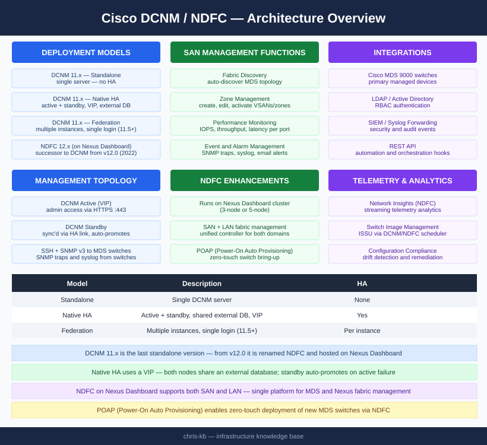
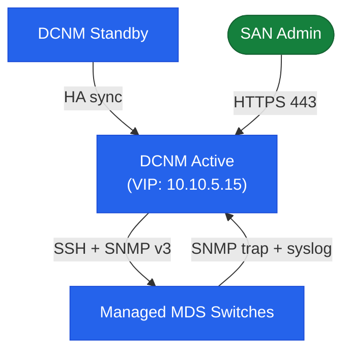

# Cisco DCNM — Architecture

Cisco DCNM 11.x is the last standalone SAN management appliance for Cisco MDS environments. Starting with version 12.0 (2022), it was renamed Nexus Dashboard Fabric Controller (NDFC) and now runs as an application on the Cisco Nexus Dashboard platform.

<a class="kb-card" href="how-it-works/"><strong>How It Works</strong>How it works, integrations, and design standards.</a>
<a class="kb-card" href="integrations/"><strong>Integrations</strong>Integration with MDS switches, LDAP, and SIEM.</a>
<a class="kb-card" href="design-standards/"><strong>Design Standards</strong>Deployment model selection, sizing, and HA configuration standards.</a>

## Deployment Models

| Model | Description | HA |
|---|---|---|
| Standalone | Single DCNM server | None |
| Native HA | Active + standby with shared external DB and VIP | Yes |
| Federation | Multiple instances managing separate fabrics; single login (11.5+) | Per instance |

## Management Topology

