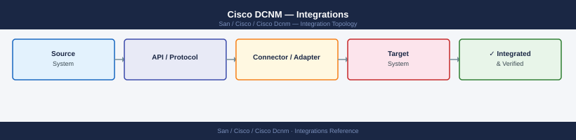

---
tags:
  - architecture
  - san
---
# Cisco DCNM — Integrations



```bash
# On DCNM appliance
ssh root@dcnm-mgmt.corp.example.com

# Configure syslog forwarding (rsyslog)
cat >> /etc/rsyslog.d/dcnm-forward.conf << 'EOF'
# Forward DCNM application logs to SIEM
local0.* @10.10.3.50:514
*.err @@10.10.3.50:514
EOF

systemctl restart rsyslog
logger -p local0.info -t dcnm "Test message"
# Verify arrival at SIEM
```


---

## See also

- [Cisco Dcnm — How It Works](how-it-works/)
- [Cisco Dcnm — Design Standards](design-standards/)
