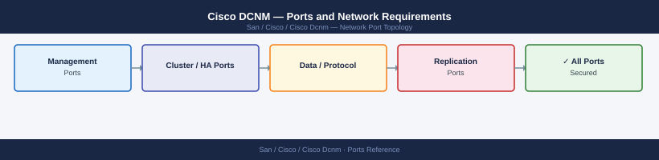

---
tags:
  - cisco
  - dcnm
  - san
  - networking
  - firewall
  - ports
description: "Firewall port reference for Cisco DCNM (Data Center Network Manager). DCNM manages MDS SAN switches and NX-OS data center fabrics. Note: DCNM is being..."
---
# Cisco DCNM — Ports and Network Requirements

<div class="kb-summary">
Firewall port reference for Cisco DCNM (Data Center Network Manager). DCNM manages MDS SAN switches and NX-OS data center fabrics. Note: DCNM is being superseded by Nexus Dashboard Fabric Controller (NDFC).

*Applies to: Cisco DCNM 11.x*
</div>


## Inbound — Admin to DCNM Server

| Port | Protocol | Source | Purpose |
|---|---|---|---|
| 443 | TCP | Admin browsers | DCNM web UI and REST API |
| 22 | TCP | Jump hosts | SSH — DCNM appliance OS access |

## DCNM to Managed Devices

| Port | Protocol | Source | Destination | Purpose |
|---|---|---|---|---|
| 22 | TCP | DCNM | MDS switches, NX-OS devices | SSH — device configuration and monitoring |
| 161 | UDP | DCNM | MDS switches, NX-OS devices | SNMP polling |
| 443 | TCP | DCNM | NX-API capable devices | NX-API REST |

## Inbound — SNMP Traps from Devices

| Port | Protocol | Source | Destination | Purpose |
|---|---|---|---|---|
| 162 | UDP | MDS switches, NX-OS devices | DCNM | SNMP traps |

## DCNM Database

| Port | Protocol | Destination | Purpose |
|---|---|---|---|
| 5432 | TCP | PostgreSQL (embedded or external) | DCNM configuration database |

## Firewall Zone Summary

| From | To | Ports | Notes |
|---|---|---|---|
| Admin clients | DCNM | 443 | Web UI |
| DCNM | Managed switches | 22, 161 UDP, 443 | Management |
| Managed switches | DCNM | 162 UDP | SNMP traps |

## Verify

```bash
# From admin workstation — test DCNM API
curl -sk -o /dev/null -w "%{http_code}" https://<dcnm-ip>/api/v1/host

# From DCNM — test switch SSH
ssh admin@<mds-switch-ip> show version | head -3

# From DCNM — test SNMP
snmpget -v2c -c <community> <switch-ip> 1.3.6.1.2.1.1.1.0
```


```text title="Expected output"
200
Cisco MDS 9148S Multilayer Fabric Switch
Cisco NX-OS Software, version 9.4(1)
Copyright (c) 2002-2023, Cisco and/or its affiliates.
SNMP v2c Community Public
sysDescr.0 = STRING: "Cisco NX-OS Software, version 9.4(1), MDS 9148S"
```

!!! warning "Common errors"
    **`curl: (60) SSL certificate problem: self signed certificate`** — Add the `-k` flag to skip certificate verification, or import the DCNM CA certificate into your system trust store.
    **`ssh: connect to host 10.50.12.45 port 22: Connection refused`** — Verify the MDS switch IP is correct and SSH is enabled with `feature ssh` on the switch.
    **`Timeout: No Response from 10.50.12.50`** — Confirm SNMP is enabled on the switch (`snmp-server community <community>`), the community string matches, and the switch IP is reachable via ping.
## See also

- [Cisco DCNM — Architecture](../how-it-works/)
- [Cisco Nexus Dashboard — Ports](../../nexus-dashboard/architecture/ports.md)
- [Cisco MDS — Ports](../../mds/architecture/ports.md)
