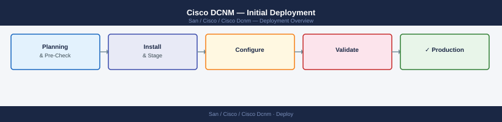

---
tags:
  - deployment
  - san
search:
  boost: 1.5
---

## Before you begin

- **Access:** admin credentials for the target system and any upstream dependencies (DNS, NTP, vCenter, directory services)
- **Timing:** safe to run during a scheduled maintenance window; allow 1-2 hours for initial deployment
- **Dependencies:** network connectivity verified; DNS resolvable; NTP configured; any licence keys available
- **Logging:** record every IP address, hostname, and credential set assigned during this deployment

---

# Cisco DCNM — Initial Deployment



This guide covers deploying Cisco Data Center Network Manager (DCNM) from OVA installation through adding a first fabric. DCNM (now integrated into Nexus Dashboard Fabric Controller, NDFC) is Cisco's centralized management platform for Nexus data center switching fabrics — covering both SAN (MDS) and LAN (Nexus VXLAN/Classic) fabrics.

Note: Cisco renamed DCNM to NDFC starting with version 12.x on the Nexus Dashboard platform. This guide covers standalone DCNM 11.x deployment; for NDFC 12.x+ see the Nexus Dashboard deployment guide.

---

## Prerequisites

**DCNM VM requirements:**

- vSphere 7.0 or later for OVA deployment
- DCNM "Compute" node: 8 vCPU, 32 GB RAM, 500 GB disk
- DCNM "Management" node (HA deployment): matching specs for second VM
- Static IP addresses for each node and a virtual IP (VIP) for HA failover

**Network:**

- Management VLAN: DCNM management interfaces must reach Nexus/MDS switch management interfaces (MGMT0)
- Ports inbound to DCNM from switches:
  - UDP 162: SNMP traps
  - TCP 443: REST API (Nexus switches call back to DCNM for telemetry)
- Ports from DCNM to switches:
  - TCP 22: SSH (configuration push)
  - UDP 161: SNMP polling
  - TCP 443: NX-API and gRPC telemetry collection

**Cisco switch requirements:**

- Nexus switches running NX-OS 9.3(x) or later for LAN fabric
- MDS switches running NX-OS 8.4(x) or later for SAN fabric
- Switches require mgmt0 interface reachable from DCNM
- `feature nxapi` and `feature telemetry` enabled on Nexus switches
- SNMP community string configured on all switches

---

## Deploy DCNM OVA

1. Download the DCNM OVA file from Cisco Software Download (search "DCNM" and select the latest 11.x release).
2. In vSphere Client, navigate to the target cluster and select **Actions > Deploy OVF Template**.
3. Upload the OVA. During deployment:
   - Select the correct network mappings:
     - `eth0`: Management network (must reach switch MGMT0 interfaces)
     - `eth1`: Data/Fabric network (used for switch programming in some deployments)
   - Set the deployment profile:
     - **Small (Lite mode):** Up to 25 switches, lab use
     - **Medium:** Up to 150 switches
     - **Large:** Up to 500 switches
4. Power on the VM after deployment. Wait 10–15 minutes for DCNM services to start. Monitor progress via VM console.

**Initial IP configuration:**

1. Access the VM console. Log in with `root` / the password set in the OVA deployment wizard.
2. Run the DCNM installation wizard:

```bash
/root/packaged-files/scripts/appmgr initial_setup
```

The wizard prompts for:

- Management IP, subnet mask, gateway
- DNS server
- NTP server
- Admin password for DCNM

After the wizard completes, DCNM restarts its services.

---

## Initial Setup Wizard

Access DCNM at `https://<dcnm_mgmt_ip>`.

1. Log in with `admin` and the password set during initial setup.
2. The **Getting Started** wizard launches. Work through each page:

   **License upload:**
   - Upload the DCNM license file (`.lic`) obtained from Cisco. Without a valid license, switch count is limited.
   - Navigate to **Administration > Licensing** and upload the file.

   **Email notification:**
   - Under **Administration > DCNM Settings > Email**, configure the SMTP relay and notification addresses.
   - Send a test email to confirm delivery.

   **User management:**
   - Create role-based accounts under **Administration > Users**:
     - Network operator (read-only)
     - Network administrator (full access)
   - Configure TACACS+ or RADIUS for centralized authentication if available.

   **SNMP settings:**
   - Navigate to **Administration > SNMP Configuration**.
   - Set the community string that DCNM will use to poll switches.
   - Set the SNMP trap listener (DCNM automatically listens on UDP 162).

---

## Add First Fabric

DCNM manages networks through "fabrics" — logical groupings of switches.

**For a SAN fabric (MDS switches):**

1. Navigate to **SAN > Fabrics > Add Fabric**.
2. Select **SAN Fabric**.
3. Enter:
   - Fabric name (e.g., `fabric_a_san`)
   - Seed switch IP (the management IP of one MDS switch)
   - Admin credentials and SNMP community string
4. Click **Save & Deploy**. DCNM connects to the seed switch and discovers the entire VSAN topology.
5. Verify all MDS switches appear in **SAN > Switches** with correct VSAN assignments.

**For a LAN fabric (Nexus switches — VXLAN BGP EVPN or Classic mode):**

1. Navigate to **LAN > Fabrics > Create Fabric**.
2. Select the fabric template:
   - **Easy Fabric (VXLAN BGP EVPN):** For new VXLAN deployments
   - **Classic LAN:** For existing switched networks without VXLAN
3. Set fabric parameters:
   - Fabric name
   - BGP ASN (for VXLAN EVPN fabric)
   - Underlay IP range (DCNM auto-assigns loopback and P2P IPs from this range)
   - NTP server, DNS, DHCP server details
4. Click **Save**. The fabric template is created.

---

## Configure LAN Fabric (VXLAN or Classic)

**For VXLAN BGP EVPN fabric — add spine and leaf switches:**

1. Navigate to **LAN > Fabrics > [fabric_name] > Switches > Add Switches**.
2. Enter the management IPs of the spine switches first, then leaf switches.
3. DCNM discovers each switch and imports its current configuration.
4. Assign roles:
   - **Spine:** Connects leaves; runs BGP route reflector
   - **Leaf:** Connects hosts and storage; runs VXLAN VTEP
5. Click **Recalculate & Deploy** to generate and push the underlay configuration (IS-IS or OSPF, BGP, loopbacks, PIM) to all switches.

**Configure VRFs and Networks:**

1. Navigate to **LAN > Fabrics > [fabric_name] > Networks > Create Network**.
2. Set the network name, VLAN ID, and Layer 3 gateway IP.
3. Attach the network to the appropriate leaf switch ports.
4. Deploy the configuration.

---

## Deploy Switches

After the fabric is configured, DCNM pushes configuration to switches via SSH and NX-API.

1. Navigate to **LAN > Fabrics > [fabric_name] > Topology**.
2. The topology view shows all switches. Any switch with pending changes shows an orange indicator.
3. Click **Deploy All** to push configuration to all switches simultaneously.
4. Monitor the deployment log under **LAN > Fabrics > [fabric_name] > Deployment**.
5. Each switch transitions from **Config Drifted** (before deployment) to **In Sync** (after successful deployment).

**Verify switch sync status:**

1. Navigate to **LAN > Fabrics > [fabric_name] > Switches**.
2. All switches should show **Policy Status: In Sync** and **Config Status: In Sync**.

---

## Validate

**Fabric health:**

1. Navigate to **Dashboard > Overview**. The dashboard shows fabric health score, switch count, and any active alarms.
2. Verify all discovered switches are **reachable** (green) in **LAN/SAN > Switches** view.
3. Check the event log under **Monitor > Events** — no critical events should be present post-deployment.

**Configuration consistency:**

```bash
# On a deployed Nexus switch, confirm DCNM-generated config is applied:
show running-config | include nv overlay
show bgp l2vpn evpn summary
# BGP neighbors (spine) should show Established state
```

**SNMP trap test:**

1. On one of the managed switches, generate a link-down event by shutting down an access port.
2. In DCNM under **Monitor > Events**, the event should appear within 30 seconds.

**Save DCNM application backup:**

```bash
# From DCNM CLI:
appmgr backup
# Creates a .tar.gz backup of the DCNM database and configuration
# Store this in an external location
```

---

## Verify

- **Cluster health:** all nodes show online in the management UI
- **Volume access:** mount a test LUN/NFS export from a host and confirm read/write
- **Replication:** confirm replication partner shows last-sync within RPO window

---

## See also

- [Cisco Dcnm — Procedures](../operations/procedures/)
- [Cisco Dcnm — Common Issues](../troubleshooting/common-issues/)
- [Cisco Dcnm — How It Works](../architecture/how-it-works/)
