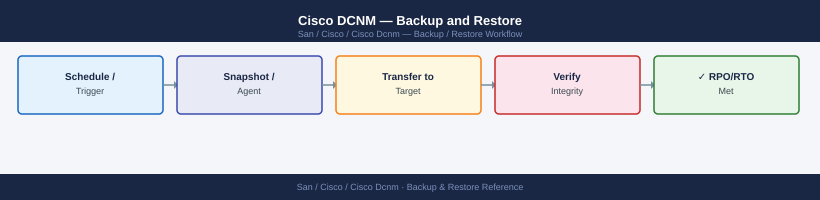

---
tags:
  - operations
  - san
---
# Cisco DCNM — Backup and Restore


```bash
ssh root@dcnm-dc1.corp.example.com

# Full database dump (all DCNM databases)
pg_dumpall -U postgres -f /var/backup/dcnm/dcnm-db-$(date +%Y%m%d-%H%M).sql

# Compress the dump
gzip /var/backup/dcnm/dcnm-db-$(date +%Y%m%d-%H%M).sql

# Transfer to remote backup server
scp /var/backup/dcnm/dcnm-db-$(date +%Y%m%d-%H%M).sql.gz \
    bkp@backup-server.corp.example.com:/backups/dcnm/db/

# List backups
ls -lh /var/backup/dcnm/
```

```bash
# Key configuration directories
tar -czf /var/backup/dcnm/dcnm-config-$(date +%Y%m%d).tar.gz \
  /usr/local/cisco/dcm/dcnm/conf/ \
  /etc/ssl/dcnm/ \
  /var/dcnm/

scp /var/backup/dcnm/dcnm-config-$(date +%Y%m%d).tar.gz \
    bkp@backup-server.corp.example.com:/backups/dcnm/config/
```
```bash
# Get auth cookie
curl -sk -c dcnm-cookie.txt -X POST \
  https://dcnm-dc1.corp.example.com/rest/logon \
  -H "Content-Type: application/json" \
  -d '{"expirationTime": 3600}' \
  -u "svc-automation:<password>"

# Export zone configuration for a fabric
curl -sk -b dcnm-cookie.txt \
  "https://dcnm-dc1.corp.example.com/rest/san/zoning?fabricName=DC1-FABRIC-A" \
  -o DC1-FABRIC-A-zones-$(date +%Y%m%d).json

curl -sk -b dcnm-cookie.txt -X POST \
  https://dcnm-dc1.corp.example.com/rest/logout
```
```bash
ssh root@dcnm-dc1.corp.example.com

# Stop DCNM services first
/usr/local/cisco/dcm/dcnm/sbin/dcnm-server stop

# Drop and recreate databases
psql -U postgres -c "DROP DATABASE IF EXISTS sane;"
psql -U postgres -c "CREATE DATABASE sane;"
psql -U postgres -c "DROP DATABASE IF EXISTS pmdb;"
psql -U postgres -c "CREATE DATABASE pmdb;"

# Restore from full dump
gunzip -c /var/backup/dcnm/dcnm-db-20260506-0200.sql.gz | psql -U postgres

# Start DCNM services
/usr/local/cisco/dcm/dcnm/sbin/dcnm-server start

# Monitor startup
tail -f /var/log/dcnm/server.log
```

## Before you begin

- **Access:** Storage admin credentials (cluster admin or equivalent)
- **Timing:** safe to run during business hours unless a step is marked ⚠ (causes interruption)
- **Dependencies:** no active upgrades or migrations on the same infrastructure
- **Logging:** capture command output — paste into the change record on completion

---

---

## Verify

- Confirm the operation completed without errors in the log or management UI
- Verify the expected state change is visible (service running, object created, config applied)
- Document the outcome in the change record

---

## See also

- [Cisco Dcnm — Procedures](procedures/)
- [Cisco Dcnm — Health Checks](health-checks/)
- [Cisco Dcnm — Common Issues](../troubleshooting/common-issues/)
