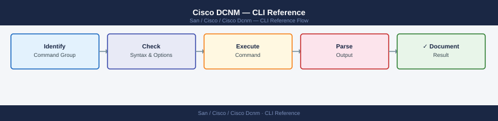

---
tags:
  - operations
  - san
---
# Cisco DCNM — CLI Reference


```bash
# Start all DCNM services
/usr/local/cisco/dcm/dcnm/sbin/dcnm-server start

# Stop all DCNM services
/usr/local/cisco/dcm/dcnm/sbin/dcnm-server stop

# Restart all services
/usr/local/cisco/dcm/dcnm/sbin/dcnm-server restart

# Check status of all services
/usr/local/cisco/dcm/dcnm/sbin/dcnm-server status

# Start/stop individual services
systemctl start dcnm-server
systemctl stop dcnm-pm        # performance manager only
systemctl restart dcnm-events
```


```text title="Expected output"
Starting DCNM services...
dcnm-server: starting...
dcnm-server started successfully (PID: 4827)
dcnm-pm started (PID: 4831)
dcnm-events started (PID: 4835)
dcnm-server: stopping...
dcnm-server stopped successfully
dcnm-pm stopped
dcnm-events stopped
Restarting DCNM services...
dcnm-server: restarting...
dcnm-server restarted successfully (PID: 4901)
dcnm-pm restarted (PID: 4905)
dcnm-events restarted (PID: 4909)

DCNM Service Status:
dcnm-server          RUNNING    (PID: 4901, uptime: 2m 34s)
dcnm-pm              RUNNING    (PID: 4905, uptime: 2m 32s)
dcnm-events          RUNNING    (PID: 4909, uptime: 2m 30s)
dcnm-db              RUNNING    (PID: 4913, uptime: 2m 28s)

dcnm-server.service - Cisco DCNM Server
   Loaded: loaded (/etc/systemd/system/dcnm-server.service; enabled; vendor preset: disabled)
   Active: active (running) since Mon 2024-01-15 14:22:18 UTC; 45s ago
dcnm-pm.service - Cisco DCNM Performance Manager
   Loaded: loaded (/etc/systemd/system/dcnm-pm.service; enabled; vendor preset: disabled)
   Active: inactive (dead) since Mon 2024-01-15 14:23:02 UTC; 2s ago
dcnm-events.service - Cisco DCNM Events Service
   Loaded: loaded (/etc/systemd/system/dcnm-events.service; enabled; vendor preset: disabled)
   Active: active (running) since Mon 2024-01-15 14:23:05 UTC; 1s ago
```

!!! warning "Common errors"
    **`dcnm-server: command not found`** — Verify the DCNM installation path is correct and add `/usr/local/cisco/dcm/dcnm/sbin` to your PATH or use the full path.
    **`Failed to start dcnm-pm: Unit dcnm-pm.service not found`** — Ensure systemd service files are installed in `/etc/systemd/system/` by running `systemctl daemon-reload` after DCNM installation.
    **`Permission denied`** — Run the commands with `sudo` or ensure your user account is in the `dcnm` group with `sudo usermod -aG dcnm $USER`.
```bash
# Test SSH connectivity to a managed switch
ssh -o ConnectTimeout=5 -o BatchMode=yes dcnm_mgmt@<switch-ip> 'show version' 2>&1

# Test SNMP v3 connectivity to a switch
snmpget -v3 -u dcnm_poll -l authPriv -a SHA -A <auth-pass> \
  -x AES -X <priv-pass> <switch-ip> sysDescr.0

# Test if DCNM is receiving traps (capture for 30 seconds)
sudo tcpdump -i eth0 -n udp port 162 -c 20
```

```text title="Expected output"
Cisco Nexus Operating System (NX-OS) Software
TAC support: http://www.cisco.com/tac
Copyright (c) 2002-2023, Cisco and/or its affiliates.
All rights reserved.
Version 9.3(8), RELEASE SOFTWARE
Build ID: 9.3.8.20230615_GEXE
Compiled: 6/15/2023 14:22:15 UTC

SNMPv3 User-based Security Model (USM) authenticated and encrypted
sysDescr.0 = STRING: "Cisco NX-OS Software, Nexus 9000 Series"

tcpdump: listening on eth0, link-type EN10MB (Ethernet), capture size 262144 bytes
12:34:56.789012 IP 10.48.12.45.38291 > 10.48.1.10.162: SNMP, length 156
12:34:57.234567 IP 10.48.12.46.39402 > 10.48.1.10.162: SNMP, length 142
12:34:58.567890 IP 10.48.12.47.40513 > 10.48.1.10.162: SNMP, length 178
12:34:59.901234 IP 10.48.12.48.41624 > 10.48.1.10.162: SNMP, length 165
12:35:00.345678 IP 10.48.12.49.42735 > 10.48.1.10.162: SNMP, length 151
20 packets captured, 20 packets received by filter, 0 packets dropped by kernel
```

!!! warning "Common errors"
    **`Permission denied (publickey,password).`** — Verify the dcnm_mgmt user exists on the switch and SSH key or password is configured correctly in DCNM credentials.
    **`Timeout: No Response from <switch-ip>`** — Check network connectivity to the switch IP, verify SNMP v3 user credentials match the switch configuration, and confirm firewall allows UDP 161 outbound.
    **`tcpdump: eth0: No such device`** — Replace eth0 with the correct management interface name (use `ip link show` to list available interfaces).
```bash
# Check HA status
/usr/local/cisco/dcm/dcnm/bin/dcnm-ha-status.sh

# Initiate manual failover (from active node — forces standby to become active)
/usr/local/cisco/dcm/dcnm/bin/dcnm-ha-failover.sh

# Check VIP status
ip addr show | grep <vip-address>
```

```text title="Expected output"
HA Cluster Status:
  Active Node: dcnm-prod-01.example.com (192.168.100.45)
  Standby Node: dcnm-prod-02.example.com (192.168.100.46)
  Virtual IP (VIP): 192.168.100.50
  HA Status: HEALTHY
  Last Heartbeat: 2024-01-15 14:32:18 UTC
  Replication Lag: 0.2 seconds

Initiating failover from active node dcnm-prod-01...
Stopping DCNM services on active node...
Promoting standby node dcnm-prod-02 to active...
Failover completed successfully in 8.3 seconds
New Active Node: dcnm-prod-02.example.com (192.168.100.46)

    inet 192.168.100.50/32 scope global secondary eth0
       valid_lft forever preferred_lft forever
```

!!! warning "Common errors"
    **`HA Status: UNHEALTHY — Replication lag exceeds threshold`** — Check network connectivity between nodes and verify DCNM services are running on both nodes with `systemctl status dcnm`.
    **`ERROR: Cannot connect to standby node — Connection refused`** — Ensure the standby node is reachable and DCNM HA daemon is running; verify firewall rules allow port 7777 between cluster nodes.
    **`inet 192.168.100.50 not found`** — Confirm the VIP address is correct and the active node has successfully claimed the virtual IP after failover.
```bash
# Login with Basic Auth — returns session cookie
curl -sk -c dcnm-cookie.txt -X POST \
  https://dcnm-dc1.corp.example.com/rest/logon \
  -H "Content-Type: application/json" \
  -d '{"expirationTime": 86400}' \
  -u "svc-automation:<password>"

# All subsequent calls use the session cookie
export DCNM="https://dcnm-dc1.corp.example.com"

# Logout
curl -sk -b dcnm-cookie.txt -X POST "${DCNM}/rest/logout"
```
```bash
# List all switches
curl -sk -b dcnm-cookie.txt "${DCNM}/rest/inventory/switches" \
  | python3 -m json.tool

# Get switch detail by serial number
curl -sk -b dcnm-cookie.txt "${DCNM}/rest/inventory/switches/<serialNumber>" \
  | python3 -m json.tool

# List all fabrics
curl -sk -b dcnm-cookie.txt "${DCNM}/rest/san/fabric" \
  | python3 -m json.tool

# List all VSANs
curl -sk -b dcnm-cookie.txt "${DCNM}/rest/san/vsan" \
  | python3 -m json.tool
```
```bash
# Get zone database for a fabric
curl -sk -b dcnm-cookie.txt \
  "${DCNM}/rest/san/zoning?fabricName=DC1-FABRIC-A" \
  | python3 -m json.tool

# Get active zone set
curl -sk -b dcnm-cookie.txt \
  "${DCNM}/rest/san/zoning/activezonesets?fabricName=DC1-FABRIC-A" \
  | python3 -m json.tool

# Get device aliases
curl -sk -b dcnm-cookie.txt \
  "${DCNM}/rest/san/devicealias?fabricName=DC1-FABRIC-A" \
  | python3 -m json.tool
```
```bash
# Get all active alarms
curl -sk -b dcnm-cookie.txt \
  "${DCNM}/rest/alarms/activealarms" \
  | python3 -m json.tool

# Get events (last 100)
curl -sk -b dcnm-cookie.txt \
  "${DCNM}/rest/events/allevents?size=100&sortby=eventtime&orderby=desc" \
  | python3 -m json.tool
```
```bash
# List firmware images in DCNM repository
curl -sk -b dcnm-cookie.txt "${DCNM}/rest/fm/image" \
  | python3 -m json.tool

# Initiate firmware upgrade on a switch
curl -sk -b dcnm-cookie.txt -X POST "${DCNM}/rest/fm/upgrade" \
  -H "Content-Type: application/json" \
  -d '{
    "switchList": ["<serialNumber>"],
    "imageName": "m9200-s2ek9-mz.8.4.2a.bin",
    "installMode": "non-disruptive"
  }' | python3 -m json.tool
```
```bash
# Count switches by management state
curl -sk -b dcnm-cookie.txt "${DCNM}/rest/inventory/switches" \
  | python3 -c "
import sys, json, collections
data = json.load(sys.stdin)
states = collections.Counter(s.get('managementState','unknown') for s in data)
print(dict(states))
"

# Find all ISLs with errors
curl -sk -b dcnm-cookie.txt "${DCNM}/rest/san/isl" \
  | python3 -c "
import sys, json
data = json.load(sys.stdin)
for isl in data:
    if isl.get('crcErrors', 0) > 0 or isl.get('lossOfSignal', 0) > 0:
        print(isl.get('switchName'), isl.get('port'), 
              'CRC:', isl.get('crcErrors'), 'LOS:', isl.get('lossOfSignal'))
"

# Export switch inventory to CSV
curl -sk -b dcnm-cookie.txt "${DCNM}/rest/inventory/switches" \
  | python3 -c "
import sys, json, csv
data = json.load(sys.stdin)
fields = ['switchName','ipAddress','model','release','managementState','fabricName']
w = csv.DictWriter(sys.stdout, fieldnames=fields, extrasaction='ignore')
w.writeheader()
for s in data: w.writerow(s)
" > switches-$(date +%Y%m%d).csv
```

## Before you begin

- **Access:** Storage admin credentials (cluster admin or equivalent)
- **Timing:** safe to run during business hours unless a step is marked ⚠ (causes interruption)
- **Dependencies:** no active upgrades or migrations on the same infrastructure
- **Logging:** capture command output — paste into the change record on completion

---

---

## Verify

- Confirm the operation completed without errors in the log or management UI
- Verify the expected state change is visible (service running, object created, config applied)
- Document the outcome in the change record

---

## See also

- [Cisco Dcnm — Procedures](../procedures/)
- [Cisco Dcnm — Scripts](../scripts/)
- [Cisco Dcnm — Health Checks](../health-checks/)
