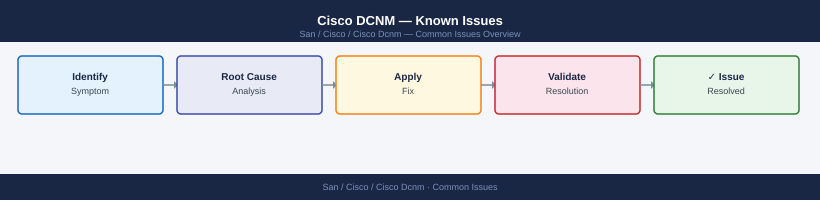

---
tags:
  - operations
  - san
---
# Cisco DCNM — Known Issues


<div class="kb-summary">
Cisco DCNM known issues: inventory sync failures, zone push errors, fabric discovery timeouts, database corruption recovery, and version upgrade caveats.

*Applies to: Cisco MDS · Nexus*
</div>



## Before you begin

- **Access:** Storage admin credentials (cluster admin or equivalent)
- **Timing:** safe to run during business hours unless a step is marked ⚠ (causes interruption)
- **Dependencies:** no active upgrades or migrations on the same infrastructure
- **Logging:** capture command output — paste into the change record on completion

---

## Fabric Discovery Failures

### Switches Not Discovered / Stuck in "Unreachable"


## Deployment Failures

### Configuration Push Fails — "Deploy Pending"

Configs remain in "Deploy Pending" state when the switch is unreachable or there is a config conflict.

```bash
# On DCNM — check deployment status
show fabric detail

# Check switch-specific config diff
# DCNM UI: Fabric → Switches → right-click → View Config Diff

# Force re-sync
# DCNM UI: Fabric → Deploy → Recalculate & Deploy
```

### "Out-of-Sync" Switch After Manual Change

Direct CLI changes on switches bypass DCNM and cause out-of-sync status.

```text
Resolution:
1. Fabric → Switches → select affected switch → Resync
2. Review diff — accept DCNM intent (overwrite manual change) or
   update DCNM policy to match the manual change
3. Re-deploy
```

!!! warning "Avoid direct CLI changes on DCNM-managed switches"
    All config changes should go through DCNM policies and templates. Direct CLI changes will be overwritten on next deploy unless captured in a freeform policy.

## Performance / UI Issues

### DCNM Web UI Slow or Unresponsive

```bash
# Check DCNM service health
dcnm# appmgr status all

# Check disk usage — full disk causes performance issues
df -h /
df -h /var

# Check ElasticSearch/PostgreSQL health
dcnm# appmgr show container-logs elasticsearch 100
dcnm# appmgr show container-logs postgres 100

# Restart DCNM services (causes brief outage)
dcnm# appmgr stop all
dcnm# appmgr start all
```

### High CPU on DCNM Server

```bash
# Identify top processes
top -bn1 | head -20

# DCNM-specific resource check
dcnm# appmgr show resource-utilization

# Reduce polling frequency if spikes are SNMP-related
# DCNM UI: Administration → DCNM Server → Server Properties
# → Performance → SNMP polling interval (increase from 30s to 60s)
```

## VXLAN / VPC Issues

### VPC Peer-Link Down Alarm

```bash
# On affected NX-OS switches
show vpc
show vpc peer-keepalive
show vpc consistency-parameters

# Common causes
show interface port-channel <vpc-peer-link>  # check physical member state
show logging | include vpc                   # check for error messages
```

### VXLAN Tunnel Not Forming

```bash
# Check NVE interface
show nve peers
show nve vni
show bgp l2vpn evpn summary    # EVPN peering state

# Verify loopback reachability
ping <remote-vtep-loopback-ip> source loopback0

# Check MTU — VXLAN adds 50 bytes overhead
show interface ethernet X/X | include MTU
```

## License Issues

### "License Expired" Warning

```bash
# Check license status
show license usage
show license host-id

# DCNM UI: Administration → Licensing
# → Add license file or update SmartNet token
```

## Log Collection for TAC

```bash
# Collect DCNM logs for TAC case
dcnm# appmgr collect-tech-support

# Output location: /tmp/dcnm-tech-support-<timestamp>.tar.gz

# Collect switch tech-support
switch# show tech-support > bootflash:tech-support-$(date +%Y%m%d).txt
```

## Quick Diagnostics Reference

| Symptom | First Check | Command |
|---|---|---|
| Switch unreachable | Credentials + reachability | `ping <mgmt-ip>` from DCNM |
| Deploy pending | Config conflict or switch offline | UI: View Config Diff |
| Out-of-sync | Manual CLI change on switch | UI: Resync → Deploy |
| UI slow | Disk full / service unhealthy | `df -h /` then `appmgr status all` |
| VPC down | Physical peer-link | `show vpc` + `show vpc peer-keepalive` |
| VXLAN not forming | BGP EVPN / MTU | `show nve peers` + `show bgp l2vpn evpn summary` |
| License warning | Expired SmartNet | UI: Administration → Licensing |

---

## Verify

- Confirm the operation completed without errors in the log or management UI
- Verify the expected state change is visible (service running, object created, config applied)
- Document the outcome in the change record

## See also

- [Cisco DCNM — Backup and Restore](backup-restore.md)
- [Cisco DCNM — CLI Reference](cli-reference.md)
- [Cisco DCNM — Health Checks](health-checks.md)
- [Cisco DCNM — Operations](index.md)
- [Cisco DCNM — Architecture](../architecture/)
- [Cisco DCNM — Initial Deployment](../deploy/)
- [Cisco DCNM — Security](../security/)
- [Cisco DCNM — Troubleshooting](../troubleshooting/)
