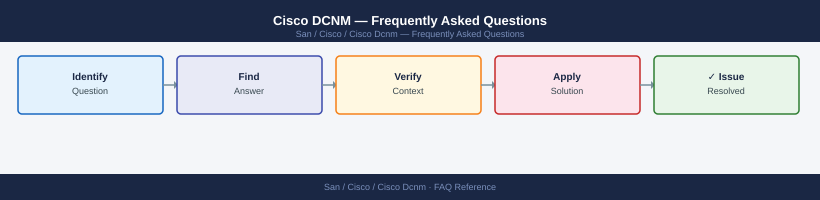

---
tags:
  - cisco-dcnm
  - faq
  - operations
---
# Cisco DCNM — Frequently Asked Questions

Common questions about Cisco DCNM operations, configuration, and troubleshooting. For step-by-step procedures, see the <a href="index.md">Operations</a> section.

## General

**Q: What DCNM version is recommended?**
A: Cisco DCNM 11.5(x) is the last release before NDFC (Nexus Dashboard Fabric Controller). New deployments should use NDFC 12.x. Check DCNM version via Web UI → Settings → About.

**Q: How do I check the current Cisco DCNM version?**
A: `show version  # on DCNM CLI`

## Configuration

**Q: What is the default fabric management mode and when should it change?**
A: Monitor mode (read-only) is the default after initial setup. Switch to Managed mode to allow DCNM to push configuration changes to switches. Change under Fabric Settings → Fabric Type.

**Q: How do I enable DCNM telemetry streaming for real-time fabric metrics?**
A: Configure Telemetry under Administration → Performance Setup. Select switches, enable gRPC streaming, and set the collection interval. Requires Nexus switches with NX-OS 9.3.5+ for full telemetry support.

## Operations

**Q: How do I upgrade DCNM without disrupting fabric management?**
A: Back up DCNM database. Upgrade DCNM appliance via the inline upgrade process. During upgrade, switch management is unavailable but fabric forwarding continues unaffected. Plan for 30-60 minute management outage.

**Q: What is the correct procedure to add a new switch to DCNM?**
A: Ensure DCNM can reach the switch management IP. Go to Fabric → Add Switches → Discover. Enter the seed IP, credentials, and SNMP community. DCNM discovers neighbours via CDP/LLDP and adds them automatically.

## Troubleshooting

**Q: DCNM shows 'Out-of-Sync' for a switch. What does it mean?**
A: The switch running config does not match what DCNM expects to have deployed. Use Fabric → Deploy → Recalculate and Deploy to reconcile. Review the diff before deploying to avoid unexpected config changes.

**Q: DCNM inventory refresh is very slow — where do I start?**
A: Check DCNM server resource utilisation. Verify SNMP connectivity to all switches. Reduce poller frequency for large fabrics. Split very large fabrics into multiple DCNM-managed domains if needed.

## Backup and Recovery

**Q: How often should I back up DCNM?**
A: Weekly via DCNM Administration → Backup & Restore. Backup includes the database and switch configurations. Store off-appliance. Back up before any software upgrade.

**Q: Can I restore a single switch configuration from DCNM backup?**
A: Yes — individual switch configs are stored in DCNM. Go to Configure → Backup → select the switch and restore point. This restores only that switch's configuration, not the full DCNM database.

## See Also

- [Cisco DCNM Operations](index.md)
- [Cisco DCNM Troubleshooting](../troubleshooting/index.md)
