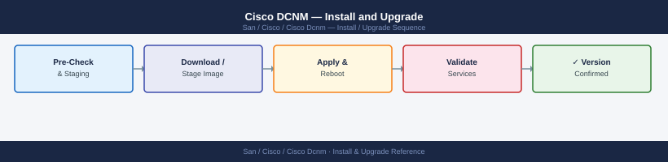

---
tags:
  - operations
  - san
---
# Cisco DCNM — Install and Upgrade

*Applies to: Cisco MDS / NX-OS*


```bash
# On the primary (active) DCNM node
ssh root@dcnm-dc1-active.corp.example.com

# Run HA setup utility
/usr/local/cisco/dcm/dcnm/bin/dcnm-ha-setup.sh \
  --primary \
  --vip 10.10.5.15 \
  --peer 10.10.5.11 \
  --password <ha-password>

# On the secondary (standby) node
ssh root@dcnm-dc1-standby.corp.example.com

/usr/local/cisco/dcm/dcnm/bin/dcnm-ha-setup.sh \
  --secondary \
  --vip 10.10.5.15 \
  --peer 10.10.5.10 \
  --password <ha-password>

# Verify HA status from active node
/usr/local/cisco/dcm/dcnm/bin/dcnm-ha-status.sh
# Expected: ACTIVE/STANDBY pair, VIP reachable
```


```text title="Expected output"
root@dcnm-dc1-active:~# /usr/local/cisco/dcm/dcnm/bin/dcnm-ha-setup.sh \
>   --primary \
>   --vip 10.10.5.15 \
>   --peer 10.10.5.11 \
>   --password ****
[INFO] Configuring DCNM HA on primary node
[INFO] Setting VIP to 10.10.5.15
[INFO] Peer node IP: 10.10.5.11
[INFO] Validating peer connectivity... OK
[INFO] Configuring keepalived service... OK
[INFO] Synchronizing database configuration... OK
[INFO] HA setup completed successfully on primary
root@dcnm-dc1-standby:~# /usr/local/cisco/dcm/dcnm/bin/dcnm-ha-setup.sh \
>   --secondary \
>   --vip 10.10.5.15 \
>   --peer 10.10.5.10 \
>   --password ****
[INFO] Configuring DCNM HA on secondary node
[INFO] Setting VIP to 10.10.5.15
[INFO] Peer node IP: 10.10.5.10
[INFO] Validating peer connectivity... OK
[INFO] Configuring keepalived service... OK
[INFO] HA setup completed successfully on secondary
root@dcnm-dc1-active:~# /usr/local/cisco/dcm/dcnm/bin/dcnm-ha-status.sh
HA Status Report
================
Primary Node:   dcnm-dc1-active (10.10.5.10)
Secondary Node: dcnm-dc1-standby (10.10.5.11)
Virtual IP:     10.10.5.15 (ACTIVE on dcnm-dc1-active)
Keepalived:     Running
Database Sync:  In Sync
HA State:       ACTIVE/STANDBY
```

!!! warning "Common errors"
    **`[ERROR] Failed to connect to peer node 10.10.5.11`** — Verify network connectivity between nodes and ensure the peer IP address is correct and reachable.
    **`[ERROR] keepalived service failed to start`** — Check that keepalived is installed (`yum install keepalived`) and that the VIP is not already in use on the network.
    **`[ERROR] Database synchronization failed: permission denied`** — Ensure the dcnm user has read/write permissions on the database directory and that both nodes have matching DCNM versions.
```bash
# On each MDS switch
no snmp-server host <dcnm-ip> traps version 3 priv dcnm_poll

# Remove syslog forwarding to DCNM
no logging server <dcnm-ip>

# Remove DCNM service account
no username dcnm_mgmt
```


```text title="Expected output"
(no output — command completes silently)
(no output — command completes silently)
(no output — command completes silently)
```

!!! warning "Common errors"
    **`% Invalid command`** — Verify the SNMP host entry exists with `show snmp host` before removing it; the syntax may differ if using SNMPv2c instead of v3.
    **`% Username dcnm_mgmt does not exist`** — Check the actual service account name with `show username` as it may be named differently (e.g., `dcnm_user` or `dcnm_admin`).
## Before you begin

- **Access:** Storage admin credentials (cluster admin or equivalent)
- **Timing:** safe to run during business hours unless a step is marked ⚠ (causes interruption)
- **Dependencies:** no active upgrades or migrations on the same infrastructure
- **Logging:** capture command output — paste into the change record on completion

---

---

## Verify

- Confirm the operation completed without errors in the log or management UI
- Verify the expected state change is visible (service running, object created, config applied)
- Document the outcome in the change record

---

## See also

- [Cisco Dcnm — Procedures](../procedures/)
- [Cisco Dcnm — Health Checks](../health-checks/)
- [Cisco Dcnm — Deploy](../../deploy/)
