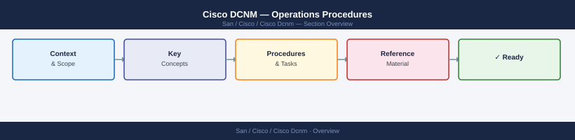

---
tags:
  - operations
  - san
---
# Cisco DCNM — Operations Procedures



Cisco DCNM (Data Center Network Manager) is the management and automation platform for Cisco MDS FC SAN fabrics, providing fabric discovery, zoning, configuration deployment, compliance checking, and VXLAN overlay management for IP fabrics.

---

## Before you begin

- **Access:** Storage admin credentials (cluster admin or equivalent)
- **Timing:** safe to run during business hours unless a step is marked ⚠ (causes interruption)
- **Dependencies:** no active upgrades or migrations on the same infrastructure
- **Logging:** capture command output — paste into the change record on completion

---

## Discover a Fabric in DCNM

Fabric discovery imports an existing MDS FC or VXLAN fabric into DCNM management without disrupting traffic.

1. Log in to the DCNM web UI at `https://<dcnm-ip>/` using an account with the **Network Admin** role.
2. Navigate to **SAN > Fabrics** (for FC) or **LAN > Fabrics** (for VXLAN/IP) and click **+ Add Fabric**.
3. Select the fabric type — for MDS FC, choose **External Fabric** to import an existing fabric.
4. Enter the **Seed Switch IP** (management IP of one switch in the fabric), SNMP v3 credentials, and SSH credentials.
5. Click **Save & Deploy** — DCNM contacts the seed switch, walks CDP/LLDP/FC neighbours, and maps the entire fabric topology.
6. Confirm all expected switches appear under **SAN > Fabrics > [Fabric Name] > Switches** with status **Manageable**.
7. Review the topology in **SAN > Topology** — verify all ISL links are shown as active.
8. Assign a descriptive fabric name and save (e.g., `DC1-MDS-Fabric-A`).

---

## Add a Switch to an Existing Fabric

When a new MDS switch is cabled and powered on, add it to DCNM management and apply baseline configuration.

1. In DCNM, navigate to **SAN > Fabrics > [Fabric Name]** and click **Actions > Rediscover**.
2. If the switch is not detected automatically, go to **SAN > Switches > + Add Switch** and enter the management IP, SNMPv3 credentials, and SSH credentials.
3. Click **Discover** — DCNM imports the switch inventory and port table.
4. Confirm the switch appears in the fabric topology with all physical ISL links shown as active.
5. Apply the site-standard SNMP threshold rules: navigate to **SAN > Switches > [Switch] > Configure > SNMP Threshold** and apply the template.
6. Set the VSAN membership for all ports: **SAN > Switches > [Switch] > Interfaces > Assign VSAN**.
7. Verify the NX-OS version matches the site-standard: **SAN > Switches > [Switch] > Hardware > Software Version**. If out of date, schedule an ISSU upgrade.
8. Save the updated topology and attach the switch to the relevant change ticket.

---

## Deploy a Configuration Change

DCNM tracks a fabric's intended state and can push diffs to switches, enabling controlled configuration deployment.

1. In DCNM, navigate to **SAN > Fabrics > [Fabric Name] > Fabric Settings** or the relevant configuration panel (e.g., **Zoning**, **Interfaces**).
2. Make the required configuration change in the DCNM UI — DCNM stores changes in its database but does not apply them immediately.
3. Navigate to **SAN > Fabrics > [Fabric Name] > Actions > Recalculate Config** to generate the pending diff.
4. Review the diff in **Pending** view — confirm only the intended changes appear; reject the change and investigate if unexpected diffs are present.
5. Click **Deploy** to push the configuration to the switches — DCNM executes NX-OS CLI commands over SSH.
6. Monitor the deployment job in **Monitor > Jobs > Deploy** — confirm all switch deployments complete with status **Success**.
7. Validate the change on the switch via SSH:

```bash
ssh admin@<switch-ip>
show running-config | section <changed-feature>
```


---

## Configure VRF and L3 Gateway

VRFs partition the IP routing table across the VXLAN fabric. The L3 gateway (anycast gateway) is the distributed default gateway for each network segment.

1. In DCNM, navigate to **LAN > VRFs** and click **+ Create VRF**.
2. Enter the **VRF Name** (e.g., `PROD-VRF`), **VRF VNI** (L3 VNI, e.g., `50001`), and **VLAN ID** reserved for the L3 VNI (e.g., `3001`).
3. Set BGP route targets — DCNM auto-generates import/export route targets based on the VNI; adjust for inter-VRF or inter-DC scenarios.
4. Click **Save** — then click **Deploy** and select all border leaf and leaf switches that will participate in this VRF.
5. Attach networks to the VRF: navigate to **LAN > Networks**, edit each network, and set the **VRF** field to the newly created VRF.
6. Configure the anycast gateway MAC: in **LAN > Fabrics > [Fabric] > Fabric Settings**, set a consistent **Anycast GW MAC** (e.g., `0000.2222.3333`) applied across all leaves.
7. Validate L3 routing on a leaf:

```bash
show vrf PROD-VRF
show ip route vrf PROD-VRF
show bgp l2vpn evpn summary
```

---

## Run Fabric Compliance Check

DCNM compliance checking compares the running configuration on each switch against the intended configuration stored in DCNM and reports deviations.

1. In DCNM, navigate to **SAN > Fabrics > [Fabric Name] > Actions > Compliance** (FC) or **LAN > Fabrics > [Fabric Name] > Compliance** (VXLAN).
2. Click **Run Compliance Check** — DCNM polls each switch and compares running state against the DCNM-stored intended configuration.
3. Wait for the compliance report to generate (1–5 minutes depending on fabric size).
4. Review the compliance report: switches and configurations marked **In Sync** are compliant; **Out of Sync** items require investigation.
5. For each Out-of-Sync item, expand the detail to see the diff — determine whether the deviation is a legitimate out-of-band change or a DCNM configuration drift.
6. If the switch configuration is correct and DCNM is wrong, update the DCNM intended configuration to match. If the switch is wrong, use **Deploy** to push the correct configuration.
7. Re-run compliance after remediation to confirm all switches return to **In Sync**.
8. Save the compliance report and attach it to the weekly SAN operations report.

---

## Collect Tech-Support Bundle

When raising a Cisco TAC case or escalating an issue internally, collect the DCNM tech-support bundle and relevant switch outputs.

1. In DCNM, navigate to **Administration > DCNM Server > Logs & Tech Support** and click **Collect Tech Support**.
2. Select the time range covering the incident window and click **Download** — the bundle is a `.tar.gz` archive.
3. For the affected switches, collect tech-support directly via SSH:

```bash
ssh admin@<switch-ip>
show tech-support >> /bootflash/<switch-name>-techsupport.log
copy bootflash:<switch-name>-techsupport.log scp://<admin>@<server-ip>/<path>/
```

4. Collect the relevant logs from DCNM server (Linux):

```bash
# On DCNM server
/usr/local/cisco/dcm/fm/logs/
# Collect: dcm.log, event.log, discovery.log
tar czf /tmp/dcnm-logs-<date>.tar.gz /usr/local/cisco/dcm/fm/logs/
```

5. Open the TAC case at `https://mycase.cloudapps.cisco.com/` with product **Data Center Network Manager** and upload the collected bundles.
6. Include the following in the case notes: DCNM version, NX-OS versions of affected switches, issue description, and first occurrence timestamp.

---

## Configure PTP (Precision Time Protocol) for Media Networks

PTP is required on media production fabrics (broadcast, video-over-IP) to synchronise clocks across switches to sub-microsecond accuracy.

1. In DCNM, navigate to **Configure → PTP** and enable PTP on the target fabric
2. Assign the grandmaster clock — typically the highest-accuracy clock source on the network (GPS-disciplined NTP appliance or dedicated PTP grandmaster)
3. Deploy the PTP configuration across all fabric switches via DCNM
4. After deployment, verify PTP synchronisation on each switch:

```bash
ssh admin@<switch-ip>
show ptp clock
```

Confirm the **Clock Identity** field matches the grandmaster and the **Offset from master** is within the acceptable range (typically < 1 µs for media networks). Investigate any switch showing **Free-run** state or high offset values.

---

## Back Up and Restore DCNM Configuration

Regular configuration backups ensure DCNM can be restored after a platform failure or data loss event.

**Back up DCNM:**

1. In DCNM, navigate to **Administration → Backup**
2. Select the backup scope — include fabric configurations, device credentials, and policy templates
3. Click **Backup** and download the backup archive file to a secure off-appliance location
4. Label the backup with the date and DCNM version: `dcnm-backup-<version>-<YYYYMMDD>.tar.gz`

**Restore DCNM:**

1. In DCNM, navigate to **Administration → Restore**
2. Click **Upload File** and select the backup archive
3. Click **Apply** — DCNM restores the configuration from the archive
4. After restore, verify all fabrics show **Connected** status and fabric discovery is functional
5. Re-run fabric compliance to confirm switch configurations match the restored intended state

---

## Upgrade DCNM Software

DCNM upgrades follow Cisco's supported upgrade path. Never skip major versions without consulting the Cisco upgrade compatibility matrix.

1. Download the DCNM upgrade ISO or `.bin` from Cisco Software Download (`software.cisco.com`) and verify the SHA-512 checksum.
2. Take a VM snapshot of the DCNM appliance in vCenter — label: `dcnm-pre-upgrade-<version>-<YYYYMMDD>`.
3. In DCNM, navigate to **Administration > DCNM Server > Software Upgrade** and click **Upload Upgrade Package**.
4. Select the downloaded upgrade file and click **Upload** — DCNM validates the package against the current version for upgrade compatibility.
5. Review the pre-upgrade compatibility check results — resolve any warnings before proceeding.
6. Click **Upgrade** — DCNM will restart services; the web UI will be unavailable for 20–45 minutes.
7. Monitor upgrade progress via the DCNM console (vCenter VM console or serial) or SSH to check service status:

```bash
# After DCNM services restart
dcnm_mgmt_server status
```

8. Log back in to the DCNM web UI and confirm the version under **Administration > About DCNM**; verify all fabrics show **Connected** and fabric discovery is functional.

---

```bash
# CSV format: alias_name,wwn
# esxi01-hba0,500010000abcdef0
# esxi01-hba1,500010000abcdef1

# REST API bulk import
curl -sk -b dcnm-cookie.txt -X POST \
  "${DCNM}/rest/san/devicealias?fabricName=DC1-FABRIC-A" \
  -H "Content-Type: application/json" \
  -d '{
    "aliases": [
      {"aliasName": "esxi01-hba0", "pwwn": "50:00:10:00:00:ab:cd:ef"},
      {"aliasName": "purestor01-ct0-fc0", "pwwn": "52:4a:93:70:ab:cd:ef:00"}
    ]
  }' | python3 -m json.tool
```

---

## Verify

- Confirm the operation completed without errors in the log or management UI
- Verify the expected state change is visible (service running, object created, config applied)
- Document the outcome in the change record

---

## See also

- [Cisco Dcnm — Health Checks](health-checks/)
- [Cisco Dcnm — CLI Reference](cli-reference/)
- [Cisco Dcnm — Common Issues](../troubleshooting/common-issues/)
