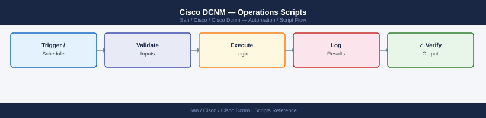

---
tags:
  - operations
  - san
---
# Cisco DCNM — Operations Scripts


```bash
#!/usr/bin/env bash
# dcnm-auth.sh — obtain a DCNM session cookie

DCNM_HOST="https://dcnm-dc1.corp.example.com"
DCNM_USER="svc-automation"
COOKIE_FILE="/tmp/dcnm-cookie-$$.txt"

if [[ -z "$DCNM_PASS" ]]; then
  echo "ERROR: Set DCNM_PASS environment variable"
  exit 1
fi

curl -sk -c "${COOKIE_FILE}" -X POST \
  "${DCNM_HOST}/rest/logon" \
  -H "Content-Type: application/json" \
  -d '{"expirationTime": 3600}' \
  -u "${DCNM_USER}:${DCNM_PASS}" > /dev/null

if [[ ! -s "${COOKIE_FILE}" ]]; then
  echo "ERROR: Authentication failed"
  exit 1
fi

export COOKIE_FILE DCNM_HOST

cleanup() {
  curl -sk -b "${COOKIE_FILE}" -X POST "${DCNM_HOST}/rest/logout" > /dev/null
  rm -f "${COOKIE_FILE}"
}
trap cleanup EXIT
echo "Authenticated to ${DCNM_HOST}"
```


```text title="Expected output"
Authenticated to https://dcnm-dc1.corp.example.com
```

!!! warning "Common errors"
    **`ERROR: Set DCNM_PASS environment variable`** — Export the DCNM_PASS variable before running the script: `export DCNM_PASS="your_password"`.
    **`ERROR: Authentication failed`** — Verify the DCNM_USER and DCNM_PASS credentials are correct, and that DCNM_HOST is reachable and running the REST API service.
    **`curl: (60) SSL certificate problem: self signed certificate`** — The `-k` flag is already present to skip SSL verification; if the error persists, check that DCNM_HOST is accessible and not blocked by a firewall.
```bash
#!/usr/bin/env bash
# dcnm-zone-export.sh
# Cron: 0 1 * * * /opt/scripts/dcnm-zone-export.sh >> /var/log/dcnm-zone-export.log 2>&1

DCNM_HOST="https://dcnm-dc1.corp.example.com"
EXPORT_DIR="/opt/dcnm-exports/zones"
DATE=$(date +%Y%m%d)

mkdir -p "${EXPORT_DIR}"

# Auth
COOKIE_FILE="/tmp/dcnm-zone-export-$$.txt"
curl -sk -c "${COOKIE_FILE}" -X POST "${DCNM_HOST}/rest/logon" \
  -H "Content-Type: application/json" -d '{"expirationTime":600}' \
  -u "svc-automation:${DCNM_PASS}" > /dev/null

trap "curl -sk -b ${COOKIE_FILE} -X POST ${DCNM_HOST}/rest/logout > /dev/null; rm -f ${COOKIE_FILE}" EXIT

# Get fabric list
FABRICS=$(curl -sk -b "${COOKIE_FILE}" "${DCNM_HOST}/rest/san/fabric" \
  | python3 -c "import sys,json; [print(f['fabricName']) for f in json.load(sys.stdin)]")

for FABRIC in ${FABRICS}; do
  OUTPUT="${EXPORT_DIR}/${FABRIC}-zones-${DATE}.json"
  curl -sk -b "${COOKIE_FILE}" \
    "${DCNM_HOST}/rest/san/zoning?fabricName=${FABRIC}" \
    -o "${OUTPUT}"
  echo "Exported: ${OUTPUT}"
done

# Cleanup: keep 90 days
find "${EXPORT_DIR}" -name "*-zones-*.json" -mtime +90 -delete
echo "Zone export complete: $(date)"
```
```python
#!/usr/bin/env python3
# dcnm-firmware-check.py

import sys, json, os, re
import urllib.request, http.cookiejar, ssl

HOST = "https://dcnm-dc1.corp.example.com"
PASS = os.environ.get("DCNM_PASS", "")

# Min firmware by MDS model prefix (NX-OS version string matching)
BASELINE = {
    "MDS 9718": "8.4(2a)",
    "MDS 9710": "8.4(2a)",
    "MDS 9706": "8.4(2a)",
    "MDS 9396T": "8.4(2a)",
    "MDS 9148T": "8.4(2a)",
    "MDS 9132T": "8.4(2a)",
}

ctx = ssl.create_default_context()
ctx.check_hostname = False
ctx.verify_mode = ssl.CERT_NONE

jar = http.cookiejar.CookieJar()
opener = urllib.request.build_opener(
    urllib.request.HTTPSHandler(context=ctx),
    urllib.request.HTTPCookieProcessor(jar)
)

req = urllib.request.Request(HOST + "/rest/logon", method="POST",
      data=json.dumps({"expirationTime": 300}).encode(),
      headers={"Content-Type": "application/json",
               "Authorization": "Basic " + __import__("base64").b64encode(
                   f"svc-monitor:{PASS}".encode()).decode()})
opener.open(req)

try:
    with opener.open(HOST + "/rest/inventory/switches") as r:
        switches = json.load(r)

    non_compliant = []
    for sw in switches:
        model = sw.get("model", "")
        fw = sw.get("release", "")
        for prefix, min_ver in BASELINE.items():
            if model.startswith(prefix):
                # Simple string comparison works for NX-OS versions of same major
                if fw < min_ver:
                    non_compliant.append((sw["switchName"], model, fw, min_ver))

    if non_compliant:
        print(f"NON-COMPLIANT ({len(non_compliant)} switches):")
        for name, model, fw, req_ver in non_compliant:
            print(f"  {name:<35} {model:<15} current={fw:<12} min={req_ver}")
        sys.exit(1)
    else:
        print(f"OK: All {len(switches)} switches meet firmware baseline.")

finally:
    req = urllib.request.Request(HOST + "/rest/logout", method="POST")
    opener.open(req)
```

## Before you begin

- **Access:** Storage admin credentials (cluster admin or equivalent)
- **Timing:** safe to run during business hours unless a step is marked ⚠ (causes interruption)
- **Dependencies:** no active upgrades or migrations on the same infrastructure
- **Logging:** capture command output — paste into the change record on completion

---

---

## Verify

- Confirm the operation completed without errors in the log or management UI
- Verify the expected state change is visible (service running, object created, config applied)
- Document the outcome in the change record

---

## See also

- [Cisco Dcnm — Procedures](../procedures/)
- [Cisco Dcnm — CLI Reference](../cli-reference/)
- [Cisco Dcnm — Health Checks](../health-checks/)
