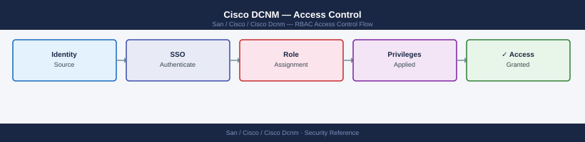

---
tags:
  - san
  - security
description: "Access Control reference covering Overview, Built-In Roles, Fabric-Level Scoping, LDAP Group to Role Mapping, Service Account Configuration and 2 more..."
---
# Cisco DCNM — Access Control

Access Control reference covering Overview, Built-In Roles, Fabric-Level Scoping, LDAP Group to Role Mapping, Service Account Configuration and 2 more sections.

*Applies to: Cisco MDS · Nexus*

## Before you begin

- **Access:** Storage admin credentials (cluster admin or equivalent)
- **Change management:** security changes require CAB approval in most environments
- **Rollback plan:** document current state before any security control change
- **Testing:** validate in a non-production environment first where possible

---

---

## See also

- [Cisco Dcnm — Authentication](../authentication/)
- [Cisco Dcnm — Hardening](../hardening/)
- [Cisco Dcnm — Encryption](../encryption/)
