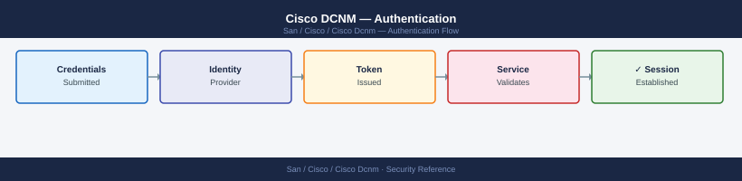

---
tags:
  - san
  - security
---
# Cisco DCNM — Authentication


```bash
ssh root@dcnm-dc1.corp.example.com

# Copy CA cert to DCNM
scp corp-ca.crt root@dcnm-dc1.corp.example.com:/tmp/

# Import into Java truststore
keytool -import -trustcacerts -alias corp-ldap-ca \
  -file /tmp/corp-ca.crt \
  -keystore /usr/java/default/jre/lib/security/cacerts \
  -storepass changeit -noprompt

# Restart DCNM to apply
/usr/local/cisco/dcm/dcnm/sbin/dcnm-server restart
```

## Before you begin

- **Access:** Storage admin credentials (cluster admin or equivalent)
- **Change management:** security changes require CAB approval in most environments
- **Rollback plan:** document current state before any security control change
- **Testing:** validate in a non-production environment first where possible

---

---

## See also

- [Cisco Dcnm — Access Control](access-control/)
- [Cisco Dcnm — Hardening](hardening/)
- [Cisco Dcnm — Encryption](encryption/)
