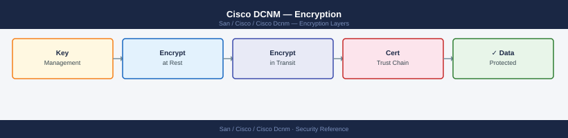

---
tags:
  - san
  - security
---
# Cisco DCNM — Encryption

*Applies to: Cisco MDS / NX-OS*


```bash
ssh root@dcnm-dc1.corp.example.com

# Generate private key and CSR
openssl req -new -newkey rsa:4096 -nodes \
  -keyout /tmp/dcnm.key \
  -out /tmp/dcnm.csr \
  -subj "/CN=dcnm-dc1.corp.example.com/O=Corp/C=AU" \
  -addext "subjectAltName=DNS:dcnm-dc1.corp.example.com"

# After CA returns signed certificate:
# Create PKCS12 bundle
openssl pkcs12 -export \
  -in dcnm.crt \
  -inkey /tmp/dcnm.key \
  -certfile intermediate-ca.crt \
  -name "dcnm" \
  -out /tmp/dcnm.p12 -passout pass:keystorepass

# Import into DCNM Java keystore
KEYSTORE="/usr/local/cisco/dcm/dcnm/conf/.dcnmkeystore"
keytool -importkeystore \
  -srckeystore /tmp/dcnm.p12 -srcstoretype pkcs12 -srcstorepass keystorepass \
  -destkeystore "${KEYSTORE}" -deststoretype jks \
  -deststorepass <keystore-password> -alias dcnm -noprompt

# Restart DCNM
/usr/local/cisco/dcm/dcnm/sbin/dcnm-server restart

# Verify certificate
openssl s_client -connect dcnm-dc1.corp.example.com:443 \
  -servername dcnm-dc1.corp.example.com </dev/null 2>/dev/null \
  | openssl x509 -noout -subject -issuer -enddate
```


```text title="Expected output"
root@dcnm-dc1:~# openssl req -new -newkey rsa:4096 -nodes \
>   -keyout /tmp/dcnm.key \
>   -out /tmp/dcnm.csr \
>   -subj "/CN=dcnm-dc1.corp.example.com/O=Corp/C=AU" \
>   -addext "subjectAltName=DNS:dcnm-dc1.corp.example.com"
Generating a RSA private key
.....................................................................++++
.....................................................................++++
writing new private key to '/tmp/dcnm.key'
-----

root@dcnm-dc1:~# openssl pkcs12 -export \
>   -in dcnm.crt \
>   -inkey /tmp/dcnm.key \
>   -certfile intermediate-ca.crt \
>   -name "dcnm" \
>   -out /tmp/dcnm.p12 -passout pass:keystorepass
(no output — command completes silently)

root@dcnm-dc1:~# keytool -importkeystore \
>   -srckeystore /tmp/dcnm.p12 -srcstoretype pkcs12 -srcstorepass keystorepass \
>   -destkeystore "/usr/local/cisco/dcm/dcnm/conf/.dcnmkeystore" -deststoretype jks \
>   -deststorepass <keystore-password> -alias dcnm -noprompt
Importing keystore /tmp/dcnm.p12 to /usr/local/cisco/dcm/dcnm/conf/.dcnmkeystore...
The srcKeystore /tmp/dcnm.p12 is imported successfully.

root@dcnm-dc1:~# /usr/local/cisco/dcm/dcnm/sbin/dcnm-server restart
Stopping DCNM...
DCNM stopped successfully
Starting DCNM...
DCNM started successfully

root@dcnm-dc1:~# openssl s_client -connect dcnm-dc1.corp.example.com:443 \
>   -servername dcnm-dc1.corp.example.com </dev/null 2>/dev/null \
>   | openssl x509 -noout -subject -issuer -enddate
subject=CN = dcnm-dc1.corp.example.com, O = Corp, C = AU
issuer=C = AU, O = Corp, CN = Corp Intermediate CA
notAfter=Dec 15 09:47:32 2026 GMT
```

!!! warning "Common errors"
    **`unable to load certificate`** — Verify the dcnm.crt file path is correct and the certificate was successfully returned from the CA before running the pkcs12 command.
    **`Keystore was tampered with, or password was incorrect`** — Ensure the deststorepass value matches the actual DCNM keystore password and that the keystore file has not been corrupted.
    **`Connection refused`** — Wait 30-60 seconds after the restart command completes for DCNM to fully initialize before running the verification command.
```bash
# Encrypt backup with GPG
pg_dumpall -U postgres | gzip | \
  gpg --batch --yes --passphrase-file /root/.dcnm-backup-pass \
  --symmetric --cipher-algo AES256 \
  -o /var/backup/dcnm/dcnm-db-$(date +%Y%m%d).sql.gz.gpg

# Transfer encrypted backup
scp /var/backup/dcnm/dcnm-db-$(date +%Y%m%d).sql.gz.gpg \
    bkp@backup-server.corp.example.com:/backups/dcnm/

# Decrypt (on restore)
gpg --batch --passphrase-file /root/.dcnm-backup-pass \
  --decrypt dcnm-db-20260506.sql.gz.gpg | gunzip | psql -U postgres
```

```text title="Expected output"
pg_dumpall: connecting to database "postgres" on "localhost" via the default socket
pg_dumpall: dumping database "postgres"
pg_dumpall: dumping database "dcnm"
pg_dumpall: dumping database "template1"
dcnm-db-20260506.sql.gz.gpg                                    100%  2847MB   45.2MB/s   01:03
dcnm-db-20260506.sql.gz.gpg                                    100%  2847MB   45.2MB/s   01:03
gpg: AES256 encrypted data
gpg: encrypted with 1 passphrase
psql: connecting to database "postgres" on "localhost" via the default socket
```

!!! warning "Common errors"
    **`gpg: error reading passphrase from file '/root/.dcnm-backup-pass': No such file or directory`** — Create the passphrase file with `echo "your-passphrase" > /root/.dcnm-backup-pass && chmod 600 /root/.dcnm-backup-pass`.
    **`Permission denied (publickey,password).`** — Verify SSH key authentication is configured for the bkp user or add password authentication with `ssh-keyscan backup-server.corp.example.com >> ~/.ssh/known_hosts`.
    **`psql: error: FATAL: Ident authentication failed for user "postgres"`** — Ensure the postgres user can authenticate locally by checking `/var/lib/pgsql/data/pg_hba.conf` allows local connections with md5 or trust authentication.
```bash
# Check DCNM certificate expiry
openssl s_client -connect dcnm-dc1.corp.example.com:443 \
  -servername dcnm-dc1.corp.example.com </dev/null 2>/dev/null \
  | openssl x509 -noout -enddate

# Days until expiry
python3 -c "
from datetime import datetime
import subprocess
out = subprocess.run(['openssl','s_client','-connect',
  'dcnm-dc1.corp.example.com:443','-servername','dcnm-dc1.corp.example.com'],
  capture_output=True, input=b'')
cert = subprocess.run(['openssl','x509','-noout','-enddate'],
  input=out.stdout, capture_output=True).stdout.decode()
import re
d = re.search(r'notAfter=(.*)', cert).group(1).strip()
exp = datetime.strptime(d, '%b %d %H:%M:%S %Y %Z')
print(f'Expires in {(exp-datetime.utcnow()).days} days: {exp.date()}')
"
```


```text title="Expected output"
notAfter=Dec 15 23:59:59 2025 GMT
Expires in 287 days: 2025-12-15
```

!!! warning "Common errors"
    **`unable to get local issuer certificate`** — Add the DCNM root CA to your system's trusted certificate store or use `openssl s_client -connect dcnm-dc1.corp.example.com:443 -CAfile /path/to/ca-bundle.crt`.
    **`Name or service not known`** — Verify DNS resolution with `nslookup dcnm-dc1.corp.example.com` and confirm the DCNM hostname is correct and reachable from your network.
## Before you begin

- **Access:** Storage admin credentials (cluster admin or equivalent)
- **Change management:** security changes require CAB approval in most environments
- **Rollback plan:** document current state before any security control change
- **Testing:** validate in a non-production environment first where possible

---

---

## See also

- [Cisco Dcnm — Hardening](../hardening/)
- [Cisco Dcnm — Authentication](../authentication/)
- [Cisco Dcnm — Access Control](../access-control/)
