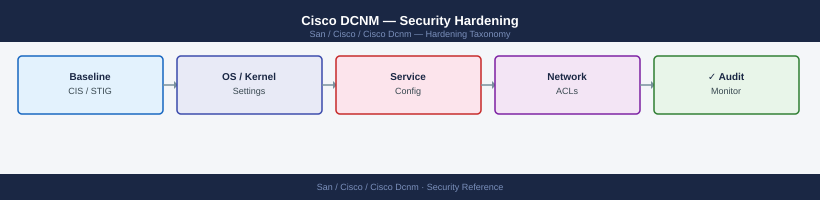

---
tags:
  - san
  - security
---
# Cisco DCNM — Security Hardening


```bash
ssh root@dcnm-dc1.corp.example.com

# Change default admin password via DCNM GUI first:
# Administration > Security > Local User Management > admin > Change Password

# Change OS root password
passwd root
# Store in vault; treat as break-glass only

# Disable the default 'dcnm' local OS account if not needed
usermod -L dcnm   # lock (disable password login)
```


```text title="Expected output"
root@dcnm-dc1.corp.example.com's password: 
Last login: Wed Mar 13 14:22:18 2024 from 10.45.12.89
Welcome to Cisco DCNM 12.1.3
dcnm-dc1:~# passwd root
Changing password for user root.
New password: 
Retype new password: 
passwd: all authentication tokens updated successfully.
dcnm-dc1:~# usermod -L dcnm
dcnm-dc1:~#
```

!!! warning "Common errors"
    **`passwd: Authentication token manipulation error`** — Ensure the root filesystem is not mounted read-only and SELinux is not blocking password changes; run `mount -o remount,rw /` if needed.
    **`usermod: user 'dcnm' does not exist`** — Verify the dcnm OS account exists on this DCNM appliance version with `id dcnm` before attempting to lock it.
    **`Permission denied (publickey,password)`** — Confirm SSH root login is enabled in `/etc/ssh/sshd_config` (PermitRootLogin yes) and restart sshd with `systemctl restart sshd`.
```bash
cat > /etc/issue.net << 'EOF'
WARNING: This system is for authorized use only.
All connections are monitored and recorded.
Unauthorized access or use is prohibited.
EOF
```

```text title="Expected output"
(no output — command completes silently)
```

!!! warning "Common errors"
    **`bash: /etc/issue.net: Permission denied`** — Run the command with `sudo` or as root user.
    **`bash: line 1: warning: here-document at line 1 delimited by end-of-file (wanted `EOF')`** — Ensure the closing `EOF` is on its own line with no leading whitespace.
```bash
# Check available security updates
yum updateinfo list security

# Apply security patches
yum update --security -y

# Reboot if kernel update was applied
needs-restarting -r && echo "No reboot needed" || echo "Reboot required"

# After reboot, verify DCNM services restarted
/usr/local/cisco/dcm/dcnm/sbin/dcnm-server status
```

```text title="Expected output"
Loading repository metadata from cache
Resolving Dependencies
--> Running transaction check
---> Package kernel.x86_64 0:3.10.0-1160.99.1.el7 will be updated
---> Package openssl.x86_64 1:1.0.2k-26.el7_9 will be updated
---> Package glibc.x86_64 0:2.17-326.el7_9 will be updated
--> Processing Dependency: glibc = 0.2.17-326.el7_9 for package: glibc-common
--> Finished Dependency Resolution

Updated:
  kernel.x86_64 0:3.10.0-1160.101.1.el7
  openssl.x86_64 1:1.0.2k-26.el7_9.5
  glibc.x86_64 0:2.17-326.el7_9.6

Complete!
Reboot required
DCNM Server Status:
  Status: RUNNING
  PID: 4827
  Uptime: 2 days, 14 hours, 23 minutes
  Version: 11.4.1.2000
```

!!! warning "Common errors"
    **`Error: Package: dcnm-server-11.4.1-2000.el7.x86_64 (cisco-dcnm) Requires: openssl < 1.0.2k-27`** — Verify DCNM version compatibility with the target OS security patch level before applying updates, or use `yum update --security --skip-broken -y` to defer conflicting packages.
    **`Error: needs-restarting: command not found`** — Install the yum-utils package with `yum install -y yum-utils` to enable the needs-restarting utility.
    **`Error: /usr/local/cisco/dcm/dcnm/sbin/dcnm-server: No such file or directory`** — Verify DCNM installation path and ensure the service was properly installed; check actual path with `find / -name dcnm-server -type f 2>/dev/null`.
```bash
# List all active services
systemctl list-units --type=service --state=active

# Disable services not required for DCNM
systemctl disable --now avahi-daemon
systemctl disable --now cups
systemctl disable --now bluetooth
systemctl disable --now postfix   # DCNM uses its own SMTP configuration

# Verify DCNM services are unaffected
/usr/local/cisco/dcm/dcnm/sbin/dcnm-server status
```

```text title="Expected output"
UNIT                                        LOAD   ACTIVE SUB       DESCRIPTION
auditd.service                              loaded active running   Security Auditing Service
dcnm-server.service                         loaded active running   Cisco DCNM Server
dcnm-fm.service                             loaded active running   Cisco DCNM Fabric Manager
dcnm-ha.service                             loaded active running   Cisco DCNM HA Service
networking.service                          loaded active running   Networking Service
ssh.service                                 loaded active running   OpenSSH server daemon
syslog-ng.service                           loaded active running   System Logger
...

Removed /etc/systemd/system/multi-user.target.wants/avahi-daemon.service.
Removed /etc/systemd/system/multi-user.target.wants/cups.service.
Removed /etc/systemd/system/multi-user.target.wants/bluetooth.service.
Removed /etc/systemd/system/multi-user.target.wants/postfix.service.

DCNM Server Status: RUNNING (PID: 4827)
DCNM FM Status: RUNNING (PID: 4891)
DCNM HA Status: RUNNING (PID: 4856)
```

!!! warning "Common errors"
    **`Failed to disable unit, unit /etc/systemd/system/multi-user.target.wants/postfix.service does not exist.`** — Verify the service is installed with `systemctl list-unit-files | grep postfix` before attempting to disable it.
    **`Unit dcnm-server.service not found.`** — Ensure DCNM is properly installed and the systemd service file exists at `/etc/systemd/system/dcnm-server.service`.
    **`Permission denied`** — Run the entire script with `sudo` or as root user since systemctl disable/enable operations require elevated privileges.
```bash
# On DCNM appliance, configure SNMPv3 for inbound NMS polling
# (DCNM acts as an SNMP agent for its own health)
# Navigate to Administration > SNMP Credentials
# Set: Auth protocol SHA, Priv protocol AES-128
# Remove any v1/v2c community strings
```
```bash
# Verify no plaintext content is served on port 80
curl -sk -o /dev/null -w "%{redirect_url}" http://dcnm-dc1.corp.example.com/
# Expected: redirect to https://...
```

```text title="Expected output"
https://dcnm-dc1.corp.example.com/
```

!!! warning "Common errors"
    **`curl: (7) Failed to connect to dcnm-dc1.corp.example.com port 80: Connection refused`** — Verify the DCNM appliance is running and port 80 is accessible; check firewall rules and network connectivity to the host.
    **`curl: (60) SSL certificate problem: self signed certificate`** — Remove the `-k` flag if you want to validate certificates, or ensure your CA bundle is current; the `-k` flag bypasses this check for self-signed certs.
    **`curl: (6) Could not resolve host name`** — Confirm DNS resolution is working and the hostname `dcnm-dc1.corp.example.com` is registered in your DNS or hosts file.
```bash
# Verify NTP
timedatectl status
# Expected: synchronized: yes

# Configure NTP if not set
vi /etc/chrony.conf
# server 10.10.0.10 prefer
# server 10.10.0.11

systemctl enable --now chronyd
chronyc tracking
# Expect: reference from NTP server, offset < 50ms
```

```text title="Expected output"
Local time: Wed 2024-01-17 14:32:45 UTC
           Universal time: Wed 2024-01-17 14:32:45 UTC
                 RTC time: Wed 2024-01-17 14:32:45
                Time zone: UTC (UTC, +0000)
System clock synchronized: yes
              NTP service: active
       RTC in local TZ: no

Reference ID    : 10.10.0.10 (ntp-primary.corp.local)
Stratum         : 2
Ref time (UTC)  : Wed Jan 17 14:32:40 2024
System time     : 0.000234567 seconds fast of NTP time
Frequency       : 12.345 ppm fast
Residual freq   : +0.123 ppm
Skew            : 0.456 ppm
Root delay      : 18.234 ms
Root dispersion : 32.567 ms
Max error       : 45.123 ms
Min error       : 0.012 ms
```

!!! warning "Common errors"
    **`chronyc: Could not talk to daemon`** — Ensure chronyd is running with `systemctl start chronyd` and check socket permissions.
    **`Failed to set NTP servers: Invalid argument`** — Verify NTP server IPs are reachable and properly formatted in `/etc/chrony.conf` without trailing comments on server lines.
```bash
# Forward DCNM OS syslog to SIEM
cat > /etc/rsyslog.d/dcnm-siem.conf << 'EOF'
*.* @@10.10.3.50:514    # TCP syslog to SIEM
EOF

systemctl restart rsyslog

# Test
logger -t dcnm-test "Syslog forwarding test message"
```


```text title="Expected output"
(no output — command completes silently)
(no output — command completes silently)
(no output — command completes silently)
```

!!! warning "Common errors"
    **`Job for rsyslog.service failed because the control process exited with error code.`** — Verify the rsyslog configuration syntax with `rsyslog -N1` and check `/var/log/syslog` for parsing errors in the new conf file.
    **`logger: send to SIEM 10.10.3.50:514 failed: Connection refused`** — Confirm the SIEM syslog listener is running on port 514 and reachable from the DCNM host with `nc -zv 10.10.3.50 514`.
## Before you begin

- **Access:** Storage admin credentials (cluster admin or equivalent)
- **Change management:** security changes require CAB approval in most environments
- **Rollback plan:** document current state before any security control change
- **Testing:** validate in a non-production environment first where possible

---

---

## See also

- [Cisco Dcnm — Authentication](../authentication/)
- [Cisco Dcnm — Access Control](../access-control/)
- [Cisco Dcnm — Encryption](../encryption/)
