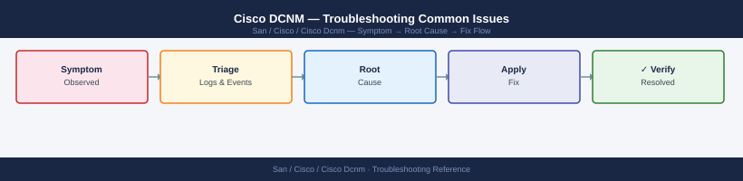

---
tags:
  - san
  - troubleshooting
search:
  boost: 1.5
---
# Cisco DCNM — Troubleshooting Common Issues


```bash
# Step 1: Test SSH from DCNM to the switch
ssh -o ConnectTimeout=5 -o BatchMode=yes dcnm_mgmt@<switch-ip> 'show version' 2>&1
# If fails: SSH connectivity problem

# Step 2: Test SNMP
snmpget -v3 -u dcnm_poll -l authPriv -a SHA -A <auth-pass> \
  -x AES -X <priv-pass> <switch-ip> sysDescr.0
# If fails: SNMP credentials mismatch or network issue

# Step 3: Check DCNM discovery log
grep "<switch-ip>" /var/log/dcnm/discovery.log | tail -30
```

```bash
# Check PM service status
systemctl status dcnm-pm

# Check PM log for polling errors
tail -f /var/log/dcnm/pm.log | grep -i "error\|timeout\|failed"

# Restart PM service
systemctl restart dcnm-pm

# Verify SNMP polling is working manually
snmpwalk -v3 -u dcnm_poll -l authPriv -a SHA -A <auth-pass> \
  -x AES -X <priv-pass> <switch-ip> ifInOctets
# Expected: output with interface counter values
```
```bash
# Test LDAP from DCNM appliance
ldapsearch -H ldaps://ldap.corp.example.com \
  -D "CN=dcnm-svc,OU=Service Accounts,DC=corp,DC=example,DC=com" \
  -w <password> \
  -b "DC=corp,DC=example,DC=com" \
  "(sAMAccountName=<test-user>)"
```
```bash
# Check resource usage
top -b -n 1 | head -20
free -h

# Check disk I/O
iostat -x 1 5

# Check database connections
psql -U postgres -c "SELECT count(*) FROM pg_stat_activity WHERE state='active';"
# If > 50 active connections: connection pool exhaustion

# Check for runaway queries
psql -U postgres -c "
SELECT pid, now() - query_start AS duration, query 
FROM pg_stat_activity 
WHERE state = 'active' 
ORDER BY duration DESC 
LIMIT 10;"

# Restart DCNM if Java memory leak suspected
/usr/local/cisco/dcm/dcnm/sbin/dcnm-server restart
```
```bash
# Capture to confirm traps are arriving
sudo tcpdump -i eth0 -n udp port 162 -c 20

# If not arriving: confirm trap destination on the switch
# On MDS switch:
show snmp host
# Should list DCNM IP

# If arriving but not processed: check event manager
tail -f /var/log/dcnm/events.log | grep "trap\|SNMP"

# Restart event service
systemctl restart dcnm-events
```
```bash
# Check upgrade log
tail -100 /var/log/dcnm/install.log

# Check if DCNM services started after upgrade
/usr/local/cisco/dcm/dcnm/sbin/dcnm-server status

# Check for database migration errors (common cause of upgrade failure)
grep -i "liquibase\|migration\|flyway\|ERROR" /var/log/dcnm/install.log

# If upgrade is unrecoverable: revert to pre-upgrade VM snapshot
# Then contact Cisco TAC with the install log
```

```d2
direction: down

symptom: Identify Symptom {shape: diamond}
diagnostic_flow: "Diagnostic Flow" {shape: rectangle}
verify_resolution: "Verify resolution" {shape: rectangle}
resolution: Resolve or Escalate {shape: oval}

symptom -> diagnostic_flow: investigate
symptom -> verify_resolution: investigate
diagnostic_flow -> resolution
verify_resolution -> resolution
```

## Diagnostic Flow

```d2
direction: right

A1: "A1" {shape: rectangle}
A2: "Fix network / firewall\nVerify mgmt IP and creds" {shape: rectangle}
A3: "Re-add switch\nCheck SNMP v3 auth settings" {shape: rectangle}
A4: "Fabric and Switch Issues" {shape: rectangle}
B: "B" {shape: rectangle}
B1: "grep discovery.log\nVerify SSH and SNMP v3 creds\nCheck domain ID conflicts" {shape: rectangle}
B2: "Fabric and Switch Issues" {shape: rectangle}
C: "C" {shape: rectangle}
C1: "systemctl status dcnm-pm\nCheck SNMP poll manually\nRestart PM service" {shape: rectangle}
C2: "Performance Issues" {shape: rectangle}
D: "D" {shape: rectangle}
D1: "Check Elasticsearch disk: df -h\nPrune old performance data\nRestart DCNM if Java heap full" {shape: rectangle}
D2: "Performance Issues" {shape: rectangle}
E: "E" {shape: rectangle}
E1: "journalctl DCNM errors\nCheck DB connections\nReview install.log for migration fail" {shape: rectangle}
E2: "Auth and Platform Issues" {shape: rectangle}
S: "What is the symptom?" {shape: rectangle}
A: "A" {shape: rectangle}

A1 -> A2
A1 -> A3
A3 -> A4
B -> B1
B1 -> B2
C -> C1
C1 -> C2
D -> D1
D1 -> D2
E -> E1
E1 -> E2
```

---

## Before you begin

- **Access:** Storage admin credentials (cluster admin or equivalent)
- **Gather first:** recent error message text, event timestamps, and affected object names
- **Scope:** confirm whether the issue affects a single object, host, cluster, or site
- **Escalation:** open a vendor support ticket before running any destructive step
- **Logging:** document each command and output — required if escalation is needed

---

---

## Verify resolution

- Confirm the original symptom no longer occurs
- Check logs for any residual errors related to the issue
- Monitor for 10–15 minutes to confirm the fix is stable

---

## See also

- [Cisco Dcnm — Diagnostics](../diagnostics/)
- [Cisco Dcnm — Escalation](../escalation/)
- [Cisco Dcnm — Health Checks](../../operations/health-checks/)
