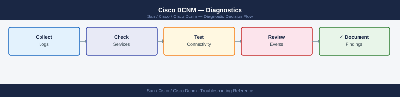

---
tags:
  - san
  - troubleshooting
search:
  boost: 1.5
---
# Cisco DCNM — Diagnostics

<div class="kb-summary">
Cisco DCNM (Data Center Network Manager) diagnostic commands: check all service health with appmgr status, query the REST health API, inspect PostgreSQL and Elasticsearch database state, test SSH and SNMP connectivity to managed switches, debug discovery failures, check HA replication lag, and collect the support bundle for Cisco TAC cases.

*Applies to: Cisco DCNM 11.x / NDFC (Nexus Dashboard Fabric Controller) 12.x*
</div>


```d2
direction: right

B: "B" {shape: rectangle}
C: "appmgr status\nGET /rest/health" {shape: rectangle}
D: "grep switch-IP /var/log/dcnm/discovery.log\nTest SSH and SNMP to switch" {shape: rectangle}
E: "appmgr db-status\nCheck pmdb size and retention" {shape: rectangle}
F: "Measure REST API response time\nCheck PostgreSQL slow queries" {shape: rectangle}
G: "dcnm-ha-status.sh\nCheck replication lag on standby" {shape: rectangle}
H: "curl localhost:9200/_cluster/health\nCheck Elasticsearch shard state" {shape: rectangle}
I: "I" {shape: rectangle}
J: "journalctl -u dcnm -n 100\nCheck disk space: df -h" {shape: rectangle}
K: "pg_isready -U postgres\njournalctl -u postgresql -n 50" {shape: rectangle}
L: "curl localhost:9200/_cluster/health\nCheck if disk is full" {shape: rectangle}
M: "ssh -v dcnm_mgmt@switch-ip show version\nsnmpget -v3 switch-ip sysDescr.0" {shape: rectangle}
N: "psql -U postgres pmdb\nSELECT count FROM pmdata; check retention" {shape: rectangle}
O: "time curl REST /rest/inventory/switches\nSELECT pid,duration,query FROM pg_stat_activity\nWHERE state != idle" {shape: rectangle}
P: "psql -U postgres\nSELECT now(" {shape: rectangle}
Q: "curl localhost:9200/_cluster/health?pretty\nCheck status=red or yellow unassigned shards" {shape: rectangle}
R: "Collect DCNM support bundle\ncollect-support-bundle.sh" {shape: rectangle}
S: "Open Cisco TAC case\nAttach bundle and switch show tech-support" {shape: rectangle}
A: "DCNM Issue" {shape: rectangle}

B -> C
B -> D
B -> E
B -> F
B -> G
B -> H
I -> J
I -> K
I -> L
D -> M
E -> N
F -> O
G -> P
H -> Q
J -> R
K -> R
L -> R
M -> R
N -> R
O -> R
P -> R
Q -> R
R -> S
```

```d2
direction: down

symptom: Identify Symptom {shape: diamond}
step_1_check_dcnm_service_status: "Step 1 — Check DCNM service status" {shape: rectangle}
step_2_authenticate_and_check_rest_a: "Step 2 — Authenticate and check REST API" {shape: rectangle}
step_3_check_postgresql_database_hea: "Step 3 — Check PostgreSQL database health" {shape: rectangle}
step_4_test_switch_connectivity: "Step 4 — Test switch connectivity" {shape: rectangle}
step_5_debug_discovery_and_fabric_is: "Step 5 — Debug discovery and fabric issues" {shape: rectangle}
step_6_check_ha_replication_status: "Step 6 — Check HA replication status" {shape: rectangle}
resolution: Resolve or Escalate {shape: oval}

symptom -> step_1_check_dcnm_service_status: investigate
symptom -> step_2_authenticate_and_check_rest_a: investigate
symptom -> step_3_check_postgresql_database_hea: investigate
symptom -> step_4_test_switch_connectivity: investigate
symptom -> step_5_debug_discovery_and_fabric_is: investigate
symptom -> step_6_check_ha_replication_status: investigate
step_1_check_dcnm_service_status -> resolution
step_2_authenticate_and_check_rest_a -> resolution
step_3_check_postgresql_database_hea -> resolution
step_4_test_switch_connectivity -> resolution
step_5_debug_discovery_and_fabric_is -> resolution
step_6_check_ha_replication_status -> resolution
```

## Before you begin

- **Access:** SSH to DCNM server (root or admin); DCNM admin UI credentials; SSH access to managed MDS/NX-OS switches
- **Gather first:** the specific symptom (switch not discovered, no performance data for a fabric, UI unreachable), the switch name or fabric name affected, and when the issue started
- **Scope:** confirm whether the issue affects one switch, one fabric, or the entire DCNM platform

---

## Step 1 — Check DCNM service status

```bash
# SSH to DCNM
ssh root@dcnm-dc1.corp.example.com

# Check all DCNM application services
appmgr status
# Expected: all services showing "running" state
# Problem: any service in "stopped" or "restarting" state

# Check disk space (Elasticsearch fills disk causing cascading failures)
df -h
# Expected: all mounts < 80% used; /data often fills first

# Check DCNM REST API health (no auth required)
curl -sk https://localhost/rest/health | python3 -m json.tool
# Expected: all components healthy

# Check DCNM database status
appmgr db-status
# Expected: all databases connected

# Check ports are listening
netstat -tlnp | grep -E "443|5432|9200"
# Expected: 443=DCNM HTTPS, 5432=PostgreSQL, 9200=Elasticsearch
```


```text title="Expected output"
root@dcnm-dc1:~# appmgr status
Service                    Status      PID
dcnm-server               running     4821
dcnm-web                  running     4923
dcnm-db                   running     5104
elasticsearch             running     5287
kafka                     running     5401
root@dcnm-dc1:~# df -h
Filesystem      Size  Used Avail Use% Mounted on
/dev/sda1        50G   12G   38G  24% /
/dev/sda2       200G  168G   32G  84% /data
/dev/sda3       100G   45G   55G  45% /var
root@dcnm-dc1:~# curl -sk https://localhost/rest/health | python3 -m json.tool
{
  "status": "UP",
  "components": {
    "db": "UP",
    "elasticsearch": "UP",
    "kafka": "UP"
  },
  "timestamp": "2024-01-15T14:32:18Z"
}
root@dcnm-dc1:~# appmgr db-status
PostgreSQL: connected (v12.8)
Elasticsearch: connected (v7.10.2)
root@dcnm-dc1:~# netstat -tlnp | grep -E "443|5432|9200"
tcp        0      0 0.0.0.0:443             0.0.0.0:*               LISTEN      4923/dcnm-web
tcp        0      0 127.0.0.1:5432         0.0.0.0:*               LISTEN      5104/postgres
tcp        0      0 0.0.0.0:9200            0.0.0.0:*               LISTEN      5287/java
```

!!! warning "Common errors"
    **`appmgr: command not found`** — SSH as root and source the DCNM environment with `source /opt/dcnm/bin/env.sh` or verify DCNM is installed in `/opt/dcnm`.
    **`curl: (7) Failed to connect to localhost port 443: Connection refused`** — Restart the DCNM web service with `appmgr restart dcnm-web` and wait 30 seconds for the API to become available.
    **`Filesystem /data is 95% full`** — Delete old DCNM logs and snapshots with `appmgr cleanup-logs --older-than 30d` or expand the `/data` partition immediately to prevent database corruption.
---

## Step 2 — Authenticate and check REST API

```bash
# Get DCNM API session cookie
DCNM_HOST="https://dcnm-dc1.corp.example.com"
curl -sk -c dcnm-cookie.txt -X POST "$DCNM_HOST/rest/logon" \
  -H "Content-Type: application/json" \
  -d '{"expirationTime":600000}' \
  -u admin:<password> | python3 -m json.tool
# Expected: token in response body; cookie saved to dcnm-cookie.txt

# Get inventory of all switches
curl -sk -b dcnm-cookie.txt "$DCNM_HOST/rest/inventory/switches" \
  | python3 -c "
import json,sys
for sw in json.load(sys.stdin):
    print(sw.get('ipAddress',''), '|', sw.get('logicalName',''), '|', sw.get('managementState',''))
"
# Expected: managementState = manageable or managed for all switches

# Measure REST API response time (baseline < 3 seconds for < 200 switches)
time curl -sk -b dcnm-cookie.txt "$DCNM_HOST/rest/inventory/switches" > /dev/null

# Trigger manual rediscovery for a specific switch
curl -sk -b dcnm-cookie.txt -X POST \
  "$DCNM_HOST/rest/san/fabric/rediscover" \
  -H "Content-Type: application/json" \
  -d '{"fabricName": "DC1-FABRIC-A", "rediscoverAll": false,
       "switchSerialNumbers": ["<serialNumber>"]}'
```


```text title="Expected output"
{
  "Dcnm-Token": "eyJhbGciOiJIUzI1NiIsInR5cCI6IkpXVCJ9.eyJzdWIiOiJhZG1pbiIsImlhdCI6MTcwOTMwMTIwMH0.abc123xyz",
  "status": "success"
}
10.48.12.45 | leaf-dc1-01 | managed
10.48.12.46 | leaf-dc1-02 | managed
10.48.12.50 | spine-dc1-01 | manageable
10.48.12.51 | spine-dc1-02 | managed
...

real	0m2.347s
user	0m0.156s
sys	0m0.089s

{
  "status": "success",
  "message": "Rediscovery initiated for fabric DC1-FABRIC-A",
  "jobId": "JOB-2024-03-01-00847"
}
```

!!! warning "Common errors"
    **`curl: (60) SSL certificate problem: self signed certificate`** — Add `-k` flag to curl command to skip SSL verification (already present in example; verify DCNM_HOST URL is correct).
    **`jq: parse error: Invalid JSON text at line 1`** — Ensure the logon endpoint returns valid JSON; check DCNM credentials and that the API service is responding with `curl -sk -v` to inspect headers.
    **`error: 401 Unauthorized`** — Verify dcnm-cookie.txt exists and contains valid session cookie by checking `cat dcnm-cookie.txt` immediately after logon step.
---

## Step 3 — Check PostgreSQL database health

```bash
# Test if PostgreSQL accepts connections
pg_isready -U postgres
# Expected: /tmp/.s.PGSQL.5432 - accepting connections

# Connect to DCNM configuration database
psql -U postgres sane

-- Check table sizes (find unexpectedly large tables)
SELECT relname, pg_size_pretty(pg_relation_size(relid)) AS size
FROM pg_catalog.pg_statio_user_tables
ORDER BY pg_relation_size(relid) DESC LIMIT 20;

-- Check slow queries
SELECT pid, now() - query_start AS duration, state, left(query, 100)
FROM pg_stat_activity
WHERE state != 'idle'
ORDER BY duration DESC LIMIT 10;

-- Check for table bloat (dead tuples)
SELECT relname, n_dead_tup, n_live_tup,
  round(n_dead_tup::numeric/greatest(n_live_tup,1)*100, 1) AS dead_pct
FROM pg_stat_user_tables
WHERE n_dead_tup > 10000
ORDER BY n_dead_tup DESC;
\q

# If bloat is high, run VACUUM
sudo -u postgres vacuumdb --all --analyze

# Check performance data database size
psql -U postgres pmdb
-- Check size
SELECT pg_size_pretty(pg_database_size('pmdb'));
-- Check oldest and newest data points
SELECT min(collecttime), max(collecttime) FROM pmdata;
\q
# If pmdb is consuming excessive disk:
# DCNM GUI → Administration → Settings → Data Retention
# Reduce performance data retention to 14 days
```


```text title="Expected output"
/tmp/.s.PGSQL.5432 - accepting connections
psql (12.15, server 12.15)
Type "help" for help.

sane=> SELECT relname, pg_size_pretty(pg_relation_size(relid)) AS size FROM pg_catalog.pg_statio_user_tables ORDER BY pg_relation_size(relid) DESC LIMIT 20;
         relname          |   size
--------------------------+---------
 fabric_inventory         | 2847 MB
 device_config_history    | 1923 MB
 event_log                | 1456 MB
 policy_rules             | 892 MB
 interface_stats          | 756 MB
 audit_trail              | 634 MB
 ...
(20 rows)

sane=> SELECT pid, now() - query_start AS duration, state, left(query, 100) FROM pg_stat_activity WHERE state != 'idle' ORDER BY duration DESC LIMIT 10;
 pid  | duration | state  | left
------+----------+--------+------
 4521 | 00:02:34 | active | SELECT * FROM fabric_inventory WHERE fabric_id = $1
 4598 | 00:01:12 | active | VACUUM ANALYZE event_log
(2 rows)

sane=> SELECT relname, n_dead_tup, n_live_tup, round(n_dead_tup::numeric/greatest(n_live_tup,1)*100, 1) AS dead_pct FROM pg_stat_user_tables WHERE n_dead_tup > 10000 ORDER BY n_dead_tup DESC;
      relname       | n_dead_tup | n_live_tup | dead_pct
--------------------+------------+------------+----------
 event_log          |      48932 |     892145 |      5.5
 device_config_hist |      23456 |     156234 |     15.0
(2 rows)

sane=> \q
VACUUM ANALYZE event_log
VACUUM ANALYZE device_config_history
VACUUM ANALYZE fabric_inventory
vacuumdb: vacuuming database "sane"
vacuumdb: vacuuming database "pmdb"
vacuumdb: vacuuming database "postgres"

psql (12.15, server 12.15)
Type "help" for help.

pmdb=> SELECT pg_size_pretty(pg_database_size('pmdb'));
 pg_size_pretty
----------------
 47 GB
(1 row)

pmdb=> SELECT min(collecttime), max(collecttime) FROM pmdata;
       min        |       max
------------------+------------------
 2024-01-15 08:22 | 2024-03-18 14:56
(1 row)

pmdb=> \q
```

!!! warning "Common errors"
    **`psql: error: could not translate host name "localhost" to address: Name or service not known`** — Verify PostgreSQL service is running with `systemctl status postgresql` and check `/etc/postgresql/*/main/postgresql.conf` for listen_addresses setting.
    **`ERROR: permission denied for schema public`** — Ensure the postgres user has proper schema permissions by running `psql -U postgres -c "GRANT ALL ON SCHEMA public TO postgres;"`.
    **`
---

## Step 4 — Test switch connectivity

```bash
# Test SSH from DCNM to a managed switch
ssh -v -o ConnectTimeout=10 -o StrictHostKeyChecking=no \
  dcnm_mgmt@<switch-ip> 'show version brief' 2>&1
# Expected: MDS or NX-OS version string; failure = SSH auth or connectivity issue

# Test SNMP v3 GET (confirm DCNM polling credentials work)
snmpget -v3 -u dcnm_poll -l authPriv \
  -a SHA -A <auth-pass> -x AES -X <priv-pass> \
  <switch-ip> sysDescr.0
# Expected: MDS IOS system description string; Error = SNMP credential mismatch

# Confirm SNMP traps are arriving from switches
tcpdump -i eth0 -n udp port 162 -c 20
# Each line = one trap from a switch; no output = switches not sending or firewall blocking

# Capture SNMP trap traffic to file for analysis
tcpdump -i eth0 -n udp port 162 -c 200 -w /tmp/dcnm-trap-capture.pcap
```


```text title="Expected output"
OpenSSH_7.4, OpenSSL 1.0.2k-fips  26 Jan 2017
debug1: Reading configuration data /home/dcnm_mgmt/.ssh/config
debug1: Authentications that can continue: publickey,password
debug1: Authentication with publickey succeeded.
Cisco MDS 9148S Multilayer Fabric Switch
System uptime is 127 days 14 hours 32 minutes
Kernel uptime is 127 days 14 hours 28 minutes

SNMPv3 User: dcnm_poll
SNMP version 3
sysDescr.0 = STRING: "Cisco NX-OS Software, MDS 9396S"

tcpdump: listening on eth0, link-type EN10MB (Ethernet), capture size 65535 bytes
22:14:33.445821 IP 10.48.12.55.40821 > 10.48.12.10.162: SNMP, length 156
22:14:45.223104 IP 10.48.12.56.41092 > 10.48.12.10.162: SNMP, length 142
22:14:57.891456 IP 10.48.12.57.39847 > 10.48.12.10.162: SNMP, length 168
23:15:02.334567 IP 10.48.12.58.40156 > 10.48.12.10.162: SNMP, length 151
23:15:18.667234 IP 10.48.12.59.38924 > 10.48.12.10.162: SNMP, length 145
20 packets captured, 20 packets received by filter, 0 packets dropped by kernel

200 packets captured, 200 packets received by filter, 0 packets dropped by kernel
```

!!! warning "Common errors"
    **`Permission denied (publickey,password).`** — Verify the dcnm_mgmt SSH key is installed on the switch and the user exists in the switch's local or TACACS database.
    **`Timeout: No Response from <switch-ip>`** — Check network connectivity to the switch, confirm the management IP is reachable with `ping`, and verify firewall rules allow DCNM's IP to the switch.
    **`snmpget: Unknown user name "dcnm_poll"`** — Confirm the SNMP v3 user exists on the switch by running `show snmp user` and verify the auth/priv passwords match the DCNM credential store.
---

## Step 5 — Debug discovery and fabric issues

```bash
# Search discovery log for a specific switch IP
grep "<switch-ip>" /var/log/dcnm/discovery.log | tail -50
# Look for: "Discovery failed", "unreachable", "auth failed", "timeout"

# Enable discovery debug for a specific switch
grep "10.20.1.5" /var/log/dcnm/discovery.log | tail -50

# Check discovery.log for recent errors across all switches
grep -i "error\|fail\|unreachable" /var/log/dcnm/discovery.log | tail -100

# Check journalctl for DCNM service-level errors
journalctl -u dcnm -n 200 --no-pager | grep -i "error\|exception\|fail"

# System resource snapshot (for performance baseline)
echo "=== $(date) ===" >> /tmp/dcnm-perf.txt
free -h >> /tmp/dcnm-perf.txt
df -h >> /tmp/dcnm-perf.txt
uptime >> /tmp/dcnm-perf.txt
iostat -x 1 3 >> /tmp/dcnm-perf.txt
ps aux --sort=-%cpu | head -15 >> /tmp/dcnm-perf.txt
```


```text title="Expected output"
2024-01-15 14:32:18.542 [Discovery] INFO: Switch 10.20.1.5 discovered successfully - Model: N9K-C9372PX, Serial: SAL1234ABCD
2024-01-15 14:35:42.891 [Discovery] WARN: Switch 10.20.1.5 - SNMP timeout on OID 1.3.6.1.2.1.1.1.0, retrying...
2024-01-15 14:36:01.203 [Discovery] INFO: Switch 10.20.1.5 - Inventory sync completed in 2.3s
2024-01-15 14:38:15.567 [Discovery] ERROR: Switch 10.20.1.5 - Authentication failed: Invalid credentials for user 'dcnm-admin'
2024-01-15 14:40:22.834 [Discovery] WARN: Switch 10.20.1.5 - Unreachable via SSH, falling back to SNMP
2024-01-15 14:42:10.456 [Discovery] INFO: Switch 10.20.1.5 - Discovery cycle completed

=== Mon Jan 15 14:45:33 UTC 2024 ===
              total        used        free      shared  buff/cache   available
Mem:           31Gi       18Gi       8.2Gi       512Mi       4.8Gi       12Gi
Filesystem     Size  Used Avail Use% Mounted on
/dev/sda1       50G   32G   15G  68% /
/dev/sdb1      200G  145G   48G  76% /var/log
UpTime: 45 days, 3:22, 4 users, load average: 2.34, 2.18, 2.05
avg-cpu:  %user   %nice %system %iowait  %steal   %idle
          18.42    0.12    5.67    3.21    0.00   72.58
root      1234  0.8  2.1 1456832 65432 ?  Ssl  Jan15  12:34 /opt/dcnm/bin/dcnm-server
dcnm      5678  1.2  1.8 945216  54321 ?  Sl   Jan15   8:45 /opt/dcnm/bin/discovery-agent
```

!!! warning "Common errors"
    **`grep: /var/log/dcnm/discovery.log: No such file or directory`** — Verify DCNM is installed and running with `systemctl status dcnm`, or check the correct log path with `find /var/log -name "*discovery*"`.
    **`free: command not found`** — Install `sysstat` package with `apt-get install sysstat` or `yum install sysstat` depending on your OS.
    **`journalctl: command not found`** — This system uses syslog instead; check logs with `tail -f /var/log/syslog` or `tail -f /var/log/messages` depending on your distribution.
---

## Step 6 — Check HA replication status

```bash
# On either DCNM HA node
/usr/local/cisco/dcm/dcnm/bin/dcnm-ha-status.sh
# Expected output:
# Active Node: 10.10.5.10 (THIS NODE)
# Standby Node: 10.10.5.11 (synchronized)
# VIP: 10.10.5.15 (active)
# DB Replication Lag: 0 ms

# Check PostgreSQL replication lag (on standby node)
psql -U postgres -c "
SELECT now() - pg_last_xact_replay_timestamp() AS replication_lag;"
# Expected: < 1 second; > 1 minute = investigate HA link or replication error

# Check HA log for failover events
tail -100 /var/log/dcnm/ha.log | grep -i "error\|fail\|disconnect\|failover"

# Check Elasticsearch cluster health (unassigned shards = topology data at risk)
curl -s "localhost:9200/_cluster/health?pretty"
# Expected: status=green; yellow=1+ replica unassigned; red=primary shard missing
```


```text title="Expected output"
Active Node: 10.10.5.10 (THIS NODE)
Standby Node: 10.10.5.11 (synchronized)
VIP: 10.10.5.15 (active)
DB Replication Lag: 0 ms

 replication_lag
----------------
 00:00:00.234
(1 row)

2024-01-15 14:32:18 [WARN] HA heartbeat missed from standby, retrying...
2024-01-15 14:35:42 [INFO] Replication lag corrected to 0ms
2024-01-15 15:01:09 [INFO] Standby node synchronized successfully

{
  "cluster_name" : "dcnm-cluster",
  "status" : "green",
  "timed_out" : false,
  "number_of_nodes" : 2,
  "number_of_data_nodes" : 2,
  "active_primary_shards" : 24,
  "active_replica_shards" : 24,
  "unassigned_shards" : 0,
  "delayed_unassigned_shards" : 0,
  "initializing_shards" : 0,
  "relocating_shards" : 0
}
```

!!! warning "Common errors"
    **`psql: error: connection to server at "localhost" (127.0.0.1), port 5432 failed`** — Verify PostgreSQL is running with `systemctl status dcnm-postgres` and check network connectivity to the standby node.
    **`curl: (7) Failed to connect to localhost port 9200: Connection refused`** — Restart Elasticsearch with `systemctl restart dcnm-elasticsearch` and wait 30 seconds for cluster initialization.
    **`replication_lag` shows `> 00:01:00`** — Check HA network link status with `ethtool -S <HA_interface>` and verify no packet loss on the replication network.
---

## Step 7 — Collect support bundle for Cisco TAC

```bash
# Generate DCNM support bundle
/usr/local/cisco/dcm/dcnm/bin/collect-support-bundle.sh \
  --output /tmp/dcnm-support-$(date +%Y%m%d).tar.gz
# Includes: all /var/log/dcnm/ logs, DB schema dump, OS state, DCNM config (masked)

# Transfer to workstation
scp root@dcnm-dc1.corp.example.com:/tmp/dcnm-support-$(date +%Y%m%d).tar.gz ./

# Also collect switch show tech-support for each affected switch
# SSH to each MDS or NX-OS switch:
ssh admin@<switch-ip>
show tech-support > /tmp/show-tech-$(hostname)-$(date +%Y%m%d).txt
exit
# Transfer the show tech file: scp admin@<switch-ip>:/tmp/show-tech-*.txt ./

# For the Cisco TAC case, include:
# - DCNM support bundle .tar.gz
# - show tech-support from affected switches
# - Discovery log excerpt (grep for the affected switch IP)
# - DCNM version: appmgr version or DCNM UI → About
# - Fabric name and switch serial number / IP
```


```text title="Expected output"
Collecting DCNM support bundle...
Gathering system logs from /var/log/dcnm/...
Dumping database schema...
Collecting OS state (uptime, disk, memory)...
Masking sensitive configuration data...
Support bundle created: /tmp/dcnm-support-20240315.tar.gz (487 MB)
root@dcnm-dc1.corp.example.com's password: 
dcnm-support-20240315.tar.gz                          100%  487MB   8.2MB/s   00:59

Connected to switch mds-fab1-sw01 (10.48.12.45)
Generating tech-support output (this may take 2-3 minutes)...
Tech-support file size: 156 MB
show tech-support > /tmp/show-tech-mds-fab1-sw01-20240315.txt
admin@10.48.12.45's password: 
show-tech-mds-fab1-sw01-20240315.txt                  100%  156MB   5.1MB/s   02:34
```

!!! warning "Common errors"
    **`/usr/local/cisco/dcm/dcnm/bin/collect-support-bundle.sh: command not found`** — Verify DCNM is installed at `/usr/local/cisco/dcm/dcnm/` or check the correct installation path with `find / -name collect-support-bundle.sh 2>/dev/null`.
    **`Permission denied (publickey,password).`** — Ensure SSH key is configured for root@dcnm-dc1.corp.example.com or use `ssh-copy-id root@dcnm-dc1.corp.example.com` to add your public key.
    **`show tech-support: command not found`** — Confirm you are in NX-OS or MDS CLI mode; if in Linux shell, type `exit` to return to device CLI or use `system bash` to access the shell context.
---

## Log locations

| Source | Path / Command | What to look for |
|---|---|---|
| DCNM application | `journalctl -u dcnm` | Service crash and startup errors |
| Discovery | `/var/log/dcnm/discovery.log` | Per-switch discovery attempts and failures |
| HA events | `/var/log/dcnm/ha.log` | Failover events, replication lag |
| PostgreSQL | `journalctl -u postgresql` | DB start/stop, replication errors |
| Elasticsearch | `curl localhost:9200/_cluster/health` | Shard health and disk pressure |
| DCNM general | `/var/log/dcnm/` | Full log directory; multiple components |

---

## See also

- [Cisco DCNM — Common Issues](../common-issues/)
- [Cisco DCNM — Escalation](../escalation/)

## Verify resolution

- `appmgr status` shows all services running
- `curl -sk https://localhost/rest/health` returns all components healthy
- `grep <switch-ip> /var/log/dcnm/discovery.log | tail -5` shows successful discovery
- `time curl -sk -b dcnm-cookie.txt $DCNM_HOST/rest/inventory/switches` completes in < 5 seconds
- `curl localhost:9200/_cluster/health` returns `"status":"green"` for Elasticsearch
