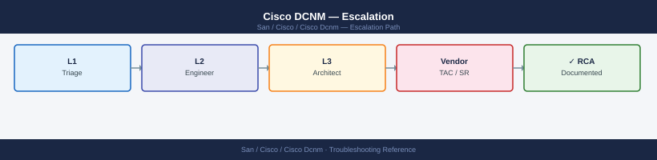
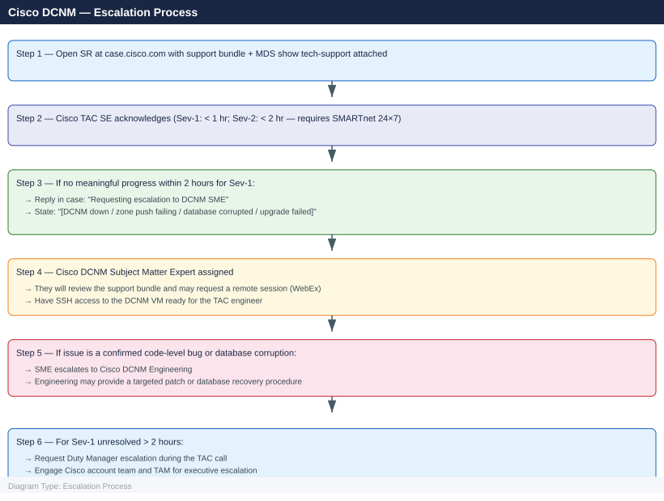

---
tags:
  - san
  - troubleshooting
search:
  boost: 1.5
---
# Cisco DCNM — Escalation

<div class="kb-summary">
How to escalate Cisco DCNM (Data Center Network Manager) issues to Cisco TAC: what data to collect, how to generate the DCNM support bundle and MDS show tech-support, step-by-step case creation on case.cisco.com, and the escalation path when progress stalls.

*Applies to: Cisco DCNM 11.x — standalone VM or Native HA deployment managing MDS / Nexus SAN fabrics*
</div>



---

```d2
direction: down

symptom: Identify Symptom {shape: diamond}
preescalation_selfcheck: "Pre-Escalation Self-Check" {shape: rectangle}
stepbystep_data_collection: "Step-by-Step Data Collection" {shape: rectangle}
how_to_open_the_sr_on_caseciscocom: "How to Open the SR on case.cisco.com" {shape: rectangle}
escalation_path: "Escalation Path" {shape: rectangle}
what_not_to_do: "What NOT to Do" {shape: rectangle}
useful_commands_for_case_updates: "Useful Commands for Case Updates" {shape: rectangle}
resolution: Resolve or Escalate {shape: oval}

symptom -> preescalation_selfcheck: investigate
symptom -> stepbystep_data_collection: investigate
symptom -> how_to_open_the_sr_on_caseciscocom: investigate
symptom -> escalation_path: investigate
symptom -> what_not_to_do: investigate
symptom -> useful_commands_for_case_updates: investigate
preescalation_selfcheck -> resolution
stepbystep_data_collection -> resolution
how_to_open_the_sr_on_caseciscocom -> resolution
escalation_path -> resolution
what_not_to_do -> resolution
useful_commands_for_case_updates -> resolution
```

## Before you begin

- **Access required:** Root or admin SSH access to the DCNM VM; DCNM admin web console credentials; Cisco CCO account at case.cisco.com; credentials for each managed MDS or Nexus switch
- **Do NOT restart DCNM services** before collecting the support bundle — a restart clears the in-memory service state and logs that TAC needs to diagnose the issue; collect the bundle first, then restart if directed by TAC
- **Do NOT make zone changes** during an active DCNM incident — if DCNM is partially functional, zone pushes in an unstable state can corrupt the zone database or leave switches in a mixed state
- **Do NOT upgrade DCNM mid-incident** — do not attempt a DCNM upgrade to resolve the issue unless explicitly directed by TAC with a targeted bugfix version

---

## Pre-Escalation Self-Check

Run these before opening the case.

| Check | Command | Expected result |
|---|---|---|
| DCNM version | `cat /var/dcnm/version` | Note full version (e.g., 11.5.4.0) |
| Service state | `appmgr status` | All services Running |
| Database state | `appmgr database-status` | Database running; no errors |
| Disk space | `df -h` | DCNM data volumes below 80% used |
| Memory | `free -h` | Sufficient free memory; no OOM in `dmesg` |
| Java heap | Run: see Step 3 | GC utilization below 95% |
| Managed switch reachability | DCNM UI → Switches | All managed MDS switches in Manageable state |
| Fabric replication | DCNM UI → Fabrics | Fabrics in normal sync state |

---

## Step-by-Step Data Collection

### 1. Get the DCNM version and deployment type

```bash
# SSH to the DCNM VM as root or admin

# DCNM version string
cat /var/dcnm/version

# For Native HA: check which node is primary
appmgr ha-status

# DCNM deployment mode
appmgr show-deployment-mode
```

### 2. Collect the DCNM support bundle

```bash
# This is the primary artifact for Cisco TAC — collect BEFORE any restart
# Run as root; the bundle takes 5–10 minutes to generate

/usr/local/cisco/dcm/dcnm/bin/collect-support-bundle.sh \
  --output /tmp/dcnm-support-$(date +%Y%m%d%H%M).tar.gz

# Verify the bundle was created
ls -lh /tmp/dcnm-support-*.tar.gz

# Transfer to your workstation for upload to the TAC case
scp root@<dcnm-vm>:/tmp/dcnm-support-$(date +%Y%m%d%H%M).tar.gz ./
```

### 3. Capture DCNM service state and resource snapshot

```bash
# All DCNM service states
appmgr status > /tmp/dcnm-services-$(date +%Y%m%d).txt

# Database health
appmgr database-status >> /tmp/dcnm-services-$(date +%Y%m%d).txt

# OS resources (disk, memory, CPU)
df -h >> /tmp/dcnm-services-$(date +%Y%m%d).txt
free -h >> /tmp/dcnm-services-$(date +%Y%m%d).txt
uptime >> /tmp/dcnm-services-$(date +%Y%m%d).txt

# Java heap utilization for the DCNM server process
DCNM_PID=$(ps aux | grep "[d]cnm-server" | awk '{print $2}' | head -1)
if [ -n "$DCNM_PID" ]; then
  jstat -gcutil "${DCNM_PID}" 1s 10 >> /tmp/dcnm-services-$(date +%Y%m%d).txt
fi

# DCNM application log tail (most recent errors)
tail -500 /var/log/dcnm/dcnm.log > /tmp/dcnm-log-tail-$(date +%Y%m%d).txt 2>/dev/null || \
  journalctl -u dcnm --since "4 hours ago" > /tmp/dcnm-log-tail-$(date +%Y%m%d).txt
```

### 4. Capture database diagnostics

```bash
# Connect to DCNM PostgreSQL and capture key table sizes
psql -U postgres sane -c "
SELECT relname, pg_size_pretty(pg_relation_size(relid)) AS size
FROM pg_catalog.pg_statio_user_tables
ORDER BY pg_relation_size(relid) DESC
LIMIT 20;" > /tmp/dcnm-db-$(date +%Y%m%d).txt

# Total database sizes
psql -U postgres -c "
SELECT datname, pg_size_pretty(pg_database_size(datname))
FROM pg_database
ORDER BY pg_database_size(datname) DESC;" >> /tmp/dcnm-db-$(date +%Y%m%d).txt
```

### 5. Collect show tech-support from affected MDS switches

```bash
# SSH to each affected MDS switch and run show tech-support
# This is required in addition to the DCNM support bundle

ssh admin@<mds-switch-ip>
show tech-support > /tmp/mds-tech-$(hostname)-$(date +%Y%m%d).txt
exit

# Transfer the tech-support file
scp admin@<mds-switch-ip>:/tmp/mds-tech-*.txt ./
```

### 6. Export the DCNM audit log

In the DCNM UI:
1. Navigate to **Administration** → **Credentials** → **Audit Log**.
2. Set the time range to cover 48 hours before the incident.
3. Click **Export** → **CSV**.
4. Save the file and include it in the TAC case attachment.

### 7. Write the timeline

```text
DCNM version: 11.5.4.0
Deployment: Standalone VM (VMware ESXi 7.0 U3)
VM resources: 16 vCPU, 32 GB RAM, 500 GB disk
Managed fabrics: SAN Fabric A (MDS 9710 x2, MDS 9396T x4), SAN Fabric B (MDS 9396T x2)
Managed switch NX-OS: 8.4(2a) on all MDS switches
Issue first observed: 2026-06-15 14:00 UTC
Last confirmed healthy: 2026-06-15 12:00 UTC
Changes in 24h before the issue:
  - 11:30: DCNM upgraded from 11.5.2 to 11.5.4.0 (upgrade completed successfully per UI)
  - 12:00: DCNM appeared healthy post-upgrade
  - 14:00: All managed switches moved to "Unreachable" state in DCNM; fabric discovery stopped
  - 14:05: appmgr status: sne-service is in "Stopped" state; attempting restart fails
  - 14:10: Disk utilization on /var/lib/pgsql: 95% — database may have run out of space
Steps already taken:
  - Did NOT restart the entire DCNM VM
  - Did NOT make any zone changes
  - Verified MDS switches are reachable via SSH independently — switches operational, only DCNM is down
  - Checked /var/dcnm/version: confirms upgrade applied (11.5.4.0)
Blast radius: All DCNM fabric management unavailable; no zone changes can be pushed; monitoring stopped
```

---

## How to Open the SR on case.cisco.com

1. Go to **case.cisco.com** and sign in with your Cisco CCO account.

2. Click **Create New Case**.

3. Under **Product**, type "Data Center Network Manager" and select **Cisco DCNM**.

4. Enter the DCNM version string from Step 1.

5. Under **Severity**, select:
   - **Severity 1 — Production Down**: DCNM is completely unavailable and no fabric management can be performed; zone changes cannot be pushed to any fabric; a production fabric is degraded and DCNM data is required for recovery
   - **Severity 2 — Major Impact**: DCNM UI is accessible but a core function is broken (zone push failing, fabric discovery stopped for specific fabrics, performance data unavailable); workaround is partial
   - **Severity 3 — Moderate Impact**: DCNM functioning with minor issues; some features not working but fabric management is intact; workaround available
   - **Severity 4 — Minimal Impact**: How-to, DCNM configuration question, best practice, upgrade planning question

6. In the **Summary** field: version + symptom. Example: `DCNM 11.5.4.0 — sne-service stopped after upgrade, all managed switches Unreachable, fabric management unavailable`.

7. In the **Description** field, paste:
   - DCNM version and deployment type (Step 1)
   - `appmgr status` output (Step 3)
   - Key log errors from the DCNM log (Step 3)
   - Database size findings if relevant (Step 4)
   - The timeline from Step 7

8. Under **Attachments**, upload:
   - `dcnm-support-*.tar.gz` from Step 2 (primary artifact)
   - `mds-tech-*.txt` from Step 5 for each affected MDS switch
   - Audit log CSV from Step 6
   - `dcnm-db-*.txt` if database issue is suspected

9. Click **Submit**. You receive a case number immediately.

10. **Severity 1 only:** call Cisco TAC after submission:
    - North America: +1-800-553-2447 (24×7)
    - State "Severity 1 — DCNM completely down, fabric management unavailable, case XXXXXXXX" at the start of the call.

---

## Escalation Path



---

## What NOT to Do

| Do NOT do this | Why | What to do instead |
|---|---|---|
| Restart DCNM before collecting the support bundle | A restart clears the in-memory service state and the current log buffer; TAC needs state data from the moment of failure | Run `collect-support-bundle.sh` before any restart; then restart only if TAC directs it |
| Make zone changes while DCNM is unstable | A zone push from an unstable DCNM can push an incomplete zone database to the MDS fabric, leaving switches with mixed active/inactive zone configurations | Freeze all zone changes until DCNM is stable and confirmed healthy |
| Upgrade DCNM to try to resolve the issue | Applying a new DCNM version to an already-broken installation may compound the failure state and make root cause harder to determine | Only upgrade with TAC providing the specific target version and documented procedure |
| Delete DCNM PostgreSQL database files to free disk space | The DCNM databases (sane and pmdb) contain all fabric topology and historical configuration data; deleting them requires a full DCNM rediscovery and configuration rebuild | Expand the disk allocated to the DCNM VM; let TAC identify which tables are safe to archive |
| Reboot the DCNM VM without TAC direction | A VM reboot may recover a hung service but may also mask the root cause; TAC often needs the state before restart | Reboot only on TAC's explicit direction after the support bundle has been collected |
| Remove and re-add managed switches in DCNM | Removing a switch from DCNM management deletes its configuration history; re-adding triggers a full rediscovery that may fail if the underlying issue is on the DCNM side | Let TAC investigate the discovery failure before any switch removal from management |

---

## Useful Commands for Case Updates

```bash
# SSH to DCNM VM — paste into every case update

# DCNM service states
appmgr status

# Disk utilization (watch for /var/lib/pgsql filling up)
df -h

# DCNM service log tail (last 100 lines)
tail -100 /var/log/dcnm/dcnm.log 2>/dev/null || journalctl -u dcnm --since "30 min ago"

# Database running check
appmgr database-status
```

---

## Support SLA Reference

| Contract | Severity | Definition | Initial Response SLA |
|---|---|---|---|
| SMARTnet 24×7 | Sev-1 | DCNM completely unavailable; fabric management down | < 1 hour (24×7) |
| SMARTnet 24×7 | Sev-2 | Core function broken; zone push failing; workaround partial | < 2 hours (24×7) |
| SMARTnet 24×7 | Sev-3 | Partial feature loss; workaround available | < 4 hours (business hours) |
| SMARTnet 24×7 | Sev-4 | How-to, general question | Next business day |
| SMARTnet 8×5 | Sev-1 | As above | < 2 hours (business hours) |

---

## See also

- [Cisco DCNM — Diagnostics](../diagnostics/)
- [Cisco DCNM — Common Issues](../common-issues/)

---

## Verify resolution

- Run `appmgr status` and confirm all DCNM services are Running
- Verify the DCNM UI is accessible and all managed MDS switches show Manageable state in the fabric view
- Run a test zone push to a non-production VSAN to confirm zone distribution is working
- Check DCNM UI → Fabrics and confirm all fabrics are in normal sync state
- Run `df -h` and confirm disk utilization is below 80% on all DCNM volumes
- Monitor `appmgr status` over 15 minutes to confirm no services cycle back to a stopped state
