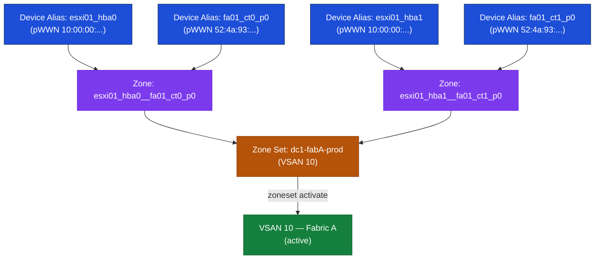
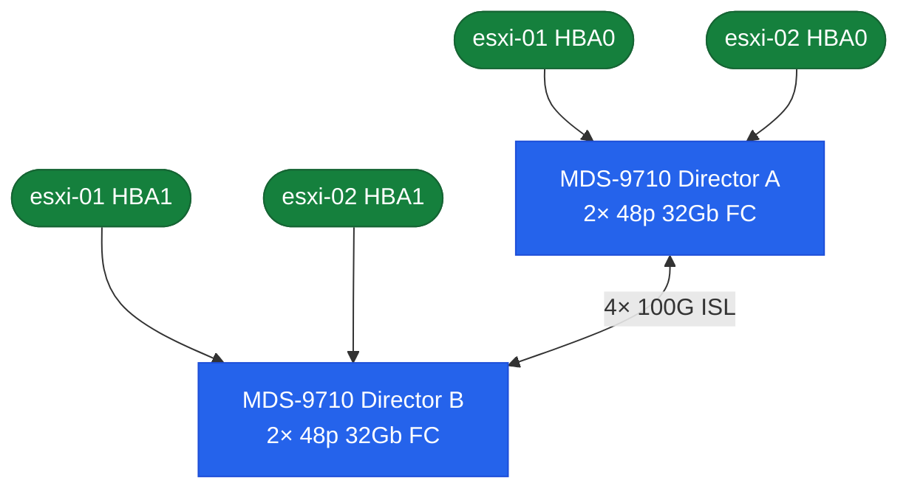
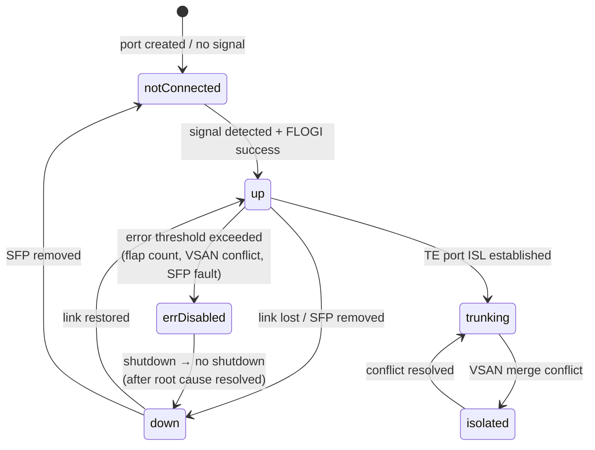

# MDS — Components

> Part of the [Cisco MDS](../../) reference.

---

## Port Types

| Port Type | Role |
|---|---|
| F_Port | Connects to a host HBA or storage target port |
| E_Port | ISL — connects to another switch |
| TE_Port | Trunking E_Port — carries multiple VSANs over an ISL trunk |
| NP_Port | N_Port Proxy — used in NPV mode |
| SD_Port | SPAN Destination Port — used for FC traffic capture |

```bash
# Check port type and state
show interface fc1/1

# Set a port to F_Port mode (override auto-negotiation)
interface fc1/1
  switchport mode F
  no shutdown
```

---

## Zoning

Zoning controls which initiator (host HBA) can communicate with which target (storage port). Best practice is **single-initiator / single-target** zones — one zone per host-port-to-storage-port pair.



```bash
# Show active zone set for a VSAN
show zoneset active vsan 10

# Show all zones (active and inactive)
show zone vsan 10

# Check if a specific WWPN is zoned
show zone member wwn <wwpn> vsan 10
```

Zone sets must be **activated** for zoning to take effect. An inactive zone set change is not applied to the fabric.

---

## ISLs

ISLs (Inter-Switch Links) connect MDS switches together to form a multi-switch fabric. ISLs are configured as port-channel trunks carrying multiple VSANs.



**ISL standards:**
- Minimum 2 physical links per port-channel group
- 32G Fibre Channel minimum for new deployments
- All VSANs allowed on the ISL must be explicitly permitted
- Load balancing: source-ID/destination-ID exchange-based

```bash
# View fabric ISL topology
show topology

# Check port-channel ISL status
show port-channel summary
show interface san-port-channel 1

# Check trunk port allowed VSANs
show trunk
```

---

## Ports

FC interfaces on MDS are identified as `fc<slot/port>`. Port mode determines how a port behaves in the fabric.

| Mode | Use Case |
|---|---|
| F | Host / initiator (N_Port) |
| E | ISL to another switch (E_Port) |
| TE | Trunking ISL (VSAN-aware) |
| NP | N-Port Virtualization (NPV mode) |
| auto | Auto-detect (default) |
| SD | SPAN destination |

```bash
# Summary of all interfaces
show interface brief

# Detailed single port
show interface fc1/1

# Error counters
show interface fc1/1 counters
show interface fc1/1 counters errors

# Transceiver / SFP details
show interface fc1/1 transceiver
```

| Counter | Cause | Action |
|---|---|---|
| link-failures | Cable/SFP; port resets | Replace SFP; check cable |
| loss-of-sync | Signal quality | Check SFP power levels |
| input-crc | Bad frames | Replace SFP; check cable |
| bb-credit-zero | Buffer-to-buffer credit depleted | Increase BB credits; check ISL design |



---

## VSANs

VSANs (Virtual SANs) partition a physical fabric into multiple logical fabrics. Each VSAN has its own name server, domain IDs, and zoning configuration.

```bash
# All VSANs on the switch
show vsan
show vsan <id>

# VSAN port membership
show vsan membership
show vsan membership interface fc<slot/port>
```

**Create and assign a VSAN:**

```bash
vsan database
  vsan <id> name "<name>"
  vsan <id> interface fc<slot/port>
```

**Allow VSAN on ISL trunk:**

```bash
interface fc<slot/port>
  switchport trunk allowed vsan add <id>
```
