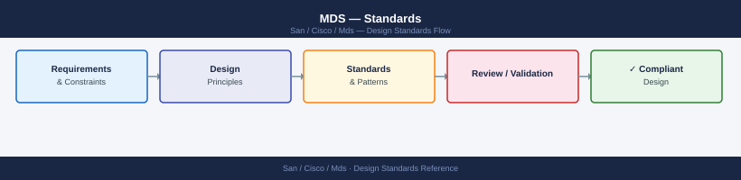

---
tags:
  - architecture
  - san
---
# MDS — Standards


<div class="kb-summary">
Cisco MDS design standards: VSANs for fabric segmentation, port-channel ISL configuration, N-port virtualisation (NPV) mode, and buffer credit sizing.

*Applies to: Cisco MDS · Nexus*
</div>



---

## Switch Naming


## ISL Standards

| Parameter | Standard |
|---|---|
| Port-channel ISLs | Minimum 2 physical links per channel group |
| ISL speed | 32G Fibre Channel minimum for new deployments |
| Load balancing | Source-ID/Destination-ID exchange-based (`port-channel load-balance src-dst-oxid`) |
| Trunk mode | Enabled on ISL ports: `switchport trunk mode on` |

Verify port-channel ISL:
```bash
show port-channel summary
show interface san-port-channel 1
```

## AAA / Authentication Standards

| Control | Standard |
|---|---|
| AAA | TACACS+ primary, RADIUS fallback |
| Local accounts | Break-glass only; one local admin per fabric |
| Role | `network-admin` for infrastructure team; `network-operator` for read-only |
| TACACS+ encryption | Enable key encryption: `tacacs-server key 7 <encrypted>` |

## NX-OS Version Standards

- All MDS switches in a fabric must run the same NX-OS major release (e.g., 9.2.x)
- Apply maintenance releases to Fabric B first, validate, then Fabric A
- Minimum: stay within N-2 of Cisco's current MDS NX-OS release
- Check EOL/EOS: [cisco.com/go/eos](https://www.cisco.com/c/en/us/products/eos-eol-policy.html)

## SNMP Standards

- SNMPv3 only; SNMPv1/v2 disabled
- Auth protocol: SHA; Privacy protocol: AES-128 minimum
- Community strings (if SNMPv2 legacy required): in vault, quarterly rotation
- SNMP trap receiver: Nexus Dashboard or Aria Operations collector

## Cisco NDFC Integration

All MDS switches should be managed through Cisco NDFC (Nexus Dashboard Fabric Controller):
- Fabric discovery: NDFC discovers switches via SSH/SNMP
- SAN fabric view: topology, VSAN health, ISL utilisation
- Zone management: preferred over per-switch CLI for large fabrics

---

## See also

- [Mds — How It Works](how-it-works/)
- [Mds — Integrations](integrations/)
- [Mds — Deploy](../deploy/)
