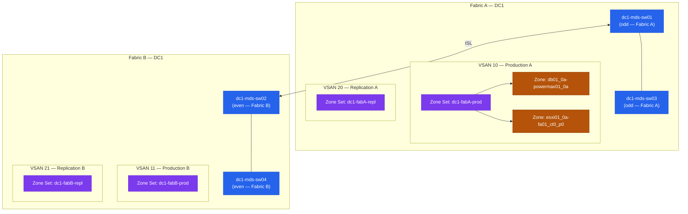

# MDS — Standards

> Part of the [Cisco MDS](../../) reference.

---

## Switch Naming

```
<site>-mds-sw<nn>
```

| Site | Fabric A | Fabric B |
|---|---|---|
| DC1 | `dc1-mds-sw01`, `dc1-mds-sw03` | `dc1-mds-sw02`, `dc1-mds-sw04` |
| DC2 | `dc2-mds-sw01`, `dc2-mds-sw03` | `dc2-mds-sw02`, `dc2-mds-sw04` |

Fabric A = odd switch numbers, Fabric B = even.

## VSAN Allocation

VSANs isolate traffic types within the same physical fabric:

| VSAN ID | Fabric | Purpose |
|---|---|---|
| 10 | Fabric A | Production |
| 11 | Fabric B | Production |
| 20 | Fabric A | Replication (SRDF/A, RecoverPoint) |
| 21 | Fabric B | Replication |
| 99 | Both | Management / out-of-band testing |

Document VSAN assignments in CMDB. Never reuse a VSAN ID after decommission.

## Zone and Alias Naming

```
Zone:   <hostname>_<hba_port>-<arrayname>_<port>
Alias:  <hostname>_<hba_port>   or   <arrayname>_<port>
```

Examples:
- Zone: `db01_0a-powermax01_0a`
- Alias: `db01_0a` (WWPN alias for host HBA port), `powermax01_0a` (WWPN alias for target)

Rules:
- Enhanced zoning (enhanced zone mode) must be enabled on all VSANs: `zone mode enhanced vsan <id>`
- One initiator per zone (single-initiator zoning)
- Zone members always referenced by alias — never hard-coded WWPNs directly in zone definitions



## ISL Standards

| Parameter | Standard |
|---|---|
| Port-channel ISLs | Minimum 2 physical links per channel group |
| ISL speed | 32G Fibre Channel minimum for new deployments |
| Load balancing | Source-ID/Destination-ID exchange-based (`port-channel load-balance src-dst-oxid`) |
| Trunk mode | Enabled on ISL ports: `switchport trunk mode on` |

Verify port-channel ISL:
```bash
show port-channel summary
show interface san-port-channel 1
```

## AAA / Authentication Standards

| Control | Standard |
|---|---|
| AAA | TACACS+ primary, RADIUS fallback |
| Local accounts | Break-glass only; one local admin per fabric |
| Role | `network-admin` for infrastructure team; `network-operator` for read-only |
| TACACS+ encryption | Enable key encryption: `tacacs-server key 7 <encrypted>` |

## NX-OS Version Standards

- All MDS switches in a fabric must run the same NX-OS major release (e.g., 9.2.x)
- Apply maintenance releases to Fabric B first, validate, then Fabric A
- Minimum: stay within N-2 of Cisco's current MDS NX-OS release
- Check EOL/EOS: [cisco.com/go/eos](https://www.cisco.com/c/en/us/products/eos-eol-policy.html)

## SNMP Standards

- SNMPv3 only; SNMPv1/v2 disabled
- Auth protocol: SHA; Privacy protocol: AES-128 minimum
- Community strings (if SNMPv2 legacy required): in vault, quarterly rotation
- SNMP trap receiver: Nexus Dashboard or Aria Operations collector

## Cisco NDFC Integration

All MDS switches should be managed through Cisco NDFC (Nexus Dashboard Fabric Controller):
- Fabric discovery: NDFC discovers switches via SSH/SNMP
- SAN fabric view: topology, VSAN health, ISL utilisation
- Zone management: preferred over per-switch CLI for large fabrics
