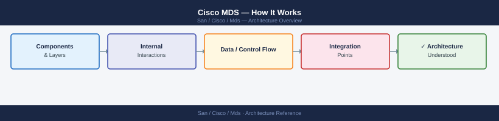

---
tags:
  - architecture
  - san
---
# Cisco MDS — How It Works

<div class="kb-summary">
How It Works reference covering Overview, SAN Fabric Topology.

*Applies to: Cisco MDS · Nexus*
</div>


```d2
direction: right

hosts: Servers {
  h1: Host 1 (HBA) {shape: rectangle}
  h2: Host 2 (HBA) {shape: rectangle}
}

director_a: MDS Director A\n(Fabric A) {
  linecard1: Line Card 1 (32×32G) {shape: rectangle}
  linecard2: Line Card 2 (32×32G) {shape: rectangle}
  sup: Supervisor Module {shape: rectangle}
  linecard1 -> sup: backplane
  linecard2 -> sup: backplane
}

director_b: MDS Director B\n(Fabric B) {
  linecard3: Line Card 3 (32×32G) {shape: rectangle}
  linecard4: Line Card 4 (32×32G) {shape: rectangle}
  sup2: Supervisor Module {shape: rectangle}
  linecard3 -> sup2: backplane
  linecard4 -> sup2: backplane
}

storage: Storage Arrays {
  arr: Target Ports {shape: cylinder}
}

dcnm: Cisco DCNM\n(management) {shape: rectangle}

hosts.h1 -> director_a.linecard1: F_Port (32G FC)
hosts.h1 -> director_b.linecard3: F_Port (dual fabric)
hosts.h2 -> director_a.linecard1: F_Port
hosts.h2 -> director_b.linecard3: F_Port

director_a.linecard2 -> storage.arr: F_Port
director_b.linecard4 -> storage.arr: F_Port

dcnm -> director_a.sup: SNMP / SSH
dcnm -> director_b.sup2: SNMP / SSH
```

## Overview

Cisco MDS 9000 series switches run NX-OS and provide scalable SAN fabric services supporting Fibre Channel (FC). The core isolation mechanism is the **VSAN (Virtual SAN)** — multiple logical fabrics share physical infrastructure while maintaining separate name servers, zoning databases, and fabric login tables. Each VSAN operates as an independent fabric.

## SAN Fabric Topology

## FC Fabric Login Sequence

When a host HBA initialises, it executes a three-stage login sequence before any SCSI I/O can occur. MDS handles and enforces each stage.

| Stage | Name | What Happens | MDS Role |
|---|---|---|---|
| 1 | FLOGI — Fabric Login | HBA sends FLOGI to the well-known address 0xFFFFFE | MDS assigns a 24-bit FCID; registers WWN in Name Server |
| 2 | PLOGI — Port Login | Initiator sends PLOGI directly to target FCID | MDS enforces zoning: PLOGI denied if initiator and target are not in the same zone |
| 3 | PRLI — Process Login | Upper-layer protocol (SCSI) negotiation between initiator and target | MDS passes transparently; FCP (FC Protocol) layer established |
| 4 | SCSI Commands | Read/Write I/O begins over the FC connection | MDS forwards frames; SAN Analytics captures per-ITL metrics |

FLOGI is the entry point — without a valid FCID, the device cannot communicate with any other fabric member. Zone enforcement at PLOGI is the primary security boundary.

## VSAN Architecture

VSANs (Virtual SANs) allow multiple independent FC fabrics to share the same physical MDS infrastructure. Each VSAN maintains its own:

- **Name Server** — devices logged into VSAN 10 cannot see devices in VSAN 20.
- **Zoning database** — zone sets and active zones are per-VSAN.
- **Fabric login table** — FCID assignments are VSAN-scoped; the same FCID can exist in two VSANs without conflict.
- **Domain ID** — each VSAN runs its own principal switch election and domain ID assignment process.

**Inter-VSAN Routing (IVR)** allows controlled communication between devices in different VSANs without merging the fabrics. IVR creates virtual ports (IVR proxy) in the target VSAN so the initiator can reach it. Commonly used to share a tape library across production and backup VSANs.

**VSAN trunking** on ISLs (E_Ports → TE_Ports) carries multiple VSANs across a single physical link, reducing cabling while maintaining full VSAN isolation.

## Zoning and Device Aliases

Zoning is the primary access-control mechanism in FC fabrics. MDS supports two enforcement models:

| Model | How Enforced | Bypass Risk |
|---|---|---|
| Hard zoning | Hardware ASIC — frames rejected at the port ASIC before forwarding | Cannot be bypassed; enforced even if the Name Server is queried directly |
| Soft zoning | Name Server filtering — targets not in the zone are hidden from PLOGI queries | Theoretically bypassable if an HBA sends PLOGI to a known FCID directly |

Cisco MDS uses **hard zoning by default**. Soft zoning is available but not recommended for security-sensitive environments.

**Device aliases** replace WWNs in zone definitions with human-readable names (e.g., `esxi-01-hba0` instead of `21:00:00:24:ff:ab:cd:ef`). Device aliases are stored in the fabric-wide CFS database and automatically resolve to WWNs during zone enforcement. Best practice: one initiator + one target per zone (single-initiator single-target zoning) to minimise blast radius if a host misbehaves.

## NPV and NPIV Mode

**NPV (N-Port Virtualiser)** mode converts an MDS switch from a full fabric participant into a proxy that forwards logins to an upstream core switch. In NPV mode:

- The NPV switch does not have its own domain ID (no F_Port services).
- All HBA FLOGIs are proxied through NPV uplinks (NP_Ports) to the core fabric.
- Reduces total domain ID consumption — useful in large environments approaching the 239-domain limit.
- Commonly deployed on edge MDS switches connecting to a director-class core.

**NPIV (N-Port ID Virtualisation)** allows a single physical FC port to present multiple virtual WWNs (vHBAs). Each virtual port gets its own FCID and appears as a separate device in the fabric. NPIV is used by:

- **ESXi hosts** — each VM can have a dedicated vHBA for per-VM zoning and QoS.
- **Virtual HBA cards** — blade servers with a single mezzanine HBA presenting multiple virtual ports.
- **UCS vHBAs** — Cisco UCS uses NPIV extensively to map service profiles to virtual FC identities.

MDS enables NPIV per-port with `feature npiv`. The physical HBA must also support NPIV.

## High Availability Features

Director-class MDS switches (9710, 9718) and high-end fixed switches provide multiple HA mechanisms to eliminate single points of failure.

| Feature | Mechanism | Benefit |
|---|---|---|
| Dual supervisor modules | Active + standby supervisor in the director chassis; stateful switchover (SSO) | Control-plane failover in &lt;30 seconds without traffic disruption |
| Port channelling (ISL) | Multiple physical FC links bundled into one logical ISL; LACP-like frame hashing | Link failure transparent to fabric; no FSPF re-convergence required |
| FSPF path selection | Link-state routing; each switch floods Link State Records (LSRs) across the fabric | Automatic traffic re-route around a failed ISL within seconds |
| Graceful link failover | Before a link goes down (planned), traffic is drained to alternate paths | Zero traffic loss during planned maintenance |
| In-Service Software Upgrade (ISSU) | NX-OS upgrade without supervisor restart; data plane continues forwarding | Upgrade fabric switches during business hours |
| BB credit recovery | Detects and recovers from BB credit stall (credit loss due to link event) without link reset | Prevents fabric-wide credit-starvation from a single link event |

---

## See also

- [Mds — Design Standards](../design-standards/)
- [Mds — Integrations](../integrations/)
- [Mds — Deploy](../../deploy/)
