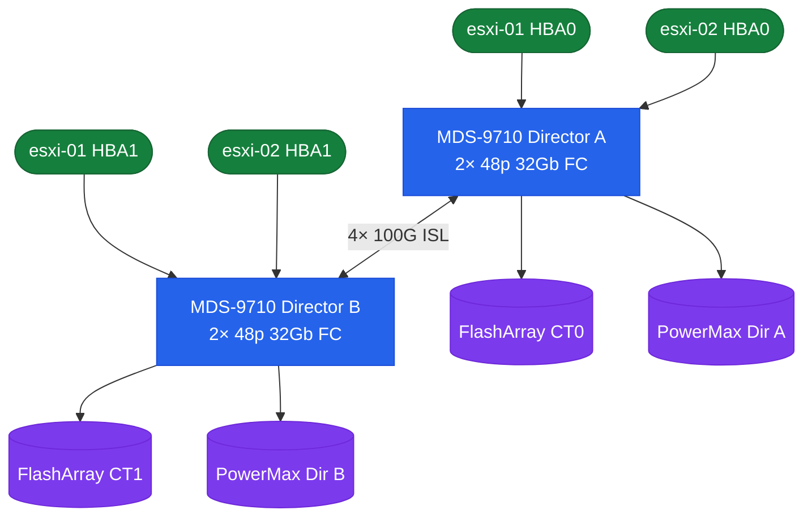

# Cisco MDS — How It Works


<div class="kb-summary">
How It Works reference covering Overview, SAN Fabric Topology.
</div>

## Overview

Cisco MDS 9000 series switches run NX-OS and provide scalable SAN fabric services supporting Fibre Channel (FC). The core isolation mechanism is the **VSAN (Virtual SAN)** — multiple logical fabrics share physical infrastructure while maintaining separate name servers, zoning databases, and fabric login tables. Each VSAN operates as an independent fabric.

## SAN Fabric Topology


```
┌──────────────────────────────────── Cisco MDS 9000 — How It Works ────────────────────────────────────┐
│                                                                                                       │
│  MDS operation: HBA FLOGI → Name Server → zoning lookup → PLOGI → I/O flow.                           │
│                                                                                                       │
│   ┌──────────────────────────────────────────────┐  ┌─────────────────────────────────────────────┐   │
│   │             FC Fabric Login Flow             │  │           VSAN & Zone Enforcement           │   │
│   │         1. HBA powers on: FLOGI send         │  │             Zone lookup on PLOGI            │   │
│   │         2. MDS assigns FCID (24-bit)         │  │           Deny if not in same zone          │   │
│   │         3. Registered in Name Server         │  │          Hard zoning: hardware ACL          │   │
│   │         4. Query GPN_ID for targets          │  │          VSAN segmentation: no leak         │   │
│   │           5. PLOGI to target FCID            │  │          CFS propagates zone across         │   │
│   └──────────────────────────────────────────────┘  └─────────────────────────────────────────────┘   │
│                                                                                                       │
│  FLOGI registers HBA; zone is enforced at PLOGI; CFS keeps zones consistent.                          │
│                                                                                                       │
│                          ▼                                                 ▼                          │
│                                                                                                       │
│   ┌──────────────────────────────────────────────┐  ┌─────────────────────────────────────────────┐   │
│   │              ISL & FSPF Routing              │  │           SAN Analytics (MDS 9700)          │   │
│   │           ISL E_Port forms on boot           │  │            Per-flow telemetry: FC           │   │
│   │          FSPF: link state LSR flood          │  │          Initiator/target pair IOPS         │   │
│   │          Shortest path: hop + cost           │  │          Latency histogram per ITL          │   │
│   │         PortChannel: LACP-like hash          │  │       Export to Kafka / Elasticsearch       │   │
│   │         BB credits: per-port control         │  │           Bottleneck ITL detection          │   │
│   └──────────────────────────────────────────────┘  └─────────────────────────────────────────────┘   │
│                                                                                                       │
│  Physical Infrastructure (the hardware everything above runs on):                                     │
│  MDS director chassis · supervisor module · line card blades · SFP transceivers                       │
│                                                                                                       │
│  Key terms:                                                                                           │
│                                                                                                       │
│  FLOGI           = Fabric Login; HBA sends FLOGI to get assigned an FCID                              │
│  FCID            = Fibre Channel ID; 24-bit address assigned by fabric to each port                   │
│  Name Server     = MDS Name Server; database of all device logins (FCID → WWN)                        │
│  GPN_ID          = Get Port Name by ID; query Name Server for target WWN list                         │
│  PLOGI           = Port Login; initiator to target; MDS enforces zone at this step                    │
│  Hard zoning     = zone enforcement in hardware ASIC; cannot be bypassed by software                  │
│  CFS             = Cisco Fabric Services; zones propagated to all switches in fabric                  │
│  FSPF            = link-state routing; each switch floods LSR with link costs                         │
│  PortChannel     = ISL aggregation; frames hashed by source/dest FCID pair                            │
│  BB credits      = Buffer-to-Buffer; receiver grants credits; no credit = pause                       │
│  SAN analytics   = MDS 9700 ASIC feature; captures per-ITL IOPS and latency                           │
│  ITL             = Initiator-Target-LUN; FC I/O flow identifier for analytics                         │
│                                                                                                       │
└───────────────────────────────────────────────────────────────────────────────────────────────────────┘
```
```
