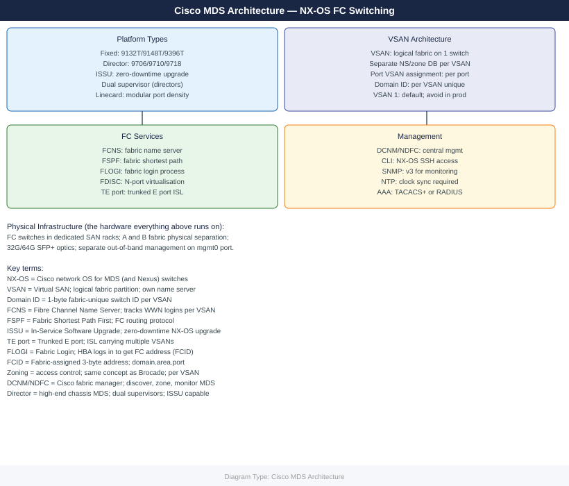

---
tags:
  - architecture
  - san
description: "Cisco MDS 9000 series FC switches running NX-OS. Core isolation mechanism is the VSAN — multiple logical fabrics share physical hardware with separate..."
---
# Cisco MDS — Architecture

Cisco MDS 9000 series FC switches running NX-OS. Core isolation mechanism is the VSAN — multiple logical fabrics share physical hardware with separate name servers, zone databases, and domain IDs per VSAN. Directors support ISSU for zero-downtime maintenance.

*Applies to: Cisco MDS · Nexus*

<a class="kb-card" href="how-it-works/"><strong>How It Works</strong>How it works, integrations, and design standards.</a>
<a class="kb-card" href="integrations/"><strong>Integrations</strong>Integration with DCNM/NDFC, storage arrays, and host connectivity.</a>
<a class="kb-card" href="design-standards/"><strong>Design Standards</strong>Dual-fabric design, VSAN allocation, zoning model, and ISL standards.</a>

## Platform Reference

| Model | Type | Max FC Ports | Notes |
|---|---|---|---|
| MDS 9132T | Fixed | 32× 32G FC | Entry/mid-range |
| MDS 9148T | Fixed | 48× 32G FC | Mid-range |
| MDS 9396T | Fixed | 96× 32G FC | High-density fixed |
| MDS 9706 | Director | Up to 384 FC | Modular director — ISSU |
| MDS 9710 | Director | Up to 576 FC | Large-scale director — ISSU |

## Dual-Fabric Topology

