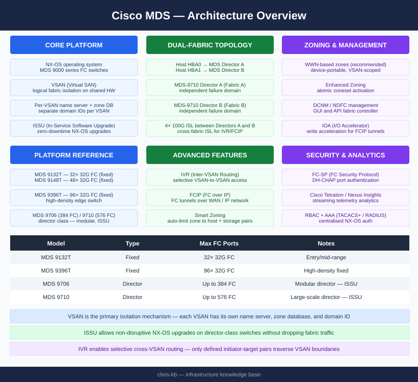

# Cisco MDS — Architecture

<div class="kb-summary">
Cisco MDS 9000 series FC switches running NX-OS. Core isolation mechanism is the VSAN — multiple logical fabrics share physical hardware with separate name servers, zone databases, and domain IDs per VSAN. Directors support ISSU for zero-downtime maintenance.
</div>

```
┌──────────────────────────────────── Cisco MDS 9000 — Architecture ────────────────────────────────────┐
│                                                                                                       │
│  MDS architecture: VSAN segmentation, ISL PortChannels, FSPF routing, zone enforcement.               │
│                                                                                                       │
│   ┌─────────────────────────────┐  ┌─────────────────────────────┐  ┌─────────────────────────────┐   │
│   │         How It Works        │  │         Integrations        │  │       Design Standards      │   │
│   │    VSAN: fabric partition   │  │     DCNM: GUI management    │  │        Dual ISL paths       │   │
│   │ ISL E_Port for switch-switch│  │      ISE: TACACS+ auth      │  │      VSAN per workload      │   │
│   │ FSPF: shortest path routing │  │     SIEM: syslog events     │  │    PortChannel for trunk    │   │
│   │   CFS: config distribution  │  │    NetApp/HPE: FC target    │  │      Zone set per VSAN      │   │
│   │   FCoE: FC over 10/25G Eth  │  │     vSphere: VMFS FC LUN    │  │      ISSU: non-disrupt      │   │
│   └─────────────────────────────┘  └─────────────────────────────┘  └─────────────────────────────┘   │
│                                                                                                       │
│  VSAN segmentation and ISL PortChannels form the MDS architecture foundation.                         │
│                                                                                                       │
│                  ▼                                ▼                                ▼                  │
│                                                                                                       │
│   ┌─────────────────────────────┐  ┌─────────────────────────────┐  ┌─────────────────────────────┐   │
│   │        Control Plane        │  │          Data Plane         │  │       Management Plane      │   │
│   │    FSPF: path computation   │  │     FC frame forwarding     │  │        DCNM REST API        │   │
│   │       FLOGI: HBA login      │  │      Hardware switching     │  │        NX-OS SSH CLI        │   │
│   │    Name server: device DB   │  │    BB credit flow control   │  │        SNMP v3 traps        │   │
│   │     CFS zone propagation    │  │     QoS: VSAN priorities    │  │         TACACS+ auth        │   │
│   │     PLOGI: target login     │  │      SAN analytics port     │  │         NetConf/gRPC        │   │
│   └─────────────────────────────┘  └─────────────────────────────┘  └─────────────────────────────┘   │
│                                                                                                       │
│  Physical Infrastructure (the hardware everything above runs on):                                     │
│  MDS director chassis · supervisor modules · line card blades · SFP transceivers                      │
│                                                                                                       │
│  Key terms:                                                                                           │
│                                                                                                       │
│  VSAN            = Virtual SAN; logical partition; one zone database per VSAN                         │
│  FSPF            = Fabric Shortest Path First; link-state routing protocol for FC                     │
│  FLOGI           = Fabric Login; HBA registers with FC Name Server via FLOGI                          │
│  PLOGI           = Port Login; initiator logs into target after FLOGI                                 │
│  CFS             = Cisco Fabric Services; distributes zone and config across fabric                   │
│  ISL             = Inter-Switch Link; E_Port trunk carrying multiple VSANs                            │
│  PortChannel     = bundled ISLs; provides bandwidth aggregation and redundancy                        │
│  BB credits      = Buffer-to-Buffer credits; flow control mechanism per FC port                       │
│  ISSU            = In-Service Software Upgrade; no traffic disruption during upgrade                  │
│  SAN analytics   = MDS 9700 feature; per-flow FC telemetry for performance                            │
│  DCNM            = Data Center Network Manager; manages MDS zone and firmware                         │
│  FCoE            = Fibre Channel over Ethernet; FC on 10/25GbE via DCB/FIP                            │
│                                                                                                       │
└───────────────────────────────────────────────────────────────────────────────────────────────────────┘
```
```text
┌──────────────────────────────────── Cisco MDS 9000 — Architecture ────────────────────────────────────┐
│                                                                                                       │
│  MDS architecture: VSAN segmentation, ISL PortChannels, FSPF routing, zone enforcement.               │
│                                                                                                       │
│   ┌─────────────────────────────┐  ┌─────────────────────────────┐  ┌─────────────────────────────┐   │
│   │         How It Works        │  │         Integrations        │  │       Design Standards      │   │
│   │    VSAN: fabric partition   │  │     DCNM: GUI management    │  │        Dual ISL paths       │   │
│   │ ISL E_Port for switch-switch│  │      ISE: TACACS+ auth      │  │      VSAN per workload      │   │
│   │ FSPF: shortest path routing │  │     SIEM: syslog events     │  │    PortChannel for trunk    │   │
│   │   CFS: config distribution  │  │    NetApp/HPE: FC target    │  │      Zone set per VSAN      │   │
│   │   FCoE: FC over 10/25G Eth  │  │     vSphere: VMFS FC LUN    │  │      ISSU: non-disrupt      │   │
│   └─────────────────────────────┘  └─────────────────────────────┘  └─────────────────────────────┘   │
│                                                                                                       │
│  VSAN segmentation and ISL PortChannels form the MDS architecture foundation.                         │
│                                                                                                       │
│                  ▼                                ▼                                ▼                  │
│                                                                                                       │
│   ┌─────────────────────────────┐  ┌─────────────────────────────┐  ┌─────────────────────────────┐   │
│   │        Control Plane        │  │          Data Plane         │  │       Management Plane      │   │
│   │    FSPF: path computation   │  │     FC frame forwarding     │  │        DCNM REST API        │   │
│   │       FLOGI: HBA login      │  │      Hardware switching     │  │        NX-OS SSH CLI        │   │
│   │    Name server: device DB   │  │    BB credit flow control   │  │        SNMP v3 traps        │   │
│   │     CFS zone propagation    │  │     QoS: VSAN priorities    │  │         TACACS+ auth        │   │
│   │     PLOGI: target login     │  │      SAN analytics port     │  │         NetConf/gRPC        │   │
│   └─────────────────────────────┘  └─────────────────────────────┘  └─────────────────────────────┘   │
│                                                                                                       │
│  Physical Infrastructure (the hardware everything above runs on):                                     │
│  MDS director chassis · supervisor modules · line card blades · SFP transceivers                      │
│                                                                                                       │
│  Key terms:                                                                                           │
│                                                                                                       │
│  VSAN            = Virtual SAN; logical partition; one zone database per VSAN                         │
│  FSPF            = Fabric Shortest Path First; link-state routing protocol for FC                     │
│  FLOGI           = Fabric Login; HBA registers with FC Name Server via FLOGI                          │
│  PLOGI           = Port Login; initiator logs into target after FLOGI                                 │
│  CFS             = Cisco Fabric Services; distributes zone and config across fabric                   │
│  ISL             = Inter-Switch Link; E_Port trunk carrying multiple VSANs                            │
│  PortChannel     = bundled ISLs; provides bandwidth aggregation and redundancy                        │
│  BB credits      = Buffer-to-Buffer credits; flow control mechanism per FC port                       │
│  ISSU            = In-Service Software Upgrade; no traffic disruption during upgrade                  │
│  SAN analytics   = MDS 9700 feature; per-flow FC telemetry for performance                            │
│  DCNM            = Data Center Network Manager; manages MDS zone and firmware                         │
│  FCoE            = Fibre Channel over Ethernet; FC on 10/25GbE via DCB/FIP                            │
│                                                                                                       │
└───────────────────────────────────────────────────────────────────────────────────────────────────────┘
```


<div class="kb-grid kb-grid-3">
<a class="kb-card" href="how-it-works/"><strong>How It Works</strong><span>How it works, integrations, and design standards.</span></a>
<a class="kb-card" href="integrations/"><strong>Integrations</strong><span>Integration with DCNM/NDFC, storage arrays, and host connectivity.</span></a>
<a class="kb-card" href="design-standards/"><strong>Design Standards</strong><span>Dual-fabric design, VSAN allocation, zoning model, and ISL standards.</span></a>
</div>

## Platform Reference

| Model | Type | Max FC Ports | Notes |
|---|---|---|---|
| MDS 9132T | Fixed | 32× 32G FC | Entry/mid-range |
| MDS 9148T | Fixed | 48× 32G FC | Mid-range |
| MDS 9396T | Fixed | 96× 32G FC | High-density fixed |
| MDS 9706 | Director | Up to 384 FC | Modular director — ISSU |
| MDS 9710 | Director | Up to 576 FC | Large-scale director — ISSU |

## Dual-Fabric Topology


