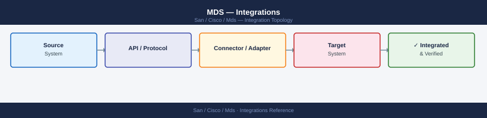
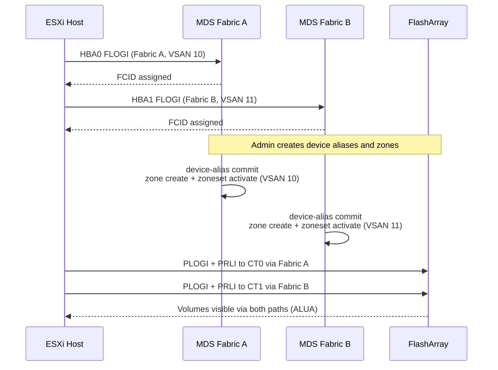

---
tags:
  - architecture
  - san
description: "Cisco MDS integrations: DCNM fabric management, vCenter SAN adapter plugin, UCS service profile SAN boot, and SNMP/syslog target configuration."
---
# MDS — Integrations

<div class="kb-summary">
Cisco MDS integrations: DCNM fabric management, vCenter SAN adapter plugin, UCS service profile SAN boot, and SNMP/syslog target configuration.

*Applies to: Cisco MDS · Nexus*
</div>


---

## Nexus Dashboard Fabric Controller (NDFC)

NDFC (formerly DCNM) provides centralised zone management, fabric topology visibility, performance monitoring, and firmware orchestration across all MDS switches.

**Key capabilities:**

- Zone provisioning from a single GUI without SSHing to individual switches
- Fabric topology view with ISL health and utilisation
- Per-port performance graphs (IOPS, MB/s, errors)
- Firmware upgrade orchestration

**Setup:**

1. Deploy the NDFC virtual appliance.
2. Discover MDS switches: NDFC → Manage → Inventory → Discover → enter switch IP and credentials.
3. Configure SNMP v3 on each switch for telemetry collection (NDFC requires SNMP and SSH access).

---

## VMware FC Connectivity

ESXi hosts connect to storage via FC HBAs, which log into the MDS fabric and are zoned to storage target ports.



---

## Dell PowerMax Integration

PowerMax FA (Front-End Adapter) ports log into the MDS fabric. Each FA port is registered as a device alias.

```bash
# Show PowerMax FA port registrations
show flogi database vsan 10 | grep <powermax-wwpns>

# Create device aliases for PowerMax FA ports
device-alias database
  device-alias name powermax01_fa0e pwwn 5x:xx:xx:xx:xx:xx:xx:xx
device-alias commit
```


```text title="Expected output"
VSAN 10:
 FCID        STATE  CLASS  FCPXP  NODE_NAME        PORT_NAME
 0x010100    online    F      5    50:00:0a:09:87:12:34:56    50:00:0a:09:87:12:34:5e
 0x010200    online    F      5    50:00:0a:09:87:12:34:57    50:00:0a:09:87:12:34:5f
 0x010300    online    F      5    50:00:0a:09:87:12:34:58    50:00:0a:09:87:12:34:60
 0x010400    online    F      5    50:00:0a:09:87:12:34:59    50:00:0a:09:87:12:34:61

Device-alias database:
powermax01_fa0e pwwn 5x:xx:xx:xx:xx:xx:xx:xx

Device-alias committed successfully.
```

!!! warning "Common errors"
    **`Invalid PWWN format`** — Ensure the PWWN uses valid hexadecimal characters (0-9, a-f) and follows the 16-character colon-separated format (xx:xx:xx:xx:xx:xx:xx:xx).
    **`Device-alias commit failed: Database locked`** — Wait for any ongoing configuration changes to complete or check for other admin sessions using `show device-alias status`.
For SRDF/A replication, the SRDF director ports on both arrays are zoned together in the replication VSAN (e.g., VSAN 20/21) — not in the production VSAN.

---

## Pure Storage FlashArray Integration

Pure FlashArray target ports are registered as device aliases and zoned per host.

```bash
# Pure array target ports (get WWPNs from Pure UI: Settings → SAN)
device-alias database
  device-alias name pure-fa01_ct0.eth4 pwwn 52:4a:xx:xx:xx:xx:xx:xx
device-alias commit

# Zone: one zone per host HBA to one Pure target port
zone name esxi-host01_hba0-pure-fa01_ct0 vsan 10
  member device-alias esxi-host01_hba0
  member device-alias pure-fa01_ct0.eth4
```


```text title="Expected output"
device-alias database
config term
Enter configuration commands, one per line. End with CNTL/Z.
MDS9148S(config)# device-alias name pure-fa01_ct0.eth4 pwwn 52:4a:xx:xx:xx:xx:xx:xx
MDS9148S(config)# device-alias commit
device-alias committed successfully
MDS9148S(config)# zone name esxi-host01_hba0-pure-fa01_ct0 vsan 10
MDS9148S(config-zone)# member device-alias esxi-host01_hba0
MDS9148S(config-zone)# member device-alias pure-fa01_ct0.eth4
MDS9148S(config-zone)# exit
MDS9148S(config)# exit
```

!!! warning "Common errors"
    **`device-alias name pure-fa01_ct0.eth4 pwwn 52:4a:xx:xx:xx:xx:xx:xx`** — Ensure you are in `device-alias database` mode; if not, enter `config term` then `device-alias database` first.
    **`zone name esxi-host01_hba0-pure-fa01_ct0 vsan 10: member device-alias esxi-host01_hba0 not found`** — Verify the device-alias `esxi-host01_hba0` exists by running `show device-alias database` before adding it to the zone.
    **`device-alias commit: no changes to commit`** — Remove the standalone `device-alias commit` line outside config mode; it must run inside `device-alias database` configuration context.
Pure recommends at least 2 target ports per host path for redundancy. Zone each host HBA to 2 Pure target ports (one zone per pair).

---

## SNMP and Syslog

```bash
# Configure SNMP v3 (preferred over v2c)
snmp-server user <username> network-operator auth sha <auth-password> priv aes-128 <priv-password>
snmp-server host <monitoring-server-ip> traps version 3 priv <username>

# Configure syslog forwarding
logging server <siem-ip> 5 facility local7
# Level 5 = notifications (includes port state changes and zone changes)
```


```text title="Expected output"
(no output — command completes silently)
(no output — command completes silently)
(no output — command completes silently)
```

!!! warning "Common errors"
    **`% Invalid command`** — Replace `<username>`, `<auth-password>`, `<priv-password>`, `<monitoring-server-ip>`, and `<siem-ip>` with actual values before running.
    **`% Incomplete command`** — Ensure all parameters including auth method (sha), encryption (aes-128), and facility (local7) are specified without angle brackets.
Verify SNMP is reachable from the monitoring server:

```bash
snmpwalk -v3 -u <username> -l authPriv -a SHA -A <auth-pass> -x AES -X <priv-pass> <switch-ip> sysDescr
```


```text title="Expected output"
SNMPv3 Session Details:
  securityEngineID: 0x80001f8800051a4c2e5b3a1c
  securityName: netadmin
  authProtocol: usmHMACSHAAuth
  privProtocol: usmAesCfb128Protocol

SNMPv3 Walk Results:
SNMPv3-MDS9710-01::sysDescr.0 = STRING: "Cisco MDS 9710 Multilayer Fabric Switch"
SNMPv3-MDS9710-01::sysObjectID.0 = OID: enterprises.9.9.13.1.1.1
SNMPv3-MDS9710-01::sysUpTime.0 = Timeticks: (1847293847) 213 days, 18:49:47.00
SNMPv3-MDS9710-01::sysContact.0 = STRING: "storage-ops@company.local"
SNMPv3-MDS9710-01::sysName.0 = STRING: "mds-switch-01.dc1.local"
SNMPv3-MDS9710-01::sysLocation.0 = STRING: "DataCenter-1, Rack-42"
SNMPv3-MDS9710-01::sysServices.0 = INTEGER: 72
SNMPv3-MDS9710-01::sysORLastChange.0 = Timeticks: (0) 0:00:00.00
```

!!! warning "Common errors"
    **`snmpwalk: Unknown user name`** — Verify the SNMPv3 username exists on the switch with `show snmp user` and confirm the `-u` parameter matches exactly.
    **`snmpwalk: Authentication failure (incorrect password)`** — Confirm the authentication password (`-A` parameter) is correct by testing with `snmpget` on a single OID first.
    **`snmpwalk: Timeout: No Response from <switch-ip>`** — Verify the switch IP is reachable with `ping`, SNMPv3 is enabled on the switch, and the management interface is configured with `show snmp host`.
---

## See also

- [Mds — How It Works](../how-it-works/)
- [Mds — Design Standards](../design-standards/)
