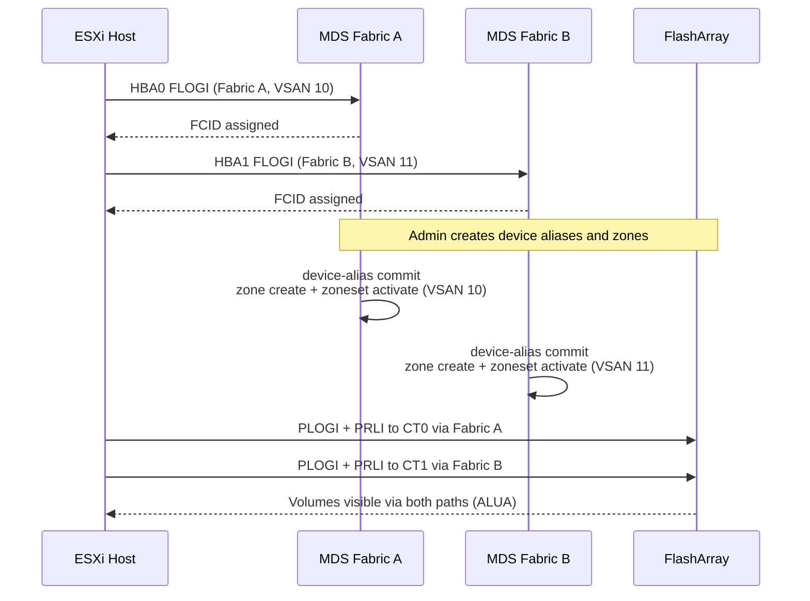

---
tags:
  - architecture
  - san
---
# MDS — Integrations

<div class="kb-summary">
Cisco MDS integrations: DCNM fabric management, vCenter SAN adapter plugin, UCS service profile SAN boot, and SNMP/syslog target configuration.

*Applies to: Cisco MDS · Nexus*
</div>


---

## Nexus Dashboard Fabric Controller (NDFC)

NDFC (formerly DCNM) provides centralised zone management, fabric topology visibility, performance monitoring, and firmware orchestration across all MDS switches.

**Key capabilities:**

- Zone provisioning from a single GUI without SSHing to individual switches
- Fabric topology view with ISL health and utilisation
- Per-port performance graphs (IOPS, MB/s, errors)
- Firmware upgrade orchestration

**Setup:**

1. Deploy the NDFC virtual appliance.
2. Discover MDS switches: NDFC → Manage → Inventory → Discover → enter switch IP and credentials.
3. Configure SNMP v3 on each switch for telemetry collection (NDFC requires SNMP and SSH access).

---

## VMware FC Connectivity

ESXi hosts connect to storage via FC HBAs, which log into the MDS fabric and are zoned to storage target ports.



---

## Dell PowerMax Integration

PowerMax FA (Front-End Adapter) ports log into the MDS fabric. Each FA port is registered as a device alias.

```bash
# Show PowerMax FA port registrations
show flogi database vsan 10 | grep <powermax-wwpns>

# Create device aliases for PowerMax FA ports
device-alias database
  device-alias name powermax01_fa0e pwwn 5x:xx:xx:xx:xx:xx:xx:xx
device-alias commit
```

For SRDF/A replication, the SRDF director ports on both arrays are zoned together in the replication VSAN (e.g., VSAN 20/21) — not in the production VSAN.

---

## Pure Storage FlashArray Integration

Pure FlashArray target ports are registered as device aliases and zoned per host.

```bash
# Pure array target ports (get WWPNs from Pure UI: Settings → SAN)
device-alias database
  device-alias name pure-fa01_ct0.eth4 pwwn 52:4a:xx:xx:xx:xx:xx:xx
device-alias commit

# Zone: one zone per host HBA to one Pure target port
zone name esxi-host01_hba0-pure-fa01_ct0 vsan 10
  member device-alias esxi-host01_hba0
  member device-alias pure-fa01_ct0.eth4
```

Pure recommends at least 2 target ports per host path for redundancy. Zone each host HBA to 2 Pure target ports (one zone per pair).

---

## SNMP and Syslog

```bash
# Configure SNMP v3 (preferred over v2c)
snmp-server user <username> network-operator auth sha <auth-password> priv aes-128 <priv-password>
snmp-server host <monitoring-server-ip> traps version 3 priv <username>

# Configure syslog forwarding
logging server <siem-ip> 5 facility local7
# Level 5 = notifications (includes port state changes and zone changes)
```

Verify SNMP is reachable from the monitoring server:

```bash
snmpwalk -v3 -u <username> -l authPriv -a SHA -A <auth-pass> -x AES -X <priv-pass> <switch-ip> sysDescr
```

---

## See also

- [Mds — How It Works](how-it-works/)
- [Mds — Design Standards](design-standards/)
