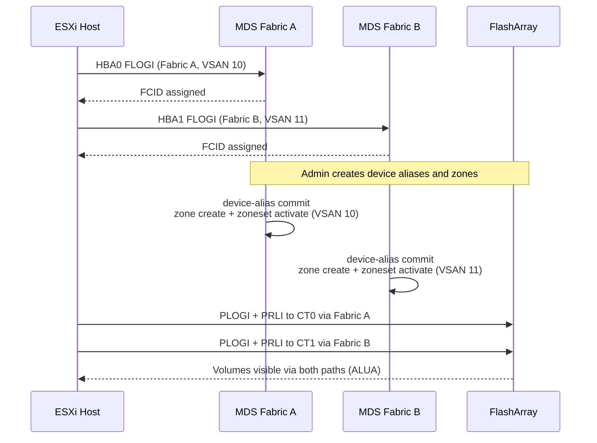

# MDS — Integrations


<div class="kb-summary">
> Part of the [Cisco MDS](../../index.md) reference.
</div>

---

## Nexus Dashboard Fabric Controller (NDFC)

NDFC (formerly DCNM) provides centralised zone management, fabric topology visibility, performance monitoring, and firmware orchestration across all MDS switches.

**Key capabilities:**

- Zone provisioning from a single GUI without SSHing to individual switches
- Fabric topology view with ISL health and utilisation
- Per-port performance graphs (IOPS, MB/s, errors)
- Firmware upgrade orchestration

**Setup:**

1. Deploy the NDFC virtual appliance.
2. Discover MDS switches: NDFC → Manage → Inventory → Discover → enter switch IP and credentials.
3. Configure SNMP v3 on each switch for telemetry collection (NDFC requires SNMP and SSH access).

---

## VMware FC Connectivity

ESXi hosts connect to storage via FC HBAs, which log into the MDS fabric and are zoned to storage target ports.


┌──────────────────────────────────── Cisco MDS 9000 — Integrations ────────────────────────────────────┐
│                                                                                                       │
│  MDS integrations: DCNM, Cisco ISE, SIEM, storage arrays, VMware vSphere, automation.                 │
│                                                                                                       │
│   ┌──────────────────────────────────────────────┐  ┌─────────────────────────────────────────────┐   │
│   │           Management Integrations            │  │            Security Integrations            │   │
│   │          DCNM: zone + firmware mgmt          │  │           ISE: TACACS+/RADIUS auth          │   │
│   │             SNMP v3: NMS polling             │  │           Syslog: SIEM forwarding           │   │
│   │           NETCONF/gRPC: automation           │  │          DH-CHAP: switch-to-switch          │   │
│   │          NTP: time sync all events           │  │           AES-256: link encryption          │   │
│   │           DNS: hostname resolution           │  │             SNMPv3 auth+privacy             │   │
│   └──────────────────────────────────────────────┘  └─────────────────────────────────────────────┘   │
│                                                                                                       │
│  DCNM manages zones; ISE provides TACACS+; SIEM gets syslog for security events.                      │
│                                                                                                       │
│                          ▼                                                 ▼                          │
│                                                                                                       │
│   ┌──────────────────────────────────────────────┐  ┌─────────────────────────────────────────────┐   │
│   │          Storage & Compute Connect           │  │           Automation Integrations           │   │
│   │         NetApp ONTAP: FC LUN target          │  │             Ansible: cisco.nxos             │   │
│   │          Pure FlashArray: FC target          │  │           Terraform: DCNM provider          │   │
│   │          Dell PowerStore: FC target          │  │          Python: NX-API / RESTCONF          │   │
│   │          VMware vSphere: VMFS LUNs           │  │             GitOps: zone as code            │   │
│   │         IBM mainframe: FICON zoning          │  │           ServiceNow: CMDB CI sync          │   │
│   └──────────────────────────────────────────────┘  └─────────────────────────────────────────────┘   │
│                                                                                                       │
│  Physical Infrastructure (the hardware everything above runs on):                                     │
│  MDS switch chassis · FC cables · management Ethernet · Cisco ISE appliance                           │
│                                                                                                       │
│  Key terms:                                                                                           │
│                                                                                                       │
│  DCNM            = Data Center Network Manager; zones, firmware, topology for MDS                     │
│  ISE             = Cisco Identity Services Engine; TACACS+ and RADIUS source                          │
│  TACACS+         = centralised CLI auth; every MDS command logged with username                       │
│  NETCONF         = XML-based configuration protocol; supported on MDS NX-OS                           │
│  gRPC            = modern API transport; MDS telemetry streaming protocol                             │
│  DH-CHAP         = Diffie-Hellman CHAP; ISL authentication between switches                           │
│  AES-256 link    = optional MDS port-level encryption; requires AES license                           │
│  NX-API          = NX-OS REST-like API; JSON over HTTP for automation                                 │
│  RESTCONF        = YANG-based configuration protocol; RFC 8040                                        │
│  cisco.nxos      = Ansible Galaxy collection for MDS and Nexus NX-OS automation                       │
│  FICON           = IBM mainframe FC I/O protocol; requires FICON zone on MDS                          │
│  VMFS            = VMware File System; FC LUN presented to ESXi as datastore                          │
│                                                                                                       │
└───────────────────────────────────────────────────────────────────────────────────────────────────────┘

**Verify the host can see the storage:**

```text
show zone member device-alias esxi-host01_hba0 vsan 10
```

---

## Dell PowerMax Integration

PowerMax FA (Front-End Adapter) ports log into the MDS fabric. Each FA port is registered as a device alias.

```bash
# Show PowerMax FA port registrations
show flogi database vsan 10 | grep <powermax-wwpns>

# Create device aliases for PowerMax FA ports
device-alias database
  device-alias name powermax01_fa0e pwwn 5x:xx:xx:xx:xx:xx:xx:xx
device-alias commit
```

For SRDF/A replication, the SRDF director ports on both arrays are zoned together in the replication VSAN (e.g., VSAN 20/21) — not in the production VSAN.

---

## Pure Storage FlashArray Integration

Pure FlashArray target ports are registered as device aliases and zoned per host.

```bash
# Pure array target ports (get WWPNs from Pure UI: Settings → SAN)
device-alias database
  device-alias name pure-fa01_ct0.eth4 pwwn 52:4a:xx:xx:xx:xx:xx:xx
device-alias commit

# Zone: one zone per host HBA to one Pure target port
zone name esxi-host01_hba0-pure-fa01_ct0 vsan 10
  member device-alias esxi-host01_hba0
  member device-alias pure-fa01_ct0.eth4
```

Pure recommends at least 2 target ports per host path for redundancy. Zone each host HBA to 2 Pure target ports (one zone per pair).

---

## SNMP and Syslog

```bash
# Configure SNMP v3 (preferred over v2c)
snmp-server user <username> network-operator auth sha <auth-password> priv aes-128 <priv-password>
snmp-server host <monitoring-server-ip> traps version 3 priv <username>

# Configure syslog forwarding
logging server <siem-ip> 5 facility local7
# Level 5 = notifications (includes port state changes and zone changes)
```

Verify SNMP is reachable from the monitoring server:

```bash
snmpwalk -v3 -u <username> -l authPriv -a SHA -A <auth-pass> -x AES -X <priv-pass> <switch-ip> sysDescr
```
