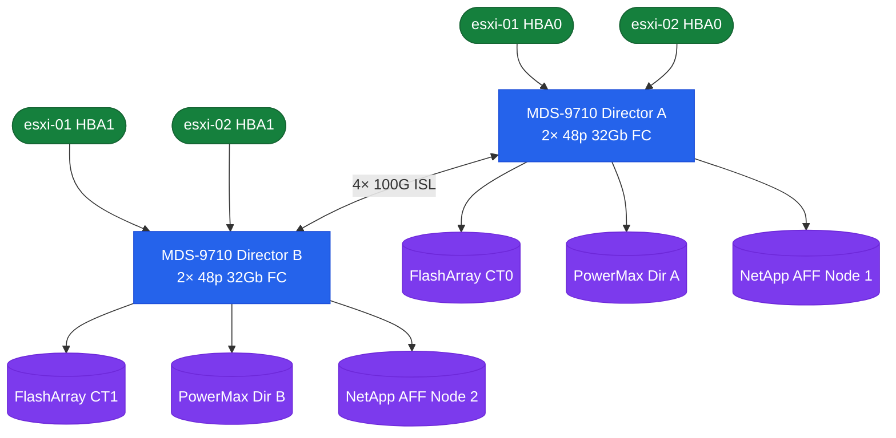
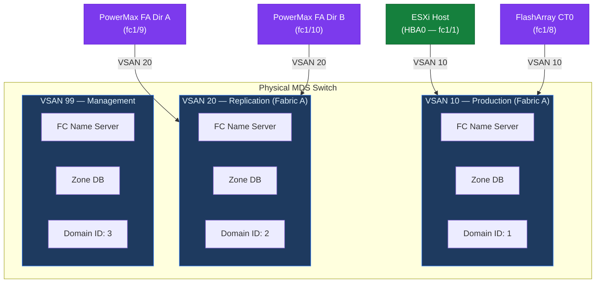
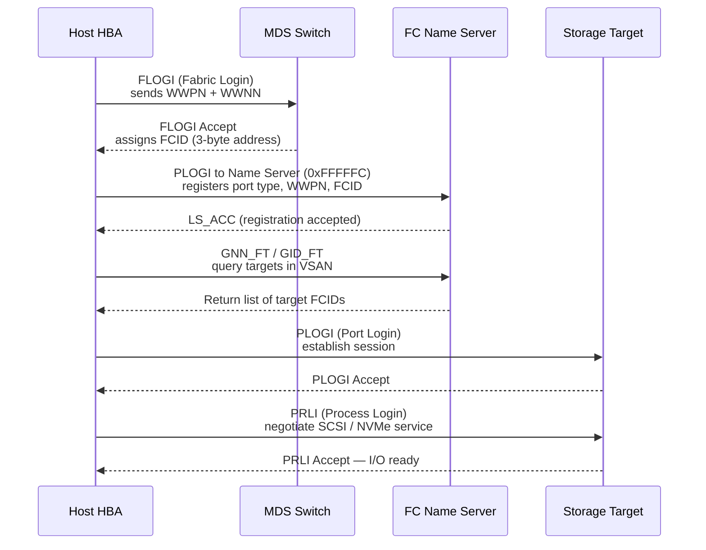

# MDS — Overview

> Part of the [Cisco MDS](../../) reference.

---

## Cisco MDS Fabric Topology



## Overview

Cisco MDS 9000 series switches run NX-OS and provide scalable SAN fabric services supporting Fibre Channel (FC) and FCoE. The core isolation mechanism is the **VSAN (Virtual SAN)** — multiple logical fabrics share physical infrastructure while maintaining separate name servers, zoning databases, and fabric login tables. Each VSAN operates as an independent fabric.

---

## Platform Reference

| Model | Type | Max FC Ports | Notes |
|---|---|---|---|
| MDS 9132T | Fixed | 32x 32G FC | Entry/mid-range |
| MDS 9148T | Fixed | 48x 32G FC | Mid-range |
| MDS 9396T | Fixed | 96x 32G FC | High-density fixed |
| MDS 9706 | Director | Up to 384 FC | Modular director |
| MDS 9710 | Director | Up to 576 FC | Large-scale director |

Directors (9706/9710) support ISSU (In-Service Software Upgrade), making them the preferred platform for environments requiring zero-downtime maintenance.

---

## Fabric Design

Typical enterprise deployment uses a **dual-fabric** architecture — each host HBA port connects to a separate switch, with storage targets dual-homed across both fabrics. A failure of one fabric does not impact the other.

Each fabric is completely independent — a failure of one fabric does not impact the other. All hosts and storage targets are connected to both fabrics for redundancy.

**ISLs (Inter-Switch Links):** Used when multiple MDS switches form a fabric. ISLs are configured as port-channel trunks (minimum 2 links). All VSANs allowed on the ISL must be explicitly permitted.

---

## VSAN Design

VSANs segment the fabric logically. Common VSAN allocation:

| VSAN | Purpose | Fabric A | Fabric B |
|---|---|---|---|
| Production | ESXi hosts → storage | 10 | 11 |
| Replication | SRDF/A or SnapMirror | 20 | 21 |
| Management | Out-of-band fabric mgmt | 99 | 99 |



Each VSAN has its own:
- FC Name Server (FCNS)
- Domain ID space
- Zone database
- FLOGI/PLOGI table

VSAN 1 is the default VSAN — do not use VSAN 1 for production; all production traffic should be in dedicated VSANs.

---

## FC Services

| Service | Function |
|---|---|
| FCNS (Name Server) | Registers all devices (hosts and storage) that FLOGI into the fabric |
| FSPF | Fabric Shortest Path First — routing protocol for FC fabrics |
| FLOGI DB | Records all fabric login events (WWN, FCID, port) |
| Zoning | Controls which initiators can communicate with which targets |



**Key commands:**

```bash
# Show all devices logged into a VSAN
show fcns database vsan 10

# Show all FLOGI entries
show flogi database

# Show fabric shortest path
show fspf database vsan 10

# Show port status
show interface fc1/1
```
