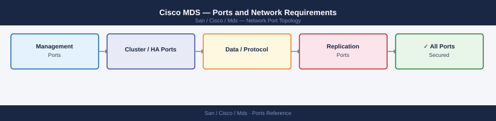

---
tags:
  - cisco
  - mds
  - san
  - networking
  - firewall
  - ports
---
# Cisco MDS — Ports and Network Requirements

<div class="kb-summary">
Firewall port reference for Cisco MDS 9000 Series SAN switches. Covers management access (SSH, HTTPS, Telnet), SNMP, NTP, AAA (TACACS+ and RADIUS), and Cisco DCNM/Nexus Dashboard Fabric Controller integration. Fibre Channel frame traffic is not IP-based.

*Applies to: Cisco MDS NX-OS 9.x / MDS 9000*
</div>


## Before you begin

- MDS management uses the dedicated mgmt0 port (Ethernet) — separate from all FC ports
- Telnet (port 23) should be disabled — SSH only in production
- TACACS+ (port 49) is preferred over RADIUS for Cisco device admin auth — provides per-command accounting
- FC fabric traffic (ISL, FSPF routing, FLOGI, zoning) is not TCP/IP and requires no firewall rules

---

## Inbound — Admin Access

| Port | Protocol | Source | Purpose |
|---|---|---|---|
| 22 | TCP | Jump hosts, DCNM, Nexus Dashboard | SSH — NX-OS CLI (primary management) |
| 443 | TCP | Admin browsers, DCNM | HTTPS — NX-API REST and Device Manager UI |
| 80 | TCP | Legacy Device Manager | HTTP — redirect to 443 (disable if not needed) |
| 23 | TCP | Legacy tooling (disable) | Telnet — disabled in production |
| 161 | UDP | DCNM, Nexus Dashboard, monitoring | SNMP polling |

---

## Outbound — Switch to External Services

| Port | Protocol | Destination | Purpose |
|---|---|---|---|
| 162 | UDP | SNMP trap receiver / DCNM | SNMP traps (hardware events, FC port changes) |
| 514 | UDP | Syslog server | NX-OS syslog event forwarding |
| 123 | UDP | NTP servers | Time synchronisation |
| 25 | TCP | SMTP relay | Email alerts (optional) |

---

## AAA Authentication — TACACS+ and RADIUS

| Port | Protocol | Destination | Purpose |
|---|---|---|---|
| 49 | TCP | TACACS+ server | TACACS+ authentication, authorisation, and per-command accounting |
| 1812 | UDP | RADIUS server | RADIUS authentication (fallback or alternative to TACACS+) |
| 1813 | UDP | RADIUS server | RADIUS accounting |

---

## Cisco DCNM / Nexus Dashboard Fabric Controller

Cisco DCNM (Data Center Network Manager) or Nexus Dashboard Fabric Controller manages MDS switches:

| Port | Protocol | Source | Destination | Purpose |
|---|---|---|---|---|
| 22 | TCP | DCNM / NDFC server | MDS mgmt IP | SSH — device management and configuration |
| 161 | UDP | DCNM / NDFC server | MDS mgmt IP | SNMP polling for inventory and telemetry |
| 443 | TCP | DCNM / NDFC server | MDS mgmt IP | NX-API REST (MDS 9.2.1+) |

| Port | Protocol | Source | Destination | Purpose |
|---|---|---|---|---|
| 443 | TCP | Admin browsers | DCNM / NDFC server | DCNM web UI and REST API |
| 22 | TCP | Jump hosts | DCNM / NDFC server | SSH — DCNM appliance management |

---

## Cisco Call Home (Optional)

| Port | Protocol | Destination | Purpose |
|---|---|---|---|
| 443 | TCP | tools.cisco.com | Smart Call Home — support phone-home |
| 25 | TCP | SMTP relay | Call Home email notifications |

---

## Firewall Zone Summary

| From | To | Ports | Notes |
|---|---|---|---|
| Admin clients | MDS mgmt IP | 22, 443 | SSH and HTTPS |
| DCNM / NDFC | MDS mgmt IP | 22, 161 UDP, 443 | Management and monitoring |
| MDS | SNMP receiver / DCNM | 162 UDP | SNMP traps |
| MDS | Syslog server | 514 UDP | Event log |
| MDS | TACACS+ | 49 TCP | Admin auth (preferred) |
| MDS | NTP | 123 UDP | Time sync |

---

## Verify

```bash
# From admin workstation — test SSH to MDS
ssh admin@<mds-mgmt-ip> show version

# From admin workstation — test HTTPS
curl -sk -o /dev/null -w "%{http_code}" https://<mds-mgmt-ip>/

# From MDS CLI — test NTP reachability
show ntp status

# From MDS CLI — test SNMP trap destination
show snmp trap

# From monitoring server — test SNMP polling
snmpget -v2c -c <community> <mds-mgmt-ip> 1.3.6.1.2.1.1.1.0

# From DCNM server — test switch SSH connectivity
ssh admin@<mds-mgmt-ip> show topology
```

---

## See also

- [Cisco MDS — Architecture](../how-it-works/)
- [Cisco MDS — Operations](../../operations/)
- [Cisco Nexus Dashboard — Ports](../../nexus-dashboard/architecture/ports.md)
- [Brocade FOS — Ports](../../../brocade/fabric-os/architecture/ports.md)
