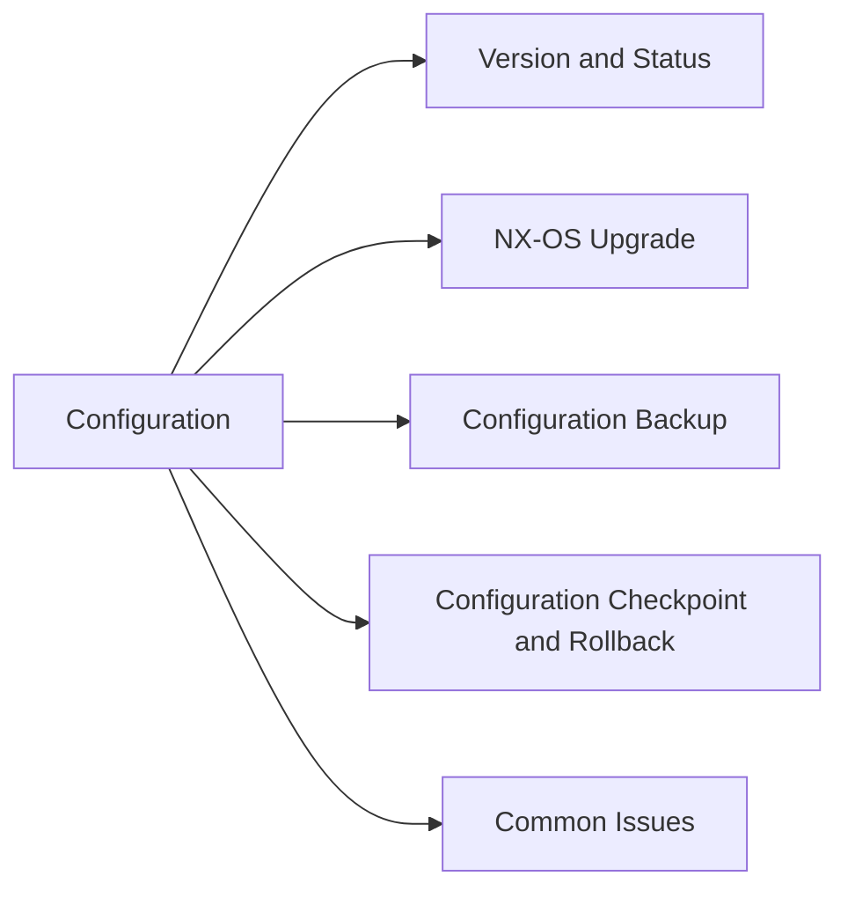

# Firmware & Configuration

> Part of the Cisco MDS NX-OS CLI Reference.



## Version & Status

```bash
show version                    # NX-OS version, compiled time, uptime
show install all status         # result of last install operation
```

## NX-OS Upgrade

```bash
# Stage and install from URL (TFTP/SCP/HTTP)
install all kickstart <kickstart_url> system <system_url>

# Non-disruptive upgrade check (ISSU)
install all nxos <url> non-disruptive

# Preview impact before committing
install all kickstart <url> system <url> status
```

MDS supports non-disruptive upgrades (ISSU) for most NX-OS releases — always verify the Cisco upgrade compatibility matrix for the specific version pair.

## Configuration Backup

```bash
# Save running to startup (before any change)
copy running-config startup-config

# Copy config off-switch via TFTP
copy running-config tftp://<server>/<filename>

# Copy config off-switch via SCP
copy running-config scp://<user>@<server>/<path>/<filename>

# Restore from TFTP
copy tftp://<server>/<filename> running-config

# Show full config
show running-config
show startup-config
```

## Configuration Checkpoint & Rollback

```bash
# Save a named checkpoint
checkpoint <checkpoint_name>
show checkpoint summary

# Rollback to checkpoint
rollback running-config checkpoint <checkpoint_name>

# Rollback to a saved file
rollback running-config file <filename>
```

## Common Issues

| Issue | Check | Action |
|---|---|---|
| Upgrade fails pre-check | Incompatible versions | Check Cisco upgrade matrix |
| Config lost after reboot | Not saved to startup | Run `copy run start` before reload |
| TFTP backup fails | Network reachability | Verify TFTP server and MDS OOB routing |
| ISSU fails | Feature or traffic mismatch | Check ISSU compatibility; schedule maintenance |
