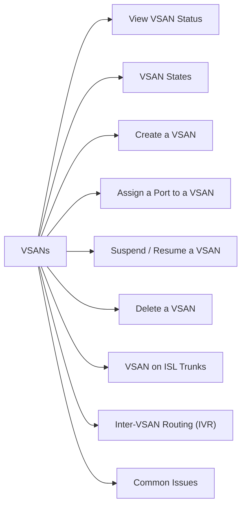

# VSANs

> Part of the Cisco MDS NX-OS CLI Reference.



## View VSAN Status

```bash
# All VSANs on the switch
show vsan
show vsan <id>

# VSAN port membership
show vsan membership
show vsan membership interface fc<slot/port>
```

## VSAN States

| State | Meaning |
|---|---|
| active | VSAN is running normally |
| suspended | VSAN administratively suspended |

## Create a VSAN

```bash
vsan database
  vsan <id> name "<name>"
```

## Assign a Port to a VSAN

```bash
vsan database
  vsan <id> interface fc<slot/port>
```

## Suspend / Resume a VSAN

```bash
vsan database
  vsan <id> suspend
  no vsan <id> suspend
```

## Delete a VSAN

```bash
vsan database
  no vsan <id>
```

> Deleting a VSAN disrupts all devices in that VSAN. Confirm no active traffic before deleting.

## VSAN on ISL Trunks

VSANs must be allowed on ISL trunk ports to traverse between switches:

```bash
interface fc<slot/port>
  switchport trunk allowed vsan add <id>
```

## Inter-VSAN Routing (IVR)

IVR allows devices in different VSANs to communicate (e.g., tape libraries shared across zones):

```bash
show ivr
show ivr vsan-topology
ivr enable
```

## Common Issues

| Issue | Check | Action |
|---|---|---|
| Host not seeing storage | Same VSAN? | `show vsan membership` on both ports |
| VSAN not crossing ISL | Trunk allowed VSANs | Add VSAN to trunk |
| VSAN suspended | Admin state | Check and `no vsan suspend` |
| IVR not working | IVR topology | Verify `show ivr vsan-topology` |
