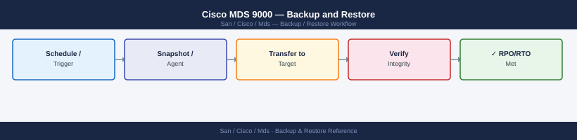

---
tags:
  - operations
  - san
---
# Cisco MDS 9000 — Backup and Restore


```bash
# Save running to startup config
copy running-config startup-config

# Copy running config off-switch via SCP
copy running-config scp://<user>@<server>/<path>/<filename>

# Copy running config off-switch via TFTP
copy running-config tftp://<server>/<filename>

# Display full running config (for manual capture)
show running-config
```

## Before you begin

- **Access:** Storage admin credentials (cluster admin or equivalent)
- **Timing:** safe to run during business hours unless a step is marked ⚠ (causes interruption)
- **Dependencies:** no active upgrades or migrations on the same infrastructure
- **Logging:** capture command output — paste into the change record on completion

---

---

## Verify

- Confirm the operation completed without errors in the log or management UI
- Verify the expected state change is visible (service running, object created, config applied)
- Document the outcome in the change record

---

## See also

- [Mds — Procedures](procedures/)
- [Mds — Health Checks](health-checks/)
- [Mds — Common Issues](../troubleshooting/common-issues/)
