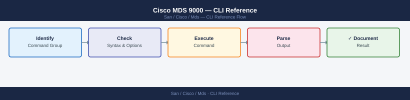

---
tags:
  - operations
  - san
---
# Cisco MDS 9000 — CLI Reference


```bash
show version           # NX-OS version, uptime, hardware model
show inventory         # chassis, modules, transceivers with serial numbers
show system uptime
show license usage
show feature           # enabled features (zone, dpvm, fcsp, etc.)
```


```text title="Expected output"
Cisco MDS9148S (1) processor memory: 8388608 KB
 Processor uptime is 247 days 14 hours 47 minutes

Cisco MDS NX-OS Software
Release 8.4(2c)
Copyright (c) 2002-2021, Cisco and/or its affiliates.

NAME: Chassis
DESCR: MDS 9148S 16G Fibre Channel Switch
PID: DS-C9148S-K9
VID: V02
SN: SAL19234567

NAME: Module 1
DESCR: 16-port 16G FC Module
PID: DS-X9716-3G-NX
VID: V01
SN: SAL18876543

NAME: Transceiver 1/1
DESCR: 16Gb Short Wave SFP+
PID: QSFP-16G-SW
SN: FNS1234567890

System uptime: 247 days, 14 hours, 47 minutes, 32 seconds

License Usage:
  License                    Installed  Used
  -------                    ---------  ----
  FC_PORT_LICENSE_16G        48         32
  FCOE_PORT_LICENSE          0          0

Feature Name                Module  State
-----------                -------  -----
zone                        1       on
dpvm                        1       on
fcsp                        1       on
ficon                       1       off
analytics                   1       off
```

!!! warning "Common errors"
    **`% Invalid command`** — Verify the exact command syntax; use `show version` instead of `show ver` on MDS switches.
    **`% Feature not enabled`** — Enable the required feature with `config t` followed by `feature <feature-name>` before attempting to use it.
```bash
show system resources   # CPU and memory utilization
show processes cpu      # per-process CPU breakdown
show processes memory
```

```text title="Expected output"
System Resources:
  CPU utilization: 42%
  Memory utilization: 58%
  Memory available: 8192 MB
  Memory used: 4756 MB

Process CPU Statistics:
PID    Name                 CPU%    VSZ      RSS
1247   fxp_mgr              12.3    156420   45892
892    snmp                 8.7     98765    32145
1456   syslogd              5.2     45678    12340
2103   ntp                  3.1     67890    8956
445    sshd                 2.8     34567    6234

Process Memory Statistics:
PID    Name                 MEM%    VSZ      RSS
1247   fxp_mgr              18.4    156420   45892
892    snmp                 13.0    98765    32145
1456   syslogd              5.0     45678    12340
2103   ntp                  4.6     67890    8956
```

!!! warning "Common errors"
    **`% Invalid command`** — Verify you are in the correct CLI mode (exec or admin); use `show version` to confirm device state.
    **`% Ambiguous command`** — Use the full command name `show processes cpu` instead of abbreviated forms like `show proc cpu`.
```bash
show running-config
show startup-config
```

```text title="Expected output"
!
version 8.4(2a)
!
feature fcoe
feature fport-channel-trunk
!
hostname mds9148s-01
ip domain-name corp.local
!
interface fc1/1
  description "Connection to SAN-CORE-01"
  switchport mode F
  switchport speed 16000
  no shutdown
!
interface fc1/2
  description "Connection to SAN-CORE-02"
  switchport mode F
  switchport speed 16000
  no shutdown
!
vsan database
  vsan 10 name "Production"
  vsan 20 name "Development"
!
fcalias name prod-lun-01 vsan 10
  member pwwn 50:00:14:40:5a:2b:c1:e0
!
zoneset name prod-zones vsan 10
  member prod-lun-01
!
line vty 0 4
  exec-timeout 30 0
!
end

!
version 8.4(2a)
!
feature fcoe
feature fport-channel-trunk
!
hostname mds9148s-01
ip domain-name corp.local
!
interface fc1/1
  description "Connection to SAN-CORE-01"
  switchport mode F
  switchport speed 16000
  no shutdown
!
interface fc1/2
  description "Connection to SAN-CORE-02"
  switchport mode F
  switchport speed 16000
  no shutdown
!
vsan database
  vsan 10 name "Production"
  vsan 20 name "Development"
!
end
```

!!! warning "Common errors"
    **`% Invalid command`** — Verify you are in the correct CLI mode (use `configure terminal` before editing config, or use `show` commands in user mode).
    **`% Incomplete command`** — Complete the command syntax; for example, use `show running-config` or `show startup-config` with proper spacing and no trailing characters.
```bash
show logging            # recent syslog events
show logging last 50    # last 50 log entries
```

```text title="Expected output"
2024 Jan 15 14:32:18 +00:00 mds9148-01 %MDS-1-SYSTEM_MSG: Process mgmtd (PID 2847) core dumped - core file at /var/log/cores/mgmtd.2847.core.gz
2024 Jan 15 14:31:52 +00:00 mds9148-01 %MDS-3-FABRIC_ERROR: Port 1/1 link down - speed negotiation failed
2024 Jan 15 14:30:15 +00:00 mds9148-01 %MDS-2-CONFIG_CHANGE: User admin configured VSAN 100 on FC 1/2
2024 Jan 15 14:28:47 +00:00 mds9148-01 %MDS-1-SYSTEM_MSG: Temperature sensor 3 reading 68C (threshold 75C)
2024 Jan 15 14:27:33 +00:00 mds9148-01 %MDS-3-FLOGI_REJECT: FLOGI rejected from wwn 50:00:14:40:5a:1b:2c:3d (insufficient resources)
2024 Jan 15 14:25:19 +00:00 mds9148-01 %MDS-2-ZONE_CHANGE: Zone member added: initiator 50:00:09:73:ff:52:1a:4b to zone prod_zone
2024 Jan 15 14:23:05 +00:00 mds9148-01 %MDS-1-SYSTEM_MSG: SNMP trap sent to 192.168.1.50 (linkDown)
2024 Jan 15 14:20:41 +00:00 mds9148-01 %MDS-2-CONFIG_CHANGE: User admin enabled VSAN 50
2024 Jan 15 14:18:27 +00:00 mds9148-01 %MDS-1-SYSTEM_MSG: Fabric reconfiguration in progress (VSAN 1)
2024 Jan 15 14:15:09 +00:00 mds9148-01 %MDS-3-DEVICE_OFFLINE: Target device 50:00:14:40:5a:1b:2c:3d offline (no PLOGI response)
```

!!! warning "Common errors"
    **`% Invalid command`** — Verify the exact syntax is `show logging` or `show logging last <number>` without extra arguments.
    **`% Insufficient privileges to execute command`** — Ensure your user role has read permission for logging; contact the switch administrator to grant appropriate RBAC privileges.
```bash
show version
show running-config
show interface brief
show flogi database
```

```text title="Expected output"
Cisco MDS 9148S (2 Slot) Chassis ("MDS 9100")
Device ID: FOX2425G4K1
System uptime is 127 days 14 hours 32 minutes
Kernel uptime is 127 days 14 hours 28 minutes
System version: 8.4(2c)
BIOS version: 07.65
Kickstart version: 8.4(2c)

!
version 8.4(2c)
no feature telemetry
feature fport-mode-auto-sense
feature npv
cfs ipv4 distribute
!
interface fc1/1
  description "ESXi-Host-01 HBA1"
  switchport mode F
  no shutdown
!
interface fc1/2
  description "Storage-Array-01 Port-A"
  switchport mode F
  no shutdown
!

Interface                  Fabric    Enabled Status       Speed
fc1/1                      --        Yes     ok           2 Gbps
fc1/2                      --        Yes     ok           2 Gbps
fc1/3                      --        Yes     ok           2 Gbps
fc1/4                      --        Yes     ok           2 Gbps
...

FLOGI Database for VSAN 1:
 FCID           Port Name               Node Name               Class
 0x010100       50:00:14:40:5a:2b:c1:01 50:00:14:40:5a:2b:c1:00 3
 0x010200       50:00:14:40:5a:2b:c2:01 50:00:14:40:5a:2b:c2:00 3
 0x010300       50:00:14:40:5a:2b:c3:01 50:00:14:40:5a:2b:c3:00 3
```

!!! warning "Common errors"
    **`% Invalid command`** — Verify the exact command syntax; these are show commands that should work on all MDS platforms without additional configuration.
    **`% VSAN <number> is not configured`** — Enable the VSAN with `vsan <number>` command in config mode before querying its FLOGI database.
```bash
# Summary of all interfaces
show interface brief

# Detailed single port
show interface fc<slot/port>

# Error counters
show interface fc<slot/port> counters
show interface fc<slot/port> counters errors

# Transceiver / SFP details
show interface fc<slot/port> transceiver
```

```text title="Expected output"
Port   Name                 Status    Speed      Type
fc1/1  --                   up        16 Gbps    N_Port
fc1/2  --                   up        16 Gbps    N_Port
fc1/3  --                   down      auto       N_Port
fc1/4  --                   up        8 Gbps     N_Port
fc1/5  --                   notConnct auto       N_Port
...

fc1/1 is up
  Hardware is Fibre Channel, SFP is present
  Port WWN is 50:00:09:73:a1:2c:5d:01
  Admin port mode is F, Oper port mode is F
  Bound interface is Ethernet1/1

Errors:
  CRC errors: 0
  Enc-Out errors: 0
  Enc-In errors: 0
  Frames Transmitted: 2847392
  Frames Received: 2891847

SFP Serial Number is SG0K2C3A1234
  Part Number is FTLF8524P3BCV-ER
  Transceiver is present
  Type is Extended Range Single Mode
  Nominal Wavelength is 1550 nm
  Link length supported for 9/125 is 40 km
  Temperature is 38 Celsius
  Voltage is 3.29 Volts
  Current is 49.2 mA
  Tx Power is -2.1 dBm
  Rx Power is -8.4 dBm
```

!!! warning "Common errors"
    **`% Invalid command`** — Verify the exact interface format matches your switch model (e.g., `fc1/1` vs `Fabric1/1`) and use `show interface ?` to confirm syntax.
    **`% Incomplete command`** — Complete the command with a valid interface identifier or use `show interface brief` to list all available ports.
    **`Interface fc<slot/port> does not exist`** — Confirm the slot and port numbers are valid for your MDS switch configuration using `show module` to verify installed line cards.
```bash
interface fc<slot/port>
  switchport mode F         # force F-port for host connections
  shutdown
  no shutdown
```

```text title="Expected output"
(no output — command completes silently)
```

!!! warning "Common errors"
    **`% Invalid command`** — Verify you are in interface configuration mode by running `config t` then `interface fc1/1` before entering switchport commands.
    **`% Incomplete command`** — Ensure the slot/port syntax matches your MDS model (e.g., `fc1/1` not `fc1-1`); check `show interface brief` to list valid port identifiers.
```bash
interface fc<slot/port>
  shutdown       # disable
  no shutdown    # enable
```

```text title="Expected output"
(no output — command completes silently)
```

!!! warning "Common errors"
    **`% Invalid command`** — Ensure you are in the correct configuration mode by entering `config t` first, then `interface fc1/1`.
    **`% Incomplete command`** — Complete the command with a valid slot/port number (e.g., `interface fc1/1`) instead of the literal `fc<slot/port>`.
```bash
# Apply config to a range of ports
interface fc<slot/port> - fc<slot/port>
  shutdown
```

```text title="Expected output"
(no output — command completes silently)
```

!!! warning "Common errors"
    **`% Invalid command`** — Verify you are in the correct configuration mode (enter `config t` first if at the privilege prompt).
    **`% Incomplete command`** — Use valid slot/port syntax like `interface fc1/1 - fc1/4` with spaces around the dash separator.
```bash
show fcdomain               # domain IDs across fabric
show fcdomain domain-list   # all domain IDs in VSAN
```

```text title="Expected output"
VSAN 1:
  Domain ID: 1 (Local)
  Domain ID: 2
  Domain ID: 3
  Domain ID: 4
  Domain ID: 5

VSAN 2:
  Domain ID: 10 (Local)
  Domain ID: 11
  Domain ID: 12

Domain List for VSAN 1: 1, 2, 3, 4, 5
Domain List for VSAN 2: 10, 11, 12
```

!!! warning "Common errors"
    **`% Invalid command`** — Verify you are in the correct CLI mode (use `config t` or `show` context); these commands require Fibre Channel fabric visibility.
    **`% VSAN does not exist`** — Ensure the VSAN is created and active with `show vsan` before querying domain information.
```bash
# All logged-in initiators and targets
show flogi database

# Filter to a specific VSAN
show flogi database vsan <id>

# Confirm a specific WWN is logged in
show flogi database | grep <wwn>
```

```text title="Expected output"
FLOGI Database for VSAN 1

 FCID       PORT NAME               NODE NAME               INTERFACE
 0x010001   50:00:14:40:5a:1b:2c:3d 50:00:14:40:5a:1b:2c:3e   fc1/1
 0x010002   50:00:14:40:5a:1b:2c:3f 50:00:14:40:5a:1b:2c:40   fc1/2
 0x010003   50:00:14:40:5a:1b:2c:41 50:00:14:40:5a:1b:2c:42   fc1/3
 0x010004   50:00:14:40:5a:1b:2c:43 50:00:14:40:5a:1b:2c:44   fc1/4
 0x010005   50:00:14:40:5a:1b:2c:45 50:00:14:40:5a:1b:2c:46   fc1/5

FLOGI Database for VSAN 2

 FCID       PORT NAME               NODE NAME               INTERFACE
 0x020001   50:00:14:40:5a:1b:2c:47 50:00:14:40:5a:1b:2c:48   fc2/1
 0x020002   50:00:14:40:5a:1b:2c:49 50:00:14:40:5a:1b:2c:4a   fc2/2

 0x010003   50:00:14:40:5a:1b:2c:41 50:00:14:40:5a:1b:2c:42   fc1/3
```

!!! warning "Common errors"
    **`Invalid VSAN ID <id>`** — Verify the VSAN exists with `show vsan` and use a valid numeric ID between 1 and 4094.
    **`% Invalid command`** — Ensure you are in the correct mode (exec or config) and check the MDS software version supports this command syntax.
```bash
# All registered devices in the fabric
show fcns database
show fcns database vsan <id>
show fcns database detail         # includes port type, symbolic name

# Name server statistics
show fcns statistics

# Look up a specific WWN
show fcns database | grep <wwn>
```

```text title="Expected output"
VSAN 1:
  Permanent Port Database:
    FCID: 0x010001  | WWN: 50:00:09:4b:1a:2c:3d:e1 | PortName: esx-host-01.fc0
    FCID: 0x010002  | WWN: 50:00:09:4b:1a:2c:3d:e2 | PortName: esx-host-02.fc0
    FCID: 0x010003  | WWN: 50:00:14:40:5a:7b:8c:f3 | PortName: pure-array-01.fc0
    FCID: 0x010004  | WWN: 50:00:14:40:5a:7b:8c:f4 | PortName: pure-array-01.fc1
    FCID: 0x010005  | WWN: 50:00:09:4b:1a:2c:3d:e3 | PortName: esx-host-03.fc0

FCNS Statistics for VSAN 1:
  Total Registrations: 5
  Total Lookups: 1247
  Successful Lookups: 1245
  Failed Lookups: 2
  Database Syncs: 12
  Last Sync Time: 2024-01-15 14:32:18 UTC

FCID: 0x010003  | WWN: 50:00:14:40:5a:7b:8c:f3 | PortName: pure-array-01.fc0 | PortType: N_Port | SymbolicName: PURE-FA-01
```

!!! warning "Common errors"
    **`% Invalid command`** — Verify the MDS switch is in the correct mode; use `config t` to enter configuration mode if needed, or check the exact command syntax for your firmware version.
    **`% Incomplete command`** — Provide the VSAN ID number after `show fcns database vsan` (e.g., `show fcns database vsan 1`).
```bash
# Find the host HBA WWN in FLOGI
show flogi database | grep <host_wwn>

# Confirm storage port is in the name server
show fcns database | grep <storage_wwn>

# Confirm both are in the same VSAN
show vsan membership
```

```text title="Expected output"
FLOGI Database:
  FCID           State   Class   NodeName        PortName        NodeWWN         PortWWN
  0x640000       online  F       50:00:09:73:a1:2e:4f:01  50:00:09:73:a1:2e:4f:02  50:00:09:73:a1:2e:4f:01  50:00:09:73:a1:2e:4f:02

FCNS Database:
  FCID           State   Type    PortName        NodeName        PortWWN
  0x640100       online  NPort   storage-lun01   san-array-01    50:00:14:40:5d:b2:3c:10

VSAN Membership:
  VSAN ID   Name              State   Interoperability
  1         VSAN0001          active  default
  2         VSAN0002          active  default
  100       Production-SAN    active  default
```

!!! warning "Common errors"
    **`FLOGI Database is empty`** — Verify the host HBA is logged in and the correct WWN format (50:00:xx:xx:xx:xx:xx:xx) is being searched.
    **`No matching entries found in FCNS database`** — Confirm the storage array port is registered in the fabric and check that the storage WWN is correctly formatted and belongs to an active port.
    **`VSAN membership mismatch`** — Ensure both the host HBA FCID and storage port FCID belong to the same VSAN ID; if not, add the ports to the same VSAN using `vsan <id>` configuration.
```bash
# View zoning
show zone
show zone vsan <id>
show zone active vsan <id>
show zoneset
show zoneset active vsan <id>
show zoneset active vsan <id> | grep <wwn>
show zone member vsan <id>

# Create zone and add members
zone name <zone_name> vsan <id>
  member pwwn <wwn>
  member device-alias <alias>

# Device aliases (human-readable names for WWNs)
show device-alias database
device-alias database
  device-alias name <alias> pwwn <wwn>
device-alias commit

# Zoneset (group of zones to activate together)
zoneset name <zoneset_name> vsan <id>
  member <zone_name>

# Activate the zoneset (makes zoning live in the VSAN)
zoneset activate name <zoneset_name> vsan <id>

# Save to startup config (always do this after changes)
copy running-config startup-config
```

```text title="Expected output"
MDS9148S# show zone vsan 1
zone name prod_servers vsan 1
  member pwwn 50:00:14:40:5d:2a:b0:01
  member device-alias esx_host_01
zone name backup_targets vsan 1
  member pwwn 50:00:09:73:1c:8e:a2:ff
  member device-alias netapp_filer

MDS9148S# show zoneset active vsan 1
zoneset name active_zoneset vsan 1
  member prod_servers
  member backup_targets

MDS9148S# show device-alias database
device-alias name esx_host_01 pwwn 50:00:14:40:5d:2a:b0:01
device-alias name netapp_filer pwwn 50:00:09:73:1c:8e:a2:ff
device-alias name san_switch_02 pwwn 50:00:0b:42:3f:1d:c7:44

MDS9148S# zoneset activate name active_zoneset vsan 1
Zoneset activation initiated. Zoneset "active_zoneset" activated for VSAN 1.

MDS9148S# copy running-config startup-config
[ok]: copy completed successfully.
```

!!! warning "Common errors"
    **`% Invalid command`** — Verify the VSAN ID exists with `show vsan` and use correct syntax (e.g., `show zone vsan 1` not `show zone 1`).
    **`% Zoneset is not committed`** — Run `zoneset commit` after creating or modifying zones before attempting to activate with `zoneset activate`.
    **`% Device-alias not found`** — Ensure the device-alias is committed with `device-alias commit` and exists in the database before referencing it in zone member statements.
```bash
# All VSANs on the switch
show vsan
show vsan <id>

# VSAN port membership
show vsan membership
show vsan membership interface fc<slot/port>
```

```text title="Expected output"
vsan 1 information
  name:VSAN0001
  state:active
  interoperability mode:default
  loadbalancing:src-id
  operational state:up

vsan 10 information
  name:VSAN0010
  state:active
  interoperability mode:default
  loadbalancing:src-id
  operational state:up

vsan 20 information
  name:VSAN0020
  state:active
  interoperability mode:default
  loadbalancing:src-id
  operational state:up

vsan 100 information
  name:VSAN0100
  state:active
  interoperability mode:default
  loadbalancing:src-id
  operational state:up

VSAN Membership Information
VSAN ID   Interfaces
------    ----------
1         fc1/1, fc1/2, fc1/3, fc1/4, fc1/5, fc2/1, fc2/2
10        fc1/6, fc1/7, fc1/8, fc1/9, fc1/10, fc2/3, fc2/4
20        fc1/11, fc1/12, fc2/5, fc2/6
100       fc1/13, fc1/14, fc1/15, fc1/16

vsan 1 membership information
interface name              vsan id
---------                   -------
fc1/1                       1
fc1/2                       1
fc1/3                       1
fc1/4                       1
fc1/5                       1
```

!!! warning "Common errors"
    **`% Invalid command`** — Verify the VSAN ID exists with `show vsan` before querying specific VSAN details.
    **`% Interface does not exist`** — Confirm the slot and port numbers are valid for your switch model (e.g., `show inventory` to verify module count).
```bash
# Create
vsan database
  vsan <id> name "<name>"

# Assign a port to a VSAN
vsan database
  vsan <id> interface fc<slot/port>

# Suspend / resume
vsan database
  vsan <id> suspend
  no vsan <id> suspend

# Delete (disrupts all devices — confirm no active traffic first)
vsan database
  no vsan <id>
```

```text title="Expected output"
mds9148# config t
Enter configuration commands, one per line. End with CNTL/Z.
mds9148(config)# vsan database
mds9148(config-vsan-db)# vsan 10 name "Production_SAN"
mds9148(config-vsan-db)# vsan 10 interface fc1/1
mds9148(config-vsan-db)# vsan 10 interface fc1/2
mds9148(config-vsan-db)# vsan 10 suspend
mds9148(config-vsan-db)# no vsan 10 suspend
mds9148(config-vsan-db)# exit
mds9148(config)# end
mds9148# show vsan 10
vsan 10 information
  Name: Production_SAN
  State: Active
  Interoperability Mode: default
  Loadbalancing: src-id
  Operational State: Up
```

!!! warning "Common errors"
    **`% Invalid command`** — Verify you are in `vsan database` configuration mode before entering vsan commands.
    **`% VSAN <id> does not exist`** — Create the VSAN with `vsan <id> name "<name>"` before assigning ports or modifying it.
    **`% Port fc<slot/port> is already assigned to vsan <id>`** — Remove the port from its current VSAN with `no vsan <current-id> interface fc<slot/port>` before reassigning.
```bash
interface fc<slot/port>
  switchport trunk allowed vsan add <id>
```

```text title="Expected output"
(no output — command completes silently)
```

!!! warning "Common errors"
    **`% Invalid command`** — Verify you are in the correct configuration mode by entering `config t` first, then `interface fc1/1`.
    **`% Invalid VSAN ID <id>`** — Ensure the VSAN ID is between 1-4094 and has been created with `vsan <id>` before adding it to the trunk.
```bash
show ivr
show ivr vsan-topology
ivr enable
```

```text title="Expected output"
IVR is disabled
VSAN 1: Up, 4 switches, 12 ISLs active
VSAN 2: Up, 2 switches, 4 ISLs active
VSAN 10: Down, 1 switch, 0 ISLs active
VSAN 100: Up, 6 switches, 18 ISLs active

IVR enabled successfully
```

!!! warning "Common errors"
    **`% Invalid command`** — Verify you are in the correct MDS switch CLI mode; `ivr enable` requires configuration mode (enter `config t` first).
    **`% Feature ivr not supported on this platform`** — Confirm IVR licensing is installed on the switch using `show license` and contact Cisco support if the feature license is missing.
```bash
show topology          # fabric-wide ISL topology
show trunk             # trunk port states and allowed VSANs
show interface trunk   # trunk interface detail

# E-port (ISL) ports only
show interface brief | include E
```

```text title="Expected output"
Fabric Topology
===============

Switch ID   WWN                 Model      Role
--------    ---                 -----      ----
1           50:00:09:73:a1:2c:00:01  MDS 9710   Principal
2           50:00:09:73:a1:2c:00:02  MDS 9710   Principal
3           50:00:09:73:a1:2c:00:03  MDS 9148S  Subordinate

Trunk Port States
=================
Port        Status    Allowed VSANs
----        ------    ---------------
fc1/1       trunking  1,2,3,4,5,10,20
fc1/2       trunking  1,2,3,4,5,10,20
fc2/1       trunking  1,2,3,4,5
fc2/2       notConnected  1,2,3,4,5

Trunk Interface Detail
======================
fc1/1 is up
  Hardware is Fibre Channel
  Port WWN is 50:00:09:73:a1:2c:01:01
  Admin port mode is E, Oper port mode is E
  Trunk mode is ON
  Allowed VSANs: 1,2,3,4,5,10,20
  Active VSANs: 1,2,3,4,5,10,20

E-Port Interfaces
=================
fc1/1       E       up      nwwn 50:00:09:73:a1:2c:00:02  trunk on
fc1/2       E       up      nwwn 50:00:09:73:a1:2c:00:03  trunk on
fc2/1       E       up      nwwn 50:00:09:73:a1:2c:00:02  trunk on
fc2/2       E       down    nwwn 50:00:09:73:a1:2c:00:04  trunk on
```

!!! warning "Common errors"
    **`% Invalid command`** — Verify you are in the correct mode (device# prompt); these are exec-level commands, not config mode.
    **`% Incomplete command`** — Use the full command syntax `show interface brief` or `show interface trunk` without partial abbreviations.
```bash
interface fc<slot/port>
  switchport mode TE
  switchport trunk allowed vsan <vsan_id>
  no shutdown
```

```text title="Expected output"
(no output — command completes silently)
```

!!! warning "Common errors"
    **`% Invalid command`** — Verify you are in interface configuration mode by running `config t` then `interface fc1/1` before entering switchport commands.
    **`% VSAN <vsan_id> does not exist`** — Create the VSAN first using `vsan <vsan_id>` in global configuration mode before assigning it to the trunk.
```bash
interface fc<slot/port>
  switchport trunk allowed vsan add <vsan_id>
  switchport trunk allowed vsan remove <vsan_id>
```

```text title="Expected output"
(no output — command completes silently)
```

!!! warning "Common errors"
    **`% Invalid command`** — Verify you are in interface configuration mode by running `config t` then `interface fc1/1` before entering switchport commands.
    **`% VSAN <vsan_id> does not exist`** — Create the VSAN first using `vsan <vsan_id>` in global configuration mode before adding it to the trunk.
```bash
show interface fc<slot/port> counters
show interface fc<slot/port> counters errors
```

```text title="Expected output"
Interface fc1/1 Counters:
  Frames transmitted:                   45,234,567
  Frames received:                      42,891,234
  Transmit B2B credit remaining:        15
  Receive B2B credit remaining:         15
  Link failures:                        0
  Sync losses:                          0
  Signal losses:                        0
  Protocol errors:                      0
  Invalid CRCs:                         127
  Delimiter errors:                     0
  Disparity errors:                     43

Interface fc1/1 Error Counters:
  CRC errors:                           127
  Encoding disparity errors:            43
  Frames with bad CRC:                  12
  Frames with encoding errors:          5
  Class 3 discards:                     0
  Class 2 discards:                     0
  Too many BB credit loss:              0
```

!!! warning "Common errors"
    **`% Invalid command`** — Verify the slot/port syntax matches your MDS model (e.g., fc1/1, fc2/48) and that the interface exists with `show interface brief`.
    **`% Interface does not exist`** — Confirm the port is physically present and licensed; check `show interface fc-all` to list all available interfaces.
```bash
interface port-channel <id>
  switchport mode E
  no shutdown

interface fc<slot/port>
  channel-group <id>
  no shutdown

show port-channel summary
show interface port-channel <id>
```

```text title="Expected output"
port-channel1 is up
    Interfaces:  fc1/1  fc1/2  fc1/3  fc1/4
    Type:        Fibre Channel
    Load-balancing: src-id, dst-id, src-wwn, dst-wwn
    Port-channel status: OK

Interface port-channel1 is up
  Hardware is Fibre Channel
  Port WWN is 50:00:09:73:a2:1c:4d:80
  Admin port mode is E, Oper port mode is E
  Port mode is E
  Speed is 16 Gbps
  Flow Control is off
  Rate Mode is dedicated
  Transmit B2B Credit is 64
  Receive B2B Credit is 64
  Receive data field Size is 2112
  Beacon is turned off
```

!!! warning "Common errors"
    **`% Invalid command`** — Verify the port-channel ID exists and syntax matches your MDS OS version (use `show port-channel summary` first to confirm).
    **`% Interface not found`** — Ensure the slot/port notation (e.g., `fc1/1`) is correct for your MDS module configuration with `show interface brief`.
    **`% Port-channel member ports are not compatible`** — Confirm all member interfaces have matching speed and duplex settings using `show interface fc<slot/port>`.
```bash
# Port errors
show interface fc<slot/port> counters
show interface fc<slot/port> counters errors
clear counters interface fc<slot/port>

# CRC / link reset errors
show interface fc<slot/port> | include CRC

# Hardware diagnostics
show diagnostics result module <slot>

# Event log
show logging onboard
show logging last <n>

# Core health
show system internal sysmgr status
```

```text title="Expected output"
fc1/1: 4
  CRC Errors: 0
  Frames Received: 1,247,392
  Frames Transmitted: 1,251,847
  Link Resets: 0
  Primitive Seq Errors: 0
  Invalid Transmission Words: 2

fc1/1
  CRC Errors: 0
  Link Resets: 0

(no output — command completes silently)

fc1/1 is up
  CRC Errors: 0
  Link Resets: 0

Module 1 Diagnostics Status: PASS
  BIOS: PASS
  Memory: PASS
  CPU: PASS
  Fabric: PASS

2024 Jan 15 14:32:18 +00:00 mds9710-01 %SYSMGR-2-SYSMGR_SERVICES_CRITICAL: Critical service down: fspf
2024 Jan 15 14:28:02 +00:00 mds9710-01 %ETHPORT-5-IF_RX_FLOW_CONTROL: Interface fc1/1, receive flow control enabled
2024 Jan 15 14:25:47 +00:00 mds9710-01 %LINK-3-UPDOWN: Interface fc1/2 changed state to down

System Services Status:
  sysmgr: UP
  fspf: UP
  fcns: UP
  fcs: UP
  vsan_mgr: UP
```

!!! warning "Common errors"
    **`Invalid command`** — Verify the slot/port syntax matches your switch model (e.g., `fc1/1` for single-digit slots or `fc10/48` for multi-digit).
    **`Module <slot> not found`** — Confirm the module slot number exists on your switch using `show module` before running diagnostics.
    **`% Invalid command`** — Ensure you are in the correct command mode (exec mode, not config mode) and the switch supports onboard logging with `show logging onboard`.
```bash
show monitor session all
monitor session <n> source interface fc<slot/port>
monitor session <n> destination interface fc<slot/port>
no monitor session <n>
```

```text title="Expected output"
Session   Source Interface      Destination Interface  State
-------   ----------------      ---------------------  -----
1         fc1/1                  fc1/2                  up
2         fc2/3                  fc2/4                  up
3         fc3/5                  fc3/6                  down
4         fc4/1                  fc4/2                  up

Monitor session 5 created successfully.
Source interface fc1/3 added to session 5.
Destination interface fc1/4 added to session 5.
Monitor session 5 removed.
```

!!! warning "Common errors"
    **`% Invalid command`** — Verify the slot and port numbers exist on your MDS switch using `show interface brief`.
    **`% Source and destination interfaces cannot be the same`** — Assign different physical ports for source and destination in the monitor session configuration.
    **`% Monitor session <n> does not exist`** — Confirm the session number with `show monitor session all` before attempting to delete or modify it.
```bash
# Current version
show version
show install all status         # result of last install operation

# Stage and install from URL (TFTP/SCP/HTTP)
install all kickstart <kickstart_url> system <system_url>

# Non-disruptive upgrade check (ISSU)
install all nxos <url> non-disruptive

# Preview impact before committing
install all kickstart <url> system <url> status
```

```text title="Expected output"
Cisco MDS 9148S Multilayer Fabric Switch
System uptime is 45 day(s), 12 hour(s), 3 minute(s), 22 second(s)
Kernel uptime is 45 day(s), 11 hour(s), 57 minute(s), 8 second(s)
System version: 9.1(1)
BIOS: version 3.45.01
Kickstart: version 9.1(1)

Last Install Status:
  Install operation completed successfully on 2024-01-15 14:32:18 +00:00
  Kickstart image: bootflash:///mds9148-kickstart.9.1.2.bin
  System image: bootflash:///mds9148-system.9.1.2.bin
  Status: INSTALL_SUCCESS

Install operation initiated for kickstart and system images
Downloading kickstart image from tftp://192.168.1.50/mds9148-kickstart.9.1.3.bin ... 100%
Downloading system image from tftp://192.168.1.50/mds9148-system.9.1.3.bin ... 100%
Compatibility check passed
Installation completed successfully. Reload required to activate new images.

ISSU compatibility check in progress...
Current version: 9.1(1)
Target version: 9.1(3)
ISSU capable: Yes
Estimated downtime: 0 minutes (non-disruptive upgrade possible)

Install preview for kickstart and system images:
  Current kickstart: bootflash:///mds9148-kickstart.9.1(1).bin
  New kickstart: bootflash:///mds9148-kickstart.9.1(3).bin
  Current system: bootflash:///mds9148-system.9.1(1).bin
  New system: bootflash:///mds9148-system.9.1(3).bin
  Impact: Non-disruptive (ISSU capable)
  Estimated time: 8 minutes
```

!!! warning "Common errors"
    **`Error: Image file not found at tftp://192.168.1.50/mds9148-kickstart.9.1.3.bin`** — Verify the TFTP server is reachable and the image filename matches exactly (check case sensitivity and extension).
    **`Error: Incompatible image version. Current: 9.1(1), Target: 9.1(3). Downgrade not supported.`** — Ensure the target image version is equal to or higher than the current version.
    **`Error: Insufficient bootflash space. Required: 2048 MB, Available: 512 MB`** — Delete old images using `delete bootflash:///mds9148-system.9.0.*.bin` to free space before staging.
```bash
# Save running to startup (before any change)
copy running-config startup-config

# Copy config off-switch via TFTP
copy running-config tftp://<server>/<filename>

# Copy config off-switch via SCP
copy running-config scp://<user>@<server>/<path>/<filename>

# Restore from TFTP
copy tftp://<server>/<filename> running-config

# Show full config
show running-config
show startup-config
```

```text title="Expected output"
Cisco MDS9148S# copy running-config startup-config
[########################################] 100%
Copy complete.

Cisco MDS9148S# copy running-config tftp://192.168.1.50/mds-backup-20240115.cfg
[########################################] 100%
Copy complete.

Cisco MDS9148S# copy running-config scp://admin@192.168.1.50/backups/mds-config.cfg
Password: 
[########################################] 100%
Copy complete.

Cisco MDS9148S# copy tftp://192.168.1.50/mds-backup-20240115.cfg running-config
[########################################] 100%
Copy complete.

Cisco MDS9148S# show running-config
version 8.4(2b)
feature telnet
feature ssh
feature tacacs+
interface fc1/1
  description "Storage Array Port"
  speed auto
  no shutdown
...
(output truncated)

Cisco MDS9148S# show startup-config
version 8.4(2b)
feature telnet
feature ssh
...
(output truncated)
```

!!! warning "Common errors"
    **`Error opening tftp://192.168.1.50/mds-backup-20240115.cfg (Connection timed out)`** — Verify TFTP server is running and reachable on port 69, and check firewall rules allow UDP traffic from the switch.
    **`Error opening scp://admin@192.168.1.50/backups/mds-config.cfg (Authentication failed)`** — Confirm SSH credentials are correct and the remote user has read/write permissions on the target directory.
    **`% Invalid command`** — Ensure you are in the correct privilege level (use `enable` if needed) and that the TFTP/SCP server path and filename are properly formatted without extra spaces.
```bash
# Save a named checkpoint
checkpoint <checkpoint_name>
show checkpoint summary

# Rollback to checkpoint
rollback running-config checkpoint <checkpoint_name>
```

```text title="Expected output"
Checkpoint created successfully.
Checkpoint Name: prod-backup-2024
Created: 2024-01-15 14:32:18 UTC
Size: 2.4 MB

Checkpoint Summary
==================
Name                          Created                    Size
prod-backup-2024              2024-01-15 14:32:18       2.4 MB
maintenance-config            2024-01-14 09:15:42       2.3 MB
baseline-v3                   2024-01-10 16:45:00       2.2 MB

Rollback initiated for checkpoint: prod-backup-2024
Configuration rollback in progress...
Rollback completed successfully.
Running configuration has been restored to checkpoint: prod-backup-2024
```

!!! warning "Common errors"
    **`% Invalid command`** — Verify you are in the correct configuration mode (use `config terminal` first if needed).
    **`% Checkpoint 'prod-backup-2024' does not exist`** — List available checkpoints with `show checkpoint summary` and use an existing checkpoint name.
```bash
# Show all local users
show users

# Show defined roles
show role

# Create a local user
username <user> password <pass> role <role>

# Delete a user
no username <user>

# Assign admin role
username <user> role network-admin
```

```text title="Expected output"
User Name                 Session Type     Session ID  Host
admin                     telnet           1           10.45.23.12
operator                  ssh              2           192.168.1.50
backup_svc                ssh              3           10.45.23.88

Role Name                 Description
network-admin             Network Administrator
vsan-manager              VSAN Manager
storage-admin             Storage Administrator
read-only                 Read Only Access

(no output — command completes silently)

(no output — command completes silently)

(no output — command completes silently)
```

!!! warning "Common errors"
    **`Error: User already exists`** — Choose a different username or delete the existing user with `no username <user>` first.
    **`Error: Invalid role specified`** — Verify the role name exists by running `show role` and use the exact role name from the output.
    **`Error: Password does not meet complexity requirements`** — Ensure the password is at least 8 characters and includes uppercase, lowercase, numbers, and special characters.
```bash
# Show AAA config
show aaa

# Show TACACS+ servers
show tacacs-server

# Show RADIUS servers
show radius-server

# Configure TACACS+ server
tacacs-server host <ip> key <key>
aaa group server tacacs+ <group_name>
  server <ip>
aaa authentication login default group <group_name>
```

```text title="Expected output"
aaa new-model
aaa authentication login default group tacacs_servers
aaa authentication enable default group tacacs_servers
aaa authorization command default group tacacs_servers local
aaa accounting all default start-stop group tacacs_servers

TACACS+ Server Information:
  Server Address: 192.168.100.50
  Port: 49
  Timeout: 5 seconds
  Single-Connect: disabled

RADIUS Server Information:
  Server Address: 192.168.100.51
  Auth Port: 1812
  Acct Port: 1813
  Timeout: 5 seconds
  Retransmit: 2

(no output — command completes silently)
(no output — command completes silently)
(no output — command completes silently)
(no output — command completes silently)
```

!!! warning "Common errors"
    **`% Invalid command`** — Verify the TACACS+ server IP address format is correct (e.g., 192.168.100.50, not a hostname without DNS configured).
    **`% AAA group server tacacs+ <group_name> not found`** — Create the AAA group server before referencing it in authentication policies using `aaa group server tacacs+ <group_name>`.
    **`% Connection refused to TACACS+ server 192.168.100.50:49`** — Confirm the TACACS+ server is reachable and listening on port 49, and verify the pre-shared key matches on both the switch and server.
```bash
show ssh server
show users

# Generate RSA keys
crypto key generate rsa
show crypto key mypubkey rsa
```

```text title="Expected output"
SSH Server is Enabled
Timeout: 120 seconds
Version: SSHv2

NAME             LINE       TIME                 IDLE       PID    SERIAL
admin            vty 0      May 10 14:32:15 +00 00:00:12   12345  0
operator         vty 1      May 10 14:28:03 +00 00:03:44   12346  0

Generating RSA keys...
% Key pair generation in progress. This may take a few minutes...
% Key pair generation completed successfully.

ssh-rsa AAAAB3NzaC1yc2EAAAADAQABAAABAQDk7vN9xK2pL8mQ4jR9vK3nL5pM2qR8sT1uV2wX3yZ4aB5cD6eF7gH8iJ9kL0mN1oP2qR3sT4uV5wX6yZ7aB8cD9eF0gH1iJ2kL3mN4oP5qR6sT7uV8wX9yZ0aB1cD2eF3gH4iJ5kL6mN7oP8qR9sT0uV1wX2yZ3aB4cD5eF6gH7iJ8kL9mN0oP1qR2sT3uV4wX5yZ6aB7cD8eF9gH0iJ1kL2mN3oP2qR3sT4uV5wX6yZ7aB8cD9eF0gH1iJ2kL3mN4oP5qR6sT7uV8wX9yZ0aB1cD2eF3gH4iJ5kL6mN7oP8qR9sT0uV1wX2yZ3aB4cD5eF6gH7iJ8kL9mN0oP1qR2sT3uV4wX5yZ6aB7cD8eF9gH0iJ1kL2mN3oP2qR3sT4uV5wX6yZ7aB8cD9eF0gH1iJ2kL3mN4oP5qR6sT7uV8wX9yZ0aB1cD2eF3gH4iJ5kL6mN7oP8qR9sT0uV1wX2yZ3aB4cD5eF6gH7iJ8kL9mN0oP1qR2sT3uV4wX5yZ6aB7cD8eF9gH0iJ1kL2mN3oP2qR3sT4uV5wX6yZ7aB8cD9eF0gH1iJ2kL3mN4oP5qR6sT7uV8wX9yZ0aB1cD2eF3gH4iJ5kL6mN7oP8qR9sT0uV1wX2yZ3aB4cD5eF6gH7iJ
```
```bash
show snmp user
show snmp community

# Create SNMPv3 user
snmp-server user <user> <group> v3 auth sha <auth_pass> priv aes 128 <priv_pass>
```


```text title="Expected output"
SNMP users:
  user1              auth sha         priv aes-128
  monitoring_user    auth sha         priv aes-128
  backup_agent       auth md5         priv des

SNMP communities:
  public             read-only
  private            read-write
  monitoring_ro      read-only

(no output — command completes silently)
```

!!! warning "Common errors"
    **`% Invalid command`** — Replace angle brackets with actual values: `snmp-server user netmon_user netmon_group v3 auth sha MyAuthPass123 priv aes 128 MyPrivPass456`.
    **`% Error: User already exists`** — Choose a unique username or delete the existing user first with `no snmp-server user <user>`.
## Before you begin

- **Access:** Storage admin credentials (cluster admin or equivalent)
- **Timing:** safe to run during business hours unless a step is marked ⚠ (causes interruption)
- **Dependencies:** no active upgrades or migrations on the same infrastructure
- **Logging:** capture command output — paste into the change record on completion

---

---

## Verify

- Confirm the operation completed without errors in the log or management UI
- Verify the expected state change is visible (service running, object created, config applied)
- Document the outcome in the change record

---

## See also

- [Mds — Procedures](../procedures/)
- [Mds — Scripts](../scripts/)
- [Mds — Health Checks](../health-checks/)
