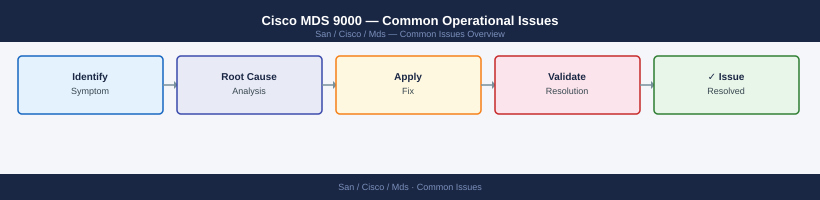

---
tags:
  - operations
  - san
---
# Cisco MDS 9000 — Common Operational Issues


```bash
# Identify the port and check detailed status
show interface fc1/3

# Check SFP / transceiver health
show interface fc1/3 transceiver

# Look for port error reason
show interface fc1/3 | include reason

# Check recent log events for this interface
show logging last 100 | grep fc1/3
```

```bash
# Find the reason for errDisabled
show interface fc1/4 | include err

# Check recent log for the error event
show logging last 100 | grep fc1/4
```
```bash
# After resolving the root cause:
interface fc1/4
  shutdown
  no shutdown

# Confirm port comes up
show interface fc1/4
```
```d2
direction: right

A: "Host cannot see storage" {shape: rectangle}
B: "show flogi database vsan 10\n| grep host-pwwn" {shape: rectangle}
C: "Host in\nFLOGI?" {shape: rectangle}
D: "Check port state\nCheck VSAN assignment\nCheck cable and SFP" {shape: rectangle}
E: "show flogi database vsan 10\n| grep storage-pwwn" {shape: rectangle}
F: "Storage in\nFLOGI?" {shape: rectangle}
G: "Check array port state\nCheck VSAN membership on array port" {shape: rectangle}
H: "show zone member pwwn\nhost-pwwn vsan 10" {shape: rectangle}
I: "Zone with both\ndevices exists?" {shape: rectangle}
J: "Create zone with initiator\nand target device aliases\nActivate zone set" {shape: rectangle}
K: "show zoneset active vsan 10\n| grep zone-name" {shape: rectangle}
L: "Zone set\nactive?" {shape: rectangle}
M: "zoneset activate name\nzoneset-name vsan 10" {shape: rectangle}
N: "Verify WWPNs in zone match\nFLOGI pWWN exactly\nCheck for alias typos" {shape: rectangle}

A -> B
B -> C
C -> D
C -> E
E -> F
F -> G
F -> H
H -> I
I -> J
I -> K
K -> L
L -> M
L -> N
```
```bash
# Step 1 — Is the host HBA logged into the fabric?
show flogi database vsan 10 | grep <host-pwwn>
# If missing: the HBA hasn't logged in — check port state and VSAN assignment

# Step 2 — Is the storage target logged in?
show flogi database vsan 10 | grep <storage-pwwn>

# Step 3 — Is there a zone containing both?
show zone member pwwn <host-pwwn> vsan 10
# Output should show the zone name and the storage port alias

# Step 4 — Is the zone set active?
show zoneset active vsan 10 | grep <zone-name>

# Step 5 — Are both devices in the same VSAN?
show vsan membership interface fc<x/y>   # for host port
show vsan membership interface fc<x/z>   # for storage port
```
```bash
# Check zone status for errors
show zone status vsan 10

# Common cause: enhanced zoning enabled and commit required
zone commit vsan 10

# Then activate
zoneset activate name <zoneset-name> vsan 10
```
```bash
# Verify current alias-to-WWPN mapping
show device-alias database | grep <alias-name>

# Verify active zone members (resolved WWPNs)
show zoneset active vsan 10

# If stale: deactivate, re-commit alias DB, reactivate
device-alias commit
zoneset activate name <zoneset-name> vsan 10
```
```bash
# List all zones in VSAN
show zone vsan 10

# Find zones containing a specific WWPN no longer in FLOGI
show zone member pwwn <old-pwwn> vsan 10

# Remove the member from the zone
zone name <zone-name> vsan 10
  no member device-alias <old-alias>

# Activate and commit
zoneset activate name <zoneset-name> vsan 10
zone commit vsan 10
copy running-config startup-config
```
```bash
# Check ISL port detail
show interface fc2/1

# Check trunk state
show trunk

# Check port-channel (if ISLs are bundled)
show port-channel summary
show interface san-port-channel 1

# Check topology
show topology
show fcdomain domain-list vsan 10
```
```bash
# Confirm rapid flap events in log
show logging last 100 | grep fc1/6

# Check error counters
show interface fc1/6 counters errors

# Check SFP optical power
show interface fc1/6 transceiver
```
```bash
interface fc1/6
  shutdown
```
```bash
# Check overall CPU
show system resources

# Identify the top consuming process
show processes cpu sort | head -20

# Check if port flap storm is the cause (high FC-related process CPU)
show logging last 200 | grep -i "link down\|flogi"
```
```bash
show fcdomain vsan 10
show fcdomain domain-list vsan 10
```
```bash
fcdomain domain 3 static vsan 10
# Then bring up the ISL
interface fc2/1
  no shutdown
```
```bash
# Review install status
show install all status

# Review install log
show install all failure-reason
```
```bash
install all nxos bootflash:<image-name>
```
```bash
# Always save after any change
copy running-config startup-config

# Or use the checkpoint mechanism before changes
checkpoint pre-change
```
```bash
show startup-config | head -20
# Confirm timestamp matches the last intended save
```

## Before you begin

- **Access:** Storage admin credentials (cluster admin or equivalent)
- **Timing:** safe to run during business hours unless a step is marked ⚠ (causes interruption)
- **Dependencies:** no active upgrades or migrations on the same infrastructure
- **Logging:** capture command output — paste into the change record on completion

---

---

## Verify

- Confirm the operation completed without errors in the log or management UI
- Verify the expected state change is visible (service running, object created, config applied)
- Document the outcome in the change record

## See also

- [Cisco MDS 9000 — Backup and Restore](backup-restore.md)
- [Cisco MDS 9000 — CLI Reference](cli-reference.md)
- [Cisco MDS 9000 — Health Checks](health-checks.md)
- [MDS — Operations](index.md)
- [Cisco MDS — Architecture](../../architecture/)
- [Cisco MDS — Initial Deployment](../../deploy/)
- [MDS — Security](../../security/)
- [MDS — Troubleshooting](../../troubleshooting/)
