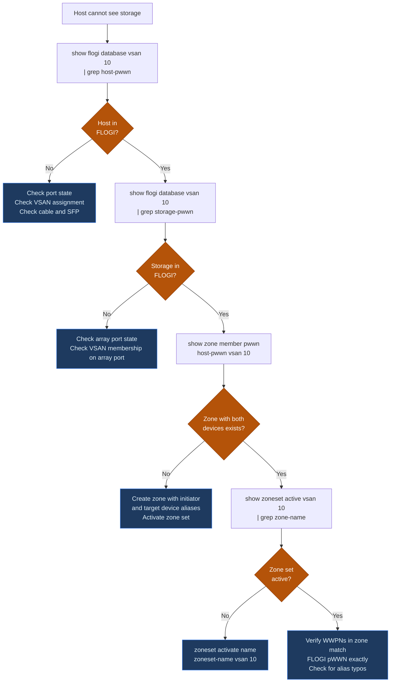

# Cisco MDS 9000 — Common Operational Issues

```bash
# Identify the port and check detailed status
show interface fc1/3

# Check SFP / transceiver health
show interface fc1/3 transceiver

# Look for port error reason
show interface fc1/3 | include reason

# Check recent log events for this interface
show logging last 100 | grep fc1/3
```

```text
┌───────────────────────────── Cisco MDS 9000 — Common Operational Issues ──────────────────────────────┐
│                                                                                                       │
│  Common MDS issues: HBA not logging in, ISL bounce, zone conflict, CRC errors, credits.               │
│                                                                                                       │
│   ┌──────────────────────────────────────────────┐  ┌─────────────────────────────────────────────┐   │
│   │              HBA & Login Issues              │  │             ISL & Fabric Issues             │   │
│   │          No FLOGI: check port state          │  │           ISL bounce: SFP or cable          │   │
│   │           Zone not allowing PLOGI            │  │           ISL down: speed mismatch          │   │
│   │           Wrong VSAN: check trunk            │  │           VSAN isolated: check ISL          │   │
│   │           Alias not in zone member           │  │          Domain conflict: renumber          │   │
│   │          Port disabled: no shut fc           │  │          CFS merge fail: zone conf          │   │
│   └──────────────────────────────────────────────┘  └─────────────────────────────────────────────┘   │
│                                                                                                       │
│  Zone and VSAN are first checks for HBA login issues; ISL = SFP and cable check.                      │
│                                                                                                       │
│                          ▼                                                 ▼                          │
│                                                                                                       │
│   ┌──────────────────────────────────────────────┐  ┌─────────────────────────────────────────────┐   │
│   │              Performance Issues              │  │           Firmware & Config Issues          │   │
│   │           CRC errors: replace SFP            │  │           NX-OS mismatch on fabric          │   │
│   │         BB credit starvation: check          │  │          Config not saved: copy run         │   │
│   │           ISL util > 70%: add ISLs           │  │          License missing: show lic          │   │
│   │         Latency spike: SAN analytics         │  │           ISSU fail: check compat           │   │
│   │          Queue depth: host HBA tune          │  │          Rollback: prior bootflash          │   │
│   └──────────────────────────────────────────────┘  └─────────────────────────────────────────────┘   │
│                                                                                                       │
│  Physical Infrastructure (the hardware everything above runs on):                                     │
│  MDS switch chassis · SFP transceivers · FC cables · host HBAs · storage arrays                       │
│                                                                                                       │
│  Key terms:                                                                                           │
│                                                                                                       │
│  FLOGI           = Fabric Login; HBA must FLOGI before data I/O is possible                           │
│  PLOGI           = Port Login; blocked by zone policy if HBA not in same zone                         │
│  VSAN trunk      = ISL must allow VSAN for HBA to appear in correct segment                           │
│  CFS merge fail  = zone database conflict between two switches; must resolve                          │
│  Domain conflict = two switches with same FC domain ID; isolate and renumber                          │
│  CRC errors      = Cyclic Redundancy Check; indicates bad SFP or dirty fiber                          │
│  BB credits      = Buffer-to-Buffer; zero credits = port paused; check starvation                     │
│  SAN analytics   = MDS 9700 per-ITL latency histogram; identify slow target                           │
│  show lic        = show license; verify ENTERPRISE_PKG or SAN_ANALYTICS_PKG                           │
│  ISSU compat     = ISSU requires NX-OS version compatibility check                                    │
│  bootflash       = switch flash; previous NX-OS image kept for rollback                               │
│  copy run start  = saves running config; loss of unsaved changes on reload                            │
│                                                                                                       │
└───────────────────────────────────────────────────────────────────────────────────────────────────────┘
```
```bash
# Find the reason for errDisabled
show interface fc1/4 | include err

# Check recent log for the error event
show logging last 100 | grep fc1/4
```
```bash
# After resolving the root cause:
interface fc1/4
  shutdown
  no shutdown

# Confirm port comes up
show interface fc1/4
```

```bash
# Step 1 — Is the host HBA logged into the fabric?
show flogi database vsan 10 | grep <host-pwwn>
# If missing: the HBA hasn't logged in — check port state and VSAN assignment

# Step 2 — Is the storage target logged in?
show flogi database vsan 10 | grep <storage-pwwn>

# Step 3 — Is there a zone containing both?
show zone member pwwn <host-pwwn> vsan 10
# Output should show the zone name and the storage port alias

# Step 4 — Is the zone set active?
show zoneset active vsan 10 | grep <zone-name>

# Step 5 — Are both devices in the same VSAN?
show vsan membership interface fc<x/y>   # for host port
show vsan membership interface fc<x/z>   # for storage port
```
```bash
# Check zone status for errors
show zone status vsan 10

# Common cause: enhanced zoning enabled and commit required
zone commit vsan 10

# Then activate
zoneset activate name <zoneset-name> vsan 10
```
```bash
# Verify current alias-to-WWPN mapping
show device-alias database | grep <alias-name>

# Verify active zone members (resolved WWPNs)
show zoneset active vsan 10

# If stale: deactivate, re-commit alias DB, reactivate
device-alias commit
zoneset activate name <zoneset-name> vsan 10
```
```bash
# List all zones in VSAN
show zone vsan 10

# Find zones containing a specific WWPN no longer in FLOGI
show zone member pwwn <old-pwwn> vsan 10

# Remove the member from the zone
zone name <zone-name> vsan 10
  no member device-alias <old-alias>

# Activate and commit
zoneset activate name <zoneset-name> vsan 10
zone commit vsan 10
copy running-config startup-config
```
```bash
# Check ISL port detail
show interface fc2/1

# Check trunk state
show trunk

# Check port-channel (if ISLs are bundled)
show port-channel summary
show interface san-port-channel 1

# Check topology
show topology
show fcdomain domain-list vsan 10
```
```bash
# Confirm rapid flap events in log
show logging last 100 | grep fc1/6

# Check error counters
show interface fc1/6 counters errors

# Check SFP optical power
show interface fc1/6 transceiver
```
```bash
interface fc1/6
  shutdown
```
```bash
# Check overall CPU
show system resources

# Identify the top consuming process
show processes cpu sort | head -20

# Check if port flap storm is the cause (high FC-related process CPU)
show logging last 200 | grep -i "link down\|flogi"
```
```bash
show fcdomain vsan 10
show fcdomain domain-list vsan 10
```
```bash
fcdomain domain 3 static vsan 10
# Then bring up the ISL
interface fc2/1
  no shutdown
```
```bash
# Review install status
show install all status

# Review install log
show install all failure-reason
```
```bash
install all nxos bootflash:<image-name>
```
```bash
# Always save after any change
copy running-config startup-config

# Or use the checkpoint mechanism before changes
checkpoint pre-change
```
```bash
show startup-config | head -20
# Confirm timestamp matches the last intended save
```
