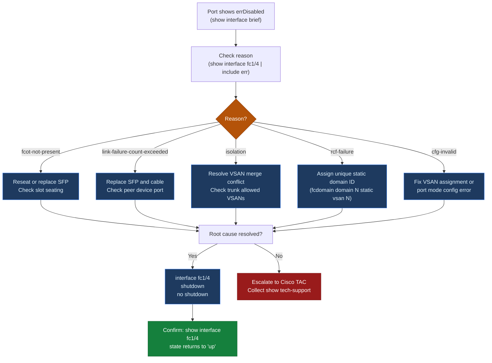
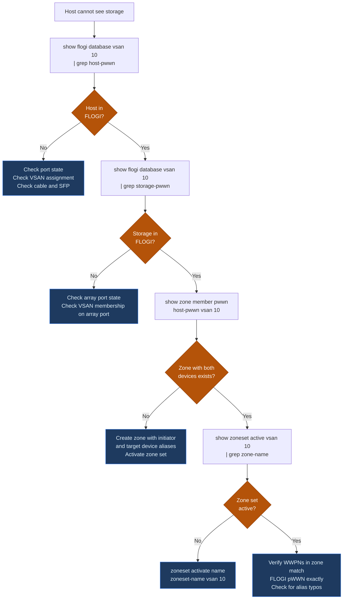

# MDS — Common Issues

> Part of the [Cisco MDS](../../) reference.

---

## Incident Triage Sequence

When a SAN fault is reported, work through this sequence before escalating. Each step narrows scope and provides evidence for the next.

- [ ] Establish the symptom precisely: is I/O failing, is a host unable to see storage, or is a port down?
- [ ] Confirm the time the problem started — correlate against change records
- [ ] Run `show interface brief` — identify any down or errDisabled FC interfaces
- [ ] Run `show flogi database` — check for missing host or storage device logins
- [ ] Run `show logging last 50` — look for error messages tied to the fault time
- [ ] Run `show environment` — rule out hardware faults (PSU failure, fan failure, overtemperature)
- [ ] Run `show zoneset active vsan <id>` — verify zoning is not blocking connectivity
- [ ] Check ISL state: `show topology` and `show port-channel summary`
- [ ] Escalate to Cisco TAC if hardware fault confirmed or interface stays errDisabled after port flap

| Question | Command |
|---|---|
| Which interfaces are down or errDisabled? | `show interface brief` |
| Are all expected hosts and storage logged in? | `show flogi database` |
| What happened at the time of the fault? | `show logging last 50` |
| Is there a hardware fault? | `show environment` |
| Is zoning blocking access? | `show zoneset active vsan <id>` |
| Are ISLs up and carrying the right VSANs? | `show topology` / `show trunk` |

---

## FC Port Down

**Symptom:** A host or storage port shows `down` in `show interface brief`. The device cannot log into the fabric.

**Triage:**

```bash
# Identify the port and check detailed status
show interface fc1/3

# Check SFP / transceiver health
show interface fc1/3 transceiver

# Look for port error reason
show interface fc1/3 | include reason

# Check recent log events for this interface
show logging last 100 | grep fc1/3
```

**Common causes and resolutions:**

| Cause | Indicator | Resolution |
|---|---|---|
| Cable unplugged or failed | `reason: Link failure or not-connected` | Reseat or replace fibre cable |
| Bad SFP / transceiver | Rx power below threshold in `show interface transceiver` | Replace SFP; use Cisco-branded or TAA-compliant optics |
| Speed mismatch | Port negotiating at wrong speed | Force speed: `interface fc1/3` → `switchport speed 16000` |
| Port in wrong VSAN | Port not assigned to a VSAN | `vsan database` → `vsan <id> interface fc1/3` |
| errDisabled state | `show interface` shows `errDisabled` | Investigate cause (see errDisabled section below) |
| Peer switch port down | Both ends of ISL down | Check peer switch port state |

**Resolution steps:**

```bash
# Verify VSAN assignment
show vsan membership interface fc1/3

# Assign to VSAN if missing
vsan database
  vsan 10 interface fc1/3

# Flap the port to attempt recovery
interface fc1/3
  shutdown
  no shutdown

# Clear error counters after recovery
clear counters interface fc1/3
```

---

## errDisabled Port

**Symptom:** `show interface brief` shows a port in `errDisabled` state. The port was automatically disabled by NX-OS following an error condition.



```bash
# Find the reason for errDisabled
show interface fc1/4 | include err

# Check recent log for the error event
show logging last 100 | grep fc1/4
```

**Common errDisabled reasons:**

| Reason | Cause | Action |
|---|---|---|
| `fcot-not-present` | SFP removed or not detected | Reseat or replace SFP |
| `cfg-invalid` | Configuration error (e.g., VSAN mismatch) | Fix config; re-enable port |
| `link-failure-count-exceeded` | Too many consecutive link flaps | Investigate cable/SFP instability |
| `isolation` | VSAN merge conflict on ISL | Resolve VSAN database conflict; re-enable |
| `rcf-failure` | RCF (Reconfigure Fabric) rejected by peer | Investigate domain ID conflict |

**Recovery:**

```bash
# After resolving the root cause:
interface fc1/4
  shutdown
  no shutdown

# Confirm port comes up
show interface fc1/4
```

Never re-enable an errDisabled port without first resolving the root cause — it will errDisable again immediately.

---

## Host Cannot See Storage

**Symptom:** A host reports no FC storage paths, or a newly connected host cannot discover storage volumes.



**Triage sequence:**

```bash
# Step 1 — Is the host HBA logged into the fabric?
show flogi database vsan 10 | grep <host-pwwn>
# If missing: the HBA hasn't logged in — check port state and VSAN assignment

# Step 2 — Is the storage target logged in?
show flogi database vsan 10 | grep <storage-pwwn>

# Step 3 — Is there a zone containing both?
show zone member pwwn <host-pwwn> vsan 10
# Output should show the zone name and the storage port alias

# Step 4 — Is the zone set active?
show zoneset active vsan 10 | grep <zone-name>

# Step 5 — Are both devices in the same VSAN?
show vsan membership interface fc<x/y>   # for host port
show vsan membership interface fc<x/z>   # for storage port
```

**Resolution matrix:**

| Finding | Resolution |
|---|---|
| Host HBA not in FLOGI database | Check port state (`show interface`); check VSAN assignment; check cable |
| Storage target not in FLOGI database | Check array port state; check VSAN membership |
| No zone containing host + storage | Create zone and add to active zone set; activate |
| Zone exists but zone set not active | `zoneset activate name <zoneset> vsan <id>` |
| Both in FLOGI but different VSANs | Move host or storage port to same VSAN, or configure IVR |
| Zone set active but host still can't see storage | Re-check WWPNs in zone match actual device FLOGI entries; check for typos in device aliases |

---

## Zoning Issues

### Zone Activation Fails

```bash
# Check zone status for errors
show zone status vsan 10

# Common cause: enhanced zoning enabled and commit required
zone commit vsan 10

# Then activate
zoneset activate name <zoneset-name> vsan 10
```

### Zone Members Show Wrong WWPNs

Device aliases resolve to WWPNs at activation time. If a device alias was modified, the zone must be re-activated to pick up the new mapping.

```bash
# Verify current alias-to-WWPN mapping
show device-alias database | grep <alias-name>

# Verify active zone members (resolved WWPNs)
show zoneset active vsan 10

# If stale: deactivate, re-commit alias DB, reactivate
device-alias commit
zoneset activate name <zoneset-name> vsan 10
```

### Stale Zone Entries

Zones referencing decommissioned hosts or storage create unnecessary zone database entries and can cause confusion.

```bash
# List all zones in VSAN
show zone vsan 10

# Find zones containing a specific WWPN no longer in FLOGI
show zone member pwwn <old-pwwn> vsan 10

# Remove the member from the zone
zone name <zone-name> vsan 10
  no member device-alias <old-alias>

# Activate and commit
zoneset activate name <zoneset-name> vsan 10
zone commit vsan 10
copy running-config startup-config
```

---

## ISL Down or Isolated

**Symptom:** `show topology` shows a missing ISL, or `show interface brief` shows an ISL port as `down` or `isolated`.

```bash
# Check ISL port detail
show interface fc2/1

# Check trunk state
show trunk

# Check port-channel (if ISLs are bundled)
show port-channel summary
show interface san-port-channel 1

# Check topology
show topology
show fcdomain domain-list vsan 10
```

**Common causes:**

| Cause | Resolution |
|---|---|
| VSAN not allowed on trunk | `interface fc2/1` → `switchport trunk allowed vsan add <id>` |
| Domain ID conflict after fabric merge | Change domain ID on one switch: `fcdomain domain <id> static vsan <id>` |
| Speed mismatch on ISL | Force same speed on both ends |
| VSAN suspended on one switch | `no vsan <id> suspend` |
| Physical cable or SFP issue | Check transceiver Rx/Tx power; replace SFP |

---

## FLOGI Storms / Rapid Re-login

**Symptom:** `show logging` shows repeated `FLOGI` or `link down/up` events on a port. This typically indicates a failing SFP, marginal cable, or HBA driver issue.

```bash
# Confirm rapid flap events in log
show logging last 100 | grep fc1/6

# Check error counters
show interface fc1/6 counters errors

# Check SFP optical power
show interface fc1/6 transceiver
```

Resolution: replace the SFP first (most common cause); if the issue persists with a new SFP, replace the cable. If both are good, investigate the connected HBA or storage port.

Temporarily shut the port to stop the flap storm and prevent disruption to other fabric services:

```bash
interface fc1/6
  shutdown
```

Restore only after root cause is confirmed resolved.

---

## High CPU on Supervisor

**Symptom:** `show system resources` shows sustained CPU > 80% on the supervisor. This can cause delayed zone activations, slow CLI response, or missed SNMP polls.

```bash
# Check overall CPU
show system resources

# Identify the top consuming process
show processes cpu sort | head -20

# Check if port flap storm is the cause (high FC-related process CPU)
show logging last 200 | grep -i "link down\|flogi"
```

High CPU caused by FLOGI storms: isolate the flapping port (shutdown). High CPU from other processes: open a TAC case with `show tech-support` output.

---

## Domain ID Conflict

**Symptom:** After connecting a new switch or after a fabric merge, VSANs go `isolated` on the ISL. `show fcdomain` shows a domain ID conflict.

```bash
show fcdomain vsan 10
show fcdomain domain-list vsan 10
```

Resolution: each switch in a VSAN must have a unique domain ID. Configure a static domain ID on the new switch before connecting the ISL:

```bash
fcdomain domain 3 static vsan 10
# Then bring up the ISL
interface fc2/1
  no shutdown
```

If the domain ID was already in use, first remove the conflict from the existing switch, or assign the new switch a domain ID not in the current domain-list.

---

## NX-OS Upgrade Fails

**Symptom:** `install all` fails pre-check or fails mid-upgrade.

```bash
# Review install status
show install all status

# Review install log
show install all failure-reason
```

Common causes:
- Insufficient bootflash space: `dir bootflash:` — delete old images: `delete bootflash:<old-image>`
- Image checksum mismatch: re-download the image and verify MD5
- Incompatible EPLD for target NX-OS: check Cisco release notes for EPLD requirements
- ISSU prerequisites not met (directors only): check dual supervisor sync: `show module`

After resolving, re-run:

```bash
install all nxos bootflash:<image-name>
```

---

## Configuration Not Persisting After Reload

**Symptom:** After a switch reload, configuration reverts to an earlier state.

**Cause:** Running configuration was not saved to startup before the reload.

**Prevention:**

```bash
# Always save after any change
copy running-config startup-config

# Or use the checkpoint mechanism before changes
checkpoint pre-change
```

**Verify startup config is current:**

```bash
show startup-config | head -20
# Confirm timestamp matches the last intended save
```
