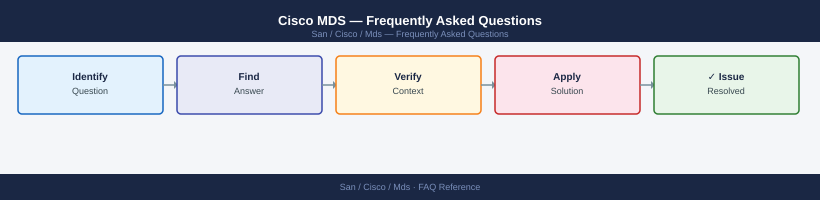

---
tags:
  - cisco-mds
  - faq
  - operations
---
# Cisco MDS — Frequently Asked Questions

<div class="kb-summary">
Common questions about Cisco MDS operations, configuration, and troubleshooting. For step-by-step procedures, see the <a href="index.md">Operations</a> section.
</div>



```d2
direction: right

hub: "Cisco MDS\nOperations" {shape: hexagon}
general: "General" {shape: rectangle}
configuration: "Configuration" {shape: rectangle}
operations: "Operations" {shape: rectangle}
troubleshooting: "Troubleshooting" {shape: rectangle}
backup_and_recovery: "Backup and Recovery" {shape: rectangle}

hub -> general
hub -> configuration
hub -> operations
hub -> troubleshooting
hub -> backup_and_recovery
```

## General

**Q: What NX-OS version is recommended for Cisco MDS?**
A: MDS NX-OS 9.4(x) is the current recommended release for new deployments. Check with `show version` from the switch CLI. Always review the Cisco Field Notice list before upgrading production switches.

**Q: How do I check the current Cisco MDS version?**
A: `show version`

## Configuration

**Q: What is the default VSANs configuration and when should it be changed?**
A: VSAN 1 is the default and all ports are assigned to it. Always create dedicated VSANs per fabric (e.g., VSAN 10 for Fabric A, VSAN 20 for Fabric B). Remove unused ports from VSAN 1 to limit broadcast domain.

**Q: How do I enable Cisco MDS NPIV for virtualisation environments?**
A: NPIV is enabled per-interface: `feature npiv` globally, then `switchport mode NP` on the F-ports connecting to virtual HBA environments. Allows each VM HBA to register its own WWPN with the fabric.

## Operations

**Q: How do I perform a non-disruptive upgrade on a Cisco MDS switch?**
A: Use ISSU (In-Service Software Upgrade) if supported for the target release: `install all nxos <image>`. ISSU upgrades supervisors and linecards sequentially without disrupting I/O. Verify ISSU compatibility in the release notes first.

**Q: What is the correct procedure to add a new host to a zone on Cisco MDS?**
A: Get WWN from `show flogi database`. Add to zone: `zone name MyZone vsan 10; member pwwn <wwn>`. Update zoneset: `zoneset name MyZoneset vsan 10; member MyZone`. Activate: `zoneset activate name MyZoneset vsan 10`.

## Troubleshooting

**Q: MDS shows 'Domain overlap' error. What does it mean?**
A: Two switches have the same domain ID, causing fabric segmentation. Fix by changing domain ID on one switch: `fcdomain domain <id> preferred vsan <id>` and remerging the fabric. Plan domain IDs before connecting new switches.

**Q: FC performance degraded on MDS — where do I start?**
A: Run `show interface fc x/x counters` for error counts. Check credit loss with `show interface fc x/x | include credit`. Use `show analytics top-ports` for congestion visibility. Look for SCSI timeouts in host/storage logs.

## Backup and Recovery

**Q: How often should I back up MDS configuration?**
A: Weekly via `copy running-config sftp://<server>/mds-config-$(date).txt`. Always back up before firmware upgrades or major zoning changes. Store configs in version control.

**Q: Can I restore a single zone without a full configuration restore?**
A: Yes — use `show zoneset active vsan 10` to view current active zones. Edit the zone database interactively using `zone` commands, then re-activate the zoneset. No full config restore needed for zone-only changes.

## See Also

- [Cisco MDS Operations](index.md)
- [Cisco MDS Troubleshooting](../../../troubleshooting/index.md)
