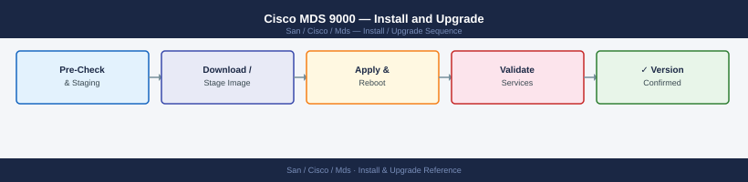

---
tags:
  - operations
  - san
---
# Cisco MDS 9000 — Install and Upgrade


```bash
# Step 1 — Copy the target NX-OS image to the switch bootflash
copy scp://<server>/<path>/nxos.bin bootflash:

# Step 2 — Verify the image MD5 checksum
show file bootflash:nxos.bin md5sum

# Step 3 — Run the install all pre-check (non-disruptive)
install all nxos bootflash:nxos.bin

# Review the pre-check output — confirm no blocking issues

# Step 4 — Confirm and proceed (switch will reload)
# The install all command prompts for confirmation before rebooting

# Step 5 — After reload, verify
show version
show interface brief   # all ports up
show vsan             # all VSANs active
show zoneset active   # zoning intact
```


```text title="Expected output"
scp://<server>/<path>/nxos.bin copied to bootflash: (2847 MB in 187 seconds)

bootflash:nxos.bin md5sum = a7f3e2c91d4b5f8e9c2a1b6d3e4f5a7b

Pre-check passed: No blocking issues detected
  - NX-OS version compatibility: OK
  - Bootflash space available: 4.2 GB
  - Active supervisor: sup-1
  - Standby supervisor: sup-2

Do you want to continue with the installation? (yes/no) [no]: yes
Proceeding with install all...
[####################] 100%
Switch will reload in 30 seconds...

Cisco MDS 9148S (2 Supervisor Module-3X)
System uptime is 2 minutes 14 seconds
Kernel uptime is 2 minutes 8 seconds
Last reset at 142856 UTC Mon Jan 15 2024

Interface  Vsan  Status
Fc1/1      1     up
Fc1/2      1     up
Fc1/3      2     up
...

VSAN 1: Interoperability Mode ON, default VSAN
VSAN 2: Interoperability Mode ON
VSAN 3: Interoperability Mode ON

zoneset name prod_zones active
  zone name zone_prod_01 vsan 1
  zone name zone_prod_02 vsan 2
```

!!! warning "Common errors"
    **`Error: bootflash: space is insufficient`** — Verify available bootflash space with `show disk` and delete old images using `delete bootflash:old_image.bin` before copying.
    **`Error: MD5 checksum mismatch`** — Re-download the NX-OS image from the Cisco repository and verify the source file integrity before copying again.
    **`Error: Pre-check failed: Incompatible supervisor module detected`** — Ensure both supervisor modules are running compatible firmware versions using `show module` and upgrade the standby supervisor first if needed.
```bash
# Step 1 — Move all host and storage ports to other switches
# Step 2 — Disable the ISL port-channels to isolate the switch from the fabric
interface port-channel1
  shutdown

# Step 3 — Confirm no devices are still logged in
show flogi database

# Step 4 — Physically remove the switch
# Step 5 — Update CMDB and domain ID register
```


```text title="Expected output"
mds9710-switch1# interface port-channel1
mds9710-switch1(config-if)# shutdown
mds9710-switch1(config-if)# exit
mds9710-switch1# show flogi database
FLOGI Database for Switch ID 0x123456:

 FCID       Port Name                    Node Name                    Class
-------- ---------- ----------------------- ----------------------- -------
(no entries found)

mds9710-switch1#
```

!!! warning "Common errors"
    **`% Invalid command`** — Verify you are in the correct configuration mode; use `config t` before entering interface mode.
    **`% Port-channel1 does not exist`** — Create the port-channel first with `interface port-channel 1` in global config, or confirm the correct port-channel number matches your ISL configuration.
## Before you begin

- **Access:** Storage admin credentials (cluster admin or equivalent)
- **Timing:** safe to run during business hours unless a step is marked ⚠ (causes interruption)
- **Dependencies:** no active upgrades or migrations on the same infrastructure
- **Logging:** capture command output — paste into the change record on completion

---

---

## Verify

- Confirm the operation completed without errors in the log or management UI
- Verify the expected state change is visible (service running, object created, config applied)
- Document the outcome in the change record

---

## See also

- [Mds — Procedures](../procedures/)
- [Mds — Health Checks](../health-checks/)
- [Mds — Deploy](../../deploy/)
