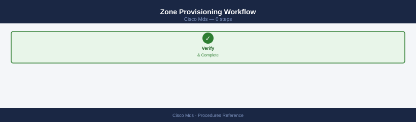
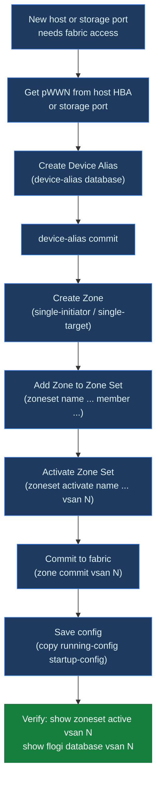
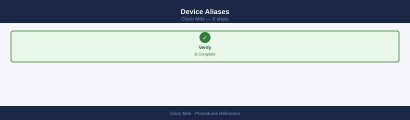
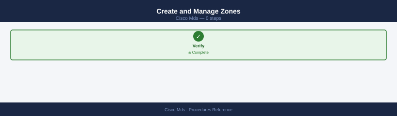
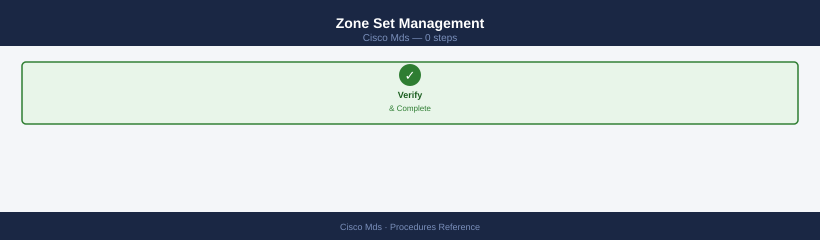
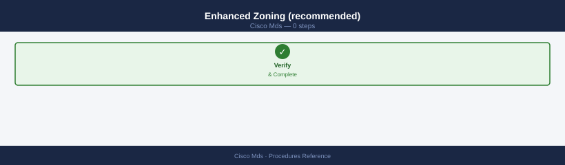
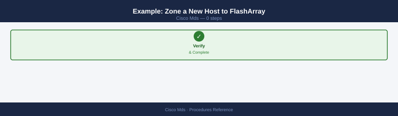
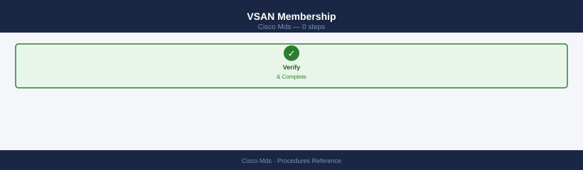
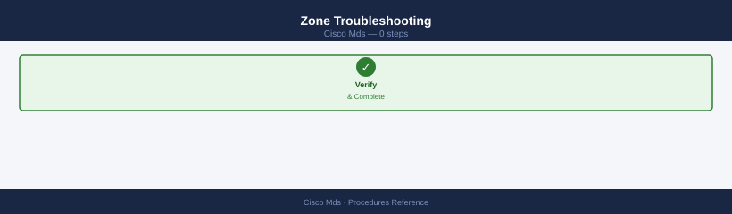
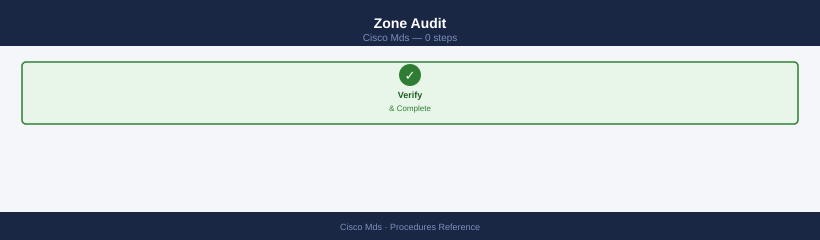

---
tags:
  - operations
  - san
---
# MDS — Procedures


<div class="kb-summary">
Cisco MDS procedures: `show flogi database`, zone member management with `zone name`, port activation, `copy running-config startup-config`, and SUP switchover.

*Applies to: Cisco MDS · Nexus*
</div>

---

```d2
direction: right

hub: "Cisco MDS\nOperations" {shape: hexagon}
change_readiness: "Change Readiness" {shape: rectangle}
maintenance_window: "Maintenance Window" {shape: rectangle}
postchange_validation: "Post-Change Validation" {shape: rectangle}
zoning: "Zoning" {shape: rectangle}
add_a_new_switch_to_an_existing_vsan: "Add a New Switch to an Existing VSAN" {shape: rectangle}
create_a_device_alias: "Create a Device Alias" {shape: rectangle}

hub -> change_readiness
hub -> maintenance_window
hub -> postchange_validation
hub -> zoning
hub -> add_a_new_switch_to_an_existing_vsan
hub -> create_a_device_alias
```

## Before you begin

- **Access:** Storage admin credentials (cluster admin or equivalent)
- **Timing:** safe to run during business hours unless a step is marked ⚠ (causes interruption)
- **Dependencies:** no active upgrades or migrations on the same infrastructure
- **Logging:** capture command output — paste into the change record on completion

---

## Change Readiness

- [ ] Configuration backup taken: `show running-config` output saved to jump host
- [ ] Both fabrics (Fabric A and Fabric B) are healthy before touching either
- [ ] VSAN configuration documented: all VSANs, membership, and active zonesets recorded
- [ ] Zoning change reviewed and approved — peer review of zone diff completed
- [ ] `show flogi database` baselined: full list of logins captured before change
- [ ] Maintenance window approved and communicated to affected storage and compute teams
- [ ] Rollback plan confirmed: procedure to restore zone config or revert VSAN change documented

| Item | Status | Notes |
|---|---|---|
| Running config backup | | `show running-config` to jump host |
| Both fabrics healthy | | `show interface brief` on all switches |
| VSAN config documented | | VSAN-to-port mapping recorded |
| Zone diff peer-reviewed | | Ticket reference |
| Change window approved | | Ticket reference |

---

## Maintenance Window

1. Confirm both fabrics are healthy: `show interface brief` and `show flogi database` on all switches
2. Take configuration backup: `copy running-config startup-config` and save `show running-config` to jump host
3. Notify storage and compute teams that Fabric A (or B) will be affected
4. Perform the change on one fabric only — leave the other fabric carrying full host I/O
5. After change, run `show interface brief`, `show flogi database`, and `show zoneset active vsan all` to confirm state
6. Validate host multipath paths are still active via host-side tools
7. Review `show logging last 50` for any errors introduced by the change
8. Repeat procedure on second fabric only after first fabric is fully validated and hosts confirmed healthy

---

## Post-Change Validation

- [ ] All FC interfaces back in connected/up state: `show interface brief`
- [ ] FLOGI database complete — all hosts and storage logged in: `show flogi database`
- [ ] Active zoneset matches expected post-change config: `show zoneset active vsan all`
- [ ] No new error or critical syslog entries since change: `show logging last 50`
- [ ] Environment still healthy — no new hardware alerts: `show environment`
- [ ] Running config saved to startup config: `copy running-config startup-config`
- [ ] Host multipath paths active and balanced (confirmed via host-side tool)
- [ ] Close change ticket with validation evidence attached

---

## Zoning

### Zone Provisioning Workflow







### Device Aliases


### Create and Manage Zones




```bash
# Create zone and add members
switch# zone name esxi01_hba0__fa01_ct0_p0 vsan 10
switch(config-zone)# member device-alias esxi01_hba0
switch(config-zone)# member device-alias fa01_ct0_p0
switch(config-zone)# member device-alias fa01_ct0_p1
switch(config-zone)# exit

# Remove a member
switch# zone name esxi01_hba0__fa01_ct0_p0 vsan 10
switch(config-zone)# no member device-alias fa01_ct0_p1
switch(config-zone)# exit
```

### Zone Set Management




```bash
# Create zone set and add zones
switch# zoneset name dc1-fabA-prod vsan 10
switch(config-zoneset)# member esxi01_hba0__fa01_ct0_p0
switch(config-zoneset)# member esxi01_hba1__fa01_ct1_p0
switch(config-zoneset)# exit

# Activate zone set
switch# zoneset activate name dc1-fabA-prod vsan 10

# Commit to fabric and save
switch# zone commit vsan 10
switch# copy running-config startup-config
```

### Enhanced Zoning (recommended)




```bash
# Enable enhanced zoning — default-deny for non-zoned devices
switch# zone mode enhanced vsan 10

# Confirm
switch# show zone status vsan 10
# Mode: Enhanced
```

### Example: Zone a New Host to FlashArray




```bash
# 1. Add device aliases
switch# device-alias database
switch(config-device-alias-db)# device-alias name web01_hba0 pwwn 10:00:00:90:fa:ab:cd:ef
switch(config-device-alias-db)# device-alias name web01_hba1 pwwn 10:00:00:90:fa:ab:cd:f0
switch(config-device-alias-db)# exit
switch# device-alias commit

# 2. Create zone (Fabric A — VSAN 10)
switch# zone name web01_hba0__fa01_ct0_p0 vsan 10
switch(config-zone)# member device-alias web01_hba0
switch(config-zone)# member device-alias fa01_ct0_p0
switch(config-zone)# exit

# 3. Add to active zone set
switch# zoneset name dc1-fabA-prod vsan 10
switch(config-zoneset)# member web01_hba0__fa01_ct0_p0
switch(config-zoneset)# exit

# 4. Activate and save
switch# zoneset activate name dc1-fabA-prod vsan 10
switch# zone commit vsan 10
switch# copy running-config startup-config

# Repeat on Fabric B switch / VSAN for HBA1
```

### VSAN Membership




```bash
# Show which ports are in a VSAN
switch# show vsan 10 membership

# Assign a port to a VSAN
switch# vsan database
switch(config-vsan-db)# vsan 10 interface fc1/5
switch(config-vsan-db)# exit
switch# copy running-config startup-config
```

### Zone Troubleshooting




| Symptom | Command | Action |
|---|---|---|
| Host HBA not logged in | `show flogi database vsan 10` | Check cable, SFP, port state; check VSAN assignment |
| Host can't see storage | `show zone name <zone> vsan 10` | Confirm alias pWWNs are correct; zone set active |
| Zone set not active | `show zoneset active vsan 10` | Run `zoneset activate name <zset> vsan <n>` |
| Device alias commit fails | `show device-alias status` | Resolve conflicts; check for duplicate aliases |
| Changes not persisted | `show startup-config \| include zone` | Run `copy running-config startup-config` |
| Two hosts in same zone | `show zone vsan 10` | Split into single-initiator zones |

### Zone Audit




```bash
# List all zones in VSAN — review for multi-initiator zones
switch# show zone vsan 10

# Check what a specific device can reach
switch# show zone member pwwn 10:00:00:90:fa:12:34:56 vsan 10

# Show fabric name server — all visible devices
switch# show fcns database vsan 10

# Diff running vs active zone set (catch uncommitted changes)
switch# show zone vsan 10
switch# show zoneset active vsan 10
```

## Add a New Switch to an Existing VSAN

Connect ISL → on existing switch: `vsan database; vsan <id> interface fc1/1` → on new switch: set domain ID to auto → `no shutdown` → verify `show topology` includes new switch.

```bash
# On existing switch: add ISL port to VSAN
switch# vsan database
switch(config-vsan-db)# vsan <id> interface fc1/1
switch(config-vsan-db)# exit

# On new switch: bring up ISL port
switch# interface fc1/1
switch(config-if)# no shutdown

# Verify new switch appears in fabric topology
switch# show topology
```

## Create a Device Alias

`device-alias database; device-alias name host01_hba0 pwwn 10:00:00:00:00:00:00:01; device-alias commit` — simplifies zone membership management.

```bash
switch# device-alias database
switch(config-device-alias-db)# device-alias name host01_hba0 pwwn 10:00:00:00:00:00:00:01
switch(config-device-alias-db)# exit
switch# device-alias commit
```

## Create an IVR Zone (Inter-VSAN Routing)

Configure IVR topology → `ivr zoneset name ivr_prod` → `ivr zone name zone_ivr_host01_array01` → add members from different VSANs → `ivr zoneset activate name ivr_prod`.

```bash
# Configure IVR topology
switch# ivr topology distribute

# Create IVR zone with members from different VSANs
switch# ivr zone name zone_ivr_host01_array01
switch(config-ivr-zone)# member pwwn 10:00:00:00:00:00:00:01 vsan 10
switch(config-ivr-zone)# member pwwn 50:00:00:00:00:00:00:02 vsan 20
switch(config-ivr-zone)# exit

# Add to IVR zone set and activate
switch# ivr zoneset name ivr_prod
switch(config-ivr-zoneset)# member zone_ivr_host01_array01
switch(config-ivr-zoneset)# exit
switch# ivr zoneset activate name ivr_prod
```

## Check Fabric Login Table

`show flogi database vsan <id>` — lists all logged-in devices with FCID and WWPN; confirm expected hosts and arrays present.

```bash
switch# show flogi database vsan <id>
```

## Collect NX-OS Tech-Support for TAC

`show tech-support` → save output to file; `copy running-config bootflash:switch-config-backup.cfg` for configuration backup.

```bash
# Collect tech-support (redirect to file)
switch# show tech-support > bootflash:tech-support-$(date +%Y%m%d).txt

# Save configuration backup
switch# copy running-config bootflash:switch-config-backup.cfg
```

## Replace a Failed Module (Line Card)

`out-of-service module <slot>` → physically swap module → `no out-of-service module <slot>` → verify `show module` shows Online.

```bash
# Take module out of service
switch# out-of-service module <slot>

# -- Physical swap of line card --

# Bring module back into service
switch# no out-of-service module <slot>

# Verify module is Online
switch# show module
```

---

## Verify

- Confirm the operation completed without errors in the log or management UI
- Verify the expected state change is visible (service running, object created, config applied)
- Document the outcome in the change record

---

## See also

- [Mds — Health Checks](health-checks/)
- [Mds — CLI Reference](cli-reference/)
- [Mds — Common Issues](../troubleshooting/common-issues/)
