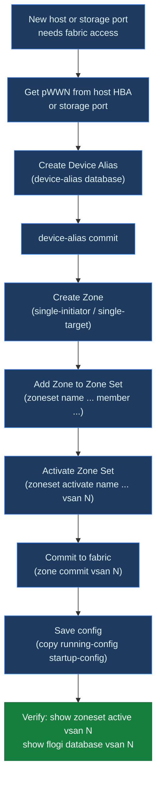

# MDS — Procedures

> Part of the [Cisco MDS](../../index.md) reference.

---

## Change Readiness

- [ ] Configuration backup taken: `show running-config` output saved to jump host
- [ ] Both fabrics (Fabric A and Fabric B) are healthy before touching either
- [ ] VSAN configuration documented: all VSANs, membership, and active zonesets recorded
- [ ] Zoning change reviewed and approved — peer review of zone diff completed
- [ ] `show flogi database` baselined: full list of logins captured before change
- [ ] Maintenance window approved and communicated to affected storage and compute teams
- [ ] Rollback plan confirmed: procedure to restore zone config or revert VSAN change documented

| Item | Status | Notes |
|---|---|---|
| Running config backup | | `show running-config` to jump host |
| Both fabrics healthy | | `show interface brief` on all switches |
| VSAN config documented | | VSAN-to-port mapping recorded |
| Zone diff peer-reviewed | | Ticket reference |
| Change window approved | | Ticket reference |

---

## Maintenance Window

1. Confirm both fabrics are healthy: `show interface brief` and `show flogi database` on all switches
2. Take configuration backup: `copy running-config startup-config` and save `show running-config` to jump host
3. Notify storage and compute teams that Fabric A (or B) will be affected
4. Perform the change on one fabric only — leave the other fabric carrying full host I/O
5. After change, run `show interface brief`, `show flogi database`, and `show zoneset active vsan all` to confirm state
6. Validate host multipath paths are still active via host-side tools
7. Review `show logging last 50` for any errors introduced by the change
8. Repeat procedure on second fabric only after first fabric is fully validated and hosts confirmed healthy

---

## Post-Change Validation

- [ ] All FC interfaces back in connected/up state: `show interface brief`
- [ ] FLOGI database complete — all hosts and storage logged in: `show flogi database`
- [ ] Active zoneset matches expected post-change config: `show zoneset active vsan all`
- [ ] No new error or critical syslog entries since change: `show logging last 50`
- [ ] Environment still healthy — no new hardware alerts: `show environment`
- [ ] Running config saved to startup config: `copy running-config startup-config`
- [ ] Host multipath paths active and balanced (confirmed via host-side tool)
- [ ] Close change ticket with validation evidence attached

---

## Zoning

### Zone Provisioning Workflow



### VSAN and Zone Model

```text
  MDS Switch (VSAN 10 — Fabric A)
  ┌─────────────────────────────────────────────────────────────────────────┐
  │  Active Zone Set: dc1-fabA-prod                                         │
  │                                                                         │
  │  ┌──────────────────────────────────────────────────────────────────┐   │
  │  │  Zone: esxi01_hba0__fa01_ct0_p0                                  │   │
  │  │  Device Alias: esxi01_hba0  pWWN 10:00:00:...  (initiator)       │   │
  │  │  Device Alias: fa01_ct0_p0  pWWN 52:4a:93:...  (target)          │   │
  │  └──────────────────────────────────────────────────────────────────┘   │
  │                                                                         │
  │  ┌──────────────────────────────────────────────────────────────────┐   │
  │  │  Zone: esxi01_hba1__fa01_ct1_p0  ← separate zone for Fabric B    │   │
  │  │  Device Alias: esxi01_hba1  pWWN 10:00:00:...                    │   │
  │  │  Device Alias: fa01_ct1_p0  pWWN 52:4a:93:...                    │   │
  │  └──────────────────────────────────────────────────────────────────┘   │
  │                                                                         │
  │  Enhanced zoning: default-deny — non-zoned devices cannot communicate   │
  └─────────────────────────────────────────────────────────────────────────┘
```

### Zoning Rules

| Rule | Reason |
|---|---|
| Single-initiator zoning — one HBA per zone | Limits blast radius; prevents cross-host visibility |
| Use device aliases (pWWN-based) | FC IDs (FCID) change on login; pWWN is permanent |
| Always set VSAN context before zoning | Zones are VSAN-local — wrong VSAN = invisible config |
| Activate with `zoneset activate` | Ensures zone set propagates to all switches in fabric |
| Commit and save after every change | `zone commit vsan <n>` + `copy run start` |

### Naming Convention

```text
  Device alias:  <hostname>_<hbaN>              e.g.  esxi01_hba0
  Device alias:  <array>_<ctrl>_<portN>         e.g.  fa01_ct0_p0
  Zone:          <host-alias>__<array-alias>    e.g.  esxi01_hba0__fa01_ct0_p0
  Zone set:      <sitecode>-<fabric>-prod       e.g.  dc1-fabA-prod
```

### View Current State

```text
switch# show zoneset active vsan 10
switch# show zone vsan 10
switch# show device-alias database
switch# show fcns database vsan 10
switch# show flogi database vsan 10
switch# show zone status vsan 10
```

### Device Aliases

```text
switch# device-alias database
switch(config-device-alias-db)# device-alias name esxi01_hba0 pwwn 10:00:00:90:fa:12:34:56
switch(config-device-alias-db)# device-alias name fa01_ct0_p0 pwwn 52:4a:93:7c:00:00:00:01
switch(config-device-alias-db)# device-alias name fa01_ct0_p1 pwwn 52:4a:93:7c:00:00:00:02
switch(config-device-alias-db)# exit
switch# device-alias commit
```

### Create and Manage Zones

```bash
# Create zone and add members
switch# zone name esxi01_hba0__fa01_ct0_p0 vsan 10
switch(config-zone)# member device-alias esxi01_hba0
switch(config-zone)# member device-alias fa01_ct0_p0
switch(config-zone)# member device-alias fa01_ct0_p1
switch(config-zone)# exit

# Remove a member
switch# zone name esxi01_hba0__fa01_ct0_p0 vsan 10
switch(config-zone)# no member device-alias fa01_ct0_p1
switch(config-zone)# exit
```

### Zone Set Management

```bash
# Create zone set and add zones
switch# zoneset name dc1-fabA-prod vsan 10
switch(config-zoneset)# member esxi01_hba0__fa01_ct0_p0
switch(config-zoneset)# member esxi01_hba1__fa01_ct1_p0
switch(config-zoneset)# exit

# Activate zone set
switch# zoneset activate name dc1-fabA-prod vsan 10

# Commit to fabric and save
switch# zone commit vsan 10
switch# copy running-config startup-config
```

### Enhanced Zoning (recommended)

```bash
# Enable enhanced zoning — default-deny for non-zoned devices
switch# zone mode enhanced vsan 10

# Confirm
switch# show zone status vsan 10
# Mode: Enhanced
```

### Example: Zone a New Host to FlashArray

```bash
# 1. Add device aliases
switch# device-alias database
switch(config-device-alias-db)# device-alias name web01_hba0 pwwn 10:00:00:90:fa:ab:cd:ef
switch(config-device-alias-db)# device-alias name web01_hba1 pwwn 10:00:00:90:fa:ab:cd:f0
switch(config-device-alias-db)# exit
switch# device-alias commit

# 2. Create zone (Fabric A — VSAN 10)
switch# zone name web01_hba0__fa01_ct0_p0 vsan 10
switch(config-zone)# member device-alias web01_hba0
switch(config-zone)# member device-alias fa01_ct0_p0
switch(config-zone)# exit

# 3. Add to active zone set
switch# zoneset name dc1-fabA-prod vsan 10
switch(config-zoneset)# member web01_hba0__fa01_ct0_p0
switch(config-zoneset)# exit

# 4. Activate and save
switch# zoneset activate name dc1-fabA-prod vsan 10
switch# zone commit vsan 10
switch# copy running-config startup-config

# Repeat on Fabric B switch / VSAN for HBA1
```

### VSAN Membership

```bash
# Show which ports are in a VSAN
switch# show vsan 10 membership

# Assign a port to a VSAN
switch# vsan database
switch(config-vsan-db)# vsan 10 interface fc1/5
switch(config-vsan-db)# exit
switch# copy running-config startup-config
```

### Zone Troubleshooting

| Symptom | Command | Action |
|---|---|---|
| Host HBA not logged in | `show flogi database vsan 10` | Check cable, SFP, port state; check VSAN assignment |
| Host can't see storage | `show zone name <zone> vsan 10` | Confirm alias pWWNs are correct; zone set active |
| Zone set not active | `show zoneset active vsan 10` | Run `zoneset activate name <zset> vsan <n>` |
| Device alias commit fails | `show device-alias status` | Resolve conflicts; check for duplicate aliases |
| Changes not persisted | `show startup-config \| include zone` | Run `copy running-config startup-config` |
| Two hosts in same zone | `show zone vsan 10` | Split into single-initiator zones |

### Zone Audit

```bash
# List all zones in VSAN — review for multi-initiator zones
switch# show zone vsan 10

# Check what a specific device can reach
switch# show zone member pwwn 10:00:00:90:fa:12:34:56 vsan 10

# Show fabric name server — all visible devices
switch# show fcns database vsan 10

# Diff running vs active zone set (catch uncommitted changes)
switch# show zone vsan 10
switch# show zoneset active vsan 10
```
