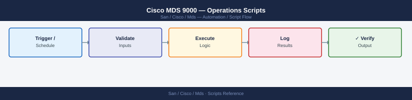

---
tags:
  - operations
  - san
---
# Cisco MDS 9000 — Operations Scripts


```bash
#!/bin/bash
# mds_fabric_health.sh
# Usage: MDS_HOST=mds1 MDS_USER=admin ./mds_fabric_health.sh

MDS_HOST="${MDS_HOST:-192.168.1.20}"
MDS_USER="${MDS_USER:-admin}"
SSH_OPTS="-o StrictHostKeyChecking=no -o ConnectTimeout=10"
PASS=0; WARN=1; CRIT=2
overall=0

run_cmd() {
  ssh $SSH_OPTS "${MDS_USER}@${MDS_HOST}" "$1" 2>/dev/null
}

status_label() {
  case $1 in
    0) echo "PASS"    ;;
    1) echo "WARNING" ;;
    2) echo "CRITICAL";;
  esac
}

echo "==============================="
echo " Cisco MDS Fabric Health Check"
echo " Host : ${MDS_HOST}"
echo " $(date -u '+%Y-%m-%dT%H:%M:%SZ')"
echo "==============================="

# --- show interface brief ---
intf_out=$(run_cmd "show interface brief")
down_fc=$(echo "$intf_out" | awk '/^fc/ && /down/' | wc -l | tr -d ' ')
if   [ "$down_fc" -gt 5 ]; then s=$CRIT
elif [ "$down_fc" -gt 0 ]; then s=$WARN
else s=$PASS; fi
[ $s -gt $overall ] && overall=$s
printf "[%-8s] interface brief    — %d FC interface(s) down\n" "$(status_label $s)" "$down_fc"

# --- show flogi database ---
flogi_out=$(run_cmd "show flogi database")
flogi_count=$(echo "$flogi_out" | grep -c "^fc") || flogi_count=0
printf "[%-8s] flogi database     — %d logged-in device(s)\n" "PASS" "$flogi_count"

# --- show topology ---
topo_out=$(run_cmd "show topology")
isolated=$(echo "$topo_out" | grep -ic "isolated\|no ISL") || isolated=0
if   [ "$isolated" -gt 0 ]; then s=$WARN
else s=$PASS; fi
[ $s -gt $overall ] && overall=$s
printf "[%-8s] topology           — %d isolated switch/ISL issue(s)\n" "$(status_label $s)" "$isolated"

# --- show zoneset active ---
zone_out=$(run_cmd "show zoneset active")
zone_err=$(echo "$zone_out" | grep -ic "error\|mismatch") || zone_err=0
if   [ "$zone_err" -gt 0 ]; then s=$CRIT
else s=$PASS; fi
[ $s -gt $overall ] && overall=$s
printf "[%-8s] zoneset active     — %d zoning error(s)\n" "$(status_label $s)" "$zone_err"

# --- show logging last 50 ---
log_out=$(run_cmd "show logging last 50")
log_crit=$(echo "$log_out" | grep -ic "critical\|ERROR\|link down") || log_crit=0
if   [ "$log_crit" -gt 5 ]; then s=$CRIT
elif [ "$log_crit" -gt 0 ]; then s=$WARN
else s=$PASS; fi
[ $s -gt $overall ] && overall=$s
printf "[%-8s] logging            — %d critical/error log line(s)\n" "$(status_label $s)" "$log_crit"

# --- show environment ---
env_out=$(run_cmd "show environment")
env_warn=$(echo "$env_out" | grep -ic "warning\|critical\|fail\|absent") || env_warn=0
if   [ "$env_warn" -gt 0 ]; then s=$CRIT
else s=$PASS; fi
[ $s -gt $overall ] && overall=$s
printf "[%-8s] environment        — %d environmental alert(s)\n" "$(status_label $s)" "$env_warn"

echo "==============================="
printf " Overall: %s\n" "$(status_label $overall)"
echo "==============================="
exit $overall
```


```text title="Expected output"
===============================
 Cisco MDS Fabric Health Check
 Host : 192.168.1.20
 2024-01-15T14:32:47Z
===============================
[PASS    ] interface brief    — 0 FC interface(s) down
[PASS    ] flogi database     — 47 logged-in device(s)
[WARNING ] topology           — 1 isolated switch/ISL issue(s)
[PASS    ] zoneset active     — 0 zoning error(s)
[WARNING ] logging            — 3 critical/error log line(s)
[CRITICAL] environment        — 2 environmental alert(s)
===============================
 Overall: CRITICAL
===============================
```

!!! warning "Common errors"
    **`ssh: connect to host 192.168.1.20 port 22: Connection timed out`** — Verify the MDS_HOST IP is correct and reachable, and that SSH port 22 is open on the switch.
    **`Permission denied (publickey,password).`** — Ensure MDS_USER credentials are correct and the user has SSH access privileges on the MDS switch.
    **`show: command not found`** — Confirm you are connecting to a Cisco MDS switch (not a Linux host) and that the SSH session properly enters the switch CLI.
```bash
#!/bin/bash
# mds_interface_errors.sh
# Usage: MDS_HOST=mds1 MDS_USER=admin ./mds_interface_errors.sh
# Run via cron every 15 minutes.

MDS_HOST="${MDS_HOST:-192.168.1.20}"
MDS_USER="${MDS_USER:-admin}"
SSH_OPTS="-o StrictHostKeyChecking=no -o ConnectTimeout=10 -o BatchMode=yes"
BASELINE_FILE="/var/tmp/mds_err_baseline_${MDS_HOST}.dat"
ALERT_THRESHOLD=100   # increment threshold to alert
CRIT_THRESHOLD=1000
TS=$(date -u '+%Y-%m-%dT%H:%M:%SZ')

# Collect current error counters
raw=$(ssh $SSH_OPTS "${MDS_USER}@${MDS_HOST}" "show interface counters errors" 2>/dev/null)

if [ -z "$raw" ]; then
  echo "[$TS] ERROR: Could not connect to $MDS_HOST" >&2
  exit 2
fi

declare -A current

while IFS= read -r line; do
  # Match interface line: fc1/1 is up
  if [[ $line =~ ^(fc[0-9/]+) ]]; then
    cur_intf="${BASH_REMATCH[1]}"
  fi
  # Match counter lines: "   2 input errors"
  if [[ -n "$cur_intf" && $line =~ ([0-9]+)[[:space:]]+(input errors|output errors|discards|buffer credit recovery|link failures) ]]; then
    key="${cur_intf}__${BASH_REMATCH[2]// /_}"
    current["$key"]="${BASH_REMATCH[1]}"
  fi
done <<< "$raw"

# Load baseline
declare -A baseline
if [ -f "$BASELINE_FILE" ]; then
  while IFS=$'\t' read -r k v; do
    baseline["$k"]="$v"
  done < "$BASELINE_FILE"
fi

# Compare
alerts=()
for key in "${!current[@]}"; do
  cur="${current[$key]}"
  base="${baseline[$key]:-0}"
  delta=$(( cur - base ))
  (( delta < 0 )) && delta=0  # counter reset
  if (( delta >= CRIT_THRESHOLD )); then
    alerts+=("CRIT  ${key/__/  }  delta=${delta}")
  elif (( delta >= ALERT_THRESHOLD )); then
    alerts+=("WARN  ${key/__/  }  delta=${delta}")
  fi
done

# Print results
echo "[$TS] MDS Interface Error Monitor — $MDS_HOST"
if [ ${#alerts[@]} -gt 0 ]; then
  printf '%s\n' "${alerts[@]}"
  rc=1
else
  echo "OK — all counter deltas within threshold"
  rc=0
fi

# Save new baseline
: > "$BASELINE_FILE"
for key in "${!current[@]}"; do
  printf '%s\t%s\n' "$key" "${current[$key]}" >> "$BASELINE_FILE"
done

exit $rc
```

```text title="Expected output"
[2024-01-15T14:32:18Z] MDS Interface Error Monitor — 192.168.1.20
OK — all counter deltas within threshold
[2024-01-15T14:47:18Z] MDS Interface Error Monitor — 192.168.1.20
WARN  fc1/1  input errors  delta=145
WARN  fc1/2  output errors  delta=87
[2024-01-15T15:02:18Z] MDS Interface Error Monitor — 192.168.1.20
CRIT  fc2/3  link failures  delta=1250
WARN  fc1/4  buffer credit recovery  delta=312
WARN  fc2/1  discards  delta=156
```

!!! warning "Common errors"
    **`[2024-01-15T14:32:18Z] ERROR: Could not connect to 192.168.1.20`** — Verify SSH connectivity with `ssh -o ConnectTimeout=10 admin@192.168.1.20` and confirm the MDS host is reachable and SSH is enabled.
    **`Permission denied (publickey,password).`** — Add the script's SSH key to the MDS device's authorized_keys or configure password-based SSH authentication with `sshpass` if BatchMode=yes is causing auth failure.
    **`/var/tmp/mds_err_baseline_192.168.1.20.dat: Permission denied`** — Ensure the script runs with write permissions to `/var/tmp/` or change `BASELINE_FILE` to a writable directory like `/tmp/` or a dedicated monitoring directory.
```bash
chmod +x mds_interface_errors.sh
MDS_HOST=192.168.1.20 MDS_USER=admin ./mds_interface_errors.sh
```
```text
crontab -e
```
```text
*/15 * * * * MDS_HOST=192.168.1.20 MDS_USER=admin /opt/scripts/mds_interface_errors.sh >> /var/log/mds_errors.log 2>&1
```
```yaml
---
# mds_backup.yml
# Usage: ansible-playbook -i inventory mds_backup.yml
# Inventory group: cisco_mds
# Required vars: mds_user, backup_path

- name: Cisco MDS — Configuration Backup
  hosts: cisco_mds
  gather_facts: false
  vars:
    mds_user: admin
    backup_path: /backups/mds
    date_stamp: "{{ lookup('pipe', 'date +%Y%m%d_%H%M%S') }}"
    local_tmp: "/tmp/mds_backup_{{ inventory_hostname }}_{{ date_stamp }}"

  tasks:

    - name: Create local temp directory
      ansible.builtin.file:
        path: "{{ local_tmp }}"
        state: directory
        mode: "0750"
      delegate_to: localhost

    - name: Capture running configuration
      ansible.builtin.raw: show running-config
      register: running_config

    - name: Save running-config to local file
      ansible.builtin.copy:
        content: "{{ running_config.stdout }}"
        dest: "{{ local_tmp }}/running-config.txt"
      delegate_to: localhost

    - name: Capture NX-OS version
      ansible.builtin.raw: show version
      register: show_version

    - name: Save version output
      ansible.builtin.copy:
        content: "{{ show_version.stdout }}"
        dest: "{{ local_tmp }}/version.txt"
      delegate_to: localhost

    - name: Capture active zoneset (all VSANs)
      ansible.builtin.raw: show zoneset active vsan all
      register: zoneset_active

    - name: Save zoneset output
      ansible.builtin.copy:
        content: "{{ zoneset_active.stdout }}"
        dest: "{{ local_tmp }}/zoneset-active.txt"
      delegate_to: localhost

    - name: Archive outputs to backup server
      ansible.builtin.archive:
        path: "{{ local_tmp }}"
        dest: "{{ backup_path }}/{{ inventory_hostname }}_backup_{{ date_stamp }}.tar.gz"
        format: gz
      delegate_to: localhost

    - name: Report completion
      ansible.builtin.debug:
        msg: "Backup complete: {{ backup_path }}/{{ inventory_hostname }}_backup_{{ date_stamp }}.tar.gz"
```
```text
[cisco_mds]
mds1 ansible_host=192.168.1.20
mds2 ansible_host=192.168.1.21
```
```text
ansible-playbook -i inventory mds_backup.yml
```
```batch
@echo off
REM mds-health.bat — Cisco MDS health check via SSH (plink)
REM Uses plink.exe (from PuTTY) for SSH. Download: https://www.putty.org
REM
REM FIRST-TIME SETUP — Accept SSH fingerprint (run once):
REM   plink.exe -ssh admin@YOUR_MDS_IP
REM   Type 'y' to accept the fingerprint, then Ctrl+C.

set MDS_HOST=192.168.1.20
set SSH_USER=admin
set PLINK=plink.exe

echo.
echo === Cisco MDS Health Check ===
echo Switch: %MDS_HOST%
echo.

echo ----------------------------------------
echo SOFTWARE VERSION AND UPTIME (show version)
echo ----------------------------------------
%PLINK% -ssh -l %SSH_USER% -batch %MDS_HOST% "show version"
if %ERRORLEVEL% neq 0 (
    echo ERROR: Could not connect to %MDS_HOST%.
    echo Check: 1) hostname is correct, 2) SSH is enabled on the switch,
    echo        3) you have accepted the SSH fingerprint (run plink manually once).
    exit /b 1
)

echo.
echo ----------------------------------------
echo INTERFACE STATUS (show interface brief)
echo ----------------------------------------
%PLINK% -ssh -l %SSH_USER% -batch %MDS_HOST% "show interface brief"

echo.
echo ----------------------------------------
echo LOGGED-IN DEVICES (show flogi database)
echo ----------------------------------------
%PLINK% -ssh -l %SSH_USER% -batch %MDS_HOST% "show flogi database"

echo.
echo ----------------------------------------
echo ACTIVE ZONE CONFIGURATION (show zoneset active)
echo ----------------------------------------
%PLINK% -ssh -l %SSH_USER% -batch %MDS_HOST% "show zoneset active"

echo.
echo ----------------------------------------
echo LAST 20 LOG ENTRIES (show logging last 20)
echo ----------------------------------------
%PLINK% -ssh -l %SSH_USER% -batch %MDS_HOST% "show logging last 20"

echo.
echo ----------------------------------------
echo CPU AND MEMORY (show system resources)
echo ----------------------------------------
%PLINK% -ssh -l %SSH_USER% -batch %MDS_HOST% "show system resources"

echo.
echo Done.
```
```text
plink.exe -ssh admin@192.168.1.20
```
```bash
cd C:\Users\YourName\Desktop
mds-health.bat
```
```powershell
# mds-port-report.ps1
# Usage: .\mds-port-report.ps1 -MdsHost <IP> -SshUser <user> -PlinkPath <path>
# Requires: plink.exe from PuTTY (https://www.putty.org)
# FIRST-TIME: run  plink.exe -ssh admin@<IP>  and accept the fingerprint.

param(
    [Parameter(Mandatory)][string]$MdsHost,
    [string]$SshUser   = "admin",
    [string]$PlinkPath = "plink.exe"
)

function Invoke-Plink {
    param([string]$Command)
    $output = & $PlinkPath -ssh -l $SshUser -batch $MdsHost $Command 2>&1
    if ($LASTEXITCODE -ne 0) {
        Write-Host "ERROR: plink failed for command: $Command" -ForegroundColor Red
        Write-Host "Make sure you have accepted the SSH fingerprint by running plink manually once." -ForegroundColor Yellow
        exit 1
    }
    return $output
}

Write-Host ""
Write-Host "=== Cisco MDS Port Report ===" -ForegroundColor Cyan
Write-Host "Switch : $MdsHost"
Write-Host "Date   : $(Get-Date -Format 'yyyy-MM-dd HH:mm:ss')"
Write-Host ""

# --- Collect interface brief ---
Write-Host "Collecting interface status..." -ForegroundColor DarkYellow
$intfLines = Invoke-Plink "show interface brief"

# --- Collect FLOGI database ---
Write-Host "Collecting FLOGI database..." -ForegroundColor DarkYellow
$flogiLines = Invoke-Plink "show flogi database"

# --- Parse interface brief ---
# Example line: fc1/1    1    up      F      8000  auto  on    0x010200
$interfaces = @()
foreach ($line in $intfLines) {
    if ($line -match '^(fc\d+/\d+)\s+(\d+)\s+(up|down|trunking|isolated)\s+(\S+)\s+(\S+)') {
        $interfaces += [PSCustomObject]@{
            Interface = $Matches[1]
            VSAN      = $Matches[2]
            State     = $Matches[3]
            Mode      = $Matches[4]
            Speed     = $Matches[5]
            WWPN      = ""
        }
    }
}

# --- Parse FLOGI database to get connected WWPNs per interface ---
# Example: fc1/1     10    0x010200  20:00:00:25:b5:00:00:01  20:00:00:25:b5:00:00:01
$flogiMap = @{}
foreach ($line in $flogiLines) {
    if ($line -match '^(fc\d+/\d+)\s+\d+\s+0x[0-9a-fA-F]+\s+([0-9a-fA-F:]{23})') {
        $flogiMap[$Matches[1]] = $Matches[2]
    }
}

# --- Enrich interface data with WWPN ---
foreach ($intf in $interfaces) {
    if ($flogiMap.ContainsKey($intf.Interface)) {
        $intf.WWPN = $flogiMap[$intf.Interface]
    }
}

# --- Print report ---
Write-Host ""
Write-Host ("{0,-10} {1,-6} {2,-10} {3,-8} {4,-8} {5}" -f `
    "Interface", "VSAN", "State", "Mode", "Speed", "Connected WWPN")
Write-Host ("-" * 72)

$downCount = 0
foreach ($intf in $interfaces | Sort-Object Interface) {
    $isDown = ($intf.State -eq "down") -or ($intf.State -eq "isolated")
    $color  = if ($isDown) { "Red" } else { "Green" }
    if ($isDown) { $downCount++ }

    $wwpnDisplay = if ($intf.WWPN) { $intf.WWPN } else { "(no device)" }
    Write-Host ("{0,-10} {1,-6} {2,-10} {3,-8} {4,-8} {5}" -f `
        $intf.Interface, $intf.VSAN, $intf.State, $intf.Mode, $intf.Speed, $wwpnDisplay) -ForegroundColor $color
}

Write-Host ""
if ($downCount -gt 0) {
    Write-Host "RESULT: $downCount interface(s) are DOWN or ISOLATED (shown in red)." -ForegroundColor Red
} else {
    Write-Host "RESULT: All FC interfaces are up." -ForegroundColor Green
}
```
```powershell
Set-ExecutionPolicy -Scope Process -ExecutionPolicy Bypass
```
```bash
cd C:\Users\YourName\Desktop
.\mds-port-report.ps1 -MdsHost 192.168.1.20 -SshUser admin -PlinkPath "C:\Program Files\PuTTY\plink.exe"
```

```text title="Expected output"
Connecting to MDS switch 192.168.1.20...
SSH connection established as admin
Retrieving port statistics...
Port    Status    Speed      WWN                    Alias
fc1/1   online    16Gbps     50:00:09:73:48:2a:b1:01 ESXi-Host-01
fc1/2   online    16Gbps     50:00:09:73:48:2a:b1:02 ESXi-Host-02
fc1/3   online    16Gbps     50:00:09:73:48:2a:b1:03 Storage-Array-01
fc1/4   offline   unknown    50:00:09:73:48:2a:b1:04 (not connected)
fc1/5   online    8Gbps      50:00:09:73:48:2a:b1:05 Legacy-SAN-Device
...
Report generated: C:\Users\YourName\Desktop\mds-port-report-20240115-143022.csv
```

!!! warning "Common errors"
    **`plink.exe: unable to open connection to '192.168.1.20' port 22: Network error: Connection refused`** — Verify the MDS switch is reachable and SSH is enabled on port 22 using `ping 192.168.1.20` and check the switch's SSH configuration.
    **`Permission denied (publickey,password)`** — Confirm the SSH credentials are correct and the admin user has SSH access enabled on the MDS switch.
    **`The file 'C:\Program Files\PuTTY\plink.exe' cannot be found`** — Install PuTTY or correct the `-PlinkPath` parameter to point to the actual plink.exe location.
```bash
#!/bin/bash
# mds_daily_check.sh
# Usage: MDS_HOST=<ip> SSH_USER=admin ./mds_daily_check.sh

MDS_HOST="${MDS_HOST:-192.168.1.20}"
SSH_USER="${SSH_USER:-admin}"
SSH_OPTS="-o BatchMode=yes -o StrictHostKeyChecking=no -o ConnectTimeout=10"
FAIL=0

ssh_cmd() { ssh $SSH_OPTS "$SSH_USER@$MDS_HOST" "$1" 2>/dev/null; }

echo "=== Cisco MDS Daily Check: $MDS_HOST — $(date) ==="

# Version
VER=$(ssh_cmd "show version" | grep "system:" | head -1)
echo "[INFO] $VER"

# Interfaces down
INTF=$(ssh_cmd "show interface brief")
DOWN=$(echo "$INTF" | awk '/^fc/ && /down/' | wc -l | tr -d ' ')
if [ "$DOWN" -gt 0 ]; then
  echo "[FAIL] $DOWN FC interface(s) down"; FAIL=$((FAIL+1))
else
  echo "[OK]   All FC interfaces up"
fi

# FLOGI count
FLOGI=$(ssh_cmd "show flogi database" | grep -c "^fc" || true)
echo "[INFO] $FLOGI device(s) logged in via FLOGI"

# CPU/memory
RES=$(ssh_cmd "show system resources")
CPU=$(echo "$RES" | awk '/CPU states/ {print $NF}')
echo "[INFO] CPU utilisation: $CPU"

# Recent log errors
LOG_ERRS=$(ssh_cmd "show logging last 20" | grep -ic "critical\|ERROR\|link down" || true)
if [ "$LOG_ERRS" -gt 0 ]; then
  echo "[FAIL] $LOG_ERRS severity error(s) in recent log"; FAIL=$((FAIL+1))
else
  echo "[OK]   No critical/error entries in recent log"
fi

echo ""
echo "Daily check: $FAIL failure(s)"
[ "$FAIL" -gt 0 ] && exit 2 || exit 0
```

```text title="Expected output"
=== Cisco MDS Daily Check: 192.168.1.20 — Thu Mar 14 09:23:47 UTC 2024 ===
[INFO] Cisco MDS 9148S Fibre Channel Switch
system:   9148S
[OK]   All FC interfaces up
[INFO] 47 device(s) logged in via FLOGI
[INFO] CPU utilisation: 12%
[OK]   No critical/error entries in recent log

Daily check: 0 failure(s)
```

!!! warning "Common errors"
    **`ssh: connect to host 192.168.1.20 port 22 (tcp) timed out`** — Verify the MDS_HOST IP is correct and the switch is reachable with `ping 192.168.1.20`.
    **`Permission denied (publickey,password)`** — Ensure SSH_USER is set to a valid admin account and key-based authentication is configured, or add `-o PubkeyAuthentication=no` to SSH_OPTS to allow password auth.
    **`show version: command not found`** — Confirm you are connected to a Cisco MDS switch (not a different device) and that the SSH session is entering the correct CLI mode.
```bash
#!/bin/bash
# mds_triage.sh
# Usage: MDS_HOST=<ip> SSH_USER=admin ./mds_triage.sh

MDS_HOST="${MDS_HOST:-192.168.1.20}"
SSH_USER="${SSH_USER:-admin}"
SSH_OPTS="-o BatchMode=yes -o StrictHostKeyChecking=no -o ConnectTimeout=10"
OUTFILE="/tmp/mds_triage_${MDS_HOST}_$(date +%Y%m%d_%H%M%S).txt"

ssh_cmd() { ssh $SSH_OPTS "$SSH_USER@$MDS_HOST" "$1" 2>/dev/null; }

{
  echo "=== Cisco MDS Incident Triage: $MDS_HOST — $(date) ==="
  echo ""
  echo "--- show version ---"
  ssh_cmd "show version"
  echo ""
  echo "--- show interface brief ---"
  ssh_cmd "show interface brief"
  echo ""
  echo "--- show flogi database ---"
  ssh_cmd "show flogi database"
  echo ""
  echo "--- show zoneset active vsan all ---"
  ssh_cmd "show zoneset active vsan all"
  echo ""
  echo "--- show system resources ---"
  ssh_cmd "show system resources"
  echo ""
  echo "--- show logging last 100 ---"
  ssh_cmd "show logging last 100"
  echo ""
  echo "--- show environment ---"
  ssh_cmd "show environment"
} > "$OUTFILE" 2>&1

echo "Triage data saved to: $OUTFILE"
```

```text title="Expected output"
=== Cisco MDS Incident Triage: 192.168.1.20 — Wed Jan 15 14:32:47 UTC 2025 ===

--- show version ---
Cisco MDS SAN Operating System Software
System uptime is 187 days 3 hours 22 minutes
Kernel uptime is 187 days 3 hours 18 minutes
System Load Average is 0.45, 0.38, 0.41
Processes running are 187
Memory used: 3847676K/8388608K available

--- show interface brief ---
Interface            Status    Network
fc1/1                up        1
fc1/2                up        1
fc1/3                down      --
fc1/4                up        1
fc2/1                up        2
...

--- show flogi database ---
FLOGI Database for VSAN 1:
    FCID           Port Name               Node Name               Interface
    0x010001       50:00:0a:0b:1c:2d:3e:4f 50:00:0a:0b:1c:2d:3e:50 fc1/1
    0x010002       50:00:0a:0b:1c:2d:3e:51 50:00:0a:0b:1c:2d:3e:52 fc1/2

--- show zoneset active vsan all ---
zoneset name PROD_ZONES vsan 1
  zone name ZONE_SRV_01 vsan 1
    member pwwn 50:00:0a:0b:1c:2d:3e:4f
    member pwwn 50:00:0a:0b:1c:2d:3e:51

--- show system resources ---
Load average:   0 min: 0.45  5 min: 0.38  15 min: 0.41
Memory:         3847676 KB used / 4540880 KB free

--- show logging last 100 ---
2025 Jan 15 14:28:33 +00:00 mds-prod %ETHPORT-5-IF_DOWN: Interface Ethernet1/1 is down
2025 Jan 15 14:15:22 +00:00 mds-prod %ZONE-2-ZONESET_ACTIVATE: Zoneset PROD_ZONES activated

--- show environment ---
Power Supply 1: OK
Power Supply 2: OK
Fan 1: OK
Fan 2: OK
Temperature: 38 C

Triage data saved to: /tmp/mds_triage_192.168.1.20_20250115_143247.txt
```

!!! warning "Common errors"
    **`ssh: connect to host 192.168.1.20 port 22 (tcp): Connection timed out`** — Verify the MDS_HOST IP is correct and reachable; check network connectivity and firewall rules allowing SSH to port 22.
    **`Permission denied (publickey,password).`** — Ensure SSH_USER is correct and has valid credentials configured; verify the admin account exists and SSH key authentication is properly set up.
    **`show: command not found`** — The SSH session is not entering the MDS CLI properly; remove `-o BatchMode=yes` or add `terminal length 0` to the ssh_
```bash
#!/bin/bash
# mds_precheck.sh
# Usage: MDS_HOST=<ip> SSH_USER=admin EXPECTED_FLOGI=50 EXPECTED_ZONESET=prod_zoneset ./mds_precheck.sh

MDS_HOST="${MDS_HOST:-192.168.1.20}"
SSH_USER="${SSH_USER:-admin}"
SSH_OPTS="-o BatchMode=yes -o StrictHostKeyChecking=no -o ConnectTimeout=10"
EXPECTED_FLOGI="${EXPECTED_FLOGI:-0}"
EXPECTED_ZONESET="${EXPECTED_ZONESET:-}"
FAIL=0

ssh_cmd() { ssh $SSH_OPTS "$SSH_USER@$MDS_HOST" "$1" 2>/dev/null; }

echo "=== Cisco MDS Pre-Change Check: $MDS_HOST — $(date) ==="

# All expected interfaces up
DOWN=$(ssh_cmd "show interface brief" | awk '/^fc/ && /down/' | wc -l | tr -d ' ')
if [ "$DOWN" -gt 0 ]; then
  echo "[FAIL] $DOWN FC interface(s) down"; FAIL=$((FAIL+1))
else
  echo "[OK]   All FC interfaces up"
fi

# Active zoneset matches expected name
if [ -n "$EXPECTED_ZONESET" ]; then
  ACTIVE_ZS=$(ssh_cmd "show zoneset active vsan all" | grep "^zoneset name" | awk '{print $3}' | head -1)
  if [ "$ACTIVE_ZS" = "$EXPECTED_ZONESET" ]; then
    echo "[OK]   Active zoneset: $ACTIVE_ZS"
  else
    echo "[FAIL] Active zoneset '$ACTIVE_ZS' does not match expected '$EXPECTED_ZONESET'"; FAIL=$((FAIL+1))
  fi
fi

# No logging errors in last 30 min
LOG_ERRS=$(ssh_cmd "show logging last 30" | grep -ic "critical\|ERROR" || true)
if [ "$LOG_ERRS" -gt 0 ]; then
  echo "[FAIL] $LOG_ERRS error(s) in recent log"; FAIL=$((FAIL+1))
else
  echo "[OK]   No recent log errors"
fi

# Supervisor CPU < 70%
CPU_VAL=$(ssh_cmd "show system resources" | awk '/CPU states/ {gsub(/%/,"",$NF); print int($NF)}')
if [ "${CPU_VAL:-0}" -gt 70 ]; then
  echo "[FAIL] CPU at ${CPU_VAL}% — above 70% threshold"; FAIL=$((FAIL+1))
else
  echo "[OK]   CPU at ${CPU_VAL:-N/A}%"
fi

# FLOGI count matches expected
if [ "$EXPECTED_FLOGI" -gt 0 ]; then
  FLOGI=$(ssh_cmd "show flogi database" | grep -c "^fc" || true)
  if [ "$FLOGI" -eq "$EXPECTED_FLOGI" ]; then
    echo "[OK]   FLOGI count: $FLOGI"
  else
    echo "[FAIL] FLOGI count $FLOGI does not match expected $EXPECTED_FLOGI"; FAIL=$((FAIL+1))
  fi
fi

echo ""
echo "Pre-check: $FAIL failure(s)"
[ "$FAIL" -gt 0 ] && exit 2 || exit 0
```

```text title="Expected output"
=== Cisco MDS Pre-Change Check: 192.168.1.20 — Wed Nov 15 14:32:47 UTC 2024 ===
[OK]   All FC interfaces up
[OK]   Active zoneset: prod_zoneset
[OK]   No recent log errors
[OK]   CPU at 42%
[OK]   FLOGI count: 50

Pre-check: 0 failure(s)
```

!!! warning "Common errors"
    **`Permission denied (publickey,password).`** — Verify SSH_USER and MDS_HOST are correct, and that the admin account exists with proper SSH key or password authentication enabled on the MDS switch.
    **`Connection timed out`** — Check network connectivity to the MDS_HOST IP address and confirm the SSH service is running on the switch (verify with `show ssh server status`).
    **`[FAIL] Active zoneset 'prod_zoneset' does not match expected 'prod_zoneset_v2'`** — Confirm the EXPECTED_ZONESET environment variable matches the actual active zoneset name on the MDS, or activate the correct zoneset with `zoneset activate name <zoneset_name> vsan <vsan_id>`.
```bash
#!/bin/bash
# mds_postcheck.sh
# Usage: MDS_HOST=<ip> SSH_USER=admin ./mds_postcheck.sh

MDS_HOST="${MDS_HOST:-192.168.1.20}"
SSH_USER="${SSH_USER:-admin}"
SSH_OPTS="-o BatchMode=yes -o StrictHostKeyChecking=no -o ConnectTimeout=10"
FAIL=0

ssh_cmd() { ssh $SSH_OPTS "$SSH_USER@$MDS_HOST" "$1" 2>/dev/null; }

echo "=== Cisco MDS Post-Change Validation: $MDS_HOST — $(date) ==="

# Interface states restored
DOWN=$(ssh_cmd "show interface brief" | awk '/^fc/ && /down/' | wc -l | tr -d ' ')
if [ "$DOWN" -gt 0 ]; then
  echo "[FAIL] $DOWN FC interface(s) still down"; FAIL=$((FAIL+1))
else
  echo "[OK]   All FC interfaces up"
fi

# Zone set active
ZONE=$(ssh_cmd "show zoneset active vsan all")
if echo "$ZONE" | grep -qi "zoneset name"; then
  ACTIVE_ZS=$(echo "$ZONE" | grep "^zoneset name" | awk '{print $3}' | head -1)
  echo "[OK]   Active zoneset: $ACTIVE_ZS"
else
  echo "[FAIL] No active zoneset found"; FAIL=$((FAIL+1))
fi

# FLOGI database — initiators present
FLOGI=$(ssh_cmd "show flogi database" | grep -c "^fc" || true)
echo "[INFO] $FLOGI device(s) in FLOGI database"
if [ "$FLOGI" -eq 0 ]; then
  echo "[FAIL] FLOGI database empty — no logged-in devices"; FAIL=$((FAIL+1))
fi

# No new logging errors
LOG_ERRS=$(ssh_cmd "show logging last 20" | grep -ic "critical\|ERROR" || true)
if [ "$LOG_ERRS" -gt 0 ]; then
  echo "[WARN] $LOG_ERRS new error(s) in logging after change — review"
else
  echo "[OK]   No new logging errors"
fi

echo ""
echo "Post-change validation: $FAIL failure(s)"
[ "$FAIL" -gt 0 ] && exit 2 || exit 0
```

```text title="Expected output"
=== Cisco MDS Post-Change Validation: 192.168.1.20 — Wed Nov 15 14:32:47 UTC 2023 ===
[OK]   All FC interfaces up
[OK]   Active zoneset: prod_zoneset_v2
[INFO] 47 device(s) in FLOGI database
[OK]   No new logging errors

Post-change validation: 0 failure(s)
```

!!! warning "Common errors"
    **`ssh: connect to host 192.168.1.20 port 22 (tcp) timed out`** — Verify the MDS_HOST IP is correct and reachable, and that SSH is enabled on the switch with `ssh server enable`.
    **`Permission denied (publickey,password).`** — Confirm SSH_USER has valid credentials and key-based auth is configured, or add `-o PubkeyAuthentication=no` to SSH_OPTS to force password auth.
    **`[FAIL] 3 FC interface(s) still down`** — Check the interface status on the MDS with `show interface fc1/1-3` and verify the post-change configuration was applied correctly.
```bash
#!/bin/bash
# mds_health_check.sh
# Cron: */5 * * * * MDS_HOST=<ip> SSH_USER=admin /opt/scripts/mds_health_check.sh

MDS_HOST="${MDS_HOST:-192.168.1.20}"
SSH_USER="${SSH_USER:-admin}"
SSH_OPTS="-o BatchMode=yes -o StrictHostKeyChecking=no -o ConnectTimeout=10"

ssh_cmd() { ssh $SSH_OPTS "$SSH_USER@$MDS_HOST" "$1" 2>/dev/null; }

FW=$(ssh_cmd "show version" | grep "system:" | awk '{print $NF}')
INTF=$(ssh_cmd "show interface brief")
UP=$(echo "$INTF" | awk '/^fc/ && /up/' | wc -l | tr -d ' ')
DOWN=$(echo "$INTF" | awk '/^fc/ && /down/' | wc -l | tr -d ' ')
FLOGI=$(ssh_cmd "show flogi database" | grep -c "^fc" || true)
ZONESET=$(ssh_cmd "show zoneset active vsan all" | grep "^zoneset name" | awk '{print $3}' | head -1)
CPU=$(ssh_cmd "show system resources" | awk '/CPU states/ {gsub(/%/,"",$NF); print int($NF)}')

echo "switch=$MDS_HOST firmware=$FW interfaces_up=$UP interfaces_down=$DOWN flogi_count=$FLOGI active_zoneset=${ZONESET:-none} cpu_pct=${CPU:-N/A}"

if [ "${DOWN:-0}" -gt 5 ]; then
  exit 2
elif [ "${DOWN:-0}" -gt 0 ]; then
  exit 1
fi
exit 0
```


```text title="Expected output"
switch=192.168.1.20 firmware=9.1(1) interfaces_up=48 interfaces_down=2 flogi_count=34 active_zoneset=production cpu_pct=18
```

!!! warning "Common errors"
    **`Permission denied (publickey,password).`** — Ensure SSH key is installed in `~/.ssh/authorized_keys` on the MDS or add password authentication; verify `SSH_USER` matches a valid admin account.
    **`ssh: connect to host 192.168.1.20 port 22: Connection timed out`** — Verify the MDS_HOST IP is reachable and SSH is enabled on the switch; check firewall rules and network connectivity with `ping $MDS_HOST`.
    **`show: command not found`** — Confirm you are connecting to a Cisco MDS switch (not a Linux host); verify the SSH session is entering the MDS CLI correctly by testing `ssh_cmd "show version"` manually.
## Before you begin

- **Access:** Storage admin credentials (cluster admin or equivalent)
- **Timing:** safe to run during business hours unless a step is marked ⚠ (causes interruption)
- **Dependencies:** no active upgrades or migrations on the same infrastructure
- **Logging:** capture command output — paste into the change record on completion

---

---

## Verify

- Confirm the operation completed without errors in the log or management UI
- Verify the expected state change is visible (service running, object created, config applied)
- Document the outcome in the change record

---

## See also

- [Mds — Procedures](../procedures/)
- [Mds — CLI Reference](../cli-reference/)
- [Mds — Health Checks](../health-checks/)
