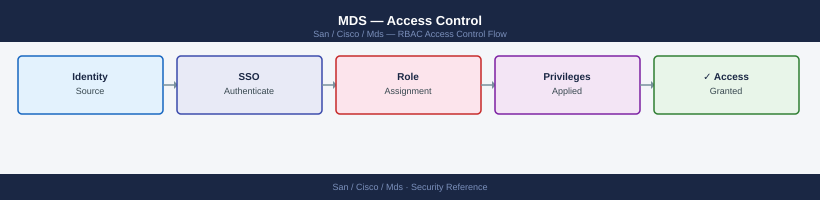
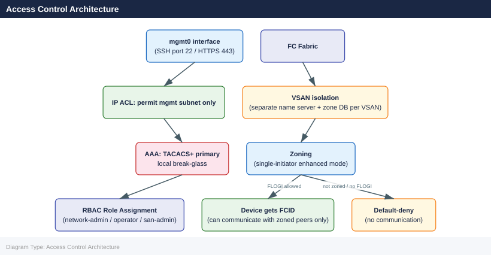

---
tags:
  - san
  - security
---
# MDS — Access Control

<div class="kb-summary">
Cisco MDS access control: RBAC role assignment with `role name`, network-admin vs. vsan-admin scoping, TACACS+ server configuration, and AAA fallback.

*Applies to: Cisco MDS · Nexus*
</div>


---

## Before you begin

- **Access:** Storage admin credentials (cluster admin or equivalent)
- **Change management:** security changes require CAB approval in most environments
- **Rollback plan:** document current state before any security control change
- **Testing:** validate in a non-production environment first where possible

---

## Overview

Access control on Cisco MDS operates at two levels: **management plane** (who can log into the switch and run commands) and **data plane** (which initiators can communicate with which targets via zoning). Both layers must be configured correctly for a secure SAN environment.

---

## Access Control Architecture



### VSAN-Scoped Roles

For environments where different teams own different VSANs, VSAN-scoped roles restrict a user's configuration rights to specific VSANs:

```bash
# Create a VSAN-scoped role for VSAN 20 (replication team)
role name repl-admin
  vsan policy permit
    permit vsan 20
  rule 1 permit read-write feature zone
  rule 2 permit read-write feature vsan
  rule 10 permit read

username repladmin role repl-admin
```


```text title="Expected output"
(no output — command completes silently)
```

!!! warning "Common errors"
    **`% Invalid command`** — Verify you are in the correct configuration mode (enter `config t` first if not already in configuration terminal mode).
    **`% Role 'repl-admin' not found`** — Create the role before assigning it to a username; ensure the role definition is committed before the username command executes.
---

## AAA Integration (TACACS+ / RADIUS)

Local user accounts should be limited to break-glass scenarios. All operational access should authenticate via TACACS+ (preferred) or RADIUS.

### TACACS+ Configuration

```bash
# Define TACACS+ servers
tacacs-server host 10.10.1.10 key 7 <encrypted-key>
tacacs-server host 10.10.1.11 key 7 <encrypted-key>

# Create AAA server group
aaa group server tacacs+ TACACS-SERVERS
  server 10.10.1.10
  server 10.10.1.11

# Configure authentication: TACACS+ first, local as fallback
aaa authentication login default group TACACS-SERVERS local

# Configure authorization: TACACS+ for commands
aaa authorization commands default group TACACS-SERVERS local

# Configure accounting: log all exec and config commands
aaa accounting default group TACACS-SERVERS
```


```text title="Expected output"
(no output — command completes silently)
```

!!! warning "Common errors"
    **`% Invalid command`** — Verify the switch is in config mode with `configure terminal` before entering AAA commands.
    **`% TACACS+ server 10.10.1.10 is unreachable`** — Confirm network connectivity to TACACS+ servers and that the shared key matches the server configuration.
    **`% Incomplete command`** — Ensure the encrypted key value is provided after `key 7`; use `show tacacs` to verify server configuration syntax.
### Role Mapping via TACACS+

TACACS+ can return the NX-OS role as an AV-pair in the authorization response, eliminating the need for local role configuration:

```bash
# Cisco AV-pair in TACACS+ user profile (ISE / TACACS+ server config):
cisco-av-pair = shell:roles*"network-admin"
```


```text title="Expected output"
(no output — command completes silently)
```

!!! warning "Common errors"
    **`TACACS+ authentication failed: Invalid AV-pair syntax`** — Ensure the AV-pair format uses `=` not `:` and wraps the role value in quotes like `shell:roles*"network-admin"`.
    **`Authorization denied: user lacks network-admin role`** — Verify the cisco-av-pair attribute is correctly configured in the TACACS+ server user profile and that the MDS switch is configured to query TACACS+ for authorization.
When the AV-pair is returned, NX-OS assigns the role dynamically at login. No local role assignment is required beyond the user account existing (or not — TACACS+ can create dynamic accounts).

### Testing AAA

```bash
# Test TACACS+ authentication for a specific user
test aaa group TACACS-SERVERS <username> <password>

# Verify TACACS+ server reachability
show tacacs-server
show tacacs-server statistics

# Verify AAA configuration
show aaa
```


```text title="Expected output"
test aaa group TACACS-SERVERS admin MyP@ssw0rd
TACACS+ authentication successful for user 'admin'

show tacacs-server
tacacs-server host 192.168.100.50 port 49
  timeout 5
  key ****
tacacs-server host 192.168.100.51 port 49
  timeout 5
  key ****

show tacacs-server statistics
TACACS+ Server Statistics:
  Server: 192.168.100.50
    Requests: 1247
    Responses: 1245
    Timeouts: 2
    Errors: 0
  Server: 192.168.100.51
    Requests: 1251
    Responses: 1251
    Timeouts: 0
    Errors: 0

show aaa
AAA Authentication:
  aaa authentication login default group TACACS-SERVERS local
  aaa authentication enable default group TACACS-SERVERS enable
AAA Authorization:
  aaa authorization commands default group TACACS-SERVERS local
AAA Accounting:
  aaa accounting commands default start-stop group TACACS-SERVERS
```

!!! warning "Common errors"
    **`TACACS+ authentication failed for user 'admin'`** — Verify the username/password are correct and the TACACS+ server is reachable on port 49.
    **`% Invalid command`** — Ensure you are in the correct mode (exec or config); use `configure terminal` if needed and verify the TACACS-SERVERS group is defined with `show aaa group-server tacacs`.
    **`Connection refused to TACACS+ server 192.168.100.50`** — Check network connectivity to the TACACS+ server and confirm the server IP, port 49, and firewall rules allow MDS-to-server communication.
---

## Management Plane ACLs

Restrict SSH and SNMP access to the switch management interface to authorised source IP ranges only.

### SSH / Management Access ACL

```bash
# Define the management source subnet
ip access-list MGMT-ACL
  10 permit tcp 10.10.0.0/24 any eq 22    # SSH from management subnet
  20 permit tcp 10.10.0.0/24 any eq 443   # HTTPS from management subnet
  30 deny ip any any log

# Apply to mgmt0 interface (inbound)
interface mgmt0
  ip access-group MGMT-ACL in

# Verify
show ip access-lists MGMT-ACL
show running-config interface mgmt0
```


```text title="Expected output"
IP access list MGMT-ACL
    10 permit tcp 10.10.0.0/24 any eq 22
    20 permit tcp 10.10.0.0/24 any eq 443
    30 deny ip any any log

interface mgmt0
  ip address 10.20.1.5 255.255.255.0
  ip access-group MGMT-ACL in
  no shutdown
```

!!! warning "Common errors"
    **`% Invalid command`** — Ensure you are in the correct configuration mode (config-if for interface commands, config for ACL commands).
    **`% Access list MGMT-ACL not found`** — Create the access list before applying it to the interface; verify the ACL name matches exactly (case-sensitive).
### SNMP Source Restriction

```bash
# Restrict SNMP polling to NMS subnet
ip access-list SNMP-ACL
  10 permit udp 10.10.2.0/24 any eq 161
  20 deny udp any any eq 161 log

# Restrict SNMP trap delivery (optional — traps are outbound)
# Apply inbound on mgmt0 for polling:
interface mgmt0
  ip access-group SNMP-ACL in   # if separate from MGMT-ACL
```


```text title="Expected output"
MDS9148S(config)# ip access-list SNMP-ACL
MDS9148S(config-acl)# 10 permit udp 10.10.2.0/24 any eq 161
MDS9148S(config-acl)# 20 deny udp any any eq 161 log
MDS9148S(config-acl)# exit
MDS9148S(config)# interface mgmt0
MDS9148S(config-if)# ip access-group SNMP-ACL in
MDS9148S(config-if)# end
MDS9148S# show access-lists SNMP-ACL
IP access list SNMP-ACL
    10 permit udp 10.10.2.0/24 any eq 161
    20 deny udp any any eq 161 log
MDS9148S# show running-config interface mgmt0 | include access-group
  ip access-group SNMP-ACL in
```

!!! warning "Common errors"
    **`% Invalid command`** — Verify you are in config mode (`configure terminal`) and that ACL syntax matches your MDS OS version (NX-OS vs older).
    **`% Access-list not found`** — Create the ACL before applying it to the interface; ensure the ACL name matches exactly between creation and application.
---

## VSAN Isolation as an Access Control Boundary

VSANs are the primary data-plane isolation mechanism. Hosts in different VSANs cannot communicate without explicit Inter-VSAN Routing (IVR) policy.

```bash
# Confirm no production host or storage ports remain in VSAN 1 (default — insecure)
show vsan 1 membership
# Any F_Ports listed are a configuration error — move them to a named production VSAN

# Verify VSAN separation
show vsan membership
# Each port should be in exactly one named VSAN

# Verify ISL trunk carries only the intended VSANs
show trunk
# Restrict to required VSANs only
interface fc2/1
  switchport trunk allowed vsan 10,20,99   # explicit allowlist — remove vsan 1
```


```text title="Expected output"
VSAN 1 Membership:
  F_Port:  fc1/1, fc1/2, fc1/3
  E_Port:  fc2/1, fc2/2
  FL_Port: None

VSAN Membership:
  VSAN 10:  fc1/4, fc1/5, fc1/6, fc1/7 (Production-SAN-A)
  VSAN 20:  fc1/8, fc1/9, fc1/10, fc1/11 (Production-SAN-B)
  VSAN 99:  fc2/3, fc2/4 (Management)
  VSAN 1:   fc1/1, fc1/2, fc1/3 (Default)

Trunk Information for fc2/1:
  Operational Mode: Trunk
  Allowed VSANs: 1,10,20,99
  Active VSANs: 1,10,20,99
  Native VSAN: 1

fc2/1# switchport trunk allowed vsan 10,20,99
(no output — command completes silently)

fc2/1# show trunk
Trunk Information for fc2/1:
  Operational Mode: Trunk
  Allowed VSANs: 10,20,99
  Active VSANs: 10,20,99
  Native VSAN: 1
```

!!! warning "Common errors"
    **`% Invalid command`** — Verify you are in interface configuration mode (interface fc2/1) before running switchport commands.
    **`% VSAN 1 cannot be removed from trunk on native VSAN port`** — Change the native VSAN to a production VSAN (switchport trunk native vsan 10) before removing VSAN 1 from the allowed list.
---

## Zoning as Data-Plane Access Control

Zoning enforces which initiator-target pairs can communicate within a VSAN. Use enhanced zoning (default-deny) to ensure that non-zoned devices cannot communicate.

```bash
# Enable enhanced zoning on all production VSANs
zone mode enhanced vsan 10
zone mode enhanced vsan 20

# Confirm mode
show zone status vsan 10
# Mode: Enhanced
# Default-deny: enabled
```


```text title="Expected output"
MDS9148S(config)# zone mode enhanced vsan 10
MDS9148S(config)# zone mode enhanced vsan 20
MDS9148S(config)# show zone status vsan 10
VSAN: 10
Mode: Enhanced
Default-deny: enabled
Session: Not Activated
Interop Mode: OFF

MDS9148S(config)# show zone status vsan 20
VSAN: 20
Mode: Enhanced
Default-deny: enabled
Session: Not Activated
Interop Mode: OFF
```

!!! warning "Common errors"
    **`% Invalid command`** — Verify the switch supports enhanced zoning mode (MDS 9000 series required); basic switches only support basic mode.
    **`% VSAN <vsan-id> does not exist`** — Create the VSAN first with `vsan <vsan-id>` before applying zone mode configuration.
    **`% Cannot change zone mode while session is active`** — Deactivate the current zone session with `no zone activate vsan <vsan-id>` before modifying the mode.
In enhanced mode, any device not explicitly included in an active zone cannot communicate with any other device in the VSAN, regardless of FLOGI state. This is the required production standard.

---

## Audit Logging

All configuration changes should be logged with user identity and command content.

```bash
# Enable accounting for all commands
aaa accounting default group TACACS-SERVERS

# Forward syslog including accounting events to SIEM
logging server 10.10.3.50 5 facility local7
logging server 10.10.3.51 5 facility local7

# Set local syslog level
logging level aaa 6
logging level zone 6
logging level flogi 6

# Verify accounting log
show accounting log

# Confirm syslog forwarding
show logging server
```


```text title="Expected output"
mds9148# aaa accounting default group TACACS-SERVERS
mds9148# logging server 10.10.3.50 5 facility local7
mds9148# logging server 10.10.3.51 5 facility local7
mds9148# logging level aaa 6
mds9148# logging level zone 6
mds9148# logging level flogi 6
mds9148# show accounting log
Accounting log is empty
mds9148# show logging server
Logging servers:
    10.10.3.50 facility local7 severity 5
    10.10.3.51 facility local7 severity 5
mds9148#
```

!!! warning "Common errors"
    **`% Invalid command`** — Verify the MDS switch supports the `aaa accounting` command; some older firmware versions require `aaa accounting commands` syntax instead.
    **`% Unresolved host name`** — Ensure the syslog server IPs (10.10.3.50, 10.10.3.51) are reachable and DNS/routing is configured if using hostnames instead of IPs.
    **`% TACACS-SERVERS group not configured`** — Define the TACACS+ server group first using `aaa group server tacacs+ TACACS-SERVERS` before referencing it in the accounting command.
---

## Access Control Checklist

- [ ] All user access via TACACS+ with role assignment via AV-pair
- [ ] Local `admin` account password stored in vault; used for break-glass only; accessed less than once per quarter under change control
- [ ] `network-operator` role assigned to monitoring/NOC accounts
- [ ] Management interface (mgmt0) restricted by ACL to management subnet only
- [ ] VSAN 1 (default) has no production host or storage ports — all ports in named VSANs
- [ ] Enhanced zoning enabled on all production VSANs (`zone mode enhanced vsan <id>`)
- [ ] Single-initiator zoning enforced — no multi-initiator zones in production
- [ ] AAA accounting enabled — all commands forwarded to SIEM
- [ ] SNMP access restricted to NMS subnet; SNMPv3 only
- [ ] Telnet disabled: `show feature | include telnet` returns `disabled`

---

## See also

- [Mds — Authentication](../authentication/)
- [Mds — Hardening](../hardening/)
- [Mds — Encryption](../encryption/)
