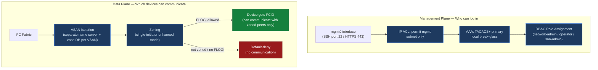

# MDS — Access Control

> Part of the [Cisco MDS](../../index.md) reference.

---

## Overview

Access control on Cisco MDS operates at two levels: **management plane** (who can log into the switch and run commands) and **data plane** (which initiators can communicate with which targets via zoning). Both layers must be configured correctly for a secure SAN environment.

---

## Access Control Architecture



## Role-Based Access Control (RBAC)

NX-OS for MDS uses role-based access control. Each user is assigned one or more roles that define which commands they can run. Roles apply globally across the switch — there is no per-VSAN role scoping in the base RBAC model.

### Built-in Roles

| Role | Access Level | Typical Assignment |
|---|---|---|
| `network-admin` | Full configuration access — all show and config commands | SAN infrastructure engineers |
| `network-operator` | Read-only — show commands only; no configuration | Monitoring, NOC, read-only users |
| `san-admin` | SAN-specific configuration (zoning, VSANs, FC services); no system-level config | Storage administrators on multi-team fabrics |
| `vsan-admin` | VSAN-scoped administration — configure only the VSANs assigned to this role | Use for strict VSAN delegation |

```bash
# View all configured roles and their rules
show role

# View all local user accounts and their assigned roles
show user-account

# Check the role of the currently logged-in user
show users
```

### Custom Roles

For environments requiring fine-grained access, create custom roles with specific command rules:

```bash
# Create a custom role (example: zone-admin — zone changes only)
role name zone-admin
  rule 1 permit command zone *
  rule 2 permit command zoneset *
  rule 3 permit command device-alias *
  rule 4 permit read-write feature zone
  rule 10 permit read

# Assign the role to a user
username zoneadmin role zone-admin

# Verify
show role name zone-admin
```

### VSAN-Scoped Roles

For environments where different teams own different VSANs, VSAN-scoped roles restrict a user's configuration rights to specific VSANs:

```bash
# Create a VSAN-scoped role for VSAN 20 (replication team)
role name repl-admin
  vsan policy permit
    permit vsan 20
  rule 1 permit read-write feature zone
  rule 2 permit read-write feature vsan
  rule 10 permit read

username repladmin role repl-admin
```

---

## AAA Integration (TACACS+ / RADIUS)

Local user accounts should be limited to break-glass scenarios. All operational access should authenticate via TACACS+ (preferred) or RADIUS.

### TACACS+ Configuration

```bash
# Define TACACS+ servers
tacacs-server host 10.10.1.10 key 7 <encrypted-key>
tacacs-server host 10.10.1.11 key 7 <encrypted-key>

# Create AAA server group
aaa group server tacacs+ TACACS-SERVERS
  server 10.10.1.10
  server 10.10.1.11

# Configure authentication: TACACS+ first, local as fallback
aaa authentication login default group TACACS-SERVERS local

# Configure authorization: TACACS+ for commands
aaa authorization commands default group TACACS-SERVERS local

# Configure accounting: log all exec and config commands
aaa accounting default group TACACS-SERVERS
```

### Role Mapping via TACACS+

TACACS+ can return the NX-OS role as an AV-pair in the authorization response, eliminating the need for local role configuration:

```bash
# Cisco AV-pair in TACACS+ user profile (ISE / TACACS+ server config):
cisco-av-pair = shell:roles*"network-admin"
```

When the AV-pair is returned, NX-OS assigns the role dynamically at login. No local role assignment is required beyond the user account existing (or not — TACACS+ can create dynamic accounts).

### Testing AAA

```bash
# Test TACACS+ authentication for a specific user
test aaa group TACACS-SERVERS <username> <password>

# Verify TACACS+ server reachability
show tacacs-server
show tacacs-server statistics

# Verify AAA configuration
show aaa
```

---

## Management Plane ACLs

Restrict SSH and SNMP access to the switch management interface to authorised source IP ranges only.

### SSH / Management Access ACL

```bash
# Define the management source subnet
ip access-list MGMT-ACL
  10 permit tcp 10.10.0.0/24 any eq 22    # SSH from management subnet
  20 permit tcp 10.10.0.0/24 any eq 443   # HTTPS from management subnet
  30 deny ip any any log

# Apply to mgmt0 interface (inbound)
interface mgmt0
  ip access-group MGMT-ACL in

# Verify
show ip access-lists MGMT-ACL
show running-config interface mgmt0
```

### SNMP Source Restriction

```bash
# Restrict SNMP polling to NMS subnet
ip access-list SNMP-ACL
  10 permit udp 10.10.2.0/24 any eq 161
  20 deny udp any any eq 161 log

# Restrict SNMP trap delivery (optional — traps are outbound)
# Apply inbound on mgmt0 for polling:
interface mgmt0
  ip access-group SNMP-ACL in   # if separate from MGMT-ACL
```

---

## VSAN Isolation as an Access Control Boundary

VSANs are the primary data-plane isolation mechanism. Hosts in different VSANs cannot communicate without explicit Inter-VSAN Routing (IVR) policy.

```bash
# Confirm no production host or storage ports remain in VSAN 1 (default — insecure)
show vsan 1 membership
# Any F_Ports listed are a configuration error — move them to a named production VSAN

# Verify VSAN separation
show vsan membership
# Each port should be in exactly one named VSAN

# Verify ISL trunk carries only the intended VSANs
show trunk
# Restrict to required VSANs only
interface fc2/1
  switchport trunk allowed vsan 10,20,99   # explicit allowlist — remove vsan 1
```

---

## Zoning as Data-Plane Access Control

Zoning enforces which initiator-target pairs can communicate within a VSAN. Use enhanced zoning (default-deny) to ensure that non-zoned devices cannot communicate.

```bash
# Enable enhanced zoning on all production VSANs
zone mode enhanced vsan 10
zone mode enhanced vsan 20

# Confirm mode
show zone status vsan 10
# Mode: Enhanced
# Default-deny: enabled
```

In enhanced mode, any device not explicitly included in an active zone cannot communicate with any other device in the VSAN, regardless of FLOGI state. This is the required production standard.

---

## Audit Logging

All configuration changes should be logged with user identity and command content.

```bash
# Enable accounting for all commands
aaa accounting default group TACACS-SERVERS

# Forward syslog including accounting events to SIEM
logging server 10.10.3.50 5 facility local7
logging server 10.10.3.51 5 facility local7

# Set local syslog level
logging level aaa 6
logging level zone 6
logging level flogi 6

# Verify accounting log
show accounting log

# Confirm syslog forwarding
show logging server
```

---

## Access Control Checklist

- [ ] All user access via TACACS+ with role assignment via AV-pair
- [ ] Local `admin` account password stored in vault; used for break-glass only; accessed less than once per quarter under change control
- [ ] `network-operator` role assigned to monitoring/NOC accounts
- [ ] Management interface (mgmt0) restricted by ACL to management subnet only
- [ ] VSAN 1 (default) has no production host or storage ports — all ports in named VSANs
- [ ] Enhanced zoning enabled on all production VSANs (`zone mode enhanced vsan <id>`)
- [ ] Single-initiator zoning enforced — no multi-initiator zones in production
- [ ] AAA accounting enabled — all commands forwarded to SIEM
- [ ] SNMP access restricted to NMS subnet; SNMPv3 only
- [ ] Telnet disabled: `show feature | include telnet` returns `disabled`
