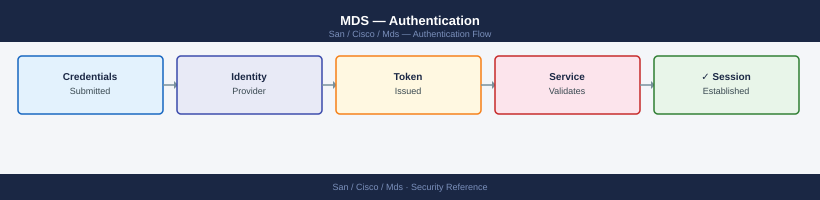

---
tags:
  - san
  - security
---
# MDS — Authentication

<div class="kb-summary">
Cisco MDS authentication: TACACS+ and RADIUS integration via `aaa group server tacacs+`, SSH key enforcement, and local account fallback policy.

*Applies to: Cisco MDS · Nexus*
</div>


---

## Before you begin

- **Access:** Storage admin credentials (cluster admin or equivalent)
- **Change management:** security changes require CAB approval in most environments
- **Rollback plan:** document current state before any security control change
- **Testing:** validate in a non-production environment first where possible

---

## Overview

Authentication on Cisco MDS covers two distinct planes:

- **Management plane authentication**: who can log into the switch CLI or GUI (SSH, HTTPS, NDFC). This is handled by AAA (Authentication, Authorization, and Accounting) via TACACS+ or RADIUS.
- **Fabric authentication**: which FC devices (hosts, storage arrays) are permitted to log into the SAN fabric. This is handled by FC-SP (Fibre Channel Security Protocol), also known as DHCHAP.

Both layers should be configured in enterprise environments. Management plane AAA is mandatory; FC-SP is strongly recommended for high-security fabrics.

---

## Authentication Architecture

```mermaid
flowchart TD
  subgraph "Management Plane"
    SSH["SSH / HTTPS Login"]
    SSH --> AAA{"AAA method list"}
    AAA -->|"primary"| TACP["TACACS+ Server\n(ISE / ACS)"]
    AAA -->|"fallback if unreachable"| RAD["RADIUS Server"]
    AAA -->|"last resort"| LOCAL["Local Account\n(break-glass only)"]
    TACP -->|"auth + role AV-pair"| ROLE["Assign NX-OS Role\n(network-admin / operator)"]
    RAD -->|"auth"| ROLE
    LOCAL -->|"auth"| ROLE
    ROLE --> CMD["Command Authorization\n& Accounting"]
    CMD --> SIEM["Syslog / SIEM\n(audit trail)"]
  end

  subgraph "Fabric Plane"
    HBA2["FC Host HBA"]
    HBA2 -->|"FLOGI"| FCSP{"FC-SP DHCHAP\nenabled?"}
    FCSP -->|"Yes — authenticate"| DHCHAP["DHCHAP challenge\n(shared secret by pWWN)"]
    DHCHAP -->|"success"| FABRIC["Device joins fabric\n(FCID assigned)"]
    DHCHAP -->|"fail"| REJECT["FLOGI rejected\nDevice cannot join"]
    FCSP -->|"No — open"| FABRIC
  end

  classDef aaaNode fill:#1e3a5f,stroke:#3b82f6,color:#e0f2fe
  classDef goodNode fill:#15803d,stroke:#166534,color:#fff
  classDef badNode fill:#991b1b,stroke:#7f1d1d,color:#fff
  classDef decisionNode fill:#b45309,stroke:#92400e,color:#fff
  class TACP,RAD,LOCAL,DHCHAP aaaNode
  class ROLE,CMD,FABRIC,SIEM goodNode
  class REJECT badNode
  class AAA,FCSP decisionNode
```



### TACACS+ Key Encryption

Shared keys must be stored encrypted in the configuration. NX-OS uses type-7 encryption by default — use `key 7` to store pre-encrypted keys, or use `key 0` when entering plaintext (NX-OS will encrypt automatically):

```bash
# NX-OS encrypts the key automatically if entered as plaintext
tacacs-server host 10.10.1.10 key 0 <plaintext-key>

# To verify the stored (encrypted) form
show tacacs-server | include key
```

---

## Management Plane: RADIUS (Fallback)

RADIUS can be used as a fallback if TACACS+ is unavailable. RADIUS is also used by some NDFC deployments.

```bash
# Define RADIUS servers
radius-server host 10.10.1.20 key 7 <encrypted-key>
radius-server host 10.10.1.21 key 7 <encrypted-key>

# Group RADIUS servers
aaa group server radius RADIUS-SERVERS
  server 10.10.1.20
  server 10.10.1.21

# Authentication chain: TACACS+ first, RADIUS second, local fallback
aaa authentication login default group TACACS-SERVERS RADIUS-SERVERS local

# Check RADIUS server status
show radius-server
show radius-server statistics
```

---

## Local Accounts

Local accounts must exist for break-glass access — when both TACACS+ and RADIUS are unreachable. Local accounts must not be used for routine operational access.

### Break-Glass Account Standards

| Requirement | Configuration |
|---|---|
| One local `admin` account per fabric | `username admin password <strong-pass> role network-admin` |
| Password stored in vault | HashiCorp Vault / CyberArk — not in config files |
| Password rotation | Quarterly, under change control |
| Account usage logged | Vault access log + syslog `%LOGIN-5-LOGIN_SUCCESS` event |

```bash
# Create break-glass local admin
username admin password 0 <strong-plaintext-password> role network-admin
# NX-OS encrypts the password in the config

# Verify account
show user-account admin

# Check currently active sessions
show users
```

### Hardening Local Accounts

```bash
# Enforce minimum password length and complexity
password strength-check
username admin password-prompt

# Set maximum login retries before lockout
aaa authentication login error-enable

# View login failures in accounting log
show accounting log | grep FAIL
```

---

## SSH Key-Based Authentication

SSH key authentication is more secure than password authentication for automated access (scripts, Ansible).

```bash
# Generate RSA keys on the switch (required for SSH server)
crypto key generate rsa
# Select key size: 2048 bits minimum

# Display the switch's public key
show crypto key mypubkey rsa

# Verify SSH server is enabled and using the generated key
show ssh server
show feature | include ssh
# Expected: ssh enabled
```

### Importing a User's SSH Public Key

To allow a user to authenticate via SSH public key:

```bash
# In username config mode, specify the user's public key
username netauto sshkey ssh-rsa AAAA...
# The key string is the full RSA public key from the user's ~/.ssh/id_rsa.pub

# Verify
show user-account netauto
```

---

## FC-SP: Fabric-Layer Device Authentication

FC-SP (DHCHAP — Diffie-Hellman Challenge Handshake Authentication Protocol) authenticates FC devices before they are permitted to log into the fabric. Without FC-SP, any device with a fibre connection to an F_Port can log in.

FC-SP is particularly relevant for high-security fabrics where rogue device insertion is a concern.

### Enabling FC-SP

```bash
# Enable FC-SP on the switch
feature fcsp

# Configure authentication mode per interface
interface fc1/1
  fcsp dhchap mode on   # enforce authentication
  # or
  fcsp dhchap mode auto  # negotiate, accept unauthenticated if peer doesn't support

# Configure a shared DHCHAP secret for a specific peer WWPN
fcsp dhchap devicename-password pwwn 21:00:00:24:ff:a1:b2:c3 password 0 <secret>
```

### Verification

```bash
# Check FC-SP status on all interfaces
show fcsp interface

# Check DHCHAP authentication state for a VSAN
show fcsp dhchap vsan 10

# Check authentication success / failure in log
show logging | grep -i fcsp
```

---

## NTP (Required for AAA and Certificate Validity)

Authentication mechanisms — TACACS+ accounting, certificate-based auth, Kerberos — rely on synchronized time. NTP is a prerequisite.

```bash
# Configure NTP servers
ntp server 10.10.0.10 prefer
ntp server 10.10.0.11

# Verify NTP sync status
show ntp status
show ntp peer-status

# Expected output: Clock is synchronized, stratum 3 (or lower)
```

All switches in the fabric must be synchronized to the same NTP source. Time drift between switches causes TACACS+ accounting log correlation to fail and may break certificate authentication.

---

## Banner and Login Warning

Configure a login banner to satisfy legal and compliance requirements:

```bash
# Set a warning banner displayed before login
banner motd #
AUTHORIZED ACCESS ONLY. All activity is monitored and logged.
Unauthorized access is prohibited and will be prosecuted.
#
```

---

## Authentication Checklist

- [ ] TACACS+ configured with encrypted shared key; at least two server addresses for redundancy
- [ ] RADIUS configured as fallback (or local-only as secondary fallback)
- [ ] AAA authentication, authorization, and accounting all enabled
- [ ] Local `admin` break-glass account password stored in vault
- [ ] No personal named local accounts — all access via TACACS+
- [ ] SSH key generated: `show crypto key mypubkey rsa` returns a valid key
- [ ] Telnet disabled: `show feature | include telnet` returns disabled
- [ ] NTP synchronized: `show ntp status` shows synchronized
- [ ] Login banner configured
- [ ] TACACS+ test: `test aaa group TACACS-SERVERS <user> <pass>` passes
- [ ] AAA accounting events appearing in SIEM / syslog receiver

---

## See also

- [Mds — Access Control](../access-control/)
- [Mds — Hardening](../hardening/)
- [Mds — Encryption](../encryption/)
