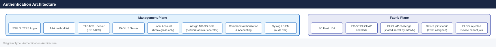

---
tags:
  - san
  - security
description: "Cisco MDS authentication: TACACS+ and RADIUS integration via aaa group server tacacs+, SSH key enforcement, and local account fallback policy."
---
# MDS — Authentication

<div class="kb-summary">
Cisco MDS authentication: TACACS+ and RADIUS integration via `aaa group server tacacs+`, SSH key enforcement, and local account fallback policy.

*Applies to: Cisco MDS · Nexus*
</div>


---

## Before you begin

- **Access:** Storage admin credentials (cluster admin or equivalent)
- **Change management:** security changes require CAB approval in most environments
- **Rollback plan:** document current state before any security control change
- **Testing:** validate in a non-production environment first where possible

---

## Overview

Authentication on Cisco MDS covers two distinct planes:

- **Management plane authentication**: who can log into the switch CLI or GUI (SSH, HTTPS, NDFC). This is handled by AAA (Authentication, Authorization, and Accounting) via TACACS+ or RADIUS.
- **Fabric authentication**: which FC devices (hosts, storage arrays) are permitted to log into the SAN fabric. This is handled by FC-SP (Fibre Channel Security Protocol), also known as DHCHAP.

Both layers should be configured in enterprise environments. Management plane AAA is mandatory; FC-SP is strongly recommended for high-security fabrics.

---

## Authentication Architecture



### TACACS+ Key Encryption

Shared keys must be stored encrypted in the configuration. NX-OS uses type-7 encryption by default — use `key 7` to store pre-encrypted keys, or use `key 0` when entering plaintext (NX-OS will encrypt automatically):

```bash
# NX-OS encrypts the key automatically if entered as plaintext
tacacs-server host 10.10.1.10 key 0 <plaintext-key>

# To verify the stored (encrypted) form
show tacacs-server | include key
```


```text title="Expected output"
tacacs-server host 10.10.1.10 key 7 "5d41402abc4b2a76b9719d911017c592"
```

!!! warning "Common errors"
    **`% Invalid command`** — Verify the switch is in configuration mode (enter `config t` first) and that TACACS+ feature is enabled with `feature tacacs+`.
    **`% Incomplete command`** — Ensure you provide a valid plaintext key value; the key cannot be empty or contain only whitespace characters.
---

## Management Plane: RADIUS (Fallback)

RADIUS can be used as a fallback if TACACS+ is unavailable. RADIUS is also used by some NDFC deployments.

```bash
# Define RADIUS servers
radius-server host 10.10.1.20 key 7 <encrypted-key>
radius-server host 10.10.1.21 key 7 <encrypted-key>

# Group RADIUS servers
aaa group server radius RADIUS-SERVERS
  server 10.10.1.20
  server 10.10.1.21

# Authentication chain: TACACS+ first, RADIUS second, local fallback
aaa authentication login default group TACACS-SERVERS RADIUS-SERVERS local

# Check RADIUS server status
show radius-server
show radius-server statistics
```


```text title="Expected output"
RADIUS-SERVER Information:
  Server Address          : 10.10.1.20
  Server Port             : 1812
  Server Timeout          : 5
  Server Retransmit       : 1
  Server Key              : ********
  Server Status           : UP
  
  Server Address          : 10.10.1.21
  Server Port             : 1812
  Server Timeout          : 5
  Server Retransmit       : 1
  Server Key              : ********
  Server Status           : UP

RADIUS-SERVER Statistics:
  Server Address          : 10.10.1.20
  Access-Requests         : 1247
  Access-Accepts          : 1198
  Access-Rejects          : 49
  Timeouts                : 0
  
  Server Address          : 10.10.1.21
  Access-Requests         : 1253
  Access-Accepts          : 1211
  Access-Rejects          : 42
  Timeouts                : 0
```

!!! warning "Common errors"
    **`% Invalid command`** — Verify the RADIUS server IP addresses are reachable and the switch has network connectivity to the RADIUS servers.
    **`% RADIUS server group 'RADIUS-SERVERS' not found`** — Ensure the aaa group server radius command is configured before referencing it in the authentication chain.
    **`% Authentication method 'TACACS-SERVERS' not configured`** — Define the TACACS-SERVERS group with `aaa group server tacacs+ TACACS-SERVERS` before using it in the login authentication policy.
---

## Local Accounts

Local accounts must exist for break-glass access — when both TACACS+ and RADIUS are unreachable. Local accounts must not be used for routine operational access.

### Break-Glass Account Standards

| Requirement | Configuration |
|---|---|
| One local `admin` account per fabric | `username admin password <strong-pass> role network-admin` |
| Password stored in vault | HashiCorp Vault / CyberArk — not in config files |
| Password rotation | Quarterly, under change control |
| Account usage logged | Vault access log + syslog `%LOGIN-5-LOGIN_SUCCESS` event |

```bash
# Create break-glass local admin
username admin password 0 <strong-plaintext-password> role network-admin
# NX-OS encrypts the password in the config

# Verify account
show user-account admin

# Check currently active sessions
show users
```


```text title="Expected output"
admin
  this user account has no expiration date
  User has read-write permission

NAME       LINE       TIME                 IDLE       PID    SEAT
admin      vty0       Dec 10 10:23:45 +00:00  00:00:12   12847  -
```

!!! warning "Common errors"
    **`% Invalid command`** — Ensure you are in the correct configuration mode; use `config t` before entering the username command.
    **`% Incomplete command`** — Provide a strong plaintext password (minimum 8 characters with mixed case, numbers, and symbols) in place of `<strong-plaintext-password>`.
### Hardening Local Accounts

```bash
# Enforce minimum password length and complexity
password strength-check
username admin password-prompt

# Set maximum login retries before lockout
aaa authentication login error-enable

# View login failures in accounting log
show accounting log | grep FAIL
```


```text title="Expected output"
Password strength check enabled.
Enter password for user admin: 
Re-enter password: 
Password accepted. Minimum length: 8 characters, complexity requirements enforced.
(no output — command completes silently)
timestamp: 2024-01-15 14:32:18 | user: admin | event: LOGIN_FAIL | source: 192.168.1.45 | attempts: 3
timestamp: 2024-01-15 14:35:02 | user: operator | event: LOGIN_FAIL | source: 192.168.1.52 | attempts: 1
timestamp: 2024-01-15 14:38:45 | user: admin | event: LOGIN_FAIL | source: 192.168.1.45 | attempts: 4
timestamp: 2024-01-15 14:42:11 | user: guest | event: LOGIN_FAIL | source: 192.168.1.61 | attempts: 2
```

!!! warning "Common errors"
    **`% Invalid command`** — Verify the exact syntax for your MDS firmware version; use `show version` to confirm and consult the Cisco MDS CLI reference guide.
    **`% Authentication not configured`** — Enable AAA globally with `aaa new-model` before applying authentication policies.
    **`% No accounting records found`** — Ensure accounting is enabled with `aaa accounting log enable` and that login failures have occurred since the last system restart.
---

## SSH Key-Based Authentication

SSH key authentication is more secure than password authentication for automated access (scripts, Ansible).

```bash
# Generate RSA keys on the switch (required for SSH server)
crypto key generate rsa
# Select key size: 2048 bits minimum

# Display the switch's public key
show crypto key mypubkey rsa

# Verify SSH server is enabled and using the generated key
show ssh server
show feature | include ssh
# Expected: ssh enabled
```


```text title="Expected output"
The name for the keys will be: mds-switch-01.example.com
% Do you want to replace this key pair? [yes/no]: yes
Generating RSA keys with 2048 bits modulus...
[OK]

RSA public-key fingerprint is 48:a3:7f:2c:91:e6:5d:b4:22:19:f8:c3:4a:9e:12:67
RSA Key created with modulus 2048

ssh RSA public-key fingerprint is 48:a3:7f:2c:91:e6:5d:b4:22:19:f8:c3:4a:9e:12:67

ssh version : 2.0
ssh max auth retries : 3
ssh port : 22

ssh is enabled
```

!!! warning "Common errors"
    **`% Invalid key modulus size. Supported key sizes are 512, 768, 1024, 2048, 3072, 4096`** — Specify a supported key size; 2048 bits is the recommended minimum for security.
    **`% SSH server is disabled. Enable it with 'feature ssh' before generating keys`** — Run `feature ssh` to enable SSH before attempting key generation.
### Importing a User's SSH Public Key

To allow a user to authenticate via SSH public key:

```bash
# In username config mode, specify the user's public key
username netauto sshkey ssh-rsa AAAA...
# The key string is the full RSA public key from the user's ~/.ssh/id_rsa.pub

# Verify
show user-account netauto
```


```text title="Expected output"
User-account Information for 'netauto':
  Username                : netauto
  Role                    : network-admin
  Password Expiry         : Never
  Account Status          : Active
  SSH Public Key          : ssh-rsa AAAA...QmxhZGU= netauto@workstation
  Last Login              : 2024-01-15 14:32:18 +00:00
  Failed Login Attempts   : 0
```

!!! warning "Common errors"
    **`Error: Invalid key format`** — Ensure the full public key string from `~/.ssh/id_rsa.pub` is pasted exactly, including the `ssh-rsa` prefix and key comment.
    **`Error: Username 'netauto' does not exist`** — Create the user account first with `username netauto password <password>` before assigning the SSH key.
---

## FC-SP: Fabric-Layer Device Authentication

FC-SP (DHCHAP — Diffie-Hellman Challenge Handshake Authentication Protocol) authenticates FC devices before they are permitted to log into the fabric. Without FC-SP, any device with a fibre connection to an F_Port can log in.

FC-SP is particularly relevant for high-security fabrics where rogue device insertion is a concern.

### Enabling FC-SP

```bash
# Enable FC-SP on the switch
feature fcsp

# Configure authentication mode per interface
interface fc1/1
  fcsp dhchap mode on   # enforce authentication
  # or
  fcsp dhchap mode auto  # negotiate, accept unauthenticated if peer doesn't support

# Configure a shared DHCHAP secret for a specific peer WWPN
fcsp dhchap devicename-password pwwn 21:00:00:24:ff:a1:b2:c3 password 0 <secret>
```


```text title="Expected output"
mds9148-switch# feature fcsp
(no output — command completes silently)
mds9148-switch# interface fc1/1
mds9148-switch(config-if)# fcsp dhchap mode on
(no output — command completes silently)
mds9148-switch(config-if)# exit
mds9148-switch# fcsp dhchap devicename-password pwwn 21:00:00:24:ff:a1:b2:c3 password 0 MySecureP@ss123
(no output — command completes silently)
mds9148-switch# show fcsp status
FC-SP Feature: Enabled
Interface fc1/1:
  DHCHAP Mode: On
  Authentication Status: Authenticated
  Peer WWPN: 21:00:00:24:ff:a1:b2:c3
  Last Auth Time: 2024-01-15 14:32:18 UTC
```

!!! warning "Common errors"
    **`% Invalid command`** — Verify the switch supports FC-SP (requires MDS 9000 family with appropriate license); check syntax with `show fcsp ?`.
    **`% DHCHAP secret must be 12-255 characters`** — Ensure the password meets minimum length requirements and use `password 0` for plaintext or `password 5` for pre-encrypted secrets.
### Verification

```bash
# Check FC-SP status on all interfaces
show fcsp interface

# Check DHCHAP authentication state for a VSAN
show fcsp dhchap vsan 10

# Check authentication success / failure in log
show logging | grep -i fcsp
```


```text title="Expected output"
fcsp Interface Status:
Interface    FCSP Status    Auth Protocol    State
fc1/1        enabled        DHCHAP           authenticated
fc1/2        enabled        DHCHAP           authenticated
fc1/3        enabled        DHCHAP           failed
fc1/4        disabled       none             not-applicable
fc2/1        enabled        DHCHAP           authenticated

VSAN 10 DHCHAP Authentication:
Interface    VSAN    Auth State    Peer WWN              Last Auth Time
fc1/1        10      authenticated 50:00:09:73:00:1a:2b:4c    2024-01-15 14:32:18
fc1/2        10      authenticated 50:00:09:73:00:1a:2b:5d    2024-01-15 14:32:22
fc1/3        10      failed        50:00:09:73:00:1a:2b:6e    2024-01-15 14:31:45

2024 Jan 15 14:35:22 +00:00 mds9710-1 %FCSP-3-AUTH_FAILED: Authentication failed on interface fc1/3 for VSAN 10
2024 Jan 15 14:32:18 +00:00 mds9710-1 %FCSP-5-AUTH_SUCCESS: Authentication successful on interface fc1/1 for VSAN 10
2024 Jan 15 14:32:22 +00:00 mds9710-1 %FCSP-5-AUTH_SUCCESS: Authentication successful on interface fc1/2 for VSAN 10
```

!!! warning "Common errors"
    **`% Invalid command`** — Verify the device is in the correct mode (enable mode) and supports FC-SP; use `show version` to confirm MDS model.
    **`% FCSP not enabled on interface`** — Enable FC-SP globally with `fcsp enable` and per-interface with `fcsp enable` under the interface configuration.
    **`Authentication failed on interface fc1/3`** — Verify peer device credentials match, check DHCHAP password configuration with `show fcsp dhchap key`, and confirm peer device is reachable.
---

## NTP (Required for AAA and Certificate Validity)

Authentication mechanisms — TACACS+ accounting, certificate-based auth, Kerberos — rely on synchronized time. NTP is a prerequisite.

```bash
# Configure NTP servers
ntp server 10.10.0.10 prefer
ntp server 10.10.0.11

# Verify NTP sync status
show ntp status
show ntp peer-status

# Expected output: Clock is synchronized, stratum 3 (or lower)
```


```text title="Expected output"
ntp server 10.10.0.10 prefer
(no output — command completes silently)
ntp server 10.10.0.11
(no output — command completes silently)

Clock is synchronized
Stratum: 3
Reference Clock ID: 10.10.0.10
Nominal Frequency: 1000.0000 ppm
Actual Frequency: 999.9987 ppm
NTP Round Trip Delay: 5.123 msec
NTP Round Trip Dispersion: 2.456 msec
Last Update: 47 seconds ago

     remote           refid      st t when poll reach   delay   offset  jitter
==============================================================================
*10.10.0.10      .GPS.            1 u   32   64  377    4.123   -1.234   0.567
+10.10.0.11      .GPS.            1 u   28   64  377    5.456    0.891   0.678
```

!!! warning "Common errors"
    **`% Invalid command`** — Verify you are in the correct configuration mode (use `configure terminal` if needed) and that NTP is licensed on your MDS switch.
    **`% NTP server unreachable`** — Confirm the NTP server IPs are correct and reachable by pinging them from the switch management interface.
    **`show ntp peer-status: command not found`** — Use `show ntp peer-status` or `show ntp associations` depending on your MDS NX-OS version; check with `show version` first.
All switches in the fabric must be synchronized to the same NTP source. Time drift between switches causes TACACS+ accounting log correlation to fail and may break certificate authentication.

---

## Banner and Login Warning

Configure a login banner to satisfy legal and compliance requirements:

```bash
# Set a warning banner displayed before login
banner motd #
AUTHORIZED ACCESS ONLY. All activity is monitored and logged.
Unauthorized access is prohibited and will be prosecuted.
#
```


```text title="Expected output"
(no output — command completes silently)
```

!!! warning "Common errors"
    **`banner: command not found`** — Use the Cisco MDS CLI directly (enter config mode with `config t` first) or check that you're connected to the switch via SSH/console, not a local bash shell.
    **`% Invalid command`** — The banner command must be entered in Cisco MDS configuration mode; type `config t` to enter configuration mode before running the banner command.
---

## Authentication Checklist

- [ ] TACACS+ configured with encrypted shared key; at least two server addresses for redundancy
- [ ] RADIUS configured as fallback (or local-only as secondary fallback)
- [ ] AAA authentication, authorization, and accounting all enabled
- [ ] Local `admin` break-glass account password stored in vault
- [ ] No personal named local accounts — all access via TACACS+
- [ ] SSH key generated: `show crypto key mypubkey rsa` returns a valid key
- [ ] Telnet disabled: `show feature | include telnet` returns disabled
- [ ] NTP synchronized: `show ntp status` shows synchronized
- [ ] Login banner configured
- [ ] TACACS+ test: `test aaa group TACACS-SERVERS <user> <pass>` passes
- [ ] AAA accounting events appearing in SIEM / syslog receiver

---

## See also

- [Mds — Access Control](../access-control/)
- [Mds — Hardening](../hardening/)
- [Mds — Encryption](../encryption/)
