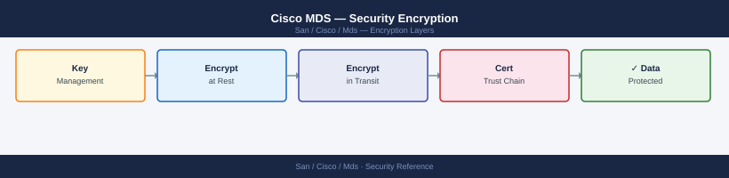

---
tags:
  - san
  - security
---
# Cisco MDS — Security Encryption


```bash
# Verify SSH is enabled
show feature | include ssh
# Expected: ssh   enabled

# Disable Telnet explicitly
no feature telnet

# Verify Telnet is disabled
show feature | include telnet
# Expected: telnet   disabled

# Generate or verify RSA key pair (required for SSH server)
crypto key generate rsa
show crypto key mypubkey rsa

# Set minimum SSH version to 2 (v1 is insecure)
ssh version 2

# View active SSH sessions
show ssh server
show users
```

```bash
# Generate a new self-signed certificate
crypto ca trustpoint LOCAL-CA
  enrollment self-signed
  subject-name CN=mds-sw01.corp.example.com

# Generate the keypair and certificate
crypto key generate rsa label mds-ssl-key modulus 2048
crypto ca enroll LOCAL-CA

# Display the current certificate
show crypto ca certificates

# Import a CA-signed certificate (PEM format via TFTP/SCP)
copy tftp://<server>/mds-sw01.pem bootflash:mds-sw01.pem
crypto ca import LOCAL-CA certificate
```
```bash
# Remove default community strings
no snmp-server community public
no snmp-server community private

# If v2c is required for a legacy NMS: restrict to a named ACL
# ip access-list SNMP-LEGACY-NMS
#   permit udp 10.10.2.5/32 any eq 161
# snmp-server community <string> group network-operator use-acl SNMP-LEGACY-NMS
```
```bash
# Create an SNMPv3 user with authPriv (SHA auth, AES-128 privacy)
snmp-server user nms_monitor network-operator v3 auth sha <auth-password> priv aes-128 <priv-password>

# Create a trap receiver using SNMPv3
snmp-server host 10.10.2.50 traps version 3 priv nms_monitor

# Verify SNMPv3 user configuration
show snmp user

# Verify trap host configuration
show snmp host

# Test SNMP from the monitoring server (Linux)
# snmpwalk -v3 -u nms_monitor -l authPriv -a SHA -A <auth-pass> -x AES -X <priv-pass> <switch-ip> sysDescr
```
```bash
# Enable specific trap categories
snmp-server enable traps link
snmp-server enable traps entity
snmp-server enable traps vsan
snmp-server enable traps zone

# Verify trap configuration
show snmp trap

# Check that traps are being sent (look for SNMP events in log)
show logging | grep -i snmp
```
```bash
# Enter key as plaintext (NX-OS encrypts automatically in running-config)
tacacs-server host 10.10.1.10 key 0 <plaintext-key>

# The stored config shows an encrypted form
show running-config | grep tacacs
# tacacs-server host 10.10.1.10 key 7 <encrypted-string>

# Rotating TACACS+ key
no tacacs-server host 10.10.1.10 key
tacacs-server host 10.10.1.10 key 0 <new-plaintext-key>
copy running-config startup-config
```
```bash
# Enable FC-SP
feature fcsp

# Configure per-interface (F_Port connections to hosts/storage)
interface fc1/1
  fcsp dhchap mode on      # Require authentication — reject unauthenticated devices
  # or
  fcsp dhchap mode auto    # Negotiate — accept unauthenticated if peer doesn't support

# Set a DHCHAP password for a specific device (by PWWN)
fcsp dhchap devicename-password pwwn 21:00:00:24:ff:a1:b2:c3 password 0 <secret>

# Verify
show fcsp interface fc1/1
show fcsp dhchap vsan 10
```
```bash
# Enable FCIP feature
feature fcip

# Create FCIP interface
interface fcip 1
  peer-info ipaddr 10.20.0.2    # remote MDS management IP for FCIP
  use-profile 1
  vsan 20                        # associate with replication VSAN

# Define FCIP profile (TCP parameters)
fcip profile 1
  ip address 10.20.0.1

# Enable IPSec on the FCIP interface
# (Requires IKE and IPSec policy configuration — see below)
```
```bash
# Define IKE proposal
crypto ike proposal FCIP-IKE-PROP
  encryption aes-256-cbc
  hash sha256
  lifetime 86400

# Define IKE policy
crypto ike policy 10
  proposal FCIP-IKE-PROP
  peer 10.20.0.2
  pre-shared-key 0 <pre-shared-key>

# Define IPSec transform set
crypto ipsec transform-set FCIP-XFORM esp-aes-256 esp-sha256-hmac

# Define IPSec profile
crypto ipsec profile FCIP-PROFILE
  set transform-set FCIP-XFORM

# Apply to FCIP interface
interface fcip 1
  ipsec crypto-map FCIP-PROFILE

# Verify IPSec SA establishment
show crypto ike sa
show crypto ipsec sa
show interface fcip 1
```

## Before you begin

- **Access:** Storage admin credentials (cluster admin or equivalent)
- **Change management:** security changes require CAB approval in most environments
- **Rollback plan:** document current state before any security control change
- **Testing:** validate in a non-production environment first where possible

---

---

## See also

- [Mds — Hardening](hardening/)
- [Mds — Authentication](authentication/)
- [Mds — Access Control](access-control/)
