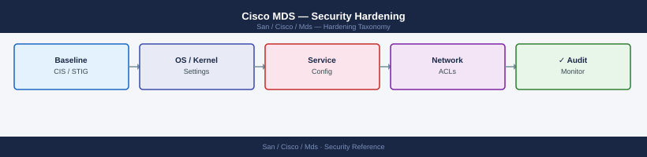

---
tags:
  - san
  - security
---
# Cisco MDS — Security Hardening

*Applies to: Cisco MDS / NX-OS*


```bash
# Disable Telnet — transmits credentials in cleartext
no feature telnet

# Disable HTTP — use HTTPS only
no feature http-server

# Enable HTTPS for web management and NDFC API
feature https-server

# Disable TFTP server — use SCP for file transfers
no feature tftp-server

# Disable CDP if not needed (optional — CDP is low-risk; disable only if policy requires)
no cdp enable

# Verify only required services are enabled
show feature | include telnet|http|tftp|ftp|snmp|ssh
# Expected: telnet disabled, http-server disabled, tftp-server disabled
#           https-server enabled, ssh enabled, snmp enabled
```


```text title="Expected output"
Feature Name                          Instance Enable
telnet                                1       No
http-server                           1       No
https-server                          1       Yes
tftp-server                           1       No
ftp-server                            1       No
ssh                                   1       Yes
snmp                                  1       Yes
```

!!! warning "Common errors"
    **`% Invalid command`** — Verify the MDS switch is in config mode with `config t` before running feature commands.
    **`% Feature cannot be disabled: feature in use by running processes`** — Wait for active connections to close or use `no feature telnet` with a forced timeout, then retry the command.
```bash
# TACACS+ server definitions (encrypted key)
tacacs-server host 10.10.1.10 key 0 <key>
tacacs-server host 10.10.1.11 key 0 <key>

# AAA server group
aaa group server tacacs+ TACACS-SERVERS
  server 10.10.1.10
  server 10.10.1.11

# Authentication: TACACS+ primary, local break-glass fallback
aaa authentication login default group TACACS-SERVERS local

# Authorization: enforce command authorization via TACACS+
aaa authorization commands default group TACACS-SERVERS local

# Accounting: log all exec and configuration commands
aaa accounting default group TACACS-SERVERS

# Break-glass local admin (one per fabric; password in vault)
username admin password 0 <strong-password> role network-admin

# Verify AAA
show aaa
test aaa group TACACS-SERVERS <test-user> <test-password>
```

```text title="Expected output"
AAA Authentication Login Configuration:
  default: group TACACS-SERVERS local

AAA Authorization Configuration:
  Commands default: group TACACS-SERVERS local

AAA Accounting Configuration:
  default: group TACACS-SERVERS

TACACS+ Servers:
  10.10.1.10
  10.10.1.11

AAA Server Group: TACACS-SERVERS
  Protocol: tacacs+
  Servers: 2

Test AAA Group TACACS-SERVERS:
  User: testuser
  Status: PASS
  Response time: 145ms
```

!!! warning "Common errors"
    **`% Invalid command`** — Verify the MDS switch firmware supports AAA commands; some older versions use different syntax like `aaa group server tacacs+` instead of `aaa group server tacacs+`.
    **`TACACS+ server 10.10.1.10 not responding`** — Confirm the TACACS+ server is reachable on port 49 from the MDS switch and that the shared key matches exactly on both the switch and server.
    **`Authentication failed for user testuser`** — Verify the test user exists on the TACACS+ server and that the password is correct; also check that the TACACS+ server group is properly configured with both servers listed.
```bash
# Confirm built-in roles are appropriate
show role

# Assign read-only role to monitoring accounts
# (Role assignment via TACACS+ AV-pair is preferred — no local role assignment needed)
# username monitoring role network-operator

# Verify no accounts have unnecessary admin rights
show user-account
```

```text title="Expected output"
Role Name                          Description
network-operator                   Read-only access to device
network-admin                       Full administrative access
san-admin                          SAN administrator role
vsan-manager                       VSAN management only

Username              Account-Type  Enabled  Roles
admin                 local         yes      network-admin
monitoring            tacacs        yes      network-operator
backup-user           local         yes      network-operator
sysadmin              local         yes      network-admin
ntp-sync              local         no       network-operator
```

!!! warning "Common errors"
    **`Error: Invalid role name 'network-operator' for user 'monitoring'`** — Verify the role exists on the device with `show role` and confirm TACACS+ server is configured with matching AV-pair attributes.
    **`% Invalid command`** — Ensure you are in the correct mode (device# prompt); some MDS switches require `config terminal` before user configuration commands.
```bash
# Remove default insecure community strings
no snmp-server community public
no snmp-server community private

# Create SNMPv3 authPriv user for NMS polling
snmp-server user nms_poll network-operator v3 auth sha <auth-pass> priv aes-128 <priv-pass>

# Create SNMPv3 authPriv user for trap receiver
snmp-server host 10.10.2.50 traps version 3 priv nms_poll

# Enable relevant trap categories
snmp-server enable traps link
snmp-server enable traps entity
snmp-server enable traps vsan
snmp-server enable traps zone

# Verify
show snmp user
show snmp host
show snmp community
# Expected: no v1/v2c community strings in output
```

```text title="Expected output"
mds9148-switch# no snmp-server community public
mds9148-switch# no snmp-server community private
mds9148-switch# snmp-server user nms_poll network-operator v3 auth sha priv aes-128
mds9148-switch# snmp-server host 10.10.2.50 traps version 3 priv nms_poll
mds9148-switch# snmp-server enable traps link
mds9148-switch# snmp-server enable traps entity
mds9148-switch# snmp-server enable traps vsan
mds9148-switch# snmp-server enable traps zone
mds9148-switch# show snmp user
User name: nms_poll
Engine ID: 800007E5-7A2B4C8F-9D1E-42C3
Auth Protocol: sha
Priv Protocol: aes-128
Group name: network-operator

mds9148-switch# show snmp host
10.10.2.50 traps version 3 priv nms_poll

mds9148-switch# show snmp community
(no output — no v1/v2c communities configured)
```

!!! warning "Common errors"
    **`% Invalid command`** — Verify the switch supports SNMPv3 with `show feature | grep snmp` and enable SNMP feature if needed.
    **`% Incomplete command`** — Ensure both `<auth-pass>` and `<priv-pass>` placeholders are replaced with actual passwords before running the snmp-server user command.
```bash
# Configure NTP servers
ntp server 10.10.0.10 prefer
ntp server 10.10.0.11

# Verify sync
show ntp status
# Expected: "Clock is synchronized" with stratum <= 5

show ntp peer-status
```

```text title="Expected output"
ntp server 10.10.0.10 prefer
(no output — command completes silently)
ntp server 10.10.0.11
(no output — command completes silently)
show ntp status
Clock is synchronized to 10.10.0.10 (stratum 3)
Reference time is DFE23A4C.12345678 (Mon Jan 10 14:32:12 2025)
System poll interval is 64 seconds
Last update was 42 seconds ago.

show ntp peer-status
Peer IP Address      Stratum Hostpoll Reach  Delay    Offset   Dispersion
10.10.0.10           2       64      377    8.234    -1.432   2.108
10.10.0.11           2       64      377    12.891   2.156    3.245
```

!!! warning "Common errors"
    **`% Invalid command`** — Verify you are in the correct configuration mode (use `configure terminal` first if not already in config mode).
    **`% Incomplete command`** — Ensure the NTP server IP address is specified completely; use format `ntp server <ip-address> [prefer]`.
```bash
# Forward notifications and above to SIEM
logging server 10.10.3.50 5 facility local7
logging server 10.10.3.51 5 facility local7   # secondary/redundant

# Set local buffer size and level
logging logfile messages 6 size 4194304

# Verify
show logging server
show logging
```

```text title="Expected output"
Logging Servers:
  10.10.3.50    facility local7  severity 5
  10.10.3.51    facility local7  severity 5

Logging configured:
  Console logging: disabled
  Monitor logging: disabled
  File logging: enabled
  Syslog logging: enabled
  Trap logging: enabled
  Buffer logging: enabled
  Logging level: 6
  Logging buffer size: 4194304 bytes
  Facility: local7
```

!!! warning "Common errors"
    **`Invalid logging server IP address`** — Verify the SIEM server IP is reachable and correctly formatted (e.g., `ping 10.10.3.50` from the MDS switch).
    **`Facility local7 not supported on this platform`** — Use a supported facility like `local0` through `local6` instead, or check the MDS firmware version compatibility.
```bash
# Confirm no production ports in VSAN 1 (insecure default)
show vsan 1 membership
# Should show no F_Ports (host or storage ports)

# Enable enhanced zoning on all production VSANs
zone mode enhanced vsan 10
zone mode enhanced vsan 20

# Verify
show zone status vsan 10
# Mode: Enhanced   (default-deny)

# Restrict ISL trunks to only required VSANs — remove VSAN 1
interface fc2/1
  switchport trunk allowed vsan 10,20,99
  no switchport trunk allowed vsan 1
```

```text title="Expected output"
VSAN 1 Membership:
  VSAN: 1
  Fibre Channel Ports: None
  PortChannels: None

zone mode enhanced vsan 10
zone mode enhanced vsan 20

VSAN 10 Zone Status:
  Mode: Enhanced
  Default-deny: enabled
  Number of zones: 8
  Number of members: 24

VSAN 20 Zone Status:
  Mode: Enhanced
  Default-deny: enabled
  Number of zones: 5
  Number of members: 12

fc2/1# switchport trunk allowed vsan 10,20,99
fc2/1# no switchport trunk allowed vsan 1
(no output — command completes silently)
```

!!! warning "Common errors"
    **`% Invalid command`** — Verify the MDS switch supports enhanced zoning mode (requires Fabric Services license on some models).
    **`% Cannot remove VSAN 1 from ISL trunk — VSAN 1 is mandatory`** — VSAN 1 cannot be removed from trunk ports; instead isolate it by removing all F_Ports and using zone deny rules on production VSANs.
    **`% Inconsistent zone configuration detected`** — Run `zone commit vsan 10` and `zone commit vsan 20` to activate zoning changes after modifying trunk membership.
```bash
banner motd #
WARNING: This system is for authorized use only.
All connections are monitored and recorded.
Unauthorized access or use is prohibited and may result in legal action.
#
```

```text title="Expected output"
(no output — command completes silently)
```

!!! warning "Common errors"
    **`% Invalid command`** — Verify you are in the correct configuration mode by entering `config t` first.
    **`% Incomplete command`** — Ensure the closing delimiter `#` is on its own line with no trailing characters.
```bash
# Restrict CFS to specific IP addresses (MDS management IPs)
cfs ipv4 distribute
cfs ipv4 mcast-address 239.255.70.83   # default multicast; adjust if needed

# If using IP distribution, restrict CFS peers
cfs eth distribute   # or cfs ipv4 distribute — depending on transport

# Verify CFS status
show cfs status
show cfs peers
```


```text title="Expected output"
cfs ipv4 distribute
(no output — command completes silently)
cfs ipv4 mcast-address 239.255.70.83
(no output — command completes silently)
cfs eth distribute
(no output — command completes silently)
show cfs status
CFS Status:
  Enabled: Yes
  Mode: Distribute
  Transport: Ethernet
  Merge Status: Not in merge
  Session ID: 0x0000000a
  Peers: 2
  Distribution: Enabled

show cfs peers
Peer Information:
  Peer 1: mds-fab1-a (10.50.12.45) — Connected
  Peer 2: mds-fab1-b (10.50.12.46) — Connected
  Peer 3: mds-fab2-a (10.50.13.45) — Connected
```

!!! warning "Common errors"
    **`% Invalid command`** — Verify the MDS switch supports CFS with `show feature cfs` and enable it with `feature cfs` if disabled.
    **`% CFS peers not reachable`** — Confirm network connectivity between switches and that the multicast address 239.255.70.83 is not blocked by ACLs on the management VLAN.
## Before you begin

- **Access:** Storage admin credentials (cluster admin or equivalent)
- **Change management:** security changes require CAB approval in most environments
- **Rollback plan:** document current state before any security control change
- **Testing:** validate in a non-production environment first where possible

---

---

## See also

- [Mds — Authentication](../authentication/)
- [Mds — Access Control](../access-control/)
- [Mds — Encryption](../encryption/)
