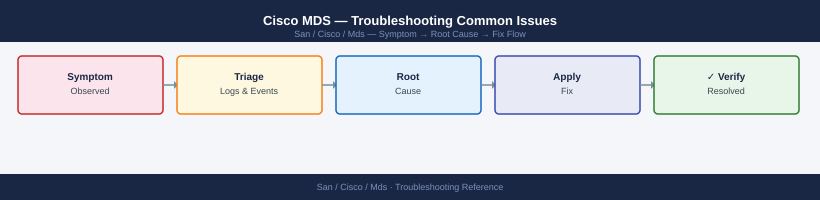
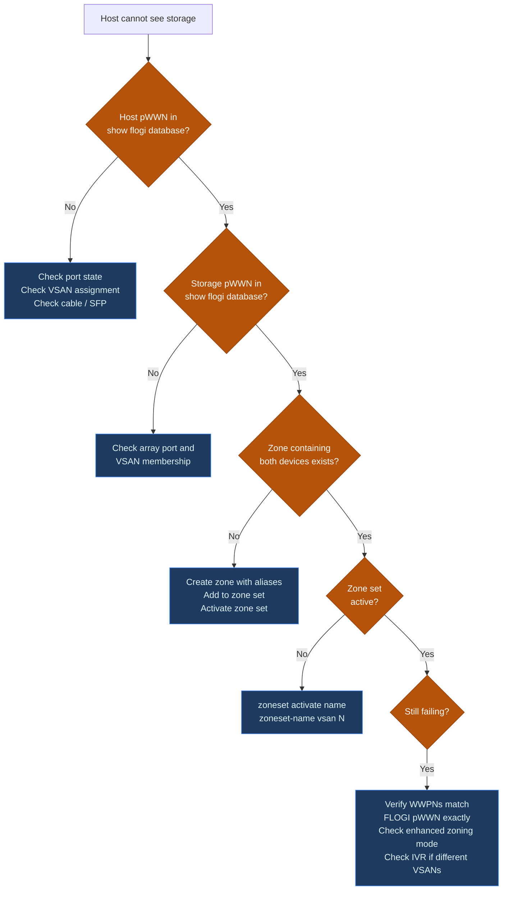
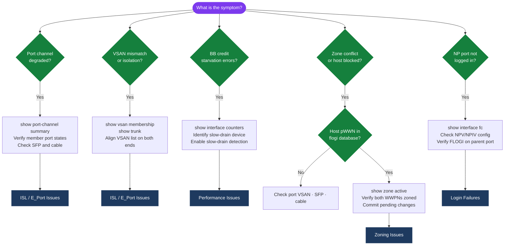

---
tags:
  - san
  - troubleshooting
search:
  boost: 1.5
---
# Cisco MDS — Troubleshooting Common Issues



```bash
# 1. Identify down or errDisabled interfaces
show interface brief

# 2. Identify missing host or storage logins
show flogi database

# 3. Check syslog for the fault event and timeline
show logging last 100

# 4. Rule out hardware faults
show environment

# 5. Confirm zoning is intact
show zoneset active vsan all

# 6. Check ISL and fabric topology
show topology
show trunk
show port-channel summary

# 7. Check domain IDs for conflict
show fcdomain domain-list vsan 10
```

```bash
# Check reason
show interface fc1/4
# Look for: "Port is in error-disabled state"

# Check log for the triggering event
show logging last 200 | grep -i "err\|disabled\|fc1/4"
```
```bash
interface fc1/4
  shutdown
  no shutdown

show interface fc1/4
# Confirm state returns to 'up'
```
```bash
# 1. Is the host HBA logged into the fabric?
show flogi database vsan 10 | grep <host-pwwn>

# 2. Is the storage target logged in?
show flogi database vsan 10 | grep <storage-pwwn>

# 3. Is there a zone pairing these two devices?
show zone member pwwn <host-pwwn> vsan 10

# 4. Is the zoneset containing that zone currently active?
show zoneset active vsan 10

# 5. Are both ports in the same VSAN?
show vsan membership interface fc<host-port>
show vsan membership interface fc<storage-port>
```

```bash
# Check zone status
show zone status vsan 10

# Check for pending changes in enhanced mode
zone commit vsan 10

# Retry activate
zoneset activate name <zoneset-name> vsan 10
```
```bash
# Check ISL port state
show interface fc2/1
show interface fc2/1 counters errors

# Check trunk state and VSAN allowance
show trunk

# Check port-channel membership if applicable
show port-channel summary

# Check for VSAN isolation reason
show vsan
show vsan <id>
```
```bash
show fcdomain vsan 10
show fcdomain domain-list vsan 10
```
```bash
# Identify flapping port
show logging last 200 | grep "link down\|link up\|flogi" | head -40

# Check error counters on the suspect port
show interface fc1/6 counters errors

# Check optical power levels
show interface fc1/6 transceiver
```
```bash
# Check overall CPU and memory
show system resources

# Find top CPU consumers
show processes cpu sort | head -20

# Check if caused by port flap storm (many FLOGI events)
show logging last 200 | grep -ci "link down"
```
```bash
# Always run this after every configuration change
copy running-config startup-config

# Verify startup config was updated
show startup-config | grep <changed-item>
```
```bash
checkpoint post-change
show checkpoint summary
```

```d2
direction: down

symptom: Identify Symptom {shape: diamond}
diagnostic_flow: "Diagnostic Flow" {shape: rectangle}
verify_resolution: "Verify resolution" {shape: rectangle}
resolution: Resolve or Escalate {shape: oval}

symptom -> diagnostic_flow: investigate
symptom -> verify_resolution: investigate
diagnostic_flow -> resolution
verify_resolution -> resolution
```

## Diagnostic Flow



---

## Before you begin

- **Access:** Storage admin credentials (cluster admin or equivalent)
- **Gather first:** recent error message text, event timestamps, and affected object names
- **Scope:** confirm whether the issue affects a single object, host, cluster, or site
- **Escalation:** open a vendor support ticket before running any destructive step
- **Logging:** document each command and output — required if escalation is needed

---

---

## Verify resolution

- Confirm the original symptom no longer occurs
- Check logs for any residual errors related to the issue
- Monitor for 10–15 minutes to confirm the fix is stable

---

## See also

- [Mds — Diagnostics](diagnostics/)
- [Mds — Escalation](escalation/)
- [Mds — Health Checks](../operations/health-checks/)
