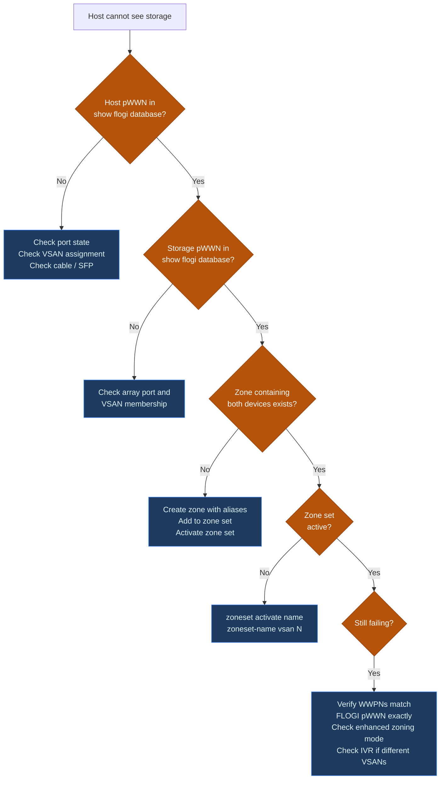

---
tags:
  - san
  - troubleshooting
---
# Cisco MDS — Troubleshooting Common Issues

```bash
# 1. Identify down or errDisabled interfaces
show interface brief

# 2. Identify missing host or storage logins
show flogi database

# 3. Check syslog for the fault event and timeline
show logging last 100

# 4. Rule out hardware faults
show environment

# 5. Confirm zoning is intact
show zoneset active vsan all

# 6. Check ISL and fabric topology
show topology
show trunk
show port-channel summary

# 7. Check domain IDs for conflict
show fcdomain domain-list vsan 10
```
```text
┌────────────────────────────── Cisco MDS — Troubleshooting Common Issues ──────────────────────────────┐
│                                                                                                       │
│  Most frequent MDS fabric issues: FLOGI failures, E_Port isolation, zoning errors.                    │
│                                                                                                       │
│   ┌──────────────────────────────────────────────┐  ┌─────────────────────────────────────────────┐   │
│   │                Login Failures                │  │             ISL / E_Port Issues             │   │
│   │      FLOGI rejected: port VSAN mismatch      │  │       E_Port isolated: domain ID clash      │   │
│   │      PLOGI fail: zoning not configured       │  │        ISL down: SFP incompatibility        │   │
│   │         HBA offline: SFP link fault          │  │        Trunk mismatch: VSAN list diff       │   │
│   │          FDISC: NPV mode login fail          │  │         Segmented fabric: FSPF cost         │   │
│   │        Show flogi database to verify         │  │           Show interface fc state           │   │
│   └──────────────────────────────────────────────┘  └─────────────────────────────────────────────┘   │
│                                                                                                       │
│  Login errors require FLOGI/PLOGI trace; ISL errors need domain/VSAN alignment check                  │
│                                                                                                       │
│                          ▼                                                 ▼                          │
│                                                                                                       │
│   ┌──────────────────────────────────────────────┐  ┌─────────────────────────────────────────────┐   │
│   │                Zoning Issues                 │  │              Performance Issues             │   │
│   │       Zone not active: pending commit        │  │           High BB_Credit pressure           │   │
│   │        WWN not in zone: PLOGI denied         │  │         CRC errors: cable or SFP bad        │   │
│   │        Zone merge conflict: mismatch         │  │        Congestion: slow-drain device        │   │
│   │         Default zone deny: block all         │  │          IOCTL timeout: queue depth         │   │
│   │          Show zone active to verify          │  │           Show interface counters           │   │
│   └──────────────────────────────────────────────┘  └─────────────────────────────────────────────┘   │
│                                                                                                       │
│  Physical Infrastructure (the hardware everything above runs on):                                     │
│  MDS line cards · SFP transceivers · ISL fiber · HBA in server · storage array ports                  │
│                                                                                                       │
│  Key terms:                                                                                           │
│                                                                                                       │
│  FLOGI          = Fabric Login; N_Port to switch handshake to join the fabric                         │
│  PLOGI          = Port Login; N_Port to N_Port session establishment through fabric                   │
│  FDISC          = Fabric Discover; VN_Port login in NPIV/NPV environments                             │
│  E_Port         = Expansion Port; ISL port mode between two switches                                  │
│  E_Port isolated= Admin-isolated due to domain ID or parameter conflict                               │
│  Domain ID      = Unique 1-239 identifier for each switch in a fabric                                 │
│  BB_Credit      = Buffer-to-Buffer Credit; flow control units for FC link                             │
│  Slow-drain     = Device accepting frames slowly; causes backpressure upstream                        │
│  Zone merge     = Process of combining zone databases when two fabrics connect                        │
│  Default zone   = Policy for devices not in any explicit zone: deny or permit                         │
│  FSPF           = Fabric Shortest Path First; routing protocol determining ISL paths                  │
│  CRC error      = Frame checksum failure; indicates physical layer problem                            │
│                                                                                                       │
└───────────────────────────────────────────────────────────────────────────────────────────────────────┘
```
```bash
# Check reason
show interface fc1/4
# Look for: "Port is in error-disabled state"

# Check log for the triggering event
show logging last 200 | grep -i "err\|disabled\|fc1/4"
```
```bash
interface fc1/4
  shutdown
  no shutdown

show interface fc1/4
# Confirm state returns to 'up'
```
```bash
# 1. Is the host HBA logged into the fabric?
show flogi database vsan 10 | grep <host-pwwn>

# 2. Is the storage target logged in?
show flogi database vsan 10 | grep <storage-pwwn>

# 3. Is there a zone pairing these two devices?
show zone member pwwn <host-pwwn> vsan 10

# 4. Is the zoneset containing that zone currently active?
show zoneset active vsan 10

# 5. Are both ports in the same VSAN?
show vsan membership interface fc<host-port>
show vsan membership interface fc<storage-port>
```

```bash
# Check zone status
show zone status vsan 10

# Check for pending changes in enhanced mode
zone commit vsan 10

# Retry activate
zoneset activate name <zoneset-name> vsan 10
```
```bash
# Check ISL port state
show interface fc2/1
show interface fc2/1 counters errors

# Check trunk state and VSAN allowance
show trunk

# Check port-channel membership if applicable
show port-channel summary

# Check for VSAN isolation reason
show vsan
show vsan <id>
```
```bash
show fcdomain vsan 10
show fcdomain domain-list vsan 10
```
```bash
# Identify flapping port
show logging last 200 | grep "link down\|link up\|flogi" | head -40

# Check error counters on the suspect port
show interface fc1/6 counters errors

# Check optical power levels
show interface fc1/6 transceiver
```
```bash
# Check overall CPU and memory
show system resources

# Find top CPU consumers
show processes cpu sort | head -20

# Check if caused by port flap storm (many FLOGI events)
show logging last 200 | grep -ci "link down"
```
```bash
# Always run this after every configuration change
copy running-config startup-config

# Verify startup config was updated
show startup-config | grep <changed-item>
```
```bash
checkpoint post-change
show checkpoint summary
```

## Before you begin

- **Access:** Storage admin credentials (cluster admin or equivalent)
- **Gather first:** recent error message text, event timestamps, and affected object names
- **Scope:** confirm whether the issue affects a single object, host, cluster, or site
- **Escalation:** open a vendor support ticket before running any destructive step
- **Logging:** document each command and output — required if escalation is needed

---

---

## Verify resolution

- Confirm the original symptom no longer occurs
- Check logs for any residual errors related to the issue
- Monitor for 10–15 minutes to confirm the fix is stable
